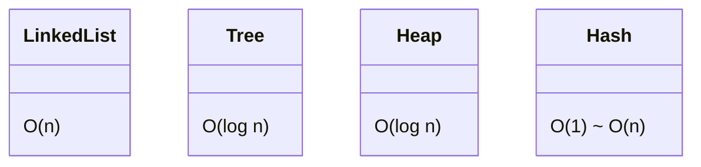

# 算法与数据结构题库（工程化答法）

## 原理

- 常见结构：链表、二叉树、堆、栈/队列、哈希、滑动窗口、并查集、拓扑排序。
- 复杂度：时间/空间权衡；工程场景结合数据规模与实时性选择。
- 设计思路：拆解为子问题（分治/递归）、利用有序性（双指针/二分）、利用局部最优（贪心）、利用记忆化/状态转移（DP），并结合约束选择合适数据结构。
- 边界与正确性：明确空集、单元素、重复值、溢出与并发访问等边界，给出不变量或归纳证明保证正确性。

## 题目与示例

### Kotlin：反转链表（迭代）

```kotlin
fun rev(head: ListNode?): ListNode? {
  var p = head; var prev: ListNode? = null
  while (p != null) { val nxt = p.next; p.next = prev; prev = p; p = nxt }
  return prev
}
```

### Kotlin：二叉树层序遍历

```kotlin
fun levelOrder(root: TreeNode?): List<List<Int>> {
  if (root == null) return emptyList()
  val q = ArrayDeque<TreeNode>(); val ans = mutableListOf<List<Int>>(); q.add(root)
  while (q.isNotEmpty()) {
    val size = q.size; val lvl = mutableListOf<Int>()
    repeat(size) { val n = q.removeFirst(); lvl += n.`val`; n.left?.let(q::add); n.right?.let(q::add) }
    ans += lvl
  }
  return ans
}
```

### Kotlin：滑动窗口最大值

```kotlin
fun maxSliding(nums: IntArray, k: Int): IntArray {
  val dq = ArrayDeque<Int>(); val res = IntArray(nums.size - k + 1); var idx = 0
  for (i in nums.indices) {
    while (dq.isNotEmpty() && nums[dq.last()] <= nums[i]) dq.removeLast()
    dq.addLast(i)
    if (dq.first() <= i - k) dq.removeFirst()
    if (i >= k - 1) res[idx++] = nums[dq.first()]
  }
  return res
}
```

### Kotlin：并查集（路径压缩）

```kotlin
class DSU(n: Int) {
  private val p = IntArray(n) { it }; private val r = IntArray(n)
  fun find(x: Int): Int { if (p[x] != x) p[x] = find(p[x]); return p[x] }
  fun union(a: Int, b: Int) { var x = find(a); var y = find(b); if (x == y) return; if (r[x] < r[y]) p[x] = y else if (r[x] > r[y]) p[y] = x else { p[y] = x; r[x]++ } }
}
```

## 对比与取舍

- 递归 vs 迭代：递归可读性更好但栈风险；迭代更稳健。
- 哈希 vs 排序：哈希 O(n) 空间换时间；排序 O(n log n)。

## 图表：复杂度参考



## 方法级细节与优化

- 边界条件：空结构、单元素、重复元素。
- 空间复用与对象池；减少逃逸与 GC 压力。

## 面试答题框架

- 明确数据结构与复杂度；边界与正确性证明。
- 工程化考虑：内存、并发与可维护性。

## 思维框架与高频套路

- 递归/分治：明确子问题与合并；避免重复计算可用记忆化或自底向上 DP。
- 双指针/滑动窗口：有序数组与区间问题常用，注意窗口扩张/收缩条件与边界。
- 图与搜索：BFS 用于最短步数/层级遍历；DFS 回溯用于组合/排列；拓扑排序解决有向无环依赖。
- 并查集：连通性与动态合并，路径压缩+按秩合并降低复杂度。
- 堆与优先队列：处理 topK、流式中值、按权重调度。

## 复杂度与内存优化提示

- 估算输入规模，决定是否需要 O(n log n) 甚至 O(n) 解；避免无谓的排序或全量复制。
- 空间优化：原地反转/原地前缀和，或使用对象池减少分配。
- 并发场景：注意可见性与原子性，必要时使用锁/原子类；无锁结构需充分证明正确性。
