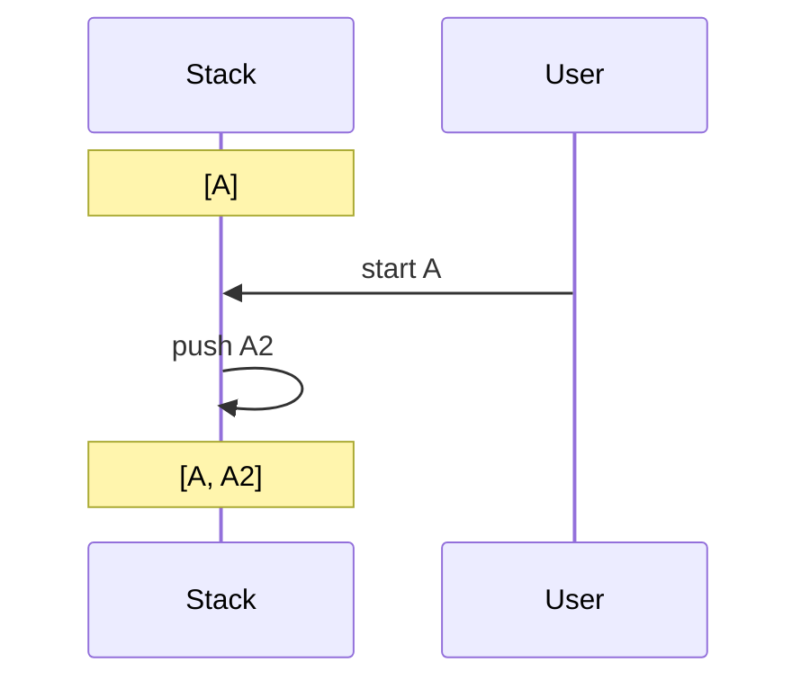
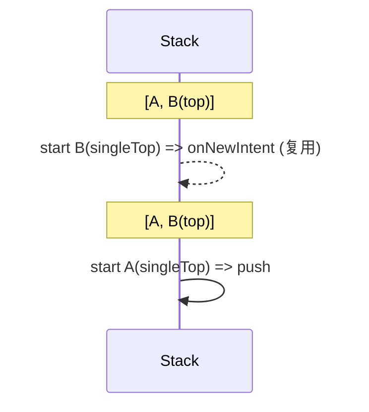
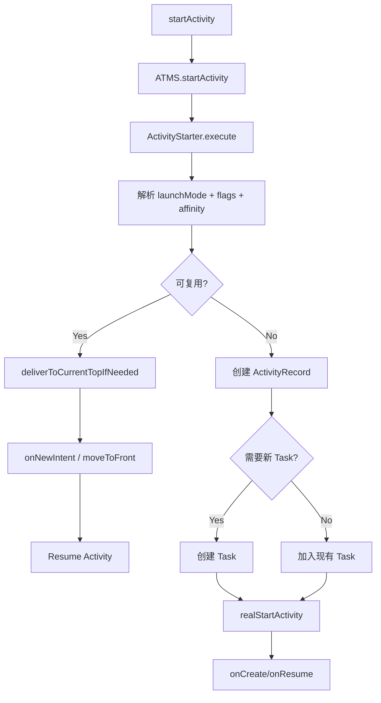

# Activity 启动模式与任务栈（提升版）

聚焦四大启动模式的场景化行为、栈变化、Flags 化学反应、源码决策链路、现代兼容与调试实践。

## 1. 核心概念可视化：任务栈与亲和性

```mermaid
graph TD
  subgraph Task["Task (任务栈)"]
    direction BT
    A[Activity A] --> B[Activity B]
    B --> C[Activity C <br/>(Top)]
  end
  style Task fill:#f6f6f6,stroke:#999,stroke-dasharray: 4 3
  style C fill:#f9f,stroke:#333,stroke-width:2px
```

- `taskAffinity` 决定归属；误用会产生多任务卡片、返回链路异常。
- `allowTaskReparenting="true"`：当同 affinity Task 激活时可重挂载。

## 2. 四种启动模式：行为·场景·图示·坑·建议

### 2.1 standard（默认，多实例）
- 场景：普通页面、可多开详情。
- 图示：每次 push 新实例。

- 坑：栈过深；深链/通知进入后返回路径冗长。
- 建议：需“回首页清栈”用 CLEAR_TOP 或首页 singleTask。

### 2.2 singleTop（仅栈顶复用）
- 场景：通知点击回到当前页、消息列表、搜索结果页。
- 行为：栈顶复用并 `onNewIntent`，否则新建。

- 坑：不是全局单例；`onNewIntent` 未刷新数据。
- 建议：统一入口封装，`onNewIntent` 必刷参数/状态。

### 2.3 singleTask（任务内唯一，清栈其上）
- 场景：App 首页、深链落地唯一页、通知回到主入口。
- 行为：栈内存在则清除其上 Activity 并 `onNewIntent`；否则新建（通常同 affinity）。
```mermaid
graph LR
  subgraph Task
    A[Login] --> B[Home(singleTask)]
    B --> C[Detail] --> D[More]
  end
  D -.start Home.-> B
  %% 结果：C/D 清除，Home 复用 onNewIntent，栈变为 A->B
```
- 坑：清栈副作用丢失中间流程；`onNewIntent` 未刷新 UI。
- 建议：仅全局入口使用；`onNewIntent` 统一刷新路由与状态。

### 2.4 singleInstance（独占任务，慎用）
- 场景：来电/闹钟/授权等全局独立界面。
- 行为：独占 Task，后续启动复用同一实例。
- 坑：返回链路割裂，多窗口下体验不一致；误用破坏导航一致性。
- 建议：能用 singleTask/flags 解决就避免；若用，完成后显式返回来源或 finish。

## 3. Flags 化学反应

| Flag | 行为 | 注意事项 |
| --- | --- | --- |
| `FLAG_ACTIVITY_NEW_TASK` | 找到/创建新 Task | 普通跳转慎用，易多任务 |
| `FLAG_ACTIVITY_CLEAR_TOP` | 清除目标之上 | 不配 `SINGLE_TOP` 会重建目标 |
| `FLAG_ACTIVITY_SINGLE_TOP` | 栈顶复用 | 常与 CLEAR_TOP 组合 |
| `FLAG_ACTIVITY_RESET_TASK_IF_NEEDED` | 重新整理任务 | 老 flag，少用 |

经典组合：回首页清栈且不重建首页
```kotlin
val intent = Intent(this, HomeActivity::class.java)
intent.addFlags(Intent.FLAG_ACTIVITY_CLEAR_TOP or Intent.FLAG_ACTIVITY_SINGLE_TOP)
startActivity(intent)
// 清掉首页之上，首页 onNewIntent 复用
```

NEW_TASK 误用：应用内普通跳转加它会开新任务，返回键跳桌面。

## 4. 启动/复用决策流程（源码导向）



关键类：`ActivityTaskManagerService`、`ActivityStarter`、`Task`、`ActivityRecord`、`RootWindowContainer`、客户端 `ActivityThread#handleLaunchActivity/handleResumeActivity`。

## 5. 实战最佳实践

### 5.1 onNewIntent 必刷参数与状态
```kotlin
class SearchActivity : AppCompatActivity() {
  override fun onCreate(savedInstanceState: Bundle?) {
    super.onCreate(savedInstanceState)
    setContentView(R.layout.activity_search)
    handleIntent(intent)
  }
  override fun onNewIntent(intent: Intent) {
    super.onNewIntent(intent)
    setIntent(intent)
    handleIntent(intent)
  }
  private fun handleIntent(intent: Intent) {
    val query = intent.getStringExtra("query")
    // 更新 UI
  }
}
```

### 5.2 通知点击回到当前页（singleTop）
```kotlin
val intent = Intent(this, MessageActivity::class.java)
intent.addFlags(Intent.FLAG_ACTIVITY_SINGLE_TOP or Intent.FLAG_ACTIVITY_CLEAR_TOP)
val pending = PendingIntent.getActivity(this, 0, intent, PendingIntent.FLAG_IMMUTABLE)
```

### 5.3 深层页面回首页清栈（singleTask/flags）
```kotlin
val intent = Intent(this, HomeActivity::class.java)
intent.addFlags(Intent.FLAG_ACTIVITY_CLEAR_TOP or Intent.FLAG_ACTIVITY_SINGLE_TOP)
startActivity(intent)
```

### 5.4 singleInstance 收尾
- 若必须独立任务，完成后显式返回或 finish，避免用户停留在孤立任务。

## 6. 现代兼容与平台行为

- Predictive Back (API 33+): 用 `OnBackInvokedCallback`，避免旧 `onBackPressed()`。
```kotlin
if (Build.VERSION.SDK_INT >= 33) {
  onBackInvokedDispatcher.registerOnBackInvokedCallback(
    OnBackInvokedDispatcher.PRIORITY_DEFAULT
  ) { finish() }
}
```
- 后台启动限制 (API 29+): 后台组件不要直接 startActivity，改用通知/前台服务。
- PendingIntent 必须 `FLAG_IMMUTABLE`（通知/DeepLink）。
- Edge-to-Edge (API 35 强制): 注意布局与状态保存，多窗口/分屏避免无谓重建。

## 7. 调试与验证

- 栈/任务：`adb shell dumpsys activity activities` 查看 Task/affinity/ActivityRecord。
- 行为验证：多次通知/DeepLink 点击、分屏/多窗口返回链路。
- 日志：关注 ActivityTaskManager/ActivityStarter 决策，确认复用/清栈。

## 8. 性能与状态管理

- 复用优于重建：用 `onNewIntent` 局部刷新减少 `onCreate`/布局开销。
- 避免滥用 NEW_TASK 造成多任务与内存抖动。
- 清栈副作用：singleTask/CLEAR_TOP 可能丢失流程，需设计导航与提示。

## 9. 自查清单

- 有概念栈图 + 启动/复用流程图 + 模式示意图各 ≥1。
- 每模式包含：行为、场景、图示、坑、建议。
- 代码示例覆盖 singleTop/CLEAR_TOP/singleTask onNewIntent、PendingIntent FLAG_IMMUTABLE。
- 覆盖现代兼容：Predictive Back、后台启动限制、Edge-to-Edge。
- 提供调试手段：dumpsys、日志关注点；文字与图表一致。
