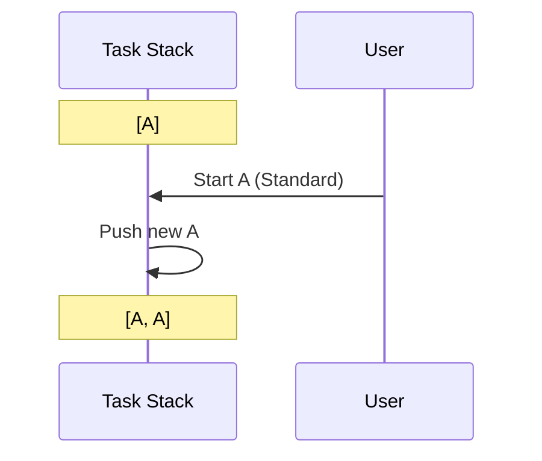
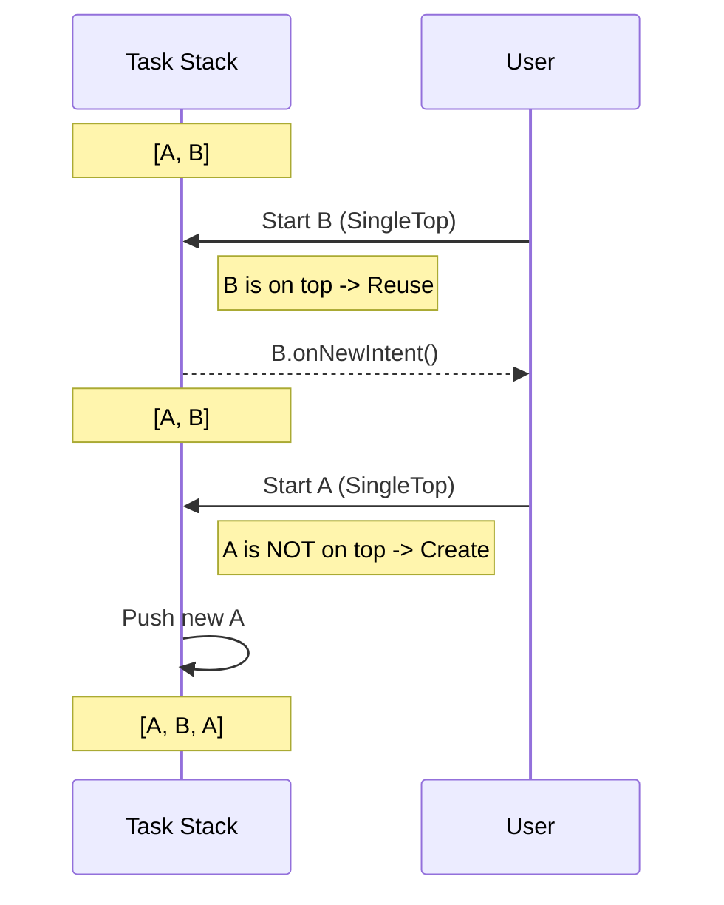
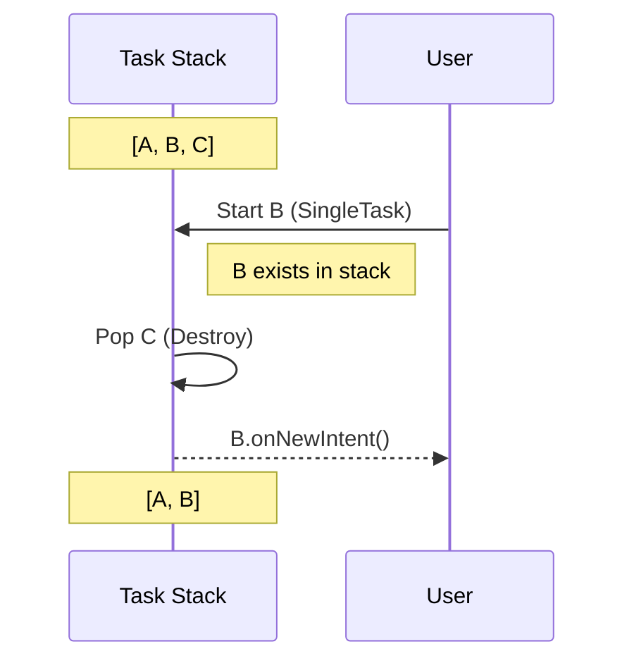
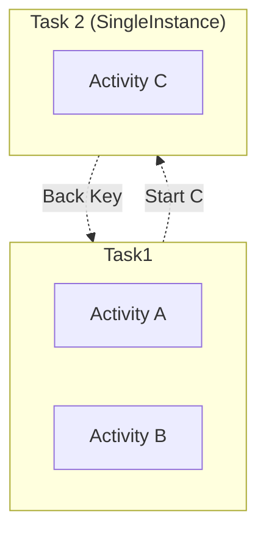
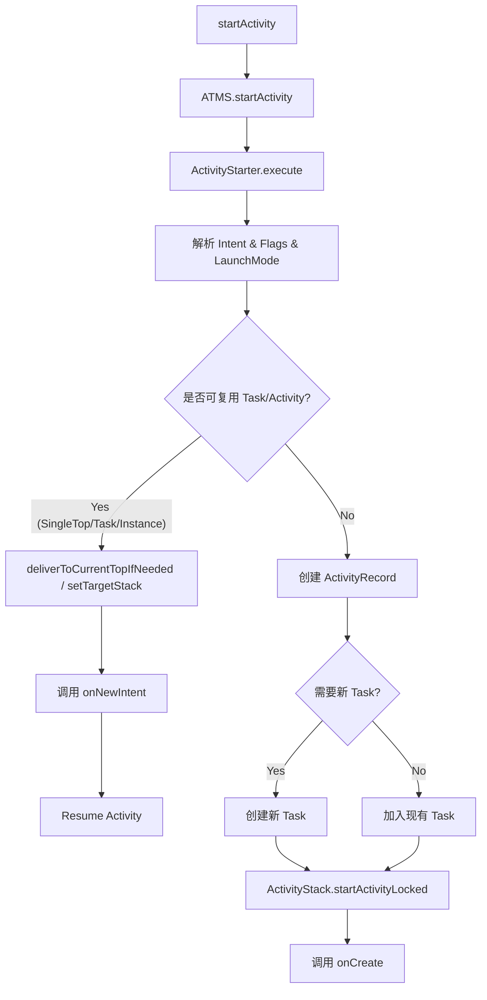

# Android Activity 启动模式与任务栈深度解析

这份指南旨在通过可视化图表、实战代码和深度原理分析，帮助你彻底掌握 Android 的任务栈管理。

## 1. 核心概念可视化：任务栈 (Task Stack)

任务栈（Back Stack）是一个“后进先出”（LIFO）的结构。

```mermaid
graph TD
    subgraph Task["Task (任务栈)"]
        direction BT
        A[Activity A] --> B[Activity B]
        B --> C[Activity C]
        C[Activity C <br/>(Top / Resumed)]
    end
    style C fill:#f9f,stroke:#333,stroke-width:2px
    style Task fill:#eee,stroke:#333,stroke-dasharray: 5 5
```

- **TaskAffinity (亲和性)**: 也就是 Activity 的“归属感”。默认情况下，所有 Activity 都属于包名相同的 Task。
- **Reparenting**: 当一个 Activity 定义了不同的 `taskAffinity` 且 `allowTaskReparenting="true"` 时，它可以从启动它的 Task 移动到与它 affinity 相同的 Task 中（当那个 Task 启动时）。

---

## 2. 四大启动模式图解 (Launch Modes)

### 2.1 Standard (默认)
**行为**: 每次启动都会创建一个新的实例，压入栈顶。



### 2.2 SingleTop (栈顶复用)
**行为**: 如果目标 Activity **已经位于栈顶**，则复用该实例并回调 `onNewIntent()`。否则，创建新实例。
**场景**: 推送通知点击进入详情页（避免连续点击打开多个详情页）。



### 2.3 SingleTask (栈内复用)
**行为**: 
1. 系统查找是否存在该 Activity 想要归属的 Task。
2. 如果 Task 存在且 Activity 也在其中：**弹出**该 Activity 之上的所有实例（Clear Top），复用该实例并回调 `onNewIntent()`。
3. 如果 Task 不存在：创建新 Task 并放入。
**场景**: App 首页 (HomeActivity)、浏览器主页。



### 2.4 SingleInstance (全局单例)
**行为**: 系统为该 Activity 创建一个**独立的 Task**，且该 Task 中**只能**有这一个 Activity。
**场景**: 来电界面、闹钟界面（与 App 其他逻辑完全隔离）。



---

## 3. 关键 Flags 的化学反应

Flags 可以在代码中动态改变启动行为，优先级通常高于 Manifest 设置。

| Flag | 对应/类似模式 | 行为描述 |
| :--- | :--- | :--- |
| `FLAG_ACTIVITY_NEW_TASK` | 类似 `singleTask` (但不完全相同) | 寻找或创建新的 Task。**注意**: 如果不配合其他 Flag，且 Activity 已在现有 Task 中，可能不会跳转到该 Task (取决于 `taskAffinity`)。通常与 `singleTask` 配合使用效果最佳。 |
| `FLAG_ACTIVITY_SINGLE_TOP` | `singleTop` | 栈顶复用。 |
| `FLAG_ACTIVITY_CLEAR_TOP` | 无直接对应 (常配合使用) | 销毁目标 Activity 之上的所有 Activity。 |

### 经典组合: `CLEAR_TOP` + `SINGLE_TOP`
这是实现“回到首页”且不重建首页的黄金搭档。

```kotlin
// 场景：从深层页面回到 HomeActivity
val intent = Intent(this, HomeActivity::class.java)
intent.addFlags(Intent.FLAG_ACTIVITY_CLEAR_TOP or Intent.FLAG_ACTIVITY_SINGLE_TOP)
startActivity(intent)
```
**效果**:
- 栈: `[Home, A, B, C]` -> `start Home`
- `CLEAR_TOP`: 移除 A, B, C。
- `SINGLE_TOP`: 发现 Home 在栈顶，复用之 -> `Home.onNewIntent()`。
- **如果不加 SINGLE_TOP**: Home 会被销毁重建 (`onDestroy` -> `onCreate`)！

---

## 4. 深度源码流程：Activity 启动与复用

核心类职责：
- **ActivityTaskManagerService (ATMS)**: 统筹管理所有 Activity 的生命周期和调度。
- **ActivityStarter**: 启动请求的执行者，负责解析 Intent、处理 Flags、计算启动模式。
- **Task**: 任务栈容器。
- **ActivityRecord**: Activity 在系统服务端的记录对象。

### 启动决策流程图



---

## 5. 进阶实战：onNewIntent 状态管理

当 Activity 被复用时，`onCreate` 不会被调用，而是调用 `onNewIntent`。**极其容易踩坑的地方是：`getIntent()` 返回的仍然是旧的 Intent。**

### 最佳实践代码

```kotlin
class SearchActivity : AppCompatActivity() {

    override fun onCreate(savedInstanceState: Bundle?) {
        super.onCreate(savedInstanceState)
        setContentView(R.layout.activity_search)
        handleIntent(intent) // 处理初始 Intent
    }

    override fun onNewIntent(intent: Intent) {
        super.onNewIntent(intent)
        // 关键：更新 Activity 持有的 Intent，否则后续调用 getIntent() 拿到的还是旧数据
        setIntent(intent) 
        handleIntent(intent) // 处理新的 Intent
    }

    private fun handleIntent(intent: Intent) {
        val query = intent.getStringExtra("query")
        // 执行搜索逻辑...
    }
}
```

---

## 6. Android 15 (API 35) 与现代开发趋势

### 6.1 Predictive Back (预测性返回)
Android 13 引入，Android 14+ 强化，Android 15 继续支持。
- **原理**: 允许用户在返回手势完成前“预览”返回后的界面（如回到桌面或上一个 Activity）。
- **影响**: 传统的 `onBackPressed()` 已被弃用。
- **适配**: 使用 `OnBackInvokedCallback`。

```kotlin
// Android 13+ (API 33+) 适配方式
if (Build.VERSION.SDK_INT >= Build.VERSION_CODES.TIRAMISU) {
    onBackInvokedDispatcher.registerOnBackInvokedCallback(
        OnBackInvokedDispatcher.PRIORITY_DEFAULT
    ) {
        // 处理返回逻辑
        // 注意：这里没有 "super.onBackPressed()"，系统动画会自动处理
        if (shouldInterceptBack) {
            showExitDialog()
        } else {
            finish()
        }
    }
}
```

### 6.2 后台启动限制 (Background Activity Start)
Android 10 (API 29) 开始限制，Android 15 更加严格。
- **规则**: 后台 Service 或 BroadcastReceiver 不能直接启动 Activity（除非有 `SYSTEM_ALERT_WINDOW` 权限等极少数例外）。
- **替代方案**: 使用 **Notification**。在通知的 `PendingIntent` 中设置 `setFullScreenIntent()` (用于高优先级事件如来电) 或普通的点击跳转。

### 6.3 边对边 (Edge-to-Edge) 强制
Android 15 强制所有 App 默认 Edge-to-Edge（沉浸式）。
- 这虽然不直接影响启动模式，但影响 Activity 的 `Configuration` 变化和布局策略，在多窗口模式下（可能触发 Activity 重建或 Resize）需要格外注意状态保存。

---

## 7. 面试与架构设计总结

### 什么时候用什么？
1.  **Standard**: 绝大多数页面。
2.  **SingleTop**: 详情页、聊天页、搜索结果页（防止快速点击打开两个）。
3.  **SingleTask**: 
    - **App 首页**: 确保按 Home 键或多次返回最终回到这里，且不再回退。
    - **WebView 容器**: 某些重型 H5 容器可能独立进程或独立栈管理。
4.  **SingleInstance**: 
    - **系统级功能**: 锁屏页、来电页、闹钟。
    - **跨 App 共享**: 极少使用，除非你需要多个 App 共享同一个 Activity 实例。

### 常见坑
- **SingleInstance 的返回键**: 从 SingleInstance Activity 按返回键，可能不会回到启动它的那个 Activity，而是回到该 Task 下方的 Activity 或者 Launcher（取决于 Task 调度）。这会导致用户迷失方向。
- **TaskAffinity 滥用**: 随意修改 affinity 会导致 App 产生多个 Task，在“最近任务”列表中出现多个卡片，用户体验割裂。

### 性能考量
- **复用 > 重建**: 频繁 `onCreate` 消耗 CPU 和内存（布局解析、资源加载）。合理利用 `SingleTop/SingleTask` + `onNewIntent` 局部刷新数据是高性能 App 的标配。
