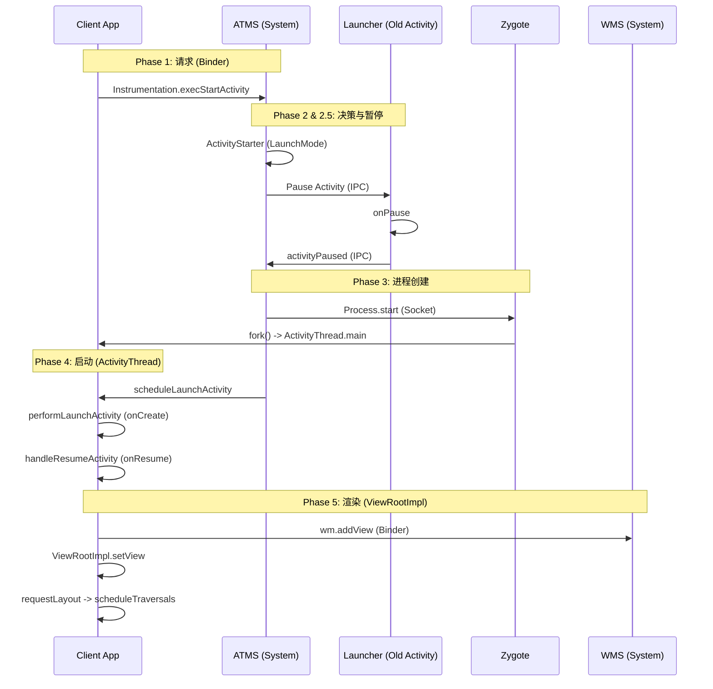
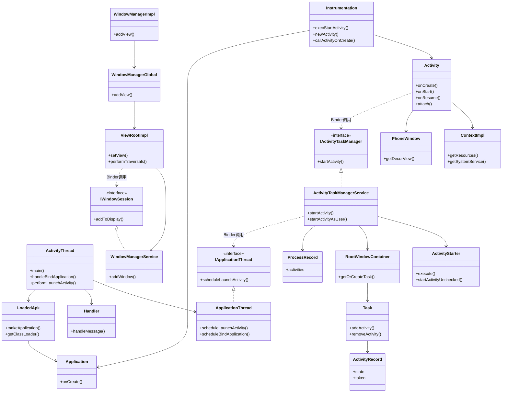
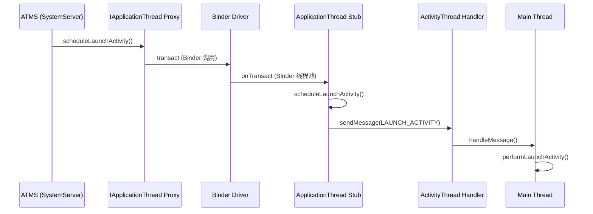
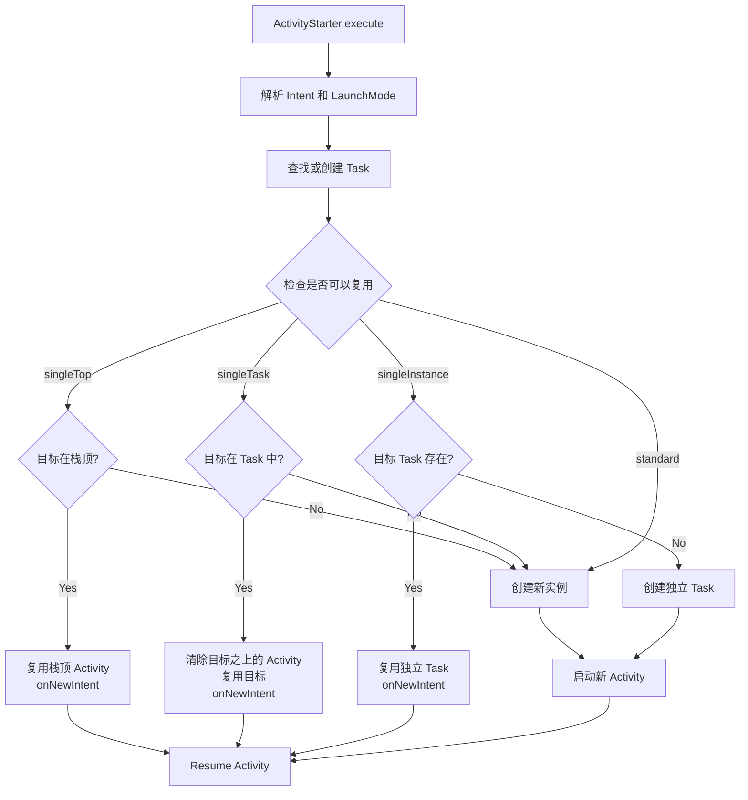
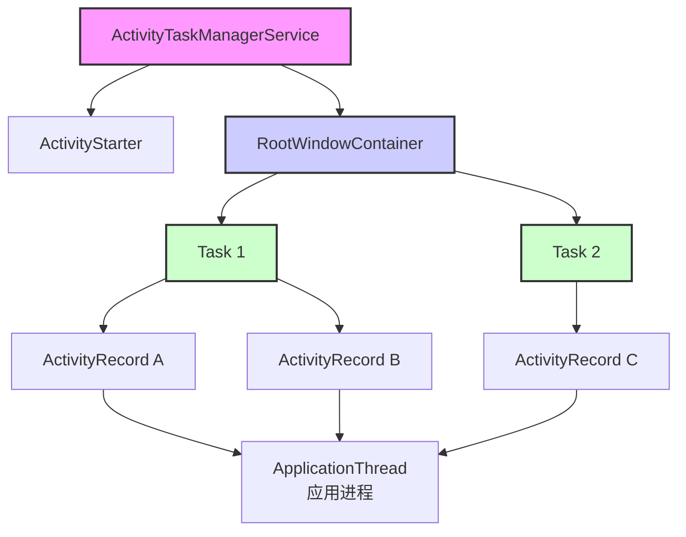
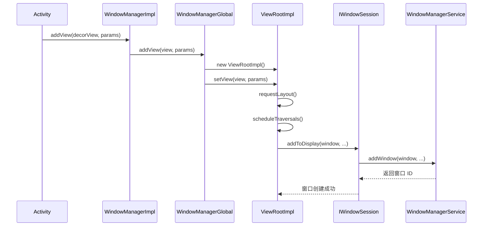
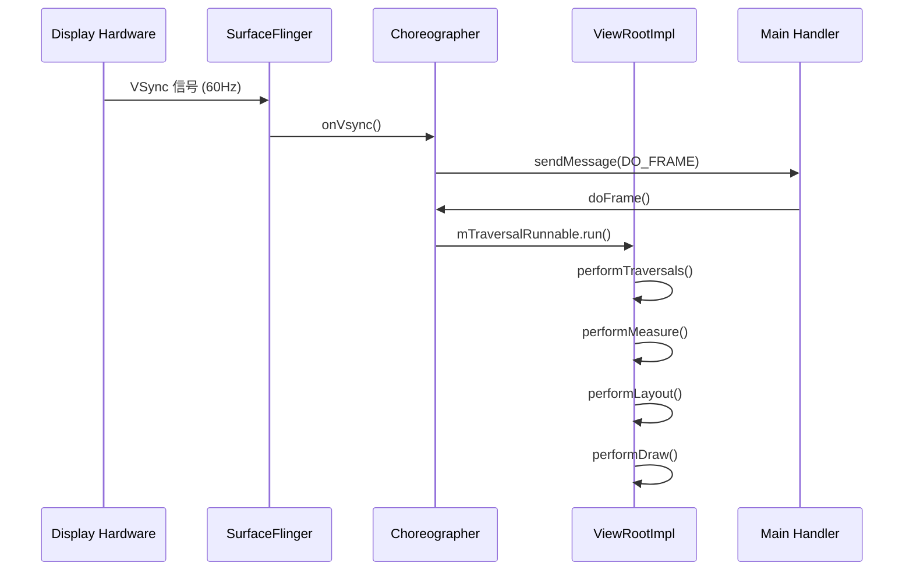
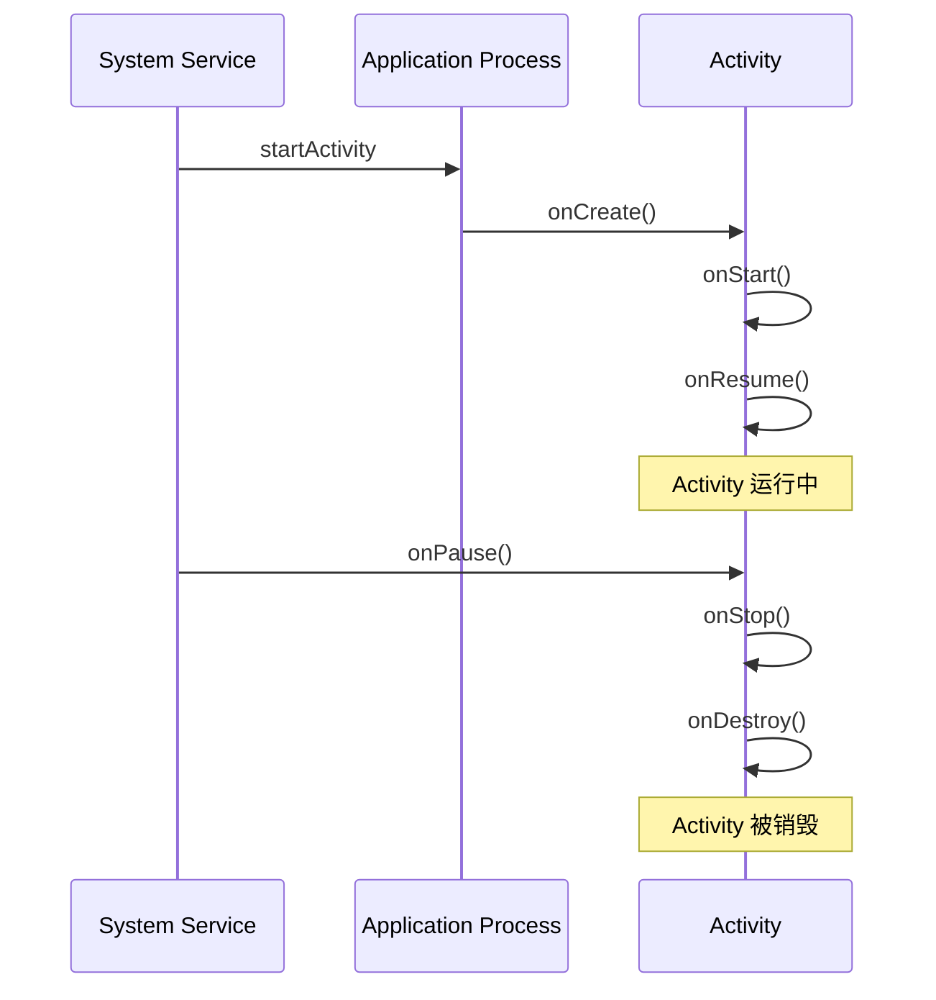
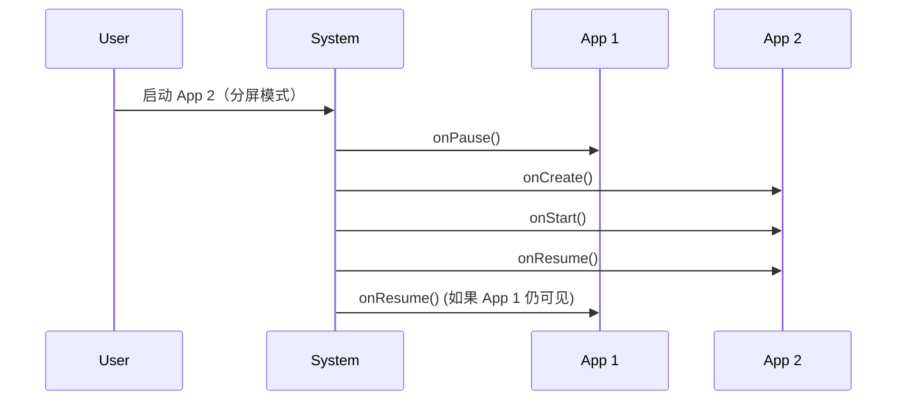

# Activity 启动流程深度解析：源码、Zygote 与 ViewRootImpl

本文将深入 Android Framework 源码，追踪从 `startActivity` 到界面显示 (`ViewRootImpl`) 的完整调用链。我们将重点分析关键方法、核心代码逻辑，以及 **Zygote 进程创建** 的底层机制。

## 0. 核心架构全景图



---

## 0.5 Activity 启动涉及的关键类及其作用

Activity 启动流程涉及众多类，理解这些类的作用和关系是掌握启动机制的基础。本节将详细介绍这些关键类。

### 0.5.1 客户端类（应用进程）

这些类运行在应用进程中，负责应用的生命周期管理和 UI 渲染。

#### Activity
- **作用**：用户交互的组件，是 Android 应用的 UI 入口
- **职责**：
  - 管理用户界面（View 树）
  - 处理用户输入事件
  - 管理生命周期（onCreate、onStart、onResume 等）
  - 与系统服务交互（通过 Context）
- **关键方法**：`onCreate()`、`onStart()`、`onResume()`、`attach()`
- **在启动流程中的位置**：Phase 4，由 `performLaunchActivity` 创建实例

#### Context / ContextImpl
- **作用**：上下文环境，提供资源访问、系统服务获取等能力
- **职责**：
  - 资源访问（getResources、getAssets）
  - 系统服务获取（getSystemService）
  - 文件系统访问
  - 启动组件（startActivity、startService）
- **ContextImpl**：Context 的具体实现类，Activity 持有 ContextImpl 实例
- **在启动流程中的位置**：Phase 4，在 `handleBindApplication` 中创建

#### Instrumentation
- **作用**：应用与系统交互的监视器，是系统控制应用行为的钩子
- **职责**：
  - 创建 Activity 实例（`newActivity`）
  - 创建 Application 实例（`newApplication`）
  - 调用生命周期方法（`callActivityOnCreate`、`callActivityOnResume`）
  - 监控应用行为（测试框架利用此机制）
- **关键方法**：`execStartActivity()`、`newActivity()`、`callActivityOnCreate()`
- **在启动流程中的位置**：Phase 1（启动请求）、Phase 4（创建实例和调用生命周期）

#### ActivityThread
- **作用**：应用进程的主线程类，管理应用的生命周期和消息循环
- **职责**：
  - 管理主线程的 Looper 和 Handler
  - 处理系统服务发送的消息（BIND_APPLICATION、EXECUTE_TRANSACTION）
  - 管理 Activity 的生命周期（performLaunchActivity、handleResumeActivity）
  - 管理 Application 的创建和初始化
- **关键方法**：`main()`、`handleBindApplication()`、`performLaunchActivity()`、`handleResumeActivity()`
- **在启动流程中的位置**：Phase 3（进程入口）、Phase 4（应用初始化和 Activity 启动）

#### ApplicationThread
- **作用**：ActivityThread 的内部类，实现 `IApplicationThread` Binder 接口，是应用进程的 Binder 服务端
- **职责**：
  - 接收系统服务（ATMS）的 Binder 调用
  - 将 Binder 调用转换为 Handler 消息发送到主线程
  - 实现 `scheduleLaunchActivity`、`scheduleBindApplication` 等方法
- **关键方法**：`scheduleLaunchActivity()`、`scheduleBindApplication()`、`schedulePauseActivity()`
- **在启动流程中的位置**：Phase 1.5（Binder 通信）、Phase 4（消息转换）

#### Handler / H
- **作用**：ActivityThread 的内部类 H，处理系统服务发送的消息
- **职责**：
  - 接收 ApplicationThread 转换的 Handler 消息
  - 在主线程执行对应的操作（启动 Activity、绑定 Application 等）
- **消息类型**：`BIND_APPLICATION`、`EXECUTE_TRANSACTION`、`SCHEDULE_LAUNCH_ACTIVITY`
- **在启动流程中的位置**：Phase 4（消息处理）

#### LoadedApk
- **作用**：已加载的 APK 信息，包含 ClassLoader、Application 等
- **职责**：
  - 管理 APK 的 ClassLoader
  - 创建 Application 实例（`makeApplication`）
  - 管理 ContentProvider
- **关键方法**：`makeApplication()`、`getClassLoader()`
- **在启动流程中的位置**：Phase 4（Application 创建）

#### Application
- **作用**：应用的全局单例，在 Activity 之前创建
- **职责**：
  - 应用级别的初始化
  - 全局状态管理
  - 生命周期回调（onCreate、onTerminate）
- **关键方法**：`onCreate()`、`attachBaseContext()`
- **在启动流程中的位置**：Phase 4，在 Activity 之前创建

### 0.5.2 系统服务端类（SystemServer 进程）

这些类运行在系统服务进程（SystemServer）中，负责管理所有应用的 Activity 和任务栈。

#### ActivityTaskManagerService (ATMS)
- **作用**：Activity 和任务栈的管理服务，系统服务端的核心
- **职责**：
  - 接收应用的启动请求（`startActivity`）
  - 管理所有 Activity 的生命周期
  - 管理任务栈（Task）的创建和调度
  - 进程管理（创建、销毁应用进程）
- **关键方法**：`startActivity()`、`startActivityAsUser()`、`resumeTopActivity()`
- **在启动流程中的位置**：Phase 1（接收请求）、Phase 2（决策）、Phase 3（进程创建）

#### ActivityStarter
- **作用**：启动请求的执行者，负责解析 Intent、处理 Flags、计算启动模式
- **职责**：
  - 解析 Intent（ComponentName、隐式 Intent 匹配）
  - 处理启动模式（LaunchMode）和 Flags
  - 决定是否复用现有 Activity 或创建新实例
  - 查找或创建 Task
- **关键方法**：`execute()`、`startActivityUnchecked()`、`deliverToCurrentTopIfNeeded()`
- **在启动流程中的位置**：Phase 2（系统决策）

#### RootWindowContainer
- **作用**：窗口容器的根节点，管理所有 Task 和窗口层级
- **职责**：
  - 管理所有 Task 的层次结构
  - 查找或创建 Task（根据 taskAffinity）
  - 管理窗口的 Z-order
- **关键方法**：`getOrCreateTask()`、`findTaskLocked()`
- **在启动流程中的位置**：Phase 2（Task 查找和创建）

#### Task
- **作用**：任务栈容器，包含多个 ActivityRecord
- **职责**：
  - 管理 ActivityRecord 的栈结构（后进先出）
  - 维护任务栈的状态
  - 处理返回键逻辑
- **数据结构**：ActivityRecord 的单向链表
- **在启动流程中的位置**：Phase 2（Task 查找和创建）

#### ActivityRecord
- **作用**：Activity 在系统服务端的表示，包含 Activity 的状态信息
- **职责**：
  - 存储 Activity 的状态（Resumed、Paused、Stopped）
  - 管理 Activity 的配置信息
  - 维护与客户端 Activity 的 Binder 连接（token）
- **关键字段**：`state`、`token`、`intent`、`task`
- **在启动流程中的位置**：Phase 2（创建 ActivityRecord）

#### ProcessRecord
- **作用**：进程记录，管理应用进程的生命周期
- **职责**：
  - 跟踪应用进程的状态
  - 管理进程中的 Activity
  - 进程死亡时的清理
- **在启动流程中的位置**：Phase 2（进程检查）、Phase 3（进程创建）

#### IActivityTaskManager
- **作用**：Binder 接口，客户端调用系统服务的接口
- **职责**：
  - 定义客户端与 ATMS 通信的接口
  - 提供 `startActivity`、`activityPaused` 等方法
- **在启动流程中的位置**：Phase 1（客户端调用）

### 0.5.3 窗口系统类

这些类负责窗口的管理和 UI 渲染。

#### Window / PhoneWindow
- **作用**：窗口抽象，PhoneWindow 是 Activity 的窗口实现
- **职责**：
  - 管理窗口的 DecorView
  - 处理窗口的属性和配置
  - 管理窗口的输入事件
- **PhoneWindow**：Window 的具体实现，每个 Activity 有一个 PhoneWindow
- **在启动流程中的位置**：Phase 4（Activity.attach 时创建）

#### WindowManager / WindowManagerImpl
- **作用**：窗口管理器，应用层的窗口管理接口
- **职责**：
  - 添加、移除、更新窗口（`addView`、`removeView`、`updateViewLayout`）
  - 管理窗口的布局参数
- **WindowManagerImpl**：WindowManager 的具体实现
- **在启动流程中的位置**：Phase 4（Activity.attach 时创建）、Phase 5（addView）

#### WindowManagerGlobal
- **作用**：全局窗口管理器，管理所有窗口
- **职责**：
  - 维护所有窗口的列表
  - 创建 ViewRootImpl
  - 与 WMS 通信
- **关键方法**：`addView()`、`removeView()`、`updateViewLayout()`
- **在启动流程中的位置**：Phase 5（addView 时创建 ViewRootImpl）

#### ViewRootImpl
- **作用**：View 树的根节点，负责 View 的测量、布局、绘制和输入事件分发
- **职责**：
  - 驱动 View 的测量、布局、绘制（performTraversals）
  - 与 Choreographer 协调 VSync 信号
  - 管理输入事件分发
  - 与 WMS 通信（窗口管理）
- **关键方法**：`setView()`、`requestLayout()`、`performTraversals()`
- **在启动流程中的位置**：Phase 5（UI 渲染）

#### WindowManagerService (WMS)
- **作用**：系统服务端的窗口管理服务
- **职责**：
  - 管理所有应用的窗口
  - 窗口的 Z-order 管理
  - 输入事件分发（触摸、按键）
  - 窗口动画
- **关键方法**：`addWindow()`、`removeWindow()`、`relayoutWindow()`
- **在启动流程中的位置**：Phase 5（窗口添加到屏幕）

#### IWindowSession
- **作用**：Binder 接口，应用与 WMS 通信的接口
- **职责**：
  - 定义应用与 WMS 通信的方法
  - 提供 `addToDisplay`、`remove` 等方法
- **在启动流程中的位置**：Phase 5（窗口管理）

### 0.5.4 Binder 通信相关

#### IApplicationThread
- **作用**：Binder 接口，系统服务调用应用进程的接口
- **职责**：
  - 定义系统服务调用应用进程的方法
  - 提供 `scheduleLaunchActivity`、`scheduleBindApplication` 等方法
- **实现**：ApplicationThread（ActivityThread 的内部类）
- **在启动流程中的位置**：Phase 1.5（Binder 通信）

#### Binder
- **作用**：Android IPC 机制的基础类
- **职责**：
  - 提供进程间通信能力
  - 序列化和反序列化数据
  - 线程池管理
- **在启动流程中的位置**：所有跨进程通信

### 0.5.5 其他关键类

#### Zygote
- **作用**：所有 Android 进程的父进程，负责 fork 新进程
- **职责**：
  - 预加载 Framework 类和资源
  - fork 新进程（应用进程）
  - 通过 Socket 接收进程创建请求
- **在启动流程中的位置**：Phase 3（进程创建）

#### Choreographer
- **作用**：帧调度器，协调 VSync 信号和 UI 绘制
- **职责**：
  - 接收 VSync 信号
  - 调度 UI 绘制任务（doFrame）
  - 保证 60fps 的流畅度
- **关键方法**：`postCallback()`、`doFrame()`
- **在启动流程中的位置**：Phase 5（UI 渲染）

### 0.5.6 类关系图谱



### 0.5.7 类调用关系总结

**启动流程中的类调用链**：

1. **客户端启动请求**：
   ```
   Activity.startActivity()
     → ContextImpl.startActivity()
       → Instrumentation.execStartActivity()
         → IActivityTaskManager.startActivity() (Binder)
   ```

2. **系统服务端决策**：
   ```
   ActivityTaskManagerService.startActivity()
     → ActivityStarter.execute()
       → RootWindowContainer.getOrCreateTask()
         → Task.addActivity()
           → ActivityRecord 创建
   ```

3. **Binder 通信到应用进程**：
   ```
   ActivityTaskManagerService
     → IApplicationThread.scheduleLaunchActivity() (Binder)
       → ApplicationThread.scheduleLaunchActivity()
         → Handler.sendMessage()
           → ActivityThread.performLaunchActivity()
   ```

4. **应用进程初始化**：
   ```
   ActivityThread.performLaunchActivity()
     → Instrumentation.newActivity()
     → Activity.attach()
     → Instrumentation.callActivityOnCreate()
   ```

5. **窗口系统**：
   ```
   ActivityThread.handleResumeActivity()
     → WindowManager.addView()
       → WindowManagerGlobal.addView()
         → ViewRootImpl.setView()
           → IWindowSession.addToDisplay() (Binder)
             → WindowManagerService.addWindow()
   ```

---

## Phase 1: 客户端请求 (Instrumentation)

一切始于 `Instrumentation`。它是应用与系统交互的监视器。

### 关键源码：`Instrumentation.execStartActivity`

```java
// Instrumentation.java
public ActivityResult execStartActivity(Context who, IBinder contextThread, IBinder token, Activity target, Intent intent, int requestCode, Bundle options) {
    // ... 省略部分检查代码 ...
    
    try {
        // 核心点：通过 Binder IPC 调用 ATMS
        // ActivityTaskManager.getService() 返回的是 IActivityTaskManager (Binder Proxy)
        int result = ActivityTaskManager.getService()
            .startActivity(whoThread, who.getBasePackageName(), intent,
                    intent.resolveTypeIfNeeded(who.getContentResolver()),
                    token, target != null ? target.mEmbeddedID : null,
                    requestCode, 0, null, options);
        
        // 检查启动结果 (如未在 Manifest 注册会抛异常)
        checkStartActivityResult(result, intent);
    } catch (RemoteException e) {
        throw new RuntimeException("Failure from system", e);
    }
    return null;
}
```

---

## Phase 1.5: Binder IPC 通信详解

系统服务（ATMS）与应用进程之间的通信通过 Binder 机制实现。理解这个通信过程对于掌握启动流程至关重要。

### 1.5.1 ApplicationThread：应用进程的 Binder 服务端

`ApplicationThread` 是 `ActivityThread` 的内部类，实现了 `IApplicationThread` Binder 接口，是应用进程的 Binder 服务端。

```java
// ActivityThread.java
private class ApplicationThread extends IApplicationThread.Stub {
    // 系统服务通过 Binder 调用这些方法
    
    @Override
    public void scheduleLaunchActivity(Intent intent, IBinder token, int ident,
            ActivityInfo info, Configuration curConfig, ...) {
        // 1. 将 Binder 调用转换为 Handler 消息
        ActivityClientRecord r = new ActivityClientRecord();
        r.token = token;
        r.intent = intent;
        r.activityInfo = info;
        // ...
        
        // 2. 发送消息到主线程 Handler
        sendMessage(H.LAUNCH_ACTIVITY, r);
    }
    
    @Override
    public void scheduleBindApplication(String packageName, ApplicationInfo appInfo, ...) {
        AppBindData data = new AppBindData();
        data.packageName = packageName;
        data.appInfo = appInfo;
        // ...
        
        // 发送 BIND_APPLICATION 消息
        sendMessage(H.BIND_APPLICATION, data);
    }
    
    @Override
    public void schedulePauseActivity(IBinder token, boolean finished, ...) {
        sendMessage(H.PAUSE_ACTIVITY, token);
    }
}
```

**关键点**：
- `ApplicationThread` 运行在 Binder 线程池中（不是主线程）
- 所有 Binder 调用都会转换为 Handler 消息发送到主线程
- 这保证了所有生命周期回调都在主线程执行

### 1.5.2 IApplicationThread：Binder 接口定义

```java
// IApplicationThread.aidl（简化）
interface IApplicationThread {
    void scheduleLaunchActivity(Intent intent, IBinder token, ...);
    void scheduleBindApplication(String packageName, ...);
    void schedulePauseActivity(IBinder token, ...);
    void scheduleResumeActivity(IBinder token, ...);
    void scheduleStopActivity(IBinder token, ...);
    void scheduleDestroyActivity(IBinder token, ...);
    // ... 更多方法
}
```

**接口作用**：
- 定义系统服务调用应用进程的方法
- 通过 AIDL 生成 Binder Proxy 和 Stub
- 系统服务持有 Proxy，应用进程持有 Stub

### 1.5.3 通信流程：从 Binder 调用到 Handler 消息



**详细流程**：

1. **系统服务端调用**：
```java
// ActivityTaskManagerService.java
void startActivity(...) {
    // 获取应用进程的 ApplicationThread Proxy
    IApplicationThread thread = app.thread;
    
    // 通过 Binder 调用应用进程
    thread.scheduleLaunchActivity(intent, token, ...);
}
```

2. **Binder 驱动传输**：
   - Binder 驱动将调用从系统服务进程传输到应用进程
   - 在应用进程的 Binder 线程池中执行

3. **应用进程接收**：
```java
// ApplicationThread.java (运行在 Binder 线程池)
public void scheduleLaunchActivity(...) {
    // 创建消息数据
    ActivityClientRecord r = new ActivityClientRecord();
    // ...
    
    // 发送到主线程 Handler
    sendMessage(H.LAUNCH_ACTIVITY, r);
}
```

4. **主线程处理**：
```java
// ActivityThread.java (运行在主线程)
class H extends Handler {
    public void handleMessage(Message msg) {
        switch (msg.what) {
            case LAUNCH_ACTIVITY:
                ActivityClientRecord r = (ActivityClientRecord) msg.obj;
                handleLaunchActivity(r);  // 在主线程执行
                break;
        }
    }
}
```

### 1.5.4 消息类型

ActivityThread 的 Handler 处理多种消息类型：

| 消息类型 | 说明 | 触发时机 |
|---------|------|---------|
| `BIND_APPLICATION` | 绑定应用，创建 Application | 进程创建后 |
| `EXECUTE_TRANSACTION` | 执行事务（新版本） | Activity 生命周期 |
| `SCHEDULE_LAUNCH_ACTIVITY` | 启动 Activity（旧版本） | 启动 Activity |
| `SCHEDULE_PAUSE_ACTIVITY` | 暂停 Activity | Activity 暂停 |
| `SCHEDULE_RESUME_ACTIVITY` | 恢复 Activity | Activity 恢复 |
| `SCHEDULE_STOP_ACTIVITY` | 停止 Activity | Activity 停止 |
| `SCHEDULE_DESTROY_ACTIVITY` | 销毁 Activity | Activity 销毁 |

### 1.5.5 为什么需要转换为 Handler 消息？

**原因 1：线程安全**
- Binder 调用在 Binder 线程池中执行（非主线程）
- Activity 的生命周期必须在主线程执行
- Handler 消息确保在主线程处理

**原因 2：异步处理**
- Binder 调用是同步的，会阻塞调用线程
- 转换为 Handler 消息可以实现异步处理
- 避免阻塞系统服务进程

**原因 3：消息队列**
- Handler 消息可以排队，按顺序处理
- 保证生命周期回调的顺序性

### 1.5.6 源码分析：sendMessage 的实现

```java
// ActivityThread.java
private void sendMessage(int what, Object obj) {
    sendMessage(what, obj, 0, 0, false);
}

private void sendMessage(int what, Object obj, int arg1, int arg2, boolean async) {
    Message msg = Message.obtain();
    msg.what = what;
    msg.obj = obj;
    msg.arg1 = arg1;
    msg.arg2 = arg2;
    if (async) {
        msg.setAsynchronous(true);
    }
    mH.sendMessage(msg);  // mH 是主线程的 Handler
}
```

**关键点**：
- `mH` 是 ActivityThread 的主线程 Handler
- 所有消息都发送到这个 Handler
- 消息在主线程的 MessageQueue 中排队

---

ATMS 收到请求后，委托给 `ActivityStarter` 执行启动决策。这是启动流程中最复杂的阶段，涉及 Intent 解析、启动模式判断、Task 查找/创建等多个步骤。

### Phase 2.1 ActivityStarter 详细决策流程

`ActivityStarter` 是启动请求的执行者，负责解析 Intent、处理 Flags、计算启动模式、决定复用或创建。

#### 2.1.1 Intent 解析

```java
// ActivityStarter.java
int execute() {
    // 1. 解析 Intent
    ResolveInfo rInfo = mSupervisor.resolveIntent(intent, resolvedType, userId);
    ActivityInfo aInfo = mSupervisor.resolveActivity(intent, rInfo, startFlags, null);
    
    // 2. 检查权限
    if (aInfo != null) {
        int grant = checkComponentPermission(aInfo.permission, ...);
        if (grant != PackageManager.PERMISSION_GRANTED) {
            return START_PERMISSION_DENIED;
        }
    }
    
    // 3. 继续启动流程
    return startActivityUnchecked(r, sourceRecord, ...);
}
```

**Intent 解析步骤**：
1. **ComponentName 解析**：如果是显式 Intent，直接获取 ComponentName
2. **隐式 Intent 匹配**：如果是隐式 Intent，通过 PackageManager 查找匹配的 Activity
3. **权限检查**：检查调用者是否有权限启动目标 Activity
4. **Manifest 验证**：确认 Activity 在 Manifest 中已注册

#### 2.1.2 LaunchMode 判断

启动模式的确定遵循以下优先级：

```java
// ActivityStarter.java
private int computeLaunchingTaskFlags() {
    int flags = 0;
    
    // 1. 优先使用 Intent Flags（代码中设置的）
    if ((mLaunchFlags & FLAG_ACTIVITY_NEW_TASK) != 0) {
        flags |= FLAG_ACTIVITY_NEW_TASK;
    }
    if ((mLaunchFlags & FLAG_ACTIVITY_SINGLE_TOP) != 0) {
        flags |= FLAG_ACTIVITY_SINGLE_TOP;
    }
    
    // 2. 其次使用 Manifest 中的 launchMode
    if (mLaunchMode != LAUNCH_MULTIPLE) {
        switch (mLaunchMode) {
            case LAUNCH_SINGLE_TOP:
                flags |= FLAG_ACTIVITY_SINGLE_TOP;
                break;
            case LAUNCH_SINGLE_TASK:
                flags |= FLAG_ACTIVITY_NEW_TASK | FLAG_ACTIVITY_CLEAR_TOP;
                break;
            case LAUNCH_SINGLE_INSTANCE:
                flags |= FLAG_ACTIVITY_NEW_TASK | FLAG_ACTIVITY_CLEAR_TOP;
                // 特殊处理
                break;
        }
    }
    
    return flags;
}
```

**优先级规则**：
1. **Intent Flags**（最高优先级）：代码中通过 `addFlags()` 设置的标志
2. **Manifest launchMode**：AndroidManifest.xml 中定义的启动模式
3. **默认值**：standard（LAUNCH_MULTIPLE）

#### 2.1.3 Task 查找与创建

```java
// ActivityStarter.java
private int startActivityUnchecked(...) {
    // 1. 计算目标 Task
    Task targetTask = computeTargetTask();
    
    // 2. 检查是否可以复用现有 Activity
    if (targetTask != null) {
        ActivityRecord target = targetTask.getActivityForIntent(intent);
        if (target != null && canReuseActivity(target)) {
            // 复用现有 Activity
            return deliverToCurrentTopIfNeeded(target);
        }
    }
    
    // 3. 创建新的 ActivityRecord
    ActivityRecord r = new ActivityRecord(...);
    
    // 4. 添加到 Task
    targetTask.addActivityToTop(r);
    
    return START_SUCCESS;
}
```

**Task 查找逻辑**：
```java
// RootWindowContainer.java
Task getOrCreateTask(ActivityRecord r, int launchFlags) {
    // 1. 查找现有 Task（根据 taskAffinity）
    Task task = findTaskLocked(r, launchFlags);
    
    if (task != null) {
        return task;
    }
    
    // 2. 创建新 Task
    task = new Task(...);
    mRootWindowContainer.addChild(task);
    
    return task;
}
```

**taskAffinity 的作用**：
- 默认值：应用的包名
- 自定义：可以在 Manifest 中设置 `android:taskAffinity`
- 匹配规则：相同 taskAffinity 的 Activity 会被放入同一个 Task

#### 2.1.4 复用判定流程



**关键方法**：
- `deliverToCurrentTopIfNeeded()`：处理 singleTop 的栈顶复用
- `reuseOrCreateTask()`：处理 singleTask 的任务内复用
- `setTargetStackAndMoveToFrontIfNeeded()`：处理 singleInstance 的独立任务

### Phase 2.2 ActivityRecord 与 Task 数据结构

#### 2.2.1 ActivityRecord 数据结构

`ActivityRecord` 是 Activity 在系统服务端的表示，包含 Activity 的所有状态信息。

```java
// ActivityRecord.java（简化）
class ActivityRecord {
    // 基本信息
    final ActivityInfo info;           // Activity 的配置信息（来自 Manifest）
    final Intent intent;               // 启动 Intent
    final ComponentName realActivity;  // Activity 的 ComponentName
    
    // 状态管理
    int state;                         // 当前状态（RESUMED、PAUSED、STOPPED 等）
    boolean visible;                   // 是否可见
    boolean finishing;                 // 是否正在销毁
    
    // 任务栈关联
    Task task;                         // 所属的 Task
    ActivityRecord next;                // 链表中的下一个 ActivityRecord
    
    // Binder 通信
    IApplicationThread app;             // 应用进程的 Binder 接口
    IBinder token;                     // Activity 的 token（用于标识）
    
    // 窗口管理
    WindowToken windowToken;            // 窗口令牌
}
```

**状态转换**：
```
INITIALIZING → RESUMED → PAUSED → STOPPED → FINISHING → DESTROYED
```

#### 2.2.2 Task 数据结构

`Task` 是任务栈容器，管理多个 ActivityRecord。

```java
// Task.java（简化）
class Task extends TaskFragment {
    // 任务栈标识
    final int taskId;                  // 任务 ID
    final String affinity;             // taskAffinity
    
    // Activity 管理
    ArrayList<ActivityRecord> mActivities;  // Activity 列表（栈结构）
    ActivityRecord topActivity;              // 栈顶 Activity
    
    // 状态管理
    boolean isResizeable;              // 是否可调整大小（多窗口）
    int displayId;                     // 所属的 Display
}
```

**栈操作**：
- **入栈**：`addActivityToTop()` - 将 ActivityRecord 添加到栈顶
- **出栈**：`removeActivity()` - 移除指定的 ActivityRecord
- **查找**：`getActivityForIntent()` - 根据 Intent 查找 ActivityRecord

#### 2.2.3 RootWindowContainer 的作用

`RootWindowContainer` 是窗口容器的根节点，管理所有 Task 和窗口层级。

```java
// RootWindowContainer.java（简化）
class RootWindowContainer extends WindowContainer {
    // 管理所有 Task
    ArrayList<Task> mTasks;
    
    // 查找或创建 Task
    Task getOrCreateTask(ActivityRecord r, int launchFlags) {
        // 1. 根据 taskAffinity 查找现有 Task
        Task task = findTaskLocked(r, launchFlags);
        
        if (task != null) {
            return task;
        }
        
        // 2. 创建新 Task
        task = new Task(...);
        addChild(task);
        
        return task;
    }
    
    // 查找 Task
    Task findTaskLocked(ActivityRecord r, int launchFlags) {
        for (Task task : mTasks) {
            if (task.affinity.equals(r.taskAffinity)) {
                return task;
            }
        }
        return null;
    }
}
```

**层次结构**：
```
RootWindowContainer
  ├── DisplayContent (屏幕)
  │   ├── Task 1
  │   │   ├── ActivityRecord A
  │   │   └── ActivityRecord B
  │   └── Task 2
  │       └── ActivityRecord C
  └── ...
```

#### 2.2.4 关系图谱



**数据流向**：
1. ATMS 接收启动请求
2. ActivityStarter 解析 Intent 和启动模式
3. RootWindowContainer 查找或创建 Task
4. Task 管理 ActivityRecord 的栈结构
5. ActivityRecord 通过 Binder 与应用进程通信

---

## Phase 2.5: 暂停前台 Activity (Pause Launcher)

在创建新进程之前，系统必须先暂停当前正在前台运行的 Activity（通常是桌面 Launcher 或上一个应用）。

### 关键逻辑：`startPausing`

1.  **检查 Resume 状态**: `ActivityStarter` 发现当前栈顶有处于 Resumed 状态的 Activity。
2.  **发起暂停**: ATMS 调用 `startPausing`，通过 Binder 通知 Launcher 进程执行 `Pause`。
3.  **Launcher 响应**:
    -   Launcher 进程收到消息，在主线程执行 `onPause`。
    -   执行完毕后，通过 `ActivityTaskManager.getService().activityPaused(token)` 告诉 ATMS "我暂停好了"。
4.  **系统继续**: ATMS 收到 `activityPaused` 回调后，才继续执行后续的进程创建逻辑 (`Phase 3`)。

> [!NOTE]
> 这就是为什么在 `onPause` 中执行耗时操作会直接拖慢新 Activity 的启动速度。

---

## Phase 3: 进程创建 (Zygote & Socket)

这是冷启动的关键步骤。如果目标进程不存在，ATMS 需要请求 Zygote 创建新进程。

### 3.1 为什么用 Socket 而不是 Binder？

AMS 通过 `Process.start` 发起请求，底层使用 **Socket** 与 Zygote 通信。这不仅仅是简单的选择，而是为了规避多线程环境下的 **死锁 (Deadlock)** 问题。

*   **多线程陷阱**: Binder 机制是基于线程池的。如果 Zygote 使用 Binder，它就必须启动 Binder 线程池。
*   **Fork 的局限**: Linux 的 `fork()` 系统调用 **只复制调用线程**。如果 Zygote 是多线程的，`fork` 出来的子进程（App 进程）里，除了主线程外，其他线程（包括 Binder 线程）都会凭空消失，但它们持有的 **锁 (Mutex/Lock)** 状态却会被原封不动地复制过来。
*   **死锁场景**:
    1.  Zygote 的某个 Binder 线程 T1 正在持有锁 L。
    2.  此时主线程调用 `fork()`。
    3.  子进程继承了内存，显示锁 L 被持有（实际上持有者 T1 在子进程中根本不存在）。
    4.  子进程的主线程如果尝试去获取锁 L，就会无限等待，导致 **死锁**。
*   **结论**: 为了安全，Zygote 必须是 **单线程** 的（在 fork 时）。Socket 通信是阻塞式的单线程操作，完美契合这一需求。

### 3.2 `fork` 机制与 Copy-on-Write (COW)

Zygote 收到 Socket 命令后，调用 `fork()` 系统调用。这里利用了操作系统的高级内存管理机制。

*   **虚拟内存映射**: `fork` 发生时，内核 **不会** 立即复制父进程的物理内存。它只是复制了 **页表 (Page Table)**。
    *   父子进程的虚拟地址不同，但指向 **同一块物理内存**。
    *   这些共享的内存页被标记为 **只读 (Read-Only)**。
*   **写时复制 (COW)**:
    1.  当子进程（或父进程）尝试 **修改** 某页数据时。
    2.  CPU 的 MMU 触发 **缺页异常 (Page Fault)**（因为试图写只读页）。
    3.  操作系统捕获异常，分配新的物理内存页，将旧数据 **复制** 过去。
    4.  更新页表，将该页标记为 **可读写 (Read-Write)**。
    5.  恢复执行，写入操作完成。
*   **Zygote 的预加载红利**:
    *   Zygote 在启动时预加载了大量的 Framework 类 (`preloadClasses`) 和资源 (`preloadResources`)。
    *   由于 COW 机制，所有 App 进程在只读这些资源时，都 **共享** Zygote 的物理内存。
    *   这不仅极大地 **加快了启动速度**（不用重新加载资源），还节省了 **巨量的系统内存**。

### 3.3 `ActivityThread.main`
新进程启动后，进入入口方法：
```java
public static void main(String[] args) {
    // 1. 初始化主线程 Looper
    Looper.prepareMainLooper();

    // 2. 创建 ActivityThread 实例
    ActivityThread thread = new ActivityThread();
    thread.attach(false, startSeq); // 向 AMS 报到 (attachApplication)

    // 3. 开启消息循环
    Looper.loop();
}
```

---

---

## Phase 4: 应用初始化与 Activity 启动 (App Init & Launch)

当 Zygote 进程创建完毕 (`Phase 3`)，新进程的主线程 (`ActivityThread.main`) 开始运行。此时，App 进程虽然启动了，但还是一个空壳。它必须先初始化全局状态 (`Application`)，然后才能启动目标 `Activity`。

### 4.1 应用初始化 (`bindApplication`)

AMS 通过 Binder 调用 `ApplicationThread.bindApplication`，最终发送 `BIND_APPLICATION` 消息到主线程 Handler。

#### 关键源码：`handleBindApplication`

这是 App 进程初始化的核心。

```java
// ActivityThread.java
private void handleBindApplication(AppBindData data) {
    // 1. 创建 ContextImpl (系统上下文)
    final ContextImpl appContext = ContextImpl.createAppContext(this, data.info);

    // 2. 初始化 Instrumentation (如果是测试模式)
    mInstrumentation.init(this, instrContext, appContext, ...);

    // 3. 创建 Application 实例
    // data.info 是 LoadedApk 对象
    Application app = data.info.makeApplication(data.restrictedBackupMode, null);
    mInitialApplication = app;

    // 4. 调用 Application.onCreate
    mInstrumentation.callApplicationOnCreate(app);
}
```

#### 关键源码：`LoadedApk.makeApplication`

这里通过反射创建 Application 对象。

```java
// LoadedApk.java
public Application makeApplication(boolean forceDefaultAppClass, Instrumentation instrumentation) {
    // 如果 Application 已存在，直接返回 (单例)
    if (mApplication != null) {
        return mApplication;
    }

    // 1. 反射创建 Application 实例
    // className 来自 AndroidManifest.xml 的 <application android:name="...">
    ContextImpl appContext = ContextImpl.createAppContext(mActivityThread, this);
    app = mActivityThread.mInstrumentation.newApplication(
            cl, appClass, appContext);

    // 2. attach: 关联 Context
    // 此时 Application.attachBaseContext() 被调用
    appContext.setOuterContext(app);
    
    // 3. 添加到 ActivityThread 的应用列表
    mActivityThread.mAllApplications.add(app);
    mApplication = app;

    return app;
}
```

### 4.2 Activity 启动 (`scheduleLaunchActivity`)

当 `Application` 初始化完成后，AMS 紧接着发送 `EXECUTE_TRANSACTION` (或旧版的 `SCHEDULE_LAUNCH_ACTIVITY`)，触发 Activity 的创建。

#### 关键源码 1：`performLaunchActivity` (onCreate)

这是 Activity 实例诞生的时刻。

```java
// ActivityThread.java
private Activity performLaunchActivity(ActivityClientRecord r, Intent customIntent) {
    // 1. 获取 ClassLoader 并加载 Activity 类
    java.lang.ClassLoader cl = appContext.getClassLoader();
    Activity activity = mInstrumentation.newActivity(cl, component.getClassName(), r.intent);

    // 2. 获取 Application (直接复用 4.1 中创建的实例)
    Application app = r.packageInfo.makeApplication(false, mInstrumentation);

    if (activity != null) {
        // 3. Attach: 创建 Window (PhoneWindow) 并关联 Context
        activity.attach(appContext, this, getInstrumentation(), r.token,
                r.ident, app, r.intent, r.activityInfo, title, r.parent,
                r.embeddedID, r.lastNonConfigurationInstances, config,
                r.referrer, r.voiceInteractor, window, r.configCallback);

        // 4. 调用 onCreate
        if (r.isPersistable()) {
            mInstrumentation.callActivityOnCreate(activity, r.state, r.persistentState);
        } else {
            mInstrumentation.callActivityOnCreate(activity, r.state);
        }
    }
    return activity;
}
```

#### 关键源码 1.5：`Activity.attach()` 详解

`Activity.attach()` 是 Activity 初始化的重要步骤，它创建了 Window、关联了 Context、初始化了 WindowManager。

```java
// Activity.java
final void attach(Context context, ActivityThread aThread,
        Instrumentation instr, IBinder token, int ident,
        Application application, Intent intent, ActivityInfo info,
        CharSequence title, Activity parent, String id,
        NonConfigurationInstances lastNonConfigurationInstances,
        Configuration config, String referrer, IVoiceInteractor voiceInteractor,
        Window window, ActivityConfigCallback activityConfigCallback) {
    
    // 1. 关联 Context
    attachBaseContext(context);  // 调用 ContextWrapper.attachBaseContext()
    
    // 2. 保存引用
    mFragments.attachHost(null /*parent*/);
    mWindow = new PhoneWindow(this, window, activityConfigCallback);
    mWindow.setWindowControllerCallback(this);
    mWindow.setCallback(this);
    mWindow.setOnWindowDismissedCallback(this);
    mWindow.getLayoutInflater().setPrivateFactory(this);
    
    // 3. 设置 WindowManager
    if (info.softInputMode != WindowManager.LayoutParams.SOFT_INPUT_STATE_UNSPECIFIED) {
        mWindow.setSoftInputMode(info.softInputMode);
    }
    if (info.uiOptions != 0) {
        mWindow.setUiOptions(info.uiOptions);
    }
    
    // 4. 创建 WindowManager
    mUiThread = Thread.currentThread();
    mMainThread = aThread;
    mInstrumentation = instr;
    mToken = token;
    mIdent = ident;
    mApplication = application;
    mIntent = intent;
    mComponent = intent.getComponent();
    mActivityInfo = info;
    mTitle = title;
    mParent = parent;
    mEmbeddedID = id;
    mLastNonConfigurationInstances = lastNonConfigurationInstances;
    mCurrentConfig = config;
    
    // 5. 获取 WindowManager
    mWindow.setWindowManager(
            (WindowManager)context.getSystemService(Context.WINDOW_SERVICE),
            mToken, mComponent.flattenToString(),
            (info.flags & ActivityInfo.FLAG_HARDWARE_ACCELERATED) != 0);
    
    if (mParent != null) {
        mWindow.setContainer(mParent.getWindow());
    }
    mWindowManager = mWindow.getWindowManager();
    mCurrentConfig.setAppBounds(mWindow.getAppBounds());
}
```

**关键步骤解析**：

1. **关联 Context**：
```java
attachBaseContext(context);
// 内部调用 ContextWrapper.attachBaseContext()
// 将 ContextImpl 保存为 mBase
```

2. **创建 PhoneWindow**：
```java
mWindow = new PhoneWindow(this, window, activityConfigCallback);
// PhoneWindow 是 Window 的具体实现
// 每个 Activity 有一个 PhoneWindow
```

3. **设置 Window 回调**：
```java
mWindow.setCallback(this);
// Activity 实现 Window.Callback 接口
// 处理窗口事件（如按键、触摸）
```

4. **创建 WindowManager**：
```java
WindowManager wm = (WindowManager)context.getSystemService(Context.WINDOW_SERVICE);
mWindow.setWindowManager(wm, mToken, ...);
mWindowManager = mWindow.getWindowManager();
// 获取 WindowManagerImpl 实例
```

**Window 的创建过程**：

```java
// PhoneWindow.java
public PhoneWindow(Context context, Window parentWindow, ...) {
    super(context);
    mContext = context;
    mLayoutInflater = LayoutInflater.from(context);
    
    // 设置窗口特性
    setWindowManager(
        (WindowManager)context.getSystemService(Context.WINDOW_SERVICE),
        mToken, mComponent.flattenToString(),
        (info.flags & ActivityInfo.FLAG_HARDWARE_ACCELERATED) != 0);
}
```

**Context 关联**：

- `ContextImpl` 是 Context 的具体实现
- Activity 通过 `attachBaseContext()` 关联 ContextImpl
- Activity 的所有 Context 操作都委托给 ContextImpl

**WindowManager 初始化**：

```java
// ContextImpl.java
public Object getSystemService(String name) {
    if (WINDOW_SERVICE.equals(name)) {
        return WindowManagerImpl.getInstance();
    }
    // ...
}
```

#### 关键源码 2：`handleResumeActivity` (onResume & addView)

这是 UI 显示的起点。

```java
// ActivityThread.java
public void handleResumeActivity(IBinder token, boolean finalStateRequest, boolean isForward, String reason) {
    // 1. 回调 onResume
    final ActivityClientRecord r = performResumeActivity(token, finalStateRequest, reason);

    final Activity a = r.activity;
    
    // 2. 关键点：将 DecorView 添加到 WindowManager
    if (r.window == null && !a.mFinished && willBeVisible) {
        r.window = r.activity.getWindow();
        View decor = r.window.getDecorView();
        
        // 这里的 wm 是 WindowManagerImpl
        ViewManager wm = a.getWindowManager();
        WindowManager.LayoutParams l = r.window.getAttributes();
        
        // 核心动作：开启 ViewRootImpl 流程
        wm.addView(decor, l);
    }
}
```

---

## Phase 5: UI 渲染与显示 (ViewRootImpl)

`WindowManagerImpl.addView` 最终会调用 `WindowManagerGlobal.addView`，在这里创建了 `ViewRootImpl`。

### 关键源码 1：`ViewRootImpl.setView`

`ViewRootImpl` 是 View 树的管理者，它负责驱动绘制。

```java
// ViewRootImpl.java
public void setView(View view, WindowManager.LayoutParams attrs, View panelParentView) {
    synchronized (this) {
        if (mView == null) {
            mView = view;
            
            // 1. 触发第一次绘制 (Measure/Layout/Draw)
            requestLayout();
            
            // 2. IPC 调用 WMS，将 Window 添加到屏幕
            // mWindowSession 是 IWindowSession (Binder Proxy)
            res = mWindowSession.addToDisplay(mWindow, mSeq, mWindowAttributes, ...);
        }
    }
}
```

### 关键源码 2：`requestLayout` 与 `scheduleTraversals`

绘制是如何被触发的？

```java
// ViewRootImpl.java
public void requestLayout() {
    if (!mHandlingLayoutInLayoutRequest) {
        checkThread(); // 检查是否在主线程
        mLayoutRequested = true;
        scheduleTraversals();
    }
}

void scheduleTraversals() {
    if (!mTraversalScheduled) {
        mTraversalScheduled = true;
        
        // 1. 发送同步屏障 (Sync Barrier)，优先处理异步消息 (绘制帧)
        mTraversalBarrier = mHandler.getLooper().getQueue().postSyncBarrier();
        
        // 2. 向 Choreographer 注册 VSync 回调
        // 当 VSync 信号到来时，会执行 mTraversalRunnable
        mChoreographer.postCallback(
                Choreographer.CALLBACK_TRAVERSAL, mTraversalRunnable, null);
    }
}

// mTraversalRunnable 最终调用 performTraversals()
private void performTraversals() {
    // ...
    performMeasure(childWidthMeasureSpec, childHeightMeasureSpec);
    performLayout(lp, mWidth, mHeight);
    performDraw();
    // ...
}
```

### Phase 5.1 WindowManager 架构

WindowManager 是应用层与窗口系统交互的接口，它隐藏了底层窗口管理的复杂性。

#### 5.1.1 WindowManagerImpl：应用层的实现

```java
// WindowManagerImpl.java
public class WindowManagerImpl implements WindowManager {
    private final WindowManagerGlobal mGlobal = WindowManagerGlobal.getInstance();
    private final Context mContext;
    
    @Override
    public void addView(View view, ViewGroup.LayoutParams params) {
        // 委托给全局 WindowManager
        mGlobal.addView(view, params, mContext.getDisplay(), mParentWindow);
    }
    
    @Override
    public void removeView(View view) {
        mGlobal.removeView(view, false);
    }
    
    @Override
    public void updateViewLayout(View view, ViewGroup.LayoutParams params) {
        mGlobal.updateViewLayout(view, params);
    }
}
```

**设计模式**：WindowManagerImpl 使用**委托模式**，将实际工作委托给 WindowManagerGlobal。

#### 5.1.2 WindowManagerGlobal：全局窗口管理

```java
// WindowManagerGlobal.java
public final class WindowManagerGlobal {
    private static WindowManagerGlobal sDefaultWindowManager;
    
    // 全局窗口列表
    private final ArrayList<View> mViews = new ArrayList<>();
    private final ArrayList<ViewRootImpl> mRoots = new ArrayList<>();
    private final ArrayList<WindowManager.LayoutParams> mParams = new ArrayList<>();
    
    public void addView(View view, ViewGroup.LayoutParams params,
            Display display, Window parentWindow) {
        synchronized (mLock) {
            // 1. 创建 ViewRootImpl
            ViewRootImpl root = new ViewRootImpl(view.getContext(), display);
            view.setLayoutParams(wparams);
            
            // 2. 添加到全局列表
            mViews.add(view);
            mRoots.add(root);
            mParams.add(wparams);
            
            // 3. 设置 View 到 ViewRootImpl
            root.setView(view, wparams, panelParentView);
        }
    }
}
```

**关键点**：
- WindowManagerGlobal 是**单例**，管理所有应用的窗口
- 维护三个列表：View、ViewRootImpl、LayoutParams
- 每个窗口对应一个 ViewRootImpl

#### 5.1.3 IWindowSession：与 WMS 的 Binder 接口

```java
// IWindowSession.aidl（简化）
interface IWindowSession {
    int addToDisplay(IWindow window, int seq, WindowManager.LayoutParams attrs, ...);
    int relayout(IWindow window, int seq, WindowManager.LayoutParams attrs, ...);
    void remove(IWindow window);
}
```

**作用**：
- 定义应用与 WMS 通信的接口
- 通过 Binder 调用 WMS 的方法
- 窗口的添加、更新、移除都通过此接口

#### 5.1.4 addView 的完整调用链



### Phase 5.2 WMS 的作用

WindowManagerService 是系统服务端的窗口管理服务，负责管理所有应用的窗口。

#### 5.2.1 WindowManagerService：系统服务端的窗口管理

```java
// WindowManagerService.java（简化）
public class WindowManagerService extends IWindowManager.Stub {
    // 管理所有窗口
    private final WindowHashMap mWindowMap = new WindowHashMap();
    
    public int addWindow(Session session, IWindow client, int seq,
            WindowManager.LayoutParams attrs, int viewVisibility, int displayId,
            Rect outContentInsets, Rect outStableInsets,
            InputChannel outInputChannel) {
        
        synchronized (mGlobalLock) {
            // 1. 权限检查
            if (!mAtmService.isCallerRecentsComponent(session.mUid)) {
                // 检查权限
            }
            
            // 2. 创建 WindowState
            WindowState win = new WindowState(this, session, client, token, ...);
            
            // 3. 添加到窗口列表
            mWindowMap.put(client.asBinder(), win);
            
            // 4. 更新窗口层级
            win.attach();
            addWindowToListInOrderLocked(win);
            
            // 5. 创建输入通道
            if (outInputChannel != null) {
                win.openInputChannel(outInputChannel);
            }
        }
        
        return WindowManagerGlobal.ADD_OKAY;
    }
}
```

**WMS 的职责**：
1. **窗口管理**：添加、移除、更新窗口
2. **窗口层级**：管理窗口的 Z-order（前后顺序）
3. **输入事件分发**：将触摸、按键事件分发给对应的窗口
4. **窗口动画**：管理窗口的显示/隐藏动画
5. **多窗口支持**：分屏、画中画等

#### 5.2.2 addToDisplay：窗口添加到屏幕

```java
// ViewRootImpl.java
public void setView(View view, WindowManager.LayoutParams attrs, ...) {
    synchronized (this) {
        if (mView == null) {
            mView = view;
            
            // 1. 触发第一次绘制
            requestLayout();
            
            // 2. IPC 调用 WMS，将窗口添加到屏幕
            res = mWindowSession.addToDisplay(mWindow, mSeq, mWindowAttributes,
                    getHostVisibility(), mDisplay.getDisplayId(), mWinFrame,
                    mAttachInfo.mContentInsets, mAttachInfo.mStableInsets,
                    mAttachInfo.mOutsets, mAttachInfo.mDisplayCutout, mInputChannel);
        }
    }
}
```

**关键点**：
- `mWindowSession` 是 `IWindowSession` 的 Binder Proxy
- `addToDisplay` 是跨进程调用，在 WMS 进程中执行
- 窗口只有在 WMS 注册后，才能接收输入事件和显示在屏幕上

#### 5.2.3 窗口层级：Z-order 的管理

WMS 维护窗口的 Z-order（前后顺序），决定窗口的显示顺序。

```java
// WindowManagerService.java
private void addWindowToListInOrderLocked(WindowState win) {
    // 根据窗口类型和层级，插入到合适的位置
    int pos = findWindowInsertIndex(win);
    mWindows.add(pos, win);
    
    // 更新窗口的层级
    win.assignLayer(mPolicy.getWindowLayerFromTypeLw(win.mAttrs.type));
}
```

**窗口类型**（影响 Z-order）：
- `TYPE_APPLICATION`：应用窗口（Activity）
- `TYPE_APPLICATION_STARTING`：应用启动窗口
- `TYPE_STATUS_BAR`：状态栏
- `TYPE_NAVIGATION_BAR`：导航栏
- `TYPE_SYSTEM_ALERT`：系统警告窗口

#### 5.2.4 输入事件分发

WMS 负责将输入事件（触摸、按键）分发给对应的窗口。

```java
// WindowManagerService.java
public int injectInputEvent(InputEvent event, int mode) {
    // 1. 找到目标窗口（根据触摸位置）
    WindowState targetWindow = findWindowAtLocked(x, y);
    
    // 2. 通过 InputChannel 发送事件
    targetWindow.mInputChannel.sendInputEvent(event);
    
    return INPUT_EVENT_INJECTION_SUCCEEDED;
}
```

**InputChannel**：
- 每个窗口有一个 InputChannel
- 用于接收输入事件
- 通过 Binder 传递事件数据

### Phase 5.3 Choreographer 与 VSync 机制

Choreographer 是帧调度器，协调 VSync 信号和 UI 绘制，保证 60fps 的流畅度。

#### 5.3.1 VSync 信号：垂直同步

VSync（Vertical Synchronization）是显示器的垂直同步信号，用于同步屏幕刷新。

**VSync 的作用**：
- 防止画面撕裂（Tearing）
- 保证帧率稳定（60fps = 每 16.67ms 一帧）
- 协调 CPU、GPU、Display 的工作

**VSync 的生成**：
- 由显示硬件（Display）生成
- 通过 SurfaceFlinger 传递给应用
- 频率通常是 60Hz（每秒 60 次）

#### 5.3.2 Choreographer：帧调度器

```java
// Choreographer.java
public final class Choreographer {
    private static final Choreographer sInstance;
    
    // 回调类型
    public static final int CALLBACK_INPUT = 0;      // 输入事件处理
    public static final int CALLBACK_ANIMATION = 1;  // 动画
    public static final int CALLBACK_TRAVERSAL = 2;   // View 绘制
    public static final int CALLBACK_COMMIT = 3;     // 提交到 GPU
    
    public void postCallback(int callbackType, Runnable action, Object token) {
        postCallbackDelayed(callbackType, action, token, 0);
    }
    
    private void postCallbackDelayed(int callbackType, Runnable action, Object token, long delayMillis) {
        synchronized (mLock) {
            final long now = SystemClock.uptimeMillis();
            final long dueTime = now + delayMillis;
            mCallbackQueues[callbackType].addCallbackLocked(dueTime, action, token);
            
            if (dueTime <= now) {
                // 立即调度
                scheduleFrameLocked();
            } else {
                // 延迟调度
                Message msg = mHandler.obtainMessage(MSG_DO_SCHEDULE_CALLBACK, action);
                msg.arg1 = callbackType;
                mHandler.sendMessageAtTime(msg, dueTime);
            }
        }
    }
}
```

**Choreographer 的职责**：
1. 接收 VSync 信号
2. 调度不同类型的回调（输入、动画、绘制）
3. 保证回调的执行顺序
4. 协调多帧的调度

#### 5.3.3 doFrame：每一帧的处理流程

```java
// Choreographer.java
void doFrame(long frameTimeNanos) {
    final long startNanos = System.nanoTime();
    synchronized (mLock) {
        // 1. 处理输入事件
        doCallbacks(Choreographer.CALLBACK_INPUT, frameTimeNanos);
        
        // 2. 处理动画
        doCallbacks(Choreographer.CALLBACK_ANIMATION, frameTimeNanos);
        
        // 3. 处理 View 绘制（Measure/Layout/Draw）
        doCallbacks(Choreographer.CALLBACK_TRAVERSAL, frameTimeNanos);
        
        // 4. 提交到 GPU
        doCallbacks(Choreographer.CALLBACK_COMMIT, frameTimeNanos);
    }
}
```

**执行顺序**：
1. **INPUT**：处理输入事件（触摸、按键）
2. **ANIMATION**：执行动画（属性动画、View 动画）
3. **TRAVERSAL**：View 的测量、布局、绘制
4. **COMMIT**：提交绘制结果到 GPU

#### 5.3.4 同步屏障：保证绘制优先执行

在 `scheduleTraversals()` 中，会插入同步屏障：

```java
// ViewRootImpl.java
void scheduleTraversals() {
    if (!mTraversalScheduled) {
        mTraversalScheduled = true;
        
        // 插入同步屏障
        mTraversalBarrier = mHandler.getLooper().getQueue().postSyncBarrier();
        
        // 向 Choreographer 注册回调（异步消息）
        mChoreographer.postCallback(
                Choreographer.CALLBACK_TRAVERSAL, mTraversalRunnable, null);
    }
}
```

**同步屏障的作用**：
- 拦截同步消息（普通 Handler 消息）
- 优先执行异步消息（绘制相关的消息）
- 保证 UI 绘制的及时性

**移除屏障**：
```java
// ViewRootImpl.java
void unscheduleTraversals() {
    if (mTraversalScheduled) {
        mTraversalScheduled = false;
        // 移除同步屏障
        mHandler.getLooper().getQueue().removeSyncBarrier(mTraversalBarrier);
    }
}
```

#### 5.3.5 VSync 回调的完整链路



**源码追踪**：
```java
// Choreographer.java
private void scheduleVsyncLocked() {
    // 注册 VSync 监听
    mDisplayEventReceiver.scheduleVsync();
}

// DisplayEventReceiver.java (Native)
private void onVsync(long timestampNanos, int builtInDisplayId, int frame) {
    // VSync 信号到达
    Message msg = Message.obtain(mHandler, this);
    msg.setAsynchronous(true);  // 异步消息
    mHandler.sendMessageAtTime(msg, timestampNanos / TimeUtils.NANOS_PER_MS);
}

// Choreographer.java
private final class FrameDisplayEventReceiver extends DisplayEventReceiver {
    @Override
    public void onVsync(long timestampNanos, int builtInDisplayId, int frame) {
        // 发送 DO_FRAME 消息
        Message msg = Message.obtain(mHandler, this);
        msg.setAsynchronous(true);
        mHandler.sendMessageAtTime(msg, timestampNanos / TimeUtils.NANOS_PER_MS);
    }
    
    @Override
    public void run() {
        // 执行 doFrame
        doFrame(mTimestampNanos, mFrame);
    }
}
```

---

---

## 6. 总结：Application 创建时机与四大组件

Application 的创建（`onCreate`）通常发生在四大组件之前，但 **ContentProvider** 是个特例。

### 6.1 启动顺序对比

| 组件类型 | 启动顺序 | 说明 |
| :--- | :--- | :--- |
| **Activity** | Application -> Activity | 必须先初始化 Application 才能启动 Activity。 |
| **Service** | Application -> Service | 同上。 |
| **BroadcastReceiver** | Application -> Receiver | 同上。 |
| **ContentProvider** | **Provider** -> Application | **特例**：Provider 的 `onCreate` 早于 Application 的 `onCreate`。 |

### 6.2 为什么 ContentProvider 这么特殊？

在 `handleBindApplication` 中，`installContentProviders` 是在 `Application.onCreate` 之前被调用的。

**详细时序：**
1.  `Application` 构造函数
2.  `Application.attachBaseContext()`
3.  **`ContentProvider.onCreate()`**
4.  `Application.onCreate()`

**设计意图**：
ContentProvider 通常用于提供应用的基础数据（如数据库）。系统设计者认为，应用在 `onCreate` 初始化时可能就需要访问这些数据，因此必须先初始化 Provider。

> [!WARNING]
> 不要在 ContentProvider 的 `onCreate` 中使用依赖 `Application.onCreate` 初始化完成的全局变量，否则会空指针。

---

## 7. 启动性能优化实战

Activity 启动性能直接影响用户体验。本节将深入分析启动性能的优化策略。

### 7.1 冷启动 vs 热启动

**冷启动（Cold Start）**：
- 应用进程不存在，需要创建进程
- 包括：进程创建、Application 初始化、Activity 创建、UI 渲染
- 耗时最长，通常 1-3 秒

**热启动（Warm Start）**：
- 应用进程已存在，Activity 被销毁但进程存活
- 包括：Activity 创建、UI 渲染
- 耗时较短，通常 200-500ms

**温启动（Lukewarm Start）**：
- 应用进程存在，但 Activity 栈被清空
- 包括：Application 可能重新初始化、Activity 创建、UI 渲染
- 耗时中等，通常 500ms-1s

### 7.2 启动耗时分析

启动流程各阶段的典型耗时：

| 阶段 | 耗时 | 说明 |
|------|------|------|
| **进程创建** | 50-200ms | Zygote fork + 进程初始化 |
| **Application.onCreate** | 100-500ms | 应用初始化（可能很慢） |
| **Activity.onCreate** | 50-300ms | Activity 初始化、View 创建 |
| **第一帧绘制** | 100-300ms | Measure/Layout/Draw |
| **总耗时** | 300-1300ms | 冷启动总时间 |

**耗时分布示例**：
```
冷启动总耗时: 1200ms
├── 进程创建: 150ms (12.5%)
├── Application.onCreate: 400ms (33.3%) ⚠️ 瓶颈
├── Activity.onCreate: 200ms (16.7%)
├── 第一帧绘制: 250ms (20.8%)
└── 其他: 200ms (16.7%)
```

### 7.3 优化策略

#### 7.3.1 Application.onCreate 优化

**问题**：Application.onCreate 在主线程执行，阻塞启动流程。

**优化方法**：

1. **延迟初始化**：
```kotlin
class MyApplication : Application() {
    override fun onCreate() {
        super.onCreate()
        
        // 1. 只初始化启动必需的组件
        initEssentialComponents()
        
        // 2. 延迟初始化非关键组件
        Handler(Looper.getMainLooper()).postDelayed({
            initNonEssentialComponents()
        }, 100)
    }
    
    private fun initEssentialComponents() {
        // 启动必需的初始化
    }
    
    private fun initNonEssentialComponents() {
        // 可以延迟的初始化（如统计 SDK、推送 SDK）
    }
}
```

2. **异步初始化**：
```kotlin
class MyApplication : Application() {
    override fun onCreate() {
        super.onCreate()
        
        // 使用线程池异步初始化
        Executors.newSingleThreadExecutor().execute {
            initHeavyComponents()
        }
    }
}
```

3. **按需初始化**：
```kotlin
// 不在 Application.onCreate 中初始化
// 在首次使用时才初始化
object AnalyticsManager {
    private var initialized = false
    
    fun init() {
        if (!initialized) {
            // 初始化逻辑
            initialized = true
        }
    }
}
```

#### 7.3.2 Activity.onCreate 优化

**问题**：Activity.onCreate 中创建 View、加载数据等操作可能很慢。

**优化方法**：

1. **减少布局层级**：
```xml
<!-- 避免深层嵌套 -->
<LinearLayout>
    <LinearLayout>
        <LinearLayout>
            <!-- 深层嵌套会减慢测量和布局 -->
        </LinearLayout>
    </LinearLayout>
</LinearLayout>

<!-- 使用 ConstraintLayout 扁平化 -->
<androidx.constraintlayout.widget.ConstraintLayout>
    <!-- 扁平化布局 -->
</androidx.constraintlayout.widget.ConstraintLayout>
```

2. **ViewStub 延迟加载**：
```xml
<ViewStub
    android:id="@+id/view_stub"
    android:layout="@layout/heavy_view"
    android:inflatedId="@+id/heavy_view" />

<!-- 在需要时才加载 -->
viewStub.inflate()
```

3. **异步加载数据**：
```kotlin
class MainActivity : AppCompatActivity() {
    override fun onCreate(savedInstanceState: Bundle?) {
        super.onCreate(savedInstanceState)
        setContentView(R.layout.activity_main)
        
        // 先显示 UI
        setupUI()
        
        // 异步加载数据
        loadDataAsync()
    }
    
    private fun loadDataAsync() {
        lifecycleScope.launch {
            val data = withContext(Dispatchers.IO) {
                fetchDataFromNetwork()
            }
            updateUI(data)
        }
    }
}
```

#### 7.3.3 预加载策略

1. **启动窗口（Splash Screen）**：
```xml
<!-- themes.xml -->
<style name="LaunchTheme" parent="Theme.AppCompat.Light">
    <item name="android:windowBackground">@drawable/splash_background</item>
    <item name="android:windowFullscreen">true</item>
</style>
```

```xml
<!-- AndroidManifest.xml -->
<activity
    android:name=".MainActivity"
    android:theme="@style/LaunchTheme">
    <intent-filter>
        <action android:name="android.intent.action.MAIN" />
        <category android:name="android.intent.category.LAUNCHER" />
    </intent-filter>
</activity>
```

```kotlin
class MainActivity : AppCompatActivity() {
    override fun onCreate(savedInstanceState: Bundle?) {
        super.onCreate(savedInstanceState)
        
        // 切换到正常主题
        setTheme(R.style.AppTheme)
        
        setContentView(R.layout.activity_main)
    }
}
```

2. **资源预加载**：
```kotlin
// 在 Application.onCreate 中预加载常用资源
class MyApplication : Application() {
    override fun onCreate() {
        super.onCreate()
        
        // 预加载图片资源
        val drawable = resources.getDrawable(R.drawable.common_icon)
    }
}
```

#### 7.3.4 多进程优化

将非关键组件放到独立进程：

```xml
<!-- AndroidManifest.xml -->
<service
    android:name=".HeavyService"
    android:process=":heavy" />
```

**优点**：
- 主进程启动更快
- 独立进程崩溃不影响主进程

**缺点**：
- 进程间通信开销
- 内存占用增加

### 7.4 工具与方法

#### 7.4.1 Systrace 分析启动流程

```bash
# 启动 Systrace
python systrace.py -t 10 -o trace.html sched freq idle am wm gfx view binder_driver hal dalvik camera input res

# 在应用中启动 Activity
adb shell am start -W com.example.app/.MainActivity
```

**关键指标**：
- `ActivityManager`: 系统服务耗时
- `am`: Activity 启动耗时
- `wm`: 窗口管理耗时
- `gfx`: 渲染耗时

#### 7.4.2 Method Tracing

```kotlin
class MainActivity : AppCompatActivity() {
    override fun onCreate(savedInstanceState: Bundle?) {
        Debug.startMethodTracing("startup")
        super.onCreate(savedInstanceState)
        // ...
        Debug.stopMethodTracing()
    }
}
```

**分析**：
- 使用 Android Studio Profiler 查看方法调用树
- 找出耗时最长的方法

#### 7.4.3 启动监控

```kotlin
class MyApplication : Application() {
    override fun onCreate() {
        super.onCreate()
        
        // 监控启动耗时
        val startTime = System.currentTimeMillis()
        
        // 初始化完成后记录
        Handler(Looper.getMainLooper()).post {
            val duration = System.currentTimeMillis() - startTime
            Log.d("Startup", "Application onCreate: ${duration}ms")
        }
    }
}
```

```kotlin
class MainActivity : AppCompatActivity() {
    override fun onCreate(savedInstanceState: Bundle?) {
        val startTime = System.currentTimeMillis()
        super.onCreate(savedInstanceState)
        // ...
        
        // 第一帧绘制完成
        window.decorView.post {
            val duration = System.currentTimeMillis() - startTime
            Log.d("Startup", "First frame: ${duration}ms")
        }
    }
}
```

### 7.5 优化检查清单

- [ ] Application.onCreate 耗时 < 100ms
- [ ] Activity.onCreate 耗时 < 200ms
- [ ] 第一帧绘制 < 300ms
- [ ] 冷启动总耗时 < 1s
- [ ] 使用启动窗口（Splash Screen）
- [ ] 延迟初始化非关键组件
- [ ] 减少布局层级
- [ ] 使用 ViewStub 延迟加载
- [ ] 异步加载数据
- [ ] 避免在 onCreate 中执行耗时操作

---

## 8. Activity 生命周期深度解析

Activity 生命周期是 Android 开发的核心概念。本节将深入分析生命周期的时序、状态保存和配置变更处理。

### 8.1 完整生命周期时序图



**生命周期方法**：

| 方法 | 调用时机 | 说明 |
|------|---------|------|
| `onCreate()` | Activity 创建时 | 初始化 Activity、创建 View |
| `onStart()` | Activity 可见时 | Activity 进入前台 |
| `onResume()` | Activity 可交互时 | Activity 获得焦点 |
| `onPause()` | Activity 失去焦点时 | 另一个 Activity 进入前台 |
| `onStop()` | Activity 不可见时 | Activity 完全被遮挡 |
| `onDestroy()` | Activity 销毁时 | Activity 被系统回收 |

### 8.2 onSaveInstanceState 调用时机

`onSaveInstanceState` 用于保存 Activity 的状态，以便在配置变更或进程被杀死后恢复。

**调用时机**：
1. **配置变更**：屏幕旋转、语言切换等
2. **内存不足**：系统杀死进程前
3. **多窗口切换**：分屏、画中画等

**调用顺序**：
```kotlin
class MainActivity : AppCompatActivity() {
    override fun onSaveInstanceState(outState: Bundle) {
        super.onSaveInstanceState(outState)
        // 保存状态
        outState.putString("key", value)
    }
    
    override fun onCreate(savedInstanceState: Bundle?) {
        super.onCreate(savedInstanceState)
        
        // 恢复状态
        if (savedInstanceState != null) {
            val value = savedInstanceState.getString("key")
        }
    }
}
```

**注意事项**：
- `onSaveInstanceState` 在 `onStop()` 之前调用
- 不能保证一定会被调用（如用户按返回键退出）
- 只适合保存轻量级数据（String、Int 等）

### 8.3 onRestoreInstanceState 调用时机

`onRestoreInstanceState` 用于恢复保存的状态。

**调用时机**：
- 在 `onStart()` 之后、`onResume()` 之前调用
- 只有在 `savedInstanceState` 不为 null 时才会调用

**调用顺序**：
```
onCreate() → onStart() → onRestoreInstanceState() → onResume()
```

**使用建议**：
```kotlin
class MainActivity : AppCompatActivity() {
    override fun onRestoreInstanceState(savedInstanceState: Bundle) {
        super.onRestoreInstanceState(savedInstanceState)
        // 恢复状态（此时 View 已创建）
        val value = savedInstanceState.getString("key")
    }
}
```

### 8.4 配置变更处理

配置变更（如屏幕旋转）会触发 Activity 重建。

**默认行为**：
1. 系统销毁当前 Activity
2. 调用 `onSaveInstanceState` 保存状态
3. 创建新的 Activity 实例
4. 调用 `onCreate` 并传入 `savedInstanceState`
5. 调用 `onRestoreInstanceState` 恢复状态

**优化方案 1：手动处理配置变更**：

```xml
<!-- AndroidManifest.xml -->
<activity
    android:name=".MainActivity"
    android:configChanges="orientation|screenSize|keyboardHidden" />
```

```kotlin
class MainActivity : AppCompatActivity() {
    override fun onConfigurationChanged(newConfig: Configuration) {
        super.onConfigurationChanged(newConfig)
        // 手动处理配置变更，Activity 不会被重建
    }
}
```

**优化方案 2：使用 ViewModel**：

```kotlin
class MainActivity : AppCompatActivity() {
    private val viewModel: MainViewModel by viewModels()
    
    override fun onCreate(savedInstanceState: Bundle?) {
        super.onCreate(savedInstanceState)
        setContentView(R.layout.activity_main)
        
        // ViewModel 在配置变更时不会重建
        viewModel.data.observe(this) { data ->
            // 更新 UI
        }
    }
}
```

### 8.5 异常情况：进程被杀死后的恢复

当系统内存不足时，可能会杀死应用进程。进程恢复时的流程：

**恢复流程**：
1. 系统重新创建进程
2. 恢复 Activity 栈（根据 Task 信息）
3. 调用 `onCreate` 并传入 `savedInstanceState`
4. 调用 `onRestoreInstanceState` 恢复状态

**状态保存的限制**：
- `onSaveInstanceState` 的 Bundle 大小有限制（通常 1MB）
- 不适合保存大量数据（如图片、数据库）
- 应该使用持久化存储（SharedPreferences、Room 等）

### 8.6 生命周期最佳实践

1. **不要在 onPause 中执行耗时操作**：
```kotlin
// ❌ 错误
override fun onPause() {
    super.onPause()
    saveDataToDatabase()  // 耗时操作，会阻塞下一个 Activity 启动
}

// ✅ 正确
override fun onPause() {
    super.onPause()
    // 只保存关键状态
}

override fun onStop() {
    super.onStop()
    // 在 onStop 中执行耗时操作
    saveDataToDatabase()
}
```

2. **使用 ViewModel 保存 UI 状态**：
```kotlin
class MainActivity : AppCompatActivity() {
    private val viewModel: MainViewModel by viewModels()
    
    override fun onCreate(savedInstanceState: Bundle?) {
        super.onCreate(savedInstanceState)
        // ViewModel 在配置变更时不会重建
    }
}
```

3. **使用 onSaveInstanceState 保存轻量级状态**：
```kotlin
override fun onSaveInstanceState(outState: Bundle) {
    super.onSaveInstanceState(outState)
    outState.putString("userInput", editText.text.toString())
}
```

---

## 9. 启动过程中的异常处理

启动过程中可能遇到各种异常情况。本节将分析常见的异常及其处理机制。

### 9.1 权限检查失败

**场景**：启动 Activity 时缺少必要权限。

**处理流程**：
```java
// ActivityStarter.java
int execute() {
    // 1. 检查权限
    int grant = checkComponentPermission(aInfo.permission, ...);
    if (grant != PackageManager.PERMISSION_GRANTED) {
        return START_PERMISSION_DENIED;
    }
}
```

**结果**：
- 启动失败，返回 `START_PERMISSION_DENIED`
- 不会创建 Activity 实例
- 可能显示权限请求对话框（如果是运行时权限）

### 9.2 Activity 未注册

**场景**：Intent 指向的 Activity 未在 AndroidManifest.xml 中注册。

**处理流程**：
```java
// ActivityStarter.java
int execute() {
    // 1. 解析 Intent
    ActivityInfo aInfo = mSupervisor.resolveActivity(intent, ...);
    if (aInfo == null) {
        return START_INTENT_NOT_RESOLVED;
    }
}
```

**结果**：
- 启动失败，返回 `START_INTENT_NOT_RESOLVED`
- 抛出 `ActivityNotFoundException`
- 应用可能崩溃（如果未捕获异常）

**预防**：
```kotlin
// 检查 Activity 是否存在
fun isActivityAvailable(context: Context, intent: Intent): Boolean {
    return context.packageManager
        .queryIntentActivities(intent, PackageManager.MATCH_DEFAULT_ONLY)
        .isNotEmpty()
}
```

### 9.3 进程创建失败

**场景**：Zygote fork 失败或进程初始化失败。

**处理流程**：
```java
// Process.java
public static ProcessStartResult start(...) {
    try {
        // 1. 通过 Socket 请求 Zygote fork 进程
        return zygoteSendArgsAndGetResult(parsedArgs);
    } catch (ZygoteStartFailedEx ex) {
        // 2. 进程创建失败
        throw new RuntimeException("Starting process failed", ex);
    }
}
```

**可能原因**：
- 系统资源不足（内存、文件描述符）
- Zygote 进程异常
- 权限问题

**结果**：
- 启动失败，返回错误码
- 用户看到 "应用无响应" 或崩溃

### 9.4 启动超时处理

**场景**：Activity 启动时间过长，超过系统限制。

**超时机制**：
```java
// ActivityTaskManagerService.java
void startActivity(...) {
    // 1. 设置超时监控
    mHandler.postDelayed(mLaunchTimeoutRunnable, LAUNCH_TIMEOUT);
    
    // 2. 如果超时，记录 ANR
    if (timeout) {
        Slog.w(TAG, "Activity launch timeout");
        // 记录 ANR
    }
}
```

**超时时间**：
- 通常为 10-20 秒
- 如果超过时间，系统会记录 ANR（Application Not Responding）

**优化建议**：
- 减少 Application.onCreate 耗时
- 减少 Activity.onCreate 耗时
- 使用启动窗口（Splash Screen）提升用户体验

### 9.5 异常恢复机制

**场景**：启动过程中发生异常，系统如何恢复。

**恢复流程**：
1. **捕获异常**：
```java
// ActivityThread.java
private Activity performLaunchActivity(...) {
    try {
        // 启动 Activity
        activity = mInstrumentation.newActivity(...);
        mInstrumentation.callActivityOnCreate(...);
    } catch (Exception e) {
        // 捕获异常
        mInstrumentation.onException(activity, e);
    }
}
```

2. **清理资源**：
```java
// 如果启动失败，清理已创建的资源
if (activity == null) {
    // 清理 Window、Context 等
}
```

3. **通知系统**：
```java
// 通知系统服务启动失败
mAtmService.activityIdle(token, ...);
```

**最佳实践**：
- 在 `onCreate` 中使用 try-catch 捕获异常
- 记录异常日志，便于排查
- 提供友好的错误提示

---

## 10. 多窗口模式下的启动

Android 7.0+ 支持多窗口模式（分屏、画中画）。本节将分析多窗口模式下的启动流程。

### 10.1 多窗口模式简介

**多窗口模式类型**：
1. **分屏模式（Split Screen）**：两个应用并排显示
2. **画中画（Picture-in-Picture）**：视频应用以小窗口显示
3. **自由窗口（Freeform）**：桌面模式下的窗口化应用

### 10.2 分屏启动流程

**启动流程**：


**关键变化**：
- 两个 Activity 可能同时处于 `RESUMED` 状态
- 需要处理窗口大小变化（`onConfigurationChanged`）
- 需要处理焦点变化（`onWindowFocusChanged`）

### 10.3 任务栈在多窗口下的行为

**任务栈独立性**：
- 每个应用有独立的 Task
- 分屏模式下，两个 Task 同时存在
- 返回键只影响当前焦点应用的 Task

**启动模式的影响**：
- `singleTask`、`singleInstance` 在多窗口下的行为可能不同
- 需要测试多窗口场景

### 10.4 配置变更处理

**多窗口切换时的配置变更**：
```kotlin
class MainActivity : AppCompatActivity() {
    override fun onConfigurationChanged(newConfig: Configuration) {
        super.onConfigurationChanged(newConfig)
        
        // 处理窗口大小变化
        val windowWidth = resources.configuration.screenWidthDp
        val windowHeight = resources.configuration.screenHeightDp
        
        // 调整布局
        adjustLayoutForMultiWindow(windowWidth, windowHeight)
    }
    
    override fun onMultiWindowModeChanged(isInMultiWindowMode: Boolean) {
        super.onMultiWindowModeChanged(isInMultiWindowMode)
        // 处理多窗口模式切换
    }
}
```

**最佳实践**：
- 使用 `ConstraintLayout` 适配不同窗口大小
- 监听 `onMultiWindowModeChanged` 调整 UI
- 测试分屏、画中画场景

---

## 11. 启动流程调试方法

掌握调试方法对于排查启动问题至关重要。本节将介绍常用的调试工具和命令。

### 11.1 adb 命令

#### 11.1.1 启动 Activity 并测量耗时

```bash
# 启动 Activity 并显示耗时
adb shell am start -W com.example.app/.MainActivity

# 输出示例：
# Starting: Intent { act=android.intent.action.MAIN cat=[android.intent.category.LAUNCHER] cmp=com.example.app/.MainActivity }
# Status: ok
# Activity: com.example.app/.MainActivity
# ThisTime: 500
# TotalTime: 500
# WaitTime: 600
```

**指标说明**：
- `ThisTime`：当前 Activity 启动耗时
- `TotalTime`：应用启动总耗时
- `WaitTime`：系统等待时间（包括系统服务处理时间）

#### 11.1.2 查看 Activity 栈

```bash
# 查看当前 Activity 栈
adb shell dumpsys activity activities

# 查看特定 Activity 的信息
adb shell dumpsys activity activities | grep -A 20 "MainActivity"
```

**输出内容**：
- Activity 栈结构
- Activity 状态（RESUMED、PAUSED 等）
- Task 信息

#### 11.1.3 查看进程信息

```bash
# 查看应用进程信息
adb shell ps | grep com.example.app

# 查看进程的详细信息
adb shell dumpsys meminfo com.example.app
```

#### 11.1.4 查看启动日志

```bash
# 过滤 ActivityManager 日志
adb logcat | grep -i "ActivityManager"

# 过滤 ActivityTaskManager 日志
adb logcat | grep -i "ActivityTaskManager"

# 查看启动相关的所有日志
adb logcat | grep -E "ActivityManager|ActivityTaskManager|ActivityThread"
```

### 11.2 Systrace 分析启动流程

#### 11.2.1 启动 Systrace

```bash
# 启动 Systrace（10 秒）
python systrace.py -t 10 -o trace.html sched freq idle am wm gfx view binder_driver hal dalvik camera input res

# 在 Systrace 运行期间启动 Activity
adb shell am start -W com.example.app/.MainActivity
```

#### 11.2.2 关键指标

**am（ActivityManager）**：
- `startActivity`：启动请求的处理时间
- `bindApplication`：应用绑定的时间

**wm（WindowManager）**：
- `addWindow`：窗口添加的时间
- `relayoutWindow`：窗口布局的时间

**gfx（Graphics）**：
- `doFrame`：每一帧的绘制时间
- `performTraversals`：View 遍历时间

#### 11.2.3 分析技巧

1. **查找耗时最长的阶段**：
   - 在 Systrace 中查找最长的色块
   - 点击查看详细信息

2. **查找主线程阻塞**：
   - 查看主线程是否有长时间阻塞
   - 查找 "Runnable" 或 "Binder" 调用

3. **查找 Binder 调用**：
   - 查看跨进程调用的耗时
   - 查找 "binder transaction" 标记

### 11.3 性能监控工具

#### 11.3.1 Android Studio Profiler

**使用步骤**：
1. 打开 Android Studio
2. 选择 "View" → "Tool Windows" → "Profiler"
3. 选择设备和应用
4. 点击 "CPU" 标签
5. 启动 Activity
6. 查看方法调用树

**关键功能**：
- 方法调用树
- 方法耗时统计
- 线程活动时间线

#### 11.3.2 Method Tracing

```kotlin
class MainActivity : AppCompatActivity() {
    override fun onCreate(savedInstanceState: Bundle?) {
        // 开始方法追踪
        Debug.startMethodTracing("startup")
        
        super.onCreate(savedInstanceState)
        setContentView(R.layout.activity_main)
        
        // 停止方法追踪
        Debug.stopMethodTracing()
    }
}
```

**分析**：
- 在 Android Studio 中打开生成的 `.trace` 文件
- 查看方法调用树和耗时

### 11.4 常见问题排查

#### 11.4.1 启动慢

**排查步骤**：
1. 使用 `adb shell am start -W` 测量耗时
2. 使用 Systrace 分析各阶段耗时
3. 检查 Application.onCreate 是否耗时过长
4. 检查 Activity.onCreate 是否耗时过长
5. 检查是否有主线程阻塞

#### 11.4.2 ANR（Application Not Responding）

**排查步骤**：
1. 查看 ANR 日志：`/data/anr/traces.txt`
2. 使用 Systrace 分析主线程阻塞
3. 检查是否有死锁
4. 检查是否有耗时操作在主线程

#### 11.4.3 启动失败

**排查步骤**：
1. 查看 logcat 日志
2. 检查 Activity 是否在 Manifest 中注册
3. 检查权限是否授予
4. 检查 Intent 是否正确

### 11.5 调试检查清单

- [ ] 使用 `adb shell am start -W` 测量启动耗时
- [ ] 使用 `adb shell dumpsys activity activities` 查看 Activity 栈
- [ ] 使用 Systrace 分析启动流程
- [ ] 使用 Android Studio Profiler 分析方法调用
- [ ] 检查 logcat 中的错误日志
- [ ] 检查 Application.onCreate 耗时
- [ ] 检查 Activity.onCreate 耗时
- [ ] 检查主线程是否有阻塞

---

## 面试高频题

1.  **为什么 AMS 和 Zygote 通信要用 Socket 而不是 Binder？**
    -   为了避免死锁。Zygote 是所有 Android 进程的父进程，Binder 机制依赖多线程和驱动，在 fork 场景下处理 Binder 锁极其复杂（子进程继承锁状态但不继承持有锁的线程）。Socket 简单纯粹，适合单线程的 fork 操作。

2.  **Instrumentation 的作用是什么？**
    -   它是一个钩子（Hook）对象，系统通过它来实例化 Activity、Application，并调用生命周期方法。测试框架（如 Espresso）正是通过注入自定义 Instrumentation 来控制 App 行为的。

3.  **ActivityThread 是线程吗？**
    -   **不是**。它是一个普通的 Java 类，只是它包含了 `main` 方法，并且管理着主线程的 Looper。它是 App 进程的主入口。

4.  **`onCreate` 中 View 能获取宽高吗？**
    -   **不能**。从流程图可见，`onCreate` 只是初始化 Window。真正的 `measure` 发生在 Phase 5 的 `ViewRootImpl.performTraversals`，这远在 `onResume` 之后。
    -   **解法**: `View.post(Runnable)` 或 `onWindowFocusChanged`。

5.  **Activity 什么时候可见？**
    -   `onResume` 时 Activity 位于前台，但第一帧绘制是在 `ViewRootImpl` 执行完 `performTraversals` 之后。所以严格来说，`onResume` 之后还有一小段系统调度的延迟，用户才能看到画面。
