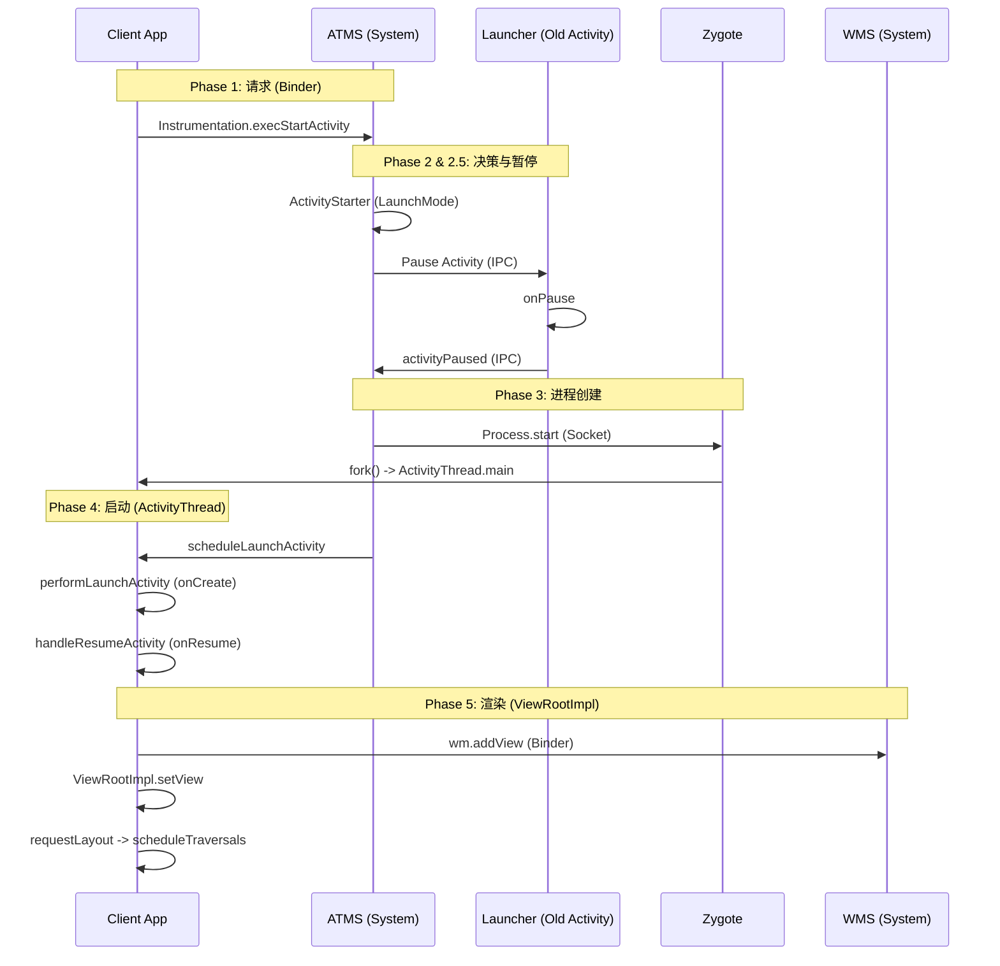

# Activity 启动流程深度解析：源码、Zygote 与 ViewRootImpl

本文将深入 Android Framework 源码，追踪从 `startActivity` 到界面显示 (`ViewRootImpl`) 的完整调用链。我们将重点分析关键方法、核心代码逻辑，以及 **Zygote 进程创建** 的底层机制。

## 0. 核心架构全景图



---

## Phase 1: 客户端请求 (Instrumentation)

一切始于 `Instrumentation`。它是应用与系统交互的监视器。

### 关键源码：`Instrumentation.execStartActivity`

```java
// Instrumentation.java
public ActivityResult execStartActivity(Context who, IBinder contextThread, IBinder token, Activity target, Intent intent, int requestCode, Bundle options) {
    // ... 省略部分检查代码 ...
    
    try {
        // 核心点：通过 Binder IPC 调用 ATMS
        // ActivityTaskManager.getService() 返回的是 IActivityTaskManager (Binder Proxy)
        int result = ActivityTaskManager.getService()
            .startActivity(whoThread, who.getBasePackageName(), intent,
                    intent.resolveTypeIfNeeded(who.getContentResolver()),
                    token, target != null ? target.mEmbeddedID : null,
                    requestCode, 0, null, options);
        
        // 检查启动结果 (如未在 Manifest 注册会抛异常)
        checkStartActivityResult(result, intent);
    } catch (RemoteException e) {
        throw new RuntimeException("Failure from system", e);
    }
    return null;
}
```

---

## Phase 2: 系统决策 (ATMS & ActivityStarter)

ATMS 收到请求后，委托给 `ActivityStarter`。
-   **Intent 解析**: 检查 Manifest，确认 Activity 是否存在。
-   **LaunchMode**: 解析 `singleTask` 等启动模式，决定是否复用任务栈。
-   **进程检查**: 检查目标 App 的进程 (`ProcessRecord`) 是否已运行。

---

## Phase 2.5: 暂停前台 Activity (Pause Launcher)

在创建新进程之前，系统必须先暂停当前正在前台运行的 Activity（通常是桌面 Launcher 或上一个应用）。

### 关键逻辑：`startPausing`

1.  **检查 Resume 状态**: `ActivityStarter` 发现当前栈顶有处于 Resumed 状态的 Activity。
2.  **发起暂停**: ATMS 调用 `startPausing`，通过 Binder 通知 Launcher 进程执行 `Pause`。
3.  **Launcher 响应**:
    -   Launcher 进程收到消息，在主线程执行 `onPause`。
    -   执行完毕后，通过 `ActivityTaskManager.getService().activityPaused(token)` 告诉 ATMS "我暂停好了"。
4.  **系统继续**: ATMS 收到 `activityPaused` 回调后，才继续执行后续的进程创建逻辑 (`Phase 3`)。

> [!NOTE]
> 这就是为什么在 `onPause` 中执行耗时操作会直接拖慢新 Activity 的启动速度。

---

## Phase 3: 进程创建 (Zygote & Socket)

这是冷启动的关键步骤。如果目标进程不存在，ATMS 需要请求 Zygote 创建新进程。

### 3.1 为什么用 Socket 而不是 Binder？

AMS 通过 `Process.start` 发起请求，底层使用 **Socket** 与 Zygote 通信。这不仅仅是简单的选择，而是为了规避多线程环境下的 **死锁 (Deadlock)** 问题。

*   **多线程陷阱**: Binder 机制是基于线程池的。如果 Zygote 使用 Binder，它就必须启动 Binder 线程池。
*   **Fork 的局限**: Linux 的 `fork()` 系统调用 **只复制调用线程**。如果 Zygote 是多线程的，`fork` 出来的子进程（App 进程）里，除了主线程外，其他线程（包括 Binder 线程）都会凭空消失，但它们持有的 **锁 (Mutex/Lock)** 状态却会被原封不动地复制过来。
*   **死锁场景**:
    1.  Zygote 的某个 Binder 线程 T1 正在持有锁 L。
    2.  此时主线程调用 `fork()`。
    3.  子进程继承了内存，显示锁 L 被持有（实际上持有者 T1 在子进程中根本不存在）。
    4.  子进程的主线程如果尝试去获取锁 L，就会无限等待，导致 **死锁**。
*   **结论**: 为了安全，Zygote 必须是 **单线程** 的（在 fork 时）。Socket 通信是阻塞式的单线程操作，完美契合这一需求。

### 3.2 `fork` 机制与 Copy-on-Write (COW)

Zygote 收到 Socket 命令后，调用 `fork()` 系统调用。这里利用了操作系统的高级内存管理机制。

*   **虚拟内存映射**: `fork` 发生时，内核 **不会** 立即复制父进程的物理内存。它只是复制了 **页表 (Page Table)**。
    *   父子进程的虚拟地址不同，但指向 **同一块物理内存**。
    *   这些共享的内存页被标记为 **只读 (Read-Only)**。
*   **写时复制 (COW)**:
    1.  当子进程（或父进程）尝试 **修改** 某页数据时。
    2.  CPU 的 MMU 触发 **缺页异常 (Page Fault)**（因为试图写只读页）。
    3.  操作系统捕获异常，分配新的物理内存页，将旧数据 **复制** 过去。
    4.  更新页表，将该页标记为 **可读写 (Read-Write)**。
    5.  恢复执行，写入操作完成。
*   **Zygote 的预加载红利**:
    *   Zygote 在启动时预加载了大量的 Framework 类 (`preloadClasses`) 和资源 (`preloadResources`)。
    *   由于 COW 机制，所有 App 进程在只读这些资源时，都 **共享** Zygote 的物理内存。
    *   这不仅极大地 **加快了启动速度**（不用重新加载资源），还节省了 **巨量的系统内存**。

### 3.3 `ActivityThread.main`
新进程启动后，进入入口方法：
```java
public static void main(String[] args) {
    // 1. 初始化主线程 Looper
    Looper.prepareMainLooper();

    // 2. 创建 ActivityThread 实例
    ActivityThread thread = new ActivityThread();
    thread.attach(false, startSeq); // 向 AMS 报到 (attachApplication)

    // 3. 开启消息循环
    Looper.loop();
}
```

---

---

## Phase 4: 应用初始化与 Activity 启动 (App Init & Launch)

当 Zygote 进程创建完毕 (`Phase 3`)，新进程的主线程 (`ActivityThread.main`) 开始运行。此时，App 进程虽然启动了，但还是一个空壳。它必须先初始化全局状态 (`Application`)，然后才能启动目标 `Activity`。

### 4.1 应用初始化 (`bindApplication`)

AMS 通过 Binder 调用 `ApplicationThread.bindApplication`，最终发送 `BIND_APPLICATION` 消息到主线程 Handler。

#### 关键源码：`handleBindApplication`

这是 App 进程初始化的核心。

```java
// ActivityThread.java
private void handleBindApplication(AppBindData data) {
    // 1. 创建 ContextImpl (系统上下文)
    final ContextImpl appContext = ContextImpl.createAppContext(this, data.info);

    // 2. 初始化 Instrumentation (如果是测试模式)
    mInstrumentation.init(this, instrContext, appContext, ...);

    // 3. 创建 Application 实例
    // data.info 是 LoadedApk 对象
    Application app = data.info.makeApplication(data.restrictedBackupMode, null);
    mInitialApplication = app;

    // 4. 调用 Application.onCreate
    mInstrumentation.callApplicationOnCreate(app);
}
```

#### 关键源码：`LoadedApk.makeApplication`

这里通过反射创建 Application 对象。

```java
// LoadedApk.java
public Application makeApplication(boolean forceDefaultAppClass, Instrumentation instrumentation) {
    // 如果 Application 已存在，直接返回 (单例)
    if (mApplication != null) {
        return mApplication;
    }

    // 1. 反射创建 Application 实例
    // className 来自 AndroidManifest.xml 的 <application android:name="...">
    ContextImpl appContext = ContextImpl.createAppContext(mActivityThread, this);
    app = mActivityThread.mInstrumentation.newApplication(
            cl, appClass, appContext);

    // 2. attach: 关联 Context
    // 此时 Application.attachBaseContext() 被调用
    appContext.setOuterContext(app);
    
    // 3. 添加到 ActivityThread 的应用列表
    mActivityThread.mAllApplications.add(app);
    mApplication = app;

    return app;
}
```

### 4.2 Activity 启动 (`scheduleLaunchActivity`)

当 `Application` 初始化完成后，AMS 紧接着发送 `EXECUTE_TRANSACTION` (或旧版的 `SCHEDULE_LAUNCH_ACTIVITY`)，触发 Activity 的创建。

#### 关键源码 1：`performLaunchActivity` (onCreate)

这是 Activity 实例诞生的时刻。

```java
// ActivityThread.java
private Activity performLaunchActivity(ActivityClientRecord r, Intent customIntent) {
    // 1. 获取 ClassLoader 并加载 Activity 类
    java.lang.ClassLoader cl = appContext.getClassLoader();
    Activity activity = mInstrumentation.newActivity(cl, component.getClassName(), r.intent);

    // 2. 获取 Application (直接复用 4.1 中创建的实例)
    Application app = r.packageInfo.makeApplication(false, mInstrumentation);

    if (activity != null) {
        // 3. Attach: 创建 Window (PhoneWindow) 并关联 Context
        activity.attach(appContext, this, getInstrumentation(), r.token,
                r.ident, app, r.intent, r.activityInfo, title, r.parent,
                r.embeddedID, r.lastNonConfigurationInstances, config,
                r.referrer, r.voiceInteractor, window, r.configCallback);

        // 4. 调用 onCreate
        if (r.isPersistable()) {
            mInstrumentation.callActivityOnCreate(activity, r.state, r.persistentState);
        } else {
            mInstrumentation.callActivityOnCreate(activity, r.state);
        }
    }
    return activity;
}
```

#### 关键源码 2：`handleResumeActivity` (onResume & addView)

这是 UI 显示的起点。

```java
// ActivityThread.java
public void handleResumeActivity(IBinder token, boolean finalStateRequest, boolean isForward, String reason) {
    // 1. 回调 onResume
    final ActivityClientRecord r = performResumeActivity(token, finalStateRequest, reason);

    final Activity a = r.activity;
    
    // 2. 关键点：将 DecorView 添加到 WindowManager
    if (r.window == null && !a.mFinished && willBeVisible) {
        r.window = r.activity.getWindow();
        View decor = r.window.getDecorView();
        
        // 这里的 wm 是 WindowManagerImpl
        ViewManager wm = a.getWindowManager();
        WindowManager.LayoutParams l = r.window.getAttributes();
        
        // 核心动作：开启 ViewRootImpl 流程
        wm.addView(decor, l);
    }
}
```

---

## Phase 5: UI 渲染与显示 (ViewRootImpl)

`WindowManagerImpl.addView` 最终会调用 `WindowManagerGlobal.addView`，在这里创建了 `ViewRootImpl`。

### 关键源码 1：`ViewRootImpl.setView`

`ViewRootImpl` 是 View 树的管理者，它负责驱动绘制。

```java
// ViewRootImpl.java
public void setView(View view, WindowManager.LayoutParams attrs, View panelParentView) {
    synchronized (this) {
        if (mView == null) {
            mView = view;
            
            // 1. 触发第一次绘制 (Measure/Layout/Draw)
            requestLayout();
            
            // 2. IPC 调用 WMS，将 Window 添加到屏幕
            // mWindowSession 是 IWindowSession (Binder Proxy)
            res = mWindowSession.addToDisplay(mWindow, mSeq, mWindowAttributes, ...);
        }
    }
}
```

### 关键源码 2：`requestLayout` 与 `scheduleTraversals`

绘制是如何被触发的？

```java
// ViewRootImpl.java
public void requestLayout() {
    if (!mHandlingLayoutInLayoutRequest) {
        checkThread(); // 检查是否在主线程
        mLayoutRequested = true;
        scheduleTraversals();
    }
}

void scheduleTraversals() {
    if (!mTraversalScheduled) {
        mTraversalScheduled = true;
        
        // 1. 发送同步屏障 (Sync Barrier)，优先处理异步消息 (绘制帧)
        mTraversalBarrier = mHandler.getLooper().getQueue().postSyncBarrier();
        
        // 2. 向 Choreographer 注册 VSync 回调
        // 当 VSync 信号到来时，会执行 mTraversalRunnable
        mChoreographer.postCallback(
                Choreographer.CALLBACK_TRAVERSAL, mTraversalRunnable, null);
    }
}

// mTraversalRunnable 最终调用 performTraversals()
private void performTraversals() {
    // ...
    performMeasure(childWidthMeasureSpec, childHeightMeasureSpec);
    performLayout(lp, mWidth, mHeight);
    performDraw();
    // ...
}
```

---

---

## 6. 总结：Application 创建时机与四大组件

Application 的创建（`onCreate`）通常发生在四大组件之前，但 **ContentProvider** 是个特例。

### 6.1 启动顺序对比

| 组件类型 | 启动顺序 | 说明 |
| :--- | :--- | :--- |
| **Activity** | Application -> Activity | 必须先初始化 Application 才能启动 Activity。 |
| **Service** | Application -> Service | 同上。 |
| **BroadcastReceiver** | Application -> Receiver | 同上。 |
| **ContentProvider** | **Provider** -> Application | **特例**：Provider 的 `onCreate` 早于 Application 的 `onCreate`。 |

### 6.2 为什么 ContentProvider 这么特殊？

在 `handleBindApplication` 中，`installContentProviders` 是在 `Application.onCreate` 之前被调用的。

**详细时序：**
1.  `Application` 构造函数
2.  `Application.attachBaseContext()`
3.  **`ContentProvider.onCreate()`**
4.  `Application.onCreate()`

**设计意图**：
ContentProvider 通常用于提供应用的基础数据（如数据库）。系统设计者认为，应用在 `onCreate` 初始化时可能就需要访问这些数据，因此必须先初始化 Provider。

> [!WARNING]
> 不要在 ContentProvider 的 `onCreate` 中使用依赖 `Application.onCreate` 初始化完成的全局变量，否则会空指针。

---

## 面试高频题

1.  **为什么 AMS 和 Zygote 通信要用 Socket 而不是 Binder？**
    -   为了避免死锁。Zygote 是所有 Android 进程的父进程，Binder 机制依赖多线程和驱动，在 fork 场景下处理 Binder 锁极其复杂（子进程继承锁状态但不继承持有锁的线程）。Socket 简单纯粹，适合单线程的 fork 操作。

2.  **Instrumentation 的作用是什么？**
    -   它是一个钩子（Hook）对象，系统通过它来实例化 Activity、Application，并调用生命周期方法。测试框架（如 Espresso）正是通过注入自定义 Instrumentation 来控制 App 行为的。

3.  **ActivityThread 是线程吗？**
    -   **不是**。它是一个普通的 Java 类，只是它包含了 `main` 方法，并且管理着主线程的 Looper。它是 App 进程的主入口。

4.  **`onCreate` 中 View 能获取宽高吗？**
    -   **不能**。从流程图可见，`onCreate` 只是初始化 Window。真正的 `measure` 发生在 Phase 5 的 `ViewRootImpl.performTraversals`，这远在 `onResume` 之后。
    -   **解法**: `View.post(Runnable)` 或 `onWindowFocusChanged`。

5.  **Activity 什么时候可见？**
    -   `onResume` 时 Activity 位于前台，但第一帧绘制是在 `ViewRootImpl` 执行完 `performTraversals` 之后。所以严格来说，`onResume` 之后还有一小段系统调度的延迟，用户才能看到画面。
