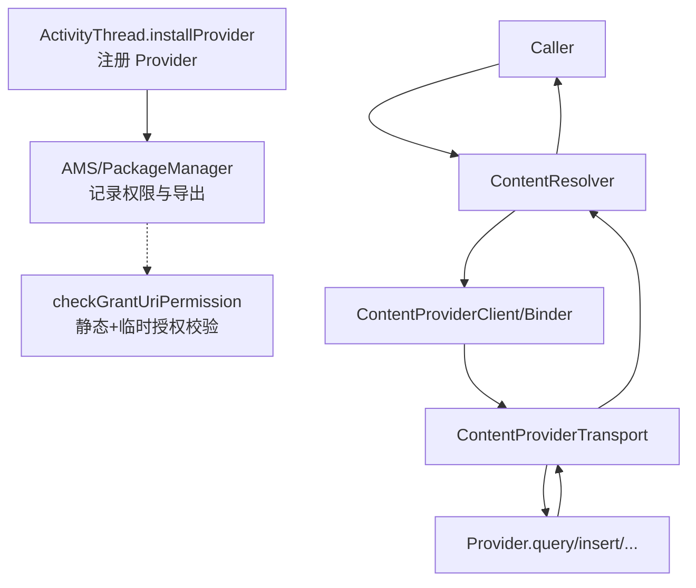
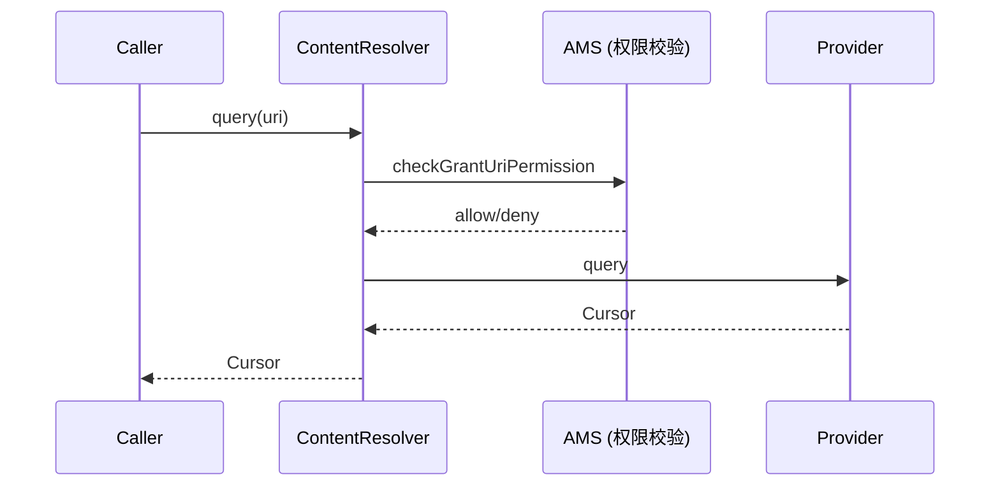

# ContentProvider 与权限模型（提升版）

聚焦跨进程调用链、授权模型、FileProvider 实战、现代平台限制与调试手段。

## 1. 概念与可视化

- Provider 提供统一 CRUD 与 URI 空间，跨进程共享。
- 权限：静态读/写权限 + 临时授权（GRANT flags）。
- 进程边界：Binder 调用进入 Provider，返回 Cursor 封装跨进程。



## 2. 权限与 Flags 速查表

| 项 | 作用 | 注意事项 |
| --- | --- | --- |
| `<permission>` / `<uses-permission>` | 静态读/写声明 | export=true 时务必收紧权限 |
| `FLAG_GRANT_READ_URI_PERMISSION` | 运行时临时读授权 | 配合 Intent/ClipData 传递 |
| `FLAG_GRANT_WRITE_URI_PERMISSION` | 运行时临时写授权 | 同上 |
| `FLAG_GRANT_PERSISTABLE_URI_PERMISSION` | 可持久化授权 | 需 `takePersistableUriPermission` |
| `FLAG_GRANT_PREFIX_URI_PERMISSION` | 前缀授权 | 谨慎，避免过宽 |

## 3. FileProvider 共享与临时授权

### Manifest 片段
```xml
<provider
  android:name="androidx.core.content.FileProvider"
  android:authorities="${applicationId}.fileprovider"
  android:exported="false"
  android:grantUriPermissions="true">
  <meta-data
    android:name="android.support.FILE_PROVIDER_PATHS"
    android:resource="@xml/file_paths" />
</provider>
```

### 发送端授予临时权限
```kotlin
val uri = FileProvider.getUriForFile(context, "${BuildConfig.APPLICATION_ID}.fileprovider", file)
val intent = Intent(Intent.ACTION_VIEW)
  .setDataAndType(uri, "application/pdf")
  .addFlags(Intent.FLAG_GRANT_READ_URI_PERMISSION)
// 可选：持久化
intent.addFlags(Intent.FLAG_GRANT_PERSISTABLE_URI_PERMISSION)
startActivity(intent)
```

### 接收端持久化（若声明了 persistable flag）
```kotlin
contentResolver.takePersistableUriPermission(
  intent.data!!,
  Intent.FLAG_GRANT_READ_URI_PERMISSION
)
```

## 4. 场景与最佳实践

- 跨进程查询：用精确 URI + 投影列 + 分页，及时 `close()`。
- 批量写入：使用事务或 `applyBatch` 减少锁竞争。
- 大文件：优先 FileProvider + 临时授权，避免裸路径暴露。
- 安全收敛：exported Provider 收紧权限；路径匹配精确，避免前缀过宽。

## 5. 调试与验证

- 注册/权限：`adb shell dumpsys package providers | grep <authority>`
- 直接查询：`adb shell content query --uri content://...`
- 授权查看：`adb shell dumpsys activity providers`（grants）
- 常见异常：`SecurityException`（授权缺失）、`FileNotFoundException`（URI/路径不匹配）、`SQLiteException`（SQL/事务问题）。

## 6. 现代平台限制（Android 15 / API 35 相关）

- 后台可见性：后台进程访问受保护 Provider 可能被拒，需前台态或权限；不要在纯后台 Service 直接访问。
- 分区存储：文件共享更应使用 FileProvider；避免直接 file://。
- PendingIntent：通知/DeepLink 相关跳转需 `FLAG_IMMUTABLE`，以防被篡改。

## 7. 对比与取舍

- Provider vs Binder/AIDL：数据表/查询型用 Provider；强类型 RPC/双向流用 Binder/AIDL。
- Cursor vs 对象序列化：Cursor 适合分页/惰性；对象直返占用内存更高但更直观。

## 8. 时序图：跨进程查询



## 9. 常见安全风险

- exported 过宽、未声明权限即对外开放。
- 路径匹配过宽（前缀授权）导致越权读写。
- 未关闭 Cursor、游标泄漏持有 FD。
- 在后台态发起跨进程访问被系统拒绝，引发异常未兜底。
