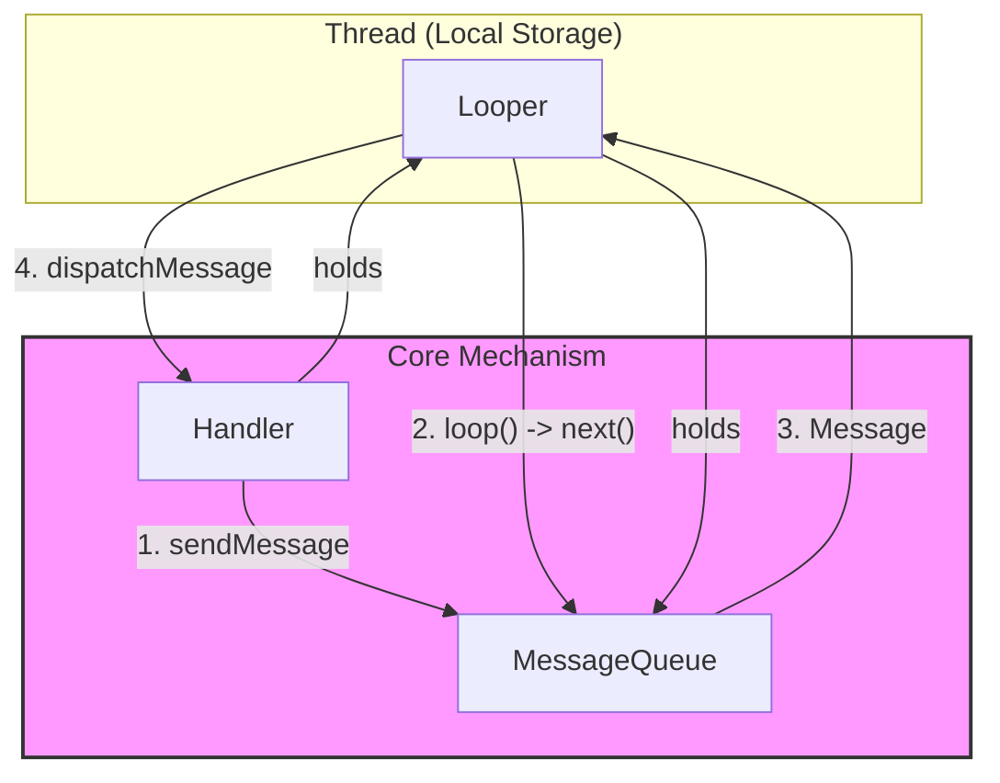
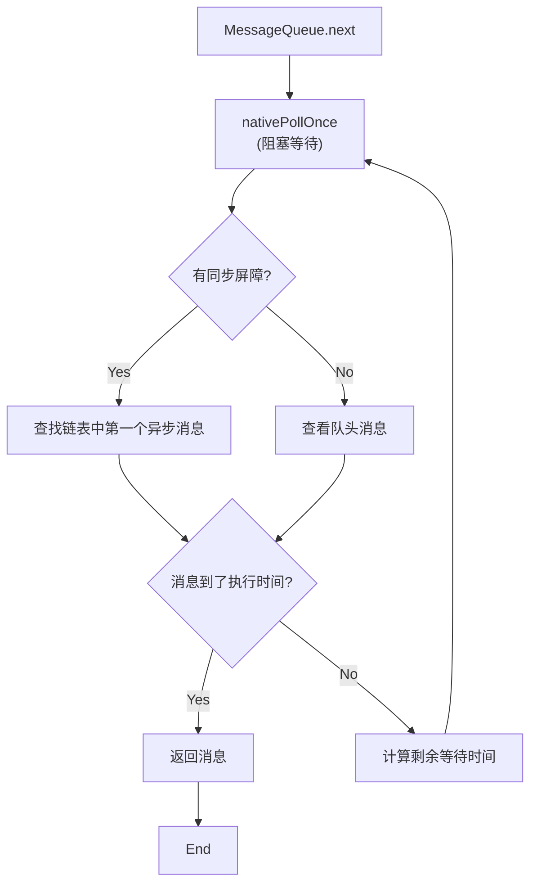
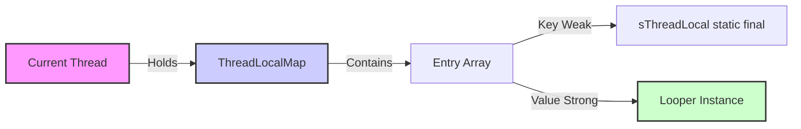
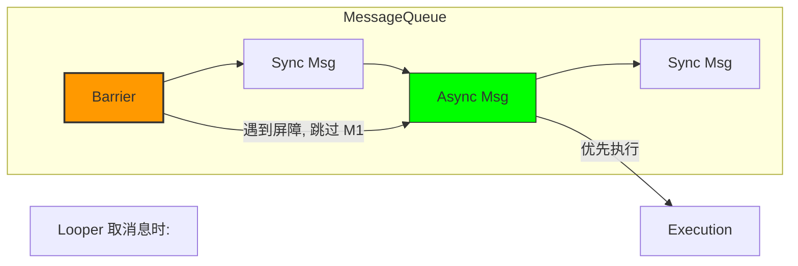
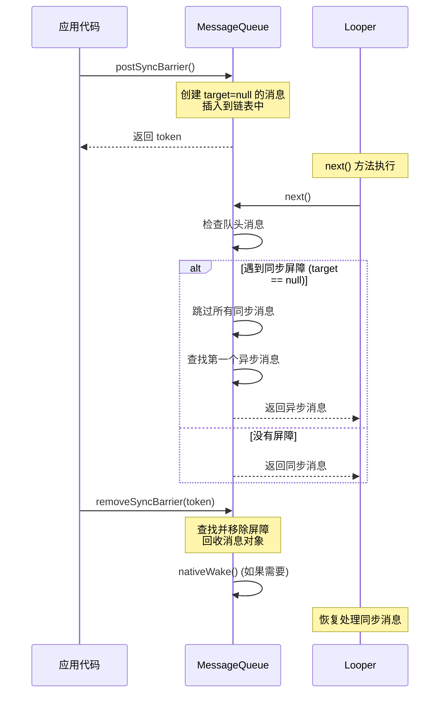

# Android Handler 机制深度解析：Looper, MessageQueue 与 Native 层

这份指南旨在通过可视化图表、源码级深度分析和实战场景，帮助你彻底掌握 Android 的消息机制。

## 1. 核心架构可视化

Android 的消息机制是基于 **生产者-消费者** 模型的事件驱动架构。

- **Handler**: 生产者 (sendMessage) & 消费者 (handleMessage)。
- **MessageQueue**: 优先级队列 (按时间排序的单链表)。
- **Looper**: 轮询器 (无限循环从队列取消息)。
- **Thread**: 载体 (一个线程对应一个 Looper)。



---

## 2. 深度源码流程：从 Java 到 Native

### 2.0 Looper 的准备：`prepare()`

在调用 `loop()` 之前，必须先初始化 Looper。

```java
// Looper.java
private static void prepare(boolean quitAllowed) {
    // 一个线程只能有一个 Looper
    if (sThreadLocal.get() != null) {
        throw new RuntimeException("Only one Looper may be created per thread");
    }
    sThreadLocal.set(new Looper(quitAllowed));
}

// 主线程专用：不允许退出 (quitAllowed = false)
public static void prepareMainLooper() {
    prepare(false);
    synchronized (Looper.class) {
        if (sMainLooper != null) {
            throw new IllegalStateException("The main Looper has already been prepared.");
        }
        sMainLooper = myLooper();
    }
}
```

### 2.1 消息循环的心脏：`Looper.loop()`

`Looper.loop()` 是整个机制的动力源。让我们深入源码（基于 Android 14/15 逻辑简化）：

```java
// Looper.java
public static void loop() {
    // 1. 获取当前线程的 Looper 对象
    final Looper me = myLooper();
    if (me == null) {
        throw new RuntimeException("No Looper; Looper.prepare() wasn't called on this thread.");
    }
    final MessageQueue queue = me.mQueue;

    // 2. 死循环
    for (;;) {
        // 3. 获取下一条消息 (可能会阻塞！)
        // next() 方法在没有消息时会调用 nativePollOnce 释放 CPU 进入休眠
        Message msg = queue.next(); 
        
        if (msg == null) {
            // 只有调用 queue.quit() 时，next() 才会返回 null，循环结束
            return;
        }

        // 4. 性能监控点：分发前
        // Printer 是 Looper 提供的日志接口，BlockCanary 等卡顿监控框架就是利用这里
        final Printer logging = me.mLogging;
        if (logging != null) {
            logging.println(">>>>> Dispatching to " + msg.target + " " + msg.callback + ": " + msg.what);
        }

        // 5. 分发消息
        // msg.target 就是发送这条消息的 Handler
        msg.target.dispatchMessage(msg);

        // 6. 性能监控点：分发后
        if (logging != null) {
            logging.println("<<<<< Finished to " + msg.target + " " + msg.callback);
        }

        // 7. 回收消息到对象池，以便复用
        msg.recycleUnchecked();
    }
}
```

### 2.2 阻塞与唤醒：`MessageQueue.next()`

这是整个机制中最精妙的地方。为什么主线程死循环不会卡死 CPU？答案是 **epoll 机制**。



#### Native 层揭秘 (`nativePollOnce`)
当 Java 层调用 `nativePollOnce` 时，会进入 Native 层 (C++)。
- **等待 (Wait)**: 如果没有消息，或者消息时间未到，线程会通过 `epoll_wait` (Linux 系统调用) 进入 **休眠状态**。此时线程挂起，**不占用 CPU 时间片**。
- **唤醒 (Wake)**: 当有新消息入队 (`enqueueMessage`) 时，会调用 `nativeWake`，向 `eventfd` 写入数据。`epoll_wait` 监听到事件，立即返回，线程恢复运行。

#### 2.2.1 Native 层深度揭秘

**为什么选择 epoll？**

epoll 是 Linux 2.6+ 引入的高效 I/O 事件通知机制，相比 select/poll 有显著优势：

| 特性 | select/poll | epoll |
|-----|-----------|-------|
| **时间复杂度** | O(n)：需要遍历所有文件描述符 | O(1)：只关注就绪的文件描述符 |
| **文件描述符限制** | 受 FD_SETSIZE 限制（通常 1024） | 支持大量文件描述符（仅受系统限制） |
| **内存拷贝** | 每次调用都需要拷贝文件描述符集合 | 内核与用户空间共享内存映射 |
| **适用场景** | 少量文件描述符 | 大量文件描述符，高并发 |

**epoll 的核心机制**：
```cpp
// Native 层实现（简化，来自 android_os_MessageQueue.cpp）
static jint android_os_MessageQueue_nativePollOnce(JNIEnv* env, jclass clazz,
        jlong ptr, jint timeoutMillis) {
    NativeMessageQueue* nativeMessageQueue = reinterpret_cast<NativeMessageQueue*>(ptr);
    return nativeMessageQueue->pollOnce(env, timeoutMillis);
}

int NativeMessageQueue::pollOnce(JNIEnv* env, int timeoutMillis) {
    // 1. 获取 epoll 文件描述符
    int eventCount = epoll_wait(mEpollFd, mRequest, EPOLL_MAX_EVENTS, timeoutMillis);
    
    // 2. 处理就绪的事件
    for (int i = 0; i < eventCount; i++) {
        if (mRequest[i].data.fd == mWakeEventFd) {
            // 3. 唤醒事件：清空 eventfd，返回
            awoken();
            return 1;
        }
    }
    return 0;
}
```

**eventfd 机制**：

`eventfd` 是 Linux 2.6.22+ 引入的轻量级事件通知机制，用于线程间通信。

```cpp
// Native 层唤醒实现（简化）
static void android_os_MessageQueue_nativeWake(JNIEnv* env, jclass clazz, jlong ptr) {
    NativeMessageQueue* nativeMessageQueue = reinterpret_cast<NativeMessageQueue*>(ptr);
    nativeMessageQueue->wake();
}

void NativeMessageQueue::wake() {
    // 向 eventfd 写入数据，触发 epoll 事件
    uint64_t inc = 1;
    ssize_t nWrite = TEMP_FAILURE_RETRY(write(mWakeEventFd, &inc, sizeof(uint64_t)));
    // epoll_wait 监听到事件，立即返回
}
```

**文件描述符管理**：

```cpp
// NativeMessageQueue 的初始化
NativeMessageQueue::NativeMessageQueue() {
    // 1. 创建 epoll 文件描述符
    mEpollFd = epoll_create(EPOLL_SIZE_HINT);
    
    // 2. 创建 eventfd（用于唤醒）
    mWakeEventFd = eventfd(0, EFD_NONBLOCK | EFD_CLOEXEC);
    
    // 3. 将 eventfd 注册到 epoll
    struct epoll_event eventItem;
    eventItem.events = EPOLLIN;
    eventItem.data.fd = mWakeEventFd;
    epoll_ctl(mEpollFd, EPOLL_CTL_ADD, mWakeEventFd, &eventItem);
}
```

**mPtr 的作用**：

`mPtr` 是 Java 层 `MessageQueue` 持有的 Native 层指针（`NativeMessageQueue*`），用于在 JNI 调用中定位 Native 对象。

```java
// MessageQueue.java
private long mPtr;  // Native 层指针

private native static long nativeInit();
private native static void nativeDestroy(long ptr);
private native void nativePollOnce(long ptr, int timeoutMillis);
private native static void nativeWake(long ptr);
```

**性能优化**：

epoll 的高效性体现在：
1. **事件驱动**：只关注就绪的文件描述符，无需轮询
2. **内核优化**：内核维护就绪列表，避免用户空间遍历
3. **内存映射**：内核与用户空间共享内存，减少拷贝

**完整调用链**：
```
Java: MessageQueue.next()
  ↓ JNI
Native: android_os_MessageQueue_nativePollOnce()
  ↓
Native: NativeMessageQueue::pollOnce()
  ↓
Linux: epoll_wait(mEpollFd, ...)  // 阻塞等待
  ↓ (有新消息时)
Native: nativeWake() → write(mWakeEventFd, ...)
  ↓
Linux: epoll_wait 返回（检测到 eventfd 事件）
  ↓
Java: MessageQueue.next() 返回消息
```

### 2.3 消息入队：`enqueueMessage`

消息是按 `when` (执行时间戳) 排序插入链表的。

```java
// MessageQueue.java
boolean enqueueMessage(Message msg, long when) {
    // 必须加锁：多生产者、单消费者模型
    // 1) 同一 MessageQueue 可能被多个线程并发 post/send（生产者不止一个）
    // 2) 需要原子更新有序链表、mMessages 头指针、needWake 判定，防止插入错乱或漏唤醒
    // 3) mQuitting/mBlocked/isInUse 等状态位也需同步保护
    synchronized (this) {
        msg.markInUse();
        msg.when = when;
        Message p = mMessages;
        boolean needWake;

        // 场景 1: 队列为空，或者新消息时间最早 (插在队头)
        if (p == null || when == 0 || when < p.when) {
            msg.next = p;
            mMessages = msg;
            needWake = mBlocked; // 如果当前 Loop 正处于阻塞状态，需要唤醒
        } else {
            // 场景 2: 插入队列中间
            // ... 遍历链表，找到合适的位置插入 ...
            needWake = false; // 通常不需要唤醒，除非插入的是异步消息且有屏障
        }

        // 如果需要唤醒，调用 Native 方法写入 eventfd
        if (needWake) {
            nativeWake(mPtr);
        }
    }
    return true;
}
```

**多线程切换简单示例**：工作线程将任务 post 到主线程队列，主线程在 `Looper.loop` 消费；如果多个工作线程同时 `sendMessage`，锁确保链表顺序和唤醒决策正确，不会因为竞争导致消息乱序或遗漏唤醒。

#### 为什么需要加锁（更详细）

- 多生产者：队列所在线程唯一，但任何线程都能 `post/send` 到这个队列；没有锁时两个生产者同时插入会破坏“按 when 有序”的单链表。
- 不变量保护：`mMessages` 头指针、链表 next 链接、`msg.isInUse` 标志、`mQuitting/mBlocked` 状态都必须原子更新；否则可能形成环、断链，导致后续消息永远无法取出。
- 唤醒判定：`needWake` 依赖当前队头、屏障、异步标记与 `mBlocked` 状态。若并发修改未同步，可能漏掉必要的 `nativeWake(mPtr)`，让队列卡在 `nativePollOnce`，消息延迟执行。
- 竞态后果示例：线程 A 判定无需唤醒，线程 B 插入更早的消息却未触发唤醒，主线程仍阻塞，直到超时才处理，表现为“偶发延迟/卡顿”。

### 2.4 Handler 的分发逻辑：`dispatchMessage`

Handler 处理消息有优先级的：

```java
// Handler.java
public void dispatchMessage(Message msg) {
    // 1. 优先处理 Message 自带的 Runnable (handler.post(Runnable))
    if (msg.callback != null) {
        handleCallback(msg);
    } else {
        // 2. 其次处理 Handler 构造时传入的 Callback 接口
        if (mCallback != null) {
            if (mCallback.handleMessage(msg)) {
                return;
            }
        }
        // 3. 最后调用重写的 handleMessage 方法
        handleMessage(msg);
    }
}
```

---

### 2.5 Handler 构造方法深度解析

Handler 有多种构造方法，每种都有不同的使用场景和注意事项。

#### 2.5.1 无参构造 `Handler()`

```java
// Handler.java
public Handler() {
    this(Looper.myLooper(), false);
    // 如果 myLooper() 返回 null，会在下面的构造方法中抛出异常
}

public Handler(@NonNull Looper looper, boolean async) {
    mLooper = looper;
    mQueue = looper.mQueue;  // 如果 looper 为 null，这里会抛出 NullPointerException
    mAsynchronous = async;
}
```

**工作原理**：
- 调用 `Looper.myLooper()` 获取**当前线程**的 Looper
- 如果当前线程没有 Looper（`myLooper()` 返回 `null`），会在构造方法中抛出异常
- 实际源码中，`Handler(Looper looper, boolean async)` 会检查 `looper` 是否为 `null`，如果为 `null` 会抛出 `RuntimeException`

**主线程 vs 子线程**：
```java
// 主线程：可以，因为主线程在 ActivityThread.main() 中已经调用了 Looper.prepareMainLooper()
Handler mainHandler = new Handler();  // ✅ 正常

// 子线程：不可以，会抛异常
new Thread(() -> {
    Handler handler = new Handler();  // ❌ RuntimeException: Can't create handler inside thread that has not called Looper.prepare()
}).start();
```

**常见错误**：
```java
// 错误示例：在子线程直接创建 Handler
new Thread(() -> {
    Handler handler = new Handler();  // 抛异常！
    handler.post(() -> {
        // ...
    });
}).start();

// 正确做法：先 prepare Looper
new Thread(() -> {
    Looper.prepare();
    Handler handler = new Handler();  // ✅ 正常
    Looper.loop();
}).start();
```

#### 2.5.2 指定 Looper 构造 `Handler(Looper looper)`

```java
// Handler.java
public Handler(@NonNull Looper looper) {
    this(looper, null, false);
}
```

**使用场景**：跨线程使用 Handler
```java
// 在工作线程中创建 Handler，但绑定到主线程的 Looper
Handler mainHandler = new Handler(Looper.getMainLooper());
mainHandler.post(() -> {
    // 这段代码会在主线程执行
    updateUI();
});
```

**获取主线程 Looper**：
- `Looper.getMainLooper()`：获取主线程的 Looper（全局单例）
- `Looper.myLooper()`：获取当前线程的 Looper

#### 2.5.3 Callback 构造 `Handler(Callback callback)`

```java
// Handler.java
public Handler(@NonNull Callback callback) {
    this(Looper.myLooper(), callback);
}
```

**使用场景**：避免创建 Handler 子类
```java
// 传统方式：需要创建子类
class MyHandler extends Handler {
    @Override
    public void handleMessage(Message msg) {
        // 处理消息
    }
}

// 使用 Callback：无需创建子类
Handler handler = new Handler(new Handler.Callback() {
    @Override
    public boolean handleMessage(Message msg) {
        // 处理消息
        return true;  // true 表示已处理，不再调用 handleMessage
    }
});
```

**Callback 的优先级**：在 `dispatchMessage` 中，Callback 优先于 `handleMessage`（见 2.4 节）

#### 2.5.4 异步 Handler 构造

```java
// Handler.java
public Handler(@NonNull Looper looper, @Nullable Callback callback, boolean async) {
    mLooper = looper;
    mQueue = looper.mQueue;
    mCallback = callback;
    mAsynchronous = async;  // 关键：标记为异步
}
```

**异步 Handler 的作用**：
- 通过此 Handler 发送的消息会被自动标记为异步消息
- 配合同步屏障使用，可以优先执行

```java
// 创建异步 Handler（需要反射，因为 API 隐藏）
Constructor<Handler> constructor = Handler.class.getDeclaredConstructor(
    Looper.class, Handler.Callback.class, boolean.class);
constructor.setAccessible(true);
Handler asyncHandler = constructor.newInstance(
    Looper.getMainLooper(), null, true);

// 通过异步 Handler 发送的消息会自动标记为异步
asyncHandler.post(() -> {
    // 这条消息会被标记为异步，可以穿透同步屏障
});
```

**注意事项**：
- 普通开发者很少需要创建异步 Handler
- 主要用于系统内部（如 Choreographer）
- 需要配合同步屏障使用才有意义

#### 2.5.5 构造方法选择指南

| 构造方法 | 适用场景 | 注意事项 |
|---------|---------|---------|
| `Handler()` | 主线程或已 prepare Looper 的线程 | 子线程会抛异常 |
| `Handler(Looper)` | 跨线程使用，指定目标线程 | 最常用 |
| `Handler(Callback)` | 避免创建子类 | Callback 优先于 handleMessage |
| `Handler(Looper, Callback, boolean)` | 创建异步 Handler | 需要反射，系统内部使用 |

### 2.6 Looper 退出机制：quit() vs quitSafely()

Looper 提供了两种退出方式，它们的行为有重要区别。

#### 2.6.1 quit() 方法：立即退出

```java
// Looper.java
public void quit() {
    mQueue.quit(false);  // false 表示不安全退出
}
```

**行为**：
- **立即退出**：不等待当前消息处理完
- **丢弃消息**：所有未处理的消息都会被丢弃
- **返回 null**：`MessageQueue.next()` 立即返回 null，`Looper.loop()` 退出

**源码分析**：
```java
// MessageQueue.java
void quit(boolean safe) {
    synchronized (this) {
        if (mQuitting) {
            return;  // 已经退出，直接返回
        }
        mQuitting = true;
        
        if (safe) {
            // quitSafely：移除所有未来的消息，但处理完当前消息
            removeAllFutureMessagesLocked();
        } else {
            // quit：移除所有消息，包括当前的
            removeAllMessagesLocked();
        }
        
        nativeWake(mPtr);  // 唤醒阻塞的 next()
    }
}
```

#### 2.6.2 quitSafely() 方法：安全退出

```java
// Looper.java
public void quitSafely() {
    mQueue.quit(true);  // true 表示安全退出
}
```

**行为**：
- **等待当前消息**：处理完当前正在处理的消息
- **移除未来消息**：只移除还未到执行时间的消息
- **优雅退出**：保证当前消息处理完再退出

**源码分析**：
```java
// MessageQueue.java
private void removeAllFutureMessagesLocked() {
    final long now = SystemClock.uptimeMillis();
    Message p = mMessages;
    if (p != null) {
        if (p.when > now) {
            // 未来消息：全部移除
            removeAllMessagesLocked();
        } else {
            // 当前消息：保留，等待处理
            Message n;
            for (;;) {
                n = p.next;
                if (n == null) {
                    return;
                }
                if (n.when > now) {
                    break;
                }
                p = n;
            }
            p.next = null;
            // 移除所有未来消息
            do {
                p = n;
                n = p.next;
                p.recycleUnchecked();
            } while (n != null);
        }
    }
}
```

#### 2.6.3 使用场景对比

| 方法 | 使用场景 | 示例 |
|-----|---------|------|
| `quit()` | 需要立即停止，不关心未处理消息 | 强制退出 HandlerThread |
| `quitSafely()` | 需要优雅退出，保证消息处理完 | 正常关闭 HandlerThread |

**示例：HandlerThread 的正确退出**
```java
HandlerThread handlerThread = new HandlerThread("Worker");
handlerThread.start();
Handler handler = new Handler(handlerThread.getLooper());

// 发送一些消息
handler.post(() -> {
    // 重要任务
    saveData();
});

// 退出方式 1：立即退出（不推荐，可能丢失消息）
handlerThread.quit();  // ❌ 可能丢失 saveData() 任务

// 退出方式 2：安全退出（推荐）
handlerThread.quitSafely();  // ✅ 等待 saveData() 完成再退出
```

#### 2.6.4 主线程 Looper 不允许 quit

```java
// Looper.java
private static void prepare(boolean quitAllowed) {
    // ...
    sThreadLocal.set(new Looper(quitAllowed));
}

public static void prepareMainLooper() {
    prepare(false);  // 主线程 Looper 不允许退出
}
```

**原因**：
- 主线程 Looper 是应用的生命线
- 如果主线程 Looper 退出，应用会崩溃
- `quit()` 和 `quitSafely()` 在主线程 Looper 上调用会抛出异常

```java
// 主线程 Looper 调用 quit 会抛异常
Looper.getMainLooper().quit();  // ❌ IllegalStateException: Main thread not allowed to quit.
```

#### 2.6.5 quit 后的行为

**新消息的处理**：
```java
// MessageQueue.java
boolean enqueueMessage(Message msg, long when) {
    synchronized (this) {
        if (mQuitting) {
            IllegalStateException e = new IllegalStateException(
                msg.target + " sending message to a Handler on a dead thread");
            Log.w(TAG, e.getMessage(), e);
            msg.recycle();
            return false;  // 返回 false，消息不会被处理
        }
        // ...
    }
}
```

**注意事项**：
- quit 后，Handler 发送消息会返回 false（`sendMessage`）或静默失败（`post`）
- 已存在但未处理的消息：
  - `quit()`：全部丢弃
  - `quitSafely()`：处理完当前消息，丢弃未来消息

#### 2.6.6 MessageQueue 的 quit 机制详解

**mQuitting 标志的作用**：

```java
// MessageQueue.java
private boolean mQuitting;  // 标记队列是否已退出

void quit(boolean safe) {
    synchronized (this) {
        if (mQuitting) {
            return;  // 已经退出，直接返回
        }
        mQuitting = true;  // 标记为退出状态
        
        if (safe) {
            removeAllFutureMessagesLocked();  // 安全退出
        } else {
            removeAllMessagesLocked();  // 立即退出
        }
        
        nativeWake(mPtr);  // 唤醒阻塞的 next()
    }
}
```

**quit 后新消息的处理**：

```java
// MessageQueue.java
boolean enqueueMessage(Message msg, long when) {
    synchronized (this) {
        if (mQuitting) {
            // 队列已退出，拒绝新消息
            IllegalStateException e = new IllegalStateException(
                msg.target + " sending message to a Handler on a dead thread");
            Log.w(TAG, e.getMessage(), e);
            msg.recycle();  // 回收消息
            return false;  // 返回 false，表示消息未入队
        }
        // ... 正常入队逻辑
    }
}
```

**已存在消息的处理**：

```java
// MessageQueue.java
private void removeAllMessagesLocked() {
    Message p = mMessages;
    while (p != null) {
        Message n = p.next;
        p.recycleUnchecked();  // 回收所有消息
        p = n;
    }
    mMessages = null;
}

private void removeAllFutureMessagesLocked() {
    final long now = SystemClock.uptimeMillis();
    Message p = mMessages;
    if (p != null) {
        if (p.when > now) {
            // 场景 1：队头消息就是未来消息，说明所有消息都是未来消息
            // 全部移除（包括队头）
            removeAllMessagesLocked();
        } else {
            // 场景 2：队头消息是当前或过去消息，需要保留
            // 遍历链表，找到第一个未来消息的位置
            Message n;
            for (;;) {
                n = p.next;
                if (n == null) {
                    // 没有未来消息，所有消息都保留
                    return;
                }
                if (n.when > now) {
                    break;  // 找到第一个未来消息 n
                }
                p = n;  // 继续遍历，p 指向当前消息
            }
            // 断开链表：p.next 指向第一个未来消息，将其设为 null
            p.next = null;
            // 移除所有未来消息（从 n 开始的所有消息）
            do {
                p = n;
                n = p.next;
                p.recycleUnchecked();  // 回收消息对象
            } while (n != null);
        }
    }
}
```

**线程安全**：

- quit 操作在 `synchronized` 块中执行，保证线程安全
- `mQuitting` 标志的检查和设置是原子的
- 新消息的入队检查也是原子的

---

### 2.7 消息复用池：`Message.obtain()`

为了避免频繁创建和销毁 `Message` 对象导致内存抖动 (Memory Churn)，Android 使用了享元模式 (Flyweight Pattern) 来复用消息对象。

```java
// Message.java
// 静态锁对象，保护 sPool
public static final Object sPoolSync = new Object();
// 链表头指针
private static Message sPool;

public static Message obtain() {
    synchronized (sPoolSync) {
        if (sPool != null) {
            // 1. 取出链表头的消息
            Message m = sPool;
            sPool = m.next;
            m.next = null;
            m.flags = 0; // 清除标记
            sPoolSize--;
            return m;
        }
    }
    // 2. 池子空了才 new 新对象
    return new Message();
}

// 消息被处理完后，Looper 会调用 recycleUnchecked
void recycleUnchecked() {
    // ... 清除数据 (what, obj, callback 等) ...
    
    synchronized (sPoolSync) {
        if (sPoolSize < MAX_POOL_SIZE) {
            // 3. 插入链表头 (头插法)
            next = sPool;
            sPool = this;
            sPoolSize++;
        }
    }
}
```

---

### 2.8 设计模式深度：享元模式 (Flyweight Pattern)

`Message` 的复用机制是 **享元模式** 在 Android 源码中的经典应用。

#### 核心概念
享元模式旨在通过 **共享对象** 来减少内存使用和对象创建的开销。它将对象的状态分为两部分：
1.  **内部状态 (Intrinsic State)**: 对象共享的、不会随环境改变的状态。
2.  **外部状态 (Extrinsic State)**: 对象特有的、随环境改变的状态。

#### Android 中的实现
在 `Message` 中：
*   **享元工厂 (Flyweight Factory)**: `Message.obtain()` 充当工厂，负责从池中获取对象。
*   **享元对象 (Concrete Flyweight)**: `Message` 本身。
*   **状态分离**:
    *   **结构 (内部状态)**: `next` 指针。这是链表结构的一部分，被池子管理。
    *   **数据 (外部状态)**: `what`, `arg1`, `obj` 等。这些数据在每次 `obtain` 后由使用者填充，在使用完 `recycle` 时被 **擦除 (Reset)**。

#### 为什么必须用享元？
Android 主线程的消息循环频率极高（60Hz 甚至 120Hz）。
*   **如果不复用**: 每秒钟可能创建成百上千个 `Message` 对象。
*   **后果**:
    1.  **内存抖动 (Memory Churn)**: 短时间内大量对象创建和销毁。
    2.  **GC 卡顿**: 频繁触发 GC，导致主线程暂停 (Stop-the-world)，直接引发 UI 掉帧 (Jank)。
*   **复用收益**: `sPool` 就像一个缓冲区，将对象分配的开销降到了几乎为零（仅涉及链表指针操作）。

---

### 2.9 Handler.Callback 接口深度解析

在 `dispatchMessage` 中，Handler 提供了三种消息处理方式，按优先级排序：

```java
// Handler.java
public void dispatchMessage(Message msg) {
    if (msg.callback != null) {
        // 1. 最高优先级：Message 自带的 Runnable
        handleCallback(msg);
    } else {
        if (mCallback != null) {
            // 2. 次优先级：Handler 构造时传入的 Callback
            if (mCallback.handleMessage(msg)) {
                return;  // Callback 返回 true，表示已处理，不再调用 handleMessage
            }
        }
        // 3. 最低优先级：重写的 handleMessage 方法
        handleMessage(msg);
    }
}
```

#### 2.9.1 Callback 的优先级

**优先级顺序**：
1. `msg.callback`（Runnable）：最高优先级
2. `mCallback.handleMessage()`：次优先级
3. `handleMessage()`：最低优先级

**Callback 的返回值**：
- `true`：表示已处理，不再调用 `handleMessage()`
- `false`：表示未处理，继续调用 `handleMessage()`

#### 2.9.2 使用场景

**场景 1：避免创建 Handler 子类**
```java
// 传统方式：需要创建子类
class MyHandler extends Handler {
    @Override
    public void handleMessage(Message msg) {
        // 处理消息
    }
}

// 使用 Callback：无需创建子类，代码更简洁
Handler handler = new Handler(new Handler.Callback() {
    @Override
    public boolean handleMessage(Message msg) {
        switch (msg.what) {
            case MSG_UPDATE_UI:
                updateUI();
                return true;  // 已处理
            default:
                return false;  // 未处理，继续调用 handleMessage
        }
    }
});
```

**场景 2：统一消息处理逻辑**
```java
// 在框架代码中，使用 Callback 统一处理某些消息
Handler handler = new Handler(Looper.getMainLooper(), new Handler.Callback() {
    @Override
    public boolean handleMessage(Message msg) {
        // 框架统一处理逻辑
        if (handleFrameworkMessage(msg)) {
            return true;
        }
        // 交给子类处理
        return false;
    }
});
```

#### 2.9.3 与 handleMessage 的配合

```java
// 示例：Callback 处理部分消息，其他交给 handleMessage
Handler handler = new Handler(new Handler.Callback() {
    @Override
    public boolean handleMessage(Message msg) {
        // 只处理特定类型的消息
        if (msg.what == MSG_SYSTEM) {
            handleSystemMessage(msg);
            return true;  // 已处理，不再调用 handleMessage
        }
        return false;  // 未处理，继续调用 handleMessage
    }
}) {
    @Override
    public void handleMessage(Message msg) {
        // 处理其他类型的消息
        switch (msg.what) {
            case MSG_USER:
                handleUserMessage(msg);
                break;
        }
    }
};
```

#### 2.9.4 实际应用

在 Android 框架中，Callback 被广泛使用：
- **ViewRootImpl**：使用 Callback 处理某些系统消息
- **ActivityThread**：使用 Callback 统一处理应用消息
- **自定义框架**：使用 Callback 实现消息拦截和处理

---

## 3. 线程隔离的魔法：ThreadLocal

你是否好奇，为什么 `Looper.myLooper()` 能获取到 **当前线程** 的 Looper？为什么不同线程的 Looper 不会混淆？
这归功于 `ThreadLocal`。

### 3.1 什么是 ThreadLocal？
`ThreadLocal` 可以被理解为一个特殊的 **“储物柜”**。
尽管这个储物柜本身（`sThreadLocal` 对象）是共享的，但 **每个线程** 来使用它时，都会得到一个自己专属的、独立的隔间。
*   `sThreadLocal.set(value)`: 当前线程把 `value` 存入它自己的隔间里。
*   `sThreadLocal.get()`: 当前线程从它自己的隔间里取出之前存入的东西。

其他线程无法访问到当前线程隔间里的东西，这就完美地实现了 **线程间的数据隔离**。

### 3.2 源码深度解析：ThreadLocalMap

很多开发者误以为 `ThreadLocal` 内部维护了一个 Map，Key 是 Thread，Value 是存储的值。**事实恰恰相反**。
**真实结构**：每个 `Thread` 对象内部维护了一个 `ThreadLocalMap`，Key 是 `ThreadLocal` 对象本身，Value 是存储的值。

#### 3.2.1 核心数据结构
```java
// Thread.java
public class Thread implements Runnable {
    // 存储该线程所有的 ThreadLocal 变量
    ThreadLocal.ThreadLocalMap threadLocals = null;
}
```

`ThreadLocalMap` 是一个自定义的哈希表，它与 `HashMap` 有两个关键区别：
1.  **Entry 的实现**：继承自 `WeakReference`。
2.  **哈希冲突解决**：使用 **开放寻址法 (Open Addressing)** 中的 **线性探测 (Linear Probing)**，而不是链地址法 (Chaining)。

```java
// ThreadLocal.java -> ThreadLocalMap -> Entry
static class Entry extends WeakReference<ThreadLocal<?>> {
    /** The value associated with this ThreadLocal. */
    Object value;

    Entry(ThreadLocal<?> k, Object v) {
        super(k); // Key 是弱引用
        value = v; // Value 是强引用
    }
}
```

#### 3.2.2 为什么 Key 是弱引用？
*   **Key (ThreadLocal)**: 使用弱引用 (`WeakReference`)。如果外部没有对 `ThreadLocal` 对象的强引用，GC 时 Key 会被回收，变为 `null`。
*   **Value**: 使用强引用。
*   **内存泄漏风险**: 如果 Key 被回收（变为 null），但 Value 还在，且线程（Thread）长时间运行（如线程池核心线程），那么 `Entry` 中的 Value 将无法被访问也无法被回收，导致内存泄漏。
*   **解决办法**: 使用完 `ThreadLocal` 后，务必调用 `remove()` 方法。

#### 3.2.3 线性探测 (Linear Probing)
当发生哈希冲突时，`ThreadLocalMap` 不会像 `HashMap` 那样拉链，而是 **向后寻找下一个空槽位**。
*   **存入**: 计算 hash -> 有冲突 -> index++ -> 直到找到空位。
*   **取出**: 计算 hash -> 比较 Key -> 不一致 -> index++ -> 直到找到或遇到 null。

### 3.3 Looper 与 ThreadLocal 的关系图谱



当我们在主线程调用 `Looper.prepare()` 时：
1.  获取 `Thread.currentThread()`。
2.  获取该线程的 `threadLocals` (Map)。
3.  以 `sThreadLocal` (静态对象) 为 Key，新创建的 `Looper` 为 Value，存入 Map。

由于 `sThreadLocal` 是 `static final` 的，它在整个应用生命周期内只有一个实例。但因为它作为 Key 存入了 **不同线程** 的 `ThreadLocalMap` 中，所以每个线程都能通过同一个 `sThreadLocal` 取出属于自己的那个 `Looper`。

#### 3.3.1 源码验证：Looper.prepare()

`Looper` 使用一个 `static final` 的 `ThreadLocal` 对象来存储 Looper 实例。

```java
// Looper.java
static final ThreadLocal<Looper> sThreadLocal = new ThreadLocal<Looper>();

private static void prepare(boolean quitAllowed) {
    // 1. 检查当前线程是否已经有 Looper 了
    if (sThreadLocal.get() != null) {
        throw new RuntimeException("Only one Looper may be created per thread");
    }
    // 2. 创建 Looper 并存入当前线程的 ThreadLocalMap
    sThreadLocal.set(new Looper(quitAllowed));
}

public static @Nullable Looper myLooper() {
    // 3. 从当前线程的 Map 中取出 Looper
    return sThreadLocal.get();
}
```

**总结**: `ThreadLocal` 就像是线程的“私有口袋”，`Looper` 把自己放进了当前线程的口袋里。

#### 3.3.2 关联总结
Looper 与 Thread 的关联并非通过直接的成员变量（如 `Thread.mLooper`），而是通过 `ThreadLocal` 间接关联：
1.  **Thread** 持有 `ThreadLocalMap`。
2.  **ThreadLocalMap** 持有 `Entry` 数组。
3.  **Entry** 以 `sThreadLocal` 为 Key，`Looper` 实例为 Value。

这种设计使得 `Looper` 既能与线程绑定（生命周期一致），又能保持 `Thread` 类的纯净（不需要知道 Looper 的存在）。

---

## 4. 高级机制：同步屏障 (Sync Barrier)

同步屏障是一种特殊的消息（`target` 为 null），它的作用是 **拦截同步消息，优先执行异步消息**。

### 4.1 原理图解



### 4.2 同步屏障的实现细节

#### 4.2.1 postSyncBarrier() 方法实现

`postSyncBarrier()` 用于在消息队列中插入一个同步屏障，返回一个 token（用于后续移除屏障）。

```java
// MessageQueue.java
public int postSyncBarrier() {
    return postSyncBarrier(SystemClock.uptimeMillis());
}

private int postSyncBarrier(long when) {
    // 1. 加锁，保证线程安全
    synchronized (this) {
        // 2. 生成唯一的 token（自增计数器）
        final int token = mNextBarrierToken++;
        
        // 3. 从消息池中获取一个 Message 对象
        final Message msg = Message.obtain();
        msg.markInUse();  // 标记为使用中
        msg.when = when;  // 设置时间戳
        msg.arg1 = token;  // 将 token 存储在 arg1 中，用于后续移除
        
        // 4. 关键：target 设置为 null，这是同步屏障的标志
        //    在 next() 方法中，target == null 的消息会被识别为同步屏障
        msg.target = null;
        
        // 5. 将屏障消息按时间顺序插入到消息链表中
        Message prev = null;
        Message p = mMessages;
        
        // 5.1 如果队列为空，或者屏障时间最早，插入到队头
        if (when != 0) {
            // 遍历链表，找到合适的位置（按 when 时间排序）
            while (p != null && p.when <= when) {
                prev = p;
                p = p.next;
            }
        }
        
        // 5.2 插入屏障消息到链表中
        if (prev != null) {
            // 插入到链表中间
            msg.next = p;
            prev.next = msg;
        } else {
            // 插入到队头
            msg.next = p;
            mMessages = msg;
        }
        
        // 6. 返回 token，用于后续移除屏障
        return token;
    }
}
```

**关键实现点**：

1. **token 生成**：
   - 使用 `mNextBarrierToken++` 生成唯一标识
   - token 存储在 `Message.arg1` 中，用于后续移除屏障

2. **屏障标志**：
   - `msg.target = null` 是同步屏障的核心标志
   - 在 `next()` 方法中，通过检查 `target == null` 来识别屏障

3. **插入位置**：
   - 屏障消息按 `when` 时间戳插入链表
   - 如果 `when == 0`，插入到队头（立即生效）
   - 如果 `when > 0`，按时间顺序插入

4. **线程安全**：
   - 所有操作都在 `synchronized` 块中执行
   - 保证多线程环境下的安全性

#### 4.2.2 removeSyncBarrier() 方法实现

`removeSyncBarrier()` 用于移除指定的同步屏障，恢复同步消息的处理。

```java
// MessageQueue.java
public void removeSyncBarrier(int token) {
    // 1. 加锁，保证线程安全
    synchronized (this) {
        Message prev = null;
        Message p = mMessages;
        
        // 2. 遍历消息链表，查找匹配的屏障消息
        //    屏障消息的特征：target == null && arg1 == token
        while (p != null && (p.target != null || p.arg1 != token)) {
            prev = p;
            p = p.next;
        }
        
        // 3. 如果没找到匹配的屏障，直接返回
        if (p == null) {
            throw new IllegalStateException("The specified message queue synchronization "
                    + " barrier token has not been posted or has already been removed.");
        }
        
        // 4. 检查是否需要唤醒阻塞的 next() 方法
        boolean needWake = false;
        
        // 4.1 如果屏障不在队头，通常不需要唤醒
        //     因为 next() 方法会继续处理后面的消息
        if (prev != null) {
            // 屏障在链表中间，移除后不需要唤醒
            prev.next = p.next;
            needWake = false;
        } else {
            // 4.2 如果屏障在队头，移除后需要检查是否需要唤醒
            mMessages = p.next;
            // 如果队列不为空，且 Looper 当前处于阻塞状态，需要唤醒
            needWake = mMessages == null || mMessages.target != null;
        }
        
        // 5. 回收屏障消息对象
        p.recycleUnchecked();
        
        // 6. 如果需要唤醒，调用 Native 方法唤醒阻塞的线程
        if (needWake) {
            nativeWake(mPtr);
        }
    }
}
```

**关键实现点**：

1. **屏障查找**：
   - 通过 `target == null && arg1 == token` 来定位屏障消息
   - 遍历整个链表，找到匹配的屏障

2. **唤醒判断**：
   - 如果屏障在队头，移除后需要检查是否需要唤醒
   - 如果队列为空或下一个消息是同步消息，需要唤醒 `next()` 方法

3. **错误处理**：
   - 如果没找到匹配的屏障，抛出 `IllegalStateException`
   - 防止重复移除或移除不存在的屏障

4. **内存管理**：
   - 移除屏障后，调用 `recycleUnchecked()` 回收消息对象
   - 防止内存泄漏

#### 4.2.3 同步屏障的工作流程



#### 4.2.4 源码中的关键数据结构

```java
// MessageQueue.java
private int mNextBarrierToken;  // 屏障 token 计数器，每次插入屏障时自增

// Message.java
public Handler target;  // 目标 Handler，null 表示同步屏障
public int arg1;        // 存储屏障 token
public long when;       // 消息执行时间戳
```

#### 4.2.5 注意事项

1. **必须配对使用**：
   - 每次调用 `postSyncBarrier()` 后，必须调用 `removeSyncBarrier(token)`
   - 忘记移除会导致同步消息永远无法执行

2. **线程安全**：
   - 两个方法都是线程安全的，可以在任何线程调用
   - 但通常在主线程使用（系统内部）

3. **性能影响**：
   - 插入和移除屏障都是 O(n) 操作（需要遍历链表）
   - 但实际使用频率很低，性能影响可忽略

4. **API 限制**：
   - Android 9.0 (API 28) 及以上版本，这些方法是隐藏 API
   - 需要通过反射调用，普通应用不建议使用

### 4.4 核心场景：UI 绘制
Android 系统为了保证 UI 流畅，在 `Choreographer` 请求 Vsync 信号时，会发送一个 **同步屏障**。
1.  **VSync 到来**: 系统向主线程发送 Vsync 信号。
2.  **插入屏障**: `ViewRootImpl` 往队列插入屏障（调用 `postSyncBarrier()`）。
3.  **优先处理**: 此时队列中只有 `Asynchronous` 消息（如 `doFrame` 绘制任务）会被处理，普通的 Handler 消息被暂停。
4.  **移除屏障**: 绘制完成后，移除屏障（调用 `removeSyncBarrier(token)`），恢复普通消息处理。

> [!WARNING]
> **开发陷阱**: 如果你反射调用了 `postSyncBarrier` 但忘记 `removeSyncBarrier`，主线程的普通消息将永远无法执行（看起来像假死），只有异步消息能跑。

### 4.5 异步消息与异步 Handler

同步屏障的作用是拦截同步消息，优先执行异步消息。那么如何创建异步消息呢？

#### 4.5.1 Message.setAsynchronous()

```java
// Message.java
public void setAsynchronous(boolean async) {
    if (async) {
        flags |= FLAG_ASYNCHRONOUS;
    } else {
        flags &= ~FLAG_ASYNCHRONOUS;
    }
}

public boolean isAsynchronous() {
    return (flags & FLAG_ASYNCHRONOUS) != 0;
}
```

**手动标记异步消息**：
```java
Message msg = Message.obtain();
msg.what = MSG_UPDATE;
msg.setAsynchronous(true);  // 标记为异步
handler.sendMessage(msg);
```

#### 4.5.2 异步 Handler 的创建

通过异步 Handler 发送的消息会自动标记为异步：

```java
// Handler.java
public Handler(@NonNull Looper looper, @Nullable Callback callback, boolean async) {
    mLooper = looper;
    mQueue = looper.mQueue;
    mCallback = callback;
    mAsynchronous = async;  // 标记 Handler 为异步
}

// 发送消息时自动标记
private boolean enqueueMessage(MessageQueue queue, Message msg, long uptimeMillis) {
    msg.target = this;
    if (mAsynchronous) {
        msg.setAsynchronous(true);  // 自动标记为异步
    }
    return queue.enqueueMessage(msg, uptimeMillis);
}
```

**创建异步 Handler**（需要反射，因为 API 隐藏）：

> **版本说明**：
> - `Handler(Looper, Callback, boolean)` 构造方法在 Android 6.0 (API 23) 及以上版本可用
> - 异步 Handler 主要用于系统内部，普通应用很少需要

```java
// 方式 1：使用反射创建异步 Handler
try {
    Constructor<Handler> constructor = Handler.class.getDeclaredConstructor(
        Looper.class, Handler.Callback.class, boolean.class);
    constructor.setAccessible(true);
    Handler asyncHandler = constructor.newInstance(
        Looper.getMainLooper(), null, true);
    
    // 通过异步 Handler 发送的消息自动标记为异步
    asyncHandler.post(() -> {
        // 这条消息会被标记为异步
    });
} catch (Exception e) {
    e.printStackTrace();
}
```

#### 4.5.3 异步消息的作用

**配合同步屏障使用**：

> **版本说明**：
> - `Looper.myQueue()` 和 `postSyncBarrier()` / `removeSyncBarrier()` 在 Android 9.0 (API 28) 及以上版本是隐藏 API，需要通过反射调用
> - 普通应用不建议使用同步屏障，主要用于系统内部（如 Choreographer）

```java
// 注意：以下代码需要反射调用，因为相关 API 在 Android 9.0+ 是隐藏的

// 1. 插入同步屏障（通过反射）
MessageQueue queue = null;
try {
    Method myQueue = Looper.class.getDeclaredMethod("myQueue");
    myQueue.setAccessible(true);
    queue = (MessageQueue) myQueue.invoke(Looper.getMainLooper());
    
    Method postSyncBarrier = MessageQueue.class.getDeclaredMethod("postSyncBarrier");
    postSyncBarrier.setAccessible(true);
    int token = (Integer) postSyncBarrier.invoke(queue);
    
    // 2. 发送异步消息（可以穿透屏障）
    Message asyncMsg = Message.obtain();
    asyncMsg.setAsynchronous(true);
    handler.sendMessage(asyncMsg);
    
    // 3. 发送同步消息（被屏障拦截）
    handler.sendMessage(Message.obtain());
    
    // 4. 此时只有异步消息会被处理
    // 5. 移除屏障后，同步消息才能处理
    Method removeSyncBarrier = MessageQueue.class.getDeclaredMethod("removeSyncBarrier", int.class);
    removeSyncBarrier.setAccessible(true);
    removeSyncBarrier.invoke(queue, token);
} catch (Exception e) {
    e.printStackTrace();
}
```

#### 4.5.4 实际应用场景

**系统内部使用**：
- **Choreographer**：UI 绘制相关的消息使用异步消息，确保优先执行
- **系统关键任务**：需要优先处理的任务使用异步消息

**普通开发者**：
- **很少需要**：普通开发者很少需要创建异步消息
- **主要是系统使用**：异步消息主要用于系统内部，保证关键任务优先执行
- **不推荐使用**：除非有特殊需求，否则不推荐使用异步消息

**注意事项**：
- 异步消息需要配合同步屏障才有意义
- 滥用异步消息可能导致普通消息饥饿
- 系统已经合理使用了异步消息，普通应用无需关心

---

## 5. 闲时机制：IdleHandler

当 MessageQueue **空闲**（没消息或消息时间未到）时，会回调 `IdleHandler`。

### 5.1 最佳实践场景
1.  **延迟初始化**: 比如 Activity 启动后，利用空闲时间加载一些非关键的大图或数据。
2.  **GC 优化**: 在空闲时手动触发 GC（系统源码中有使用）。
3.  **性能监控**: 监控主线程空闲情况。

```kotlin
Looper.myQueue().addIdleHandler {
    // 这里是主线程空闲时
    Preloader.preloadHeavyData()
    
    false // 返回 false 表示执行一次后移除；返回 true 表示一直保留
}
```

---

## 6. 常见面试题与避坑指南

### 6.1 内存泄漏 (The Classic Leak)
**现象**: `Activity` 销毁了，但 `Handler` 还没处理完消息。
**原因**: 非静态内部类 (`Handler`) 隐式持有外部类 (`Activity`) 引用。`Message` 持有 `Handler`，`MessageQueue` 持有 `Message`。
**链条**: `GCRoot (MainLooper)` -> `MessageQueue` -> `Message` -> `Handler` -> `Activity`。

**解决方案**:
```java
// 1. 静态内部类 (不持有外部引用)
static class MyHandler extends Handler {
    // 2. 弱引用持有 Activity
    private final WeakReference<Activity> mActivity;

    public MyHandler(Activity activity) {
        mActivity = new WeakReference<>(activity);
    }

    @Override
    public void handleMessage(Message msg) {
        Activity activity = mActivity.get();
        if (activity != null) {
            // ...
        }
    }
}

// 3. Activity 销毁时清空消息
@Override
protected void onDestroy() {
    mHandler.removeCallbacksAndMessages(null);
    super.onDestroy();
}
```

### 6.2 为什么主线程 Loop 不会 ANR？
- **ANR 定义**: 输入事件 5s 未响应 / 广播 10s 未响应。
- **Loop 机制**: Loop 本身就是 Android 运行的基础。ANR 是因为 **Loop 中的某一次 `dispatchMessage` 执行耗时太久**，导致无法处理后续的输入事件消息。
- 只要 Loop 还在转，且处理速度够快，就不会 ANR。

### 6.3 子线程能直接 new Handler 吗？
- **不能**。会抛出 "Can't create handler inside thread that has not called Looper.prepare()"。
- **正确做法**:
    ```java
    new Thread(() -> {
        Looper.prepare(); // 1. 初始化 Looper
        Handler h = new Handler();
        Looper.loop();    // 2. 启动循环 (会阻塞在这里)
    }).start();
    ```
- **更推荐**: 使用 `HandlerThread`。

### 6.4 View.post() 的原理是什么？
- **场景**: 在 `onCreate` 中获取 View 宽高。
- **原理**:
    - 如果 View **已经 attach** 到 Window：直接调用 `AttachInfo.mHandler.post()` (即主线程 Handler)。
    - 如果 View **还没 attach**：先存入 `HandlerActionQueue` (一个数组)，等 `dispatchAttachedToWindow` 时再统一执行。

### 6.5 HandlerThread 是什么？
- 它是一个继承自 `Thread` 的辅助类。
- **核心**: 它的 `run()` 方法里自动帮你写好了 `Looper.prepare()` 和 `Looper.loop()`。
- **优势**: 避免了自己写 Looper 逻辑的样板代码，且避免了多线程并发获取 Looper 的空指针问题 (它内部有 `wait/notify` 机制保证 `getLooper()` 时 Looper 已经创建)。

### 6.6 Handler 的 remove 方法详解

Handler 提供了多种 remove 方法，用于移除消息队列中的消息。

#### 6.6.1 removeCallbacks(Runnable r)

移除指定的 Runnable 消息。

```java
// Handler.java
public final void removeCallbacks(Runnable r) {
    mQueue.removeMessages(this, r, null);
}
```

**使用场景**：取消延迟任务
```java
Runnable task = () -> {
    // 执行任务
};

handler.postDelayed(task, 1000);  // 1 秒后执行

// 如果用户操作取消了任务
handler.removeCallbacks(task);  // 移除任务
```

**注意事项**：
- 只能移除通过 `post(Runnable)` 或 `postDelayed(Runnable, delay)` 发送的消息
- 如果 Runnable 对象不同（即使内容相同），无法移除

#### 6.6.2 removeMessages(int what)

移除指定 `what` 值的所有消息。

```java
// Handler.java
public final void removeMessages(int what) {
    mQueue.removeMessages(this, null, what);
}
```

**使用场景**：批量移除同类型消息
```java
private static final int MSG_UPDATE_UI = 1;

// 发送多条更新消息
handler.sendEmptyMessage(MSG_UPDATE_UI);
handler.sendEmptyMessageDelayed(MSG_UPDATE_UI, 100);
handler.sendEmptyMessageDelayed(MSG_UPDATE_UI, 200);

// 移除所有更新消息
handler.removeMessages(MSG_UPDATE_UI);
```

**源码分析**：
```java
// MessageQueue.java
void removeMessages(Handler h, Runnable r, int what, Object object) {
    synchronized (this) {
        Message p = mMessages;
        while (p != null && p.target == h && p.what == what &&
               (r == null || p.callback == r) &&
               (object == null || p.obj == object)) {
            Message n = p.next;
            mMessages = n;
            p.recycleUnchecked();
            p = n;
        }
        
        // 移除队列中间的消息
        while (p != null) {
            Message n = p.next;
            if (n != null && n.target == h && n.what == what &&
                (r == null || n.callback == r) &&
                (object == null || n.obj == object)) {
                Message nn = n.next;
                n.recycleUnchecked();
                p.next = nn;
                continue;
            }
            p = n;
        }
    }
}
```

#### 6.6.3 removeCallbacksAndMessages(Object token)

移除所有消息（token 为 null）或指定 token 的消息。

```java
// Handler.java
public final void removeCallbacksAndMessages(Object token) {
    mQueue.removeMessages(this, null, 0, token);
}
```

**使用场景**：Activity 销毁时清理所有消息
```java
public class MainActivity extends AppCompatActivity {
    private Handler mHandler;
    
    @Override
    protected void onCreate(Bundle savedInstanceState) {
        super.onCreate(savedInstanceState);
        mHandler = new Handler();
    }
    
    @Override
    protected void onDestroy() {
        super.onDestroy();
        // 移除所有消息，防止内存泄漏
        mHandler.removeCallbacksAndMessages(null);
    }
}
```

**token 的使用**：
```java
// 使用 token 标记消息
Object token = new Object();
handler.sendMessage(Message.obtain(handler, MSG_1, token));
handler.sendMessage(Message.obtain(handler, MSG_2, token));

// 只移除标记了 token 的消息
handler.removeCallbacksAndMessages(token);
```

#### 6.6.4 性能考虑

**remove 方法的开销**：
- 需要遍历消息链表查找匹配的消息
- 时间复杂度：O(n)，n 为消息队列长度
- 频繁调用 remove 可能有性能开销

**最佳实践**：
1. **及时清理**：在 Activity/Fragment 销毁时清理消息
2. **避免频繁调用**：不要频繁调用 remove，考虑合并消息
3. **使用 token**：使用 token 批量管理相关消息

### 6.7 postDelayed 的精确性分析

`postDelayed` 的延迟时间并不总是精确的，理解其原因有助于合理使用。

#### 6.7.1 延迟时间的计算

```java
// Handler.java
public final boolean postDelayed(Runnable r, long delayMillis) {
    return sendMessageDelayed(getPostMessage(r), delayMillis);
}

public final boolean sendMessageDelayed(Message msg, long delayMillis) {
    if (delayMillis < 0) {
        delayMillis = 0;
    }
    return sendMessageAtTime(msg, SystemClock.uptimeMillis() + delayMillis);
}
```

**关键点**：
- 使用 `SystemClock.uptimeMillis()` 而非 `System.currentTimeMillis()`
- `uptimeMillis()` 不受系统时间调整影响（如用户修改系统时间）
- 延迟时间 = `SystemClock.uptimeMillis() + delayMillis`
- **重要**：`postDelayed` 只是将消息的 `when` 字段设置为未来时间，实际执行时间取决于消息队列的积压情况

#### 6.7.2 为什么不精确？

**原因 1：消息队列积压**
```java
// 如果消息队列中有大量消息，延迟消息需要等待前面的消息处理完
handler.post(() -> {
    // 耗时操作，阻塞 2 秒
    Thread.sleep(2000);
});

handler.postDelayed(() -> {
    // 这条消息可能延迟超过预期
}, 1000);  // 期望 1 秒后执行，实际可能 2 秒后
```

**原因 2：系统负载高**
- CPU 繁忙时，消息处理可能延迟
- 系统调度可能延迟线程执行

**原因 3：前面有耗时消息**
```java
handler.post(() -> {
    // 耗时 5 秒
    heavyWork();
});

handler.postDelayed(() -> {
    // 这条消息需要等待前面的消息处理完
}, 1000);  // 实际可能 5 秒后执行
```

#### 6.7.3 源码分析：消息时间判断（完整实现）

以下是 `MessageQueue.next()` 的完整实现，包含所有关键逻辑：

```java
// MessageQueue.java（完整实现）
Message next() {
    // 1. pendingIdleHandlerCount 用于记录待处理的 IdleHandler 数量
    //    -1 表示还未计算，需要计算一次
    //    0 表示没有 IdleHandler 或已经处理完
    //    >0 表示还有待处理的 IdleHandler
    int pendingIdleHandlerCount = -1;
    
    // 2. nextPollTimeoutMillis 表示下次阻塞的超时时间（毫秒）
    //    -1 表示无限阻塞，直到被唤醒
    //    0 表示不阻塞，立即返回
    //    >0 表示阻塞指定毫秒数
    int nextPollTimeoutMillis = 0;
    
    // 3. 无限循环，直到找到可执行的消息或队列退出
    for (;;) {
        // 4. 调用 Native 方法阻塞等待
        //    如果没有消息或消息时间未到，线程会在这里进入休眠状态
        //    当有新消息入队时，会通过 nativeWake() 唤醒
        nativePollOnce(ptr, nextPollTimeoutMillis);
        
        // 5. 加锁，保证线程安全（多生产者、单消费者模型）
        synchronized (this) {
            // 6. 获取当前时间（系统启动后的毫秒数，不受系统时间调整影响）
            final long now = SystemClock.uptimeMillis();
            Message prevMsg = null;
            Message msg = mMessages;
            
            // 7. 检查队列是否已退出
            if (mQuitting) {
                // 队列已退出，回收所有消息并返回 null
                dispose();
                return null;
            }
            
            // 8. 处理同步屏障（target == null 表示同步屏障）
            if (msg != null && msg.target == null) {
                // 8.1 遇到同步屏障，需要跳过所有同步消息，查找第一个异步消息
                do {
                    prevMsg = msg;
                    msg = msg.next;
                } while (msg != null && !msg.isAsynchronous());
                // 循环结束后，msg 指向第一个异步消息（如果存在）
            }
            
            // 9. 处理找到的消息
            if (msg != null) {
                // 9.1 检查消息是否到了执行时间
                if (now < msg.when) {
                    // 消息时间未到，计算需要等待的时间
                    nextPollTimeoutMillis = (int) Math.min(msg.when - now, Integer.MAX_VALUE);
                } else {
                    // 9.2 消息时间到了，可以执行
                    // 标记当前未阻塞（有消息可处理）
                    mBlocked = false;
                    
                    // 9.3 从链表中移除该消息
                    if (prevMsg != null) {
                        // 如果 prevMsg 不为 null，说明跳过了同步屏障或前面的消息
                        prevMsg.next = msg.next;
                    } else {
                        // 如果 prevMsg 为 null，说明这是队头消息
                        mMessages = msg.next;
                    }
                    
                    // 9.4 断开消息的 next 指针，防止内存泄漏
                    msg.next = null;
                    
                    // 9.5 标记消息正在使用中
                    msg.markInUse();
                    
                    // 9.6 返回消息给 Looper 处理
                    return msg;
                }
            } else {
                // 10. 没有找到可执行的消息（队列为空或只有同步屏障且没有异步消息）
                nextPollTimeoutMillis = -1;  // 无限阻塞，直到有新消息
            }
            
            // 11. 处理 IdleHandler（只在第一次循环且没有立即可执行的消息时处理）
            if (pendingIdleHandlerCount < 0 && (mMessages == null || now < mMessages.when)) {
                // 11.1 计算待处理的 IdleHandler 数量
                pendingIdleHandlerCount = mIdleHandlers.size();
            }
            
            // 12. 如果没有待处理的 IdleHandler，继续下一次循环
            if (pendingIdleHandlerCount <= 0) {
                // 没有 IdleHandler，标记为阻塞状态，继续循环
                mBlocked = true;
                continue;
            }
            
            // 13. 有 IdleHandler 需要处理
            if (mPendingIdleHandlers == null) {
                // 13.1 初始化 IdleHandler 数组（最多 4 个）
                mPendingIdleHandlers = new IdleHandler[Math.max(pendingIdleHandlerCount, 4)];
            }
            // 13.2 将 IdleHandler 列表转换为数组（便于遍历和修改）
            mPendingIdleHandlers = mIdleHandlers.toArray(mPendingIdleHandlers);
        }
        
        // 14. 执行 IdleHandler（在锁外执行，避免阻塞消息队列）
        for (int i = 0; i < pendingIdleHandlerCount; i++) {
            final IdleHandler idler = mPendingIdleHandlers[i];
            mPendingIdleHandlers[i] = null;  // 释放引用，防止内存泄漏
            
            boolean keep = false;
            try {
                // 14.1 调用 IdleHandler.queueIdle() 方法
                //      - 返回 true：保留该 IdleHandler，下次空闲时继续调用
                //      - 返回 false：移除该 IdleHandler，只执行一次
                keep = idler.queueIdle();
            } catch (Throwable t) {
                Log.wtf(TAG, "IdleHandler threw exception", t);
            }
            
            // 14.2 根据返回值决定是否保留 IdleHandler
            if (!keep) {
                synchronized (this) {
                    mIdleHandlers.remove(idler);
                }
            }
        }
        
        // 15. 重置计数，准备下一次循环
        pendingIdleHandlerCount = 0;
        
        // 16. 重置超时时间，因为 IdleHandler 执行期间可能有新消息入队
        nextPollTimeoutMillis = 0;
    }
}
```

**完整流程解析**：

1. **初始化阶段**（第 1-2 行）：
   - `pendingIdleHandlerCount = -1`：表示还未计算 IdleHandler 数量
   - `nextPollTimeoutMillis = 0`：初始不阻塞，立即检查消息

2. **阻塞等待阶段**（第 4 行）：
   - 调用 `nativePollOnce()` 进入 Native 层
   - 如果没有消息或消息时间未到，线程会通过 `epoll_wait` 进入休眠
   - 当有新消息入队时，会通过 `nativeWake()` 唤醒线程

3. **同步屏障处理**（第 8 行）：
   - 如果队头消息的 `target == null`，说明是同步屏障
   - 跳过所有同步消息，查找第一个异步消息
   - 只有异步消息可以穿透同步屏障

4. **消息时间判断**（第 9 行）：
   - 如果 `now < msg.when`：消息时间未到，计算等待时间
   - 如果 `now >= msg.when`：消息时间到了，从链表中移除并返回

5. **IdleHandler 处理**（第 11-14 行）：
   - 只在第一次循环且没有立即可执行的消息时处理
   - 在锁外执行，避免阻塞消息队列
   - 根据返回值决定是否保留 IdleHandler

6. **退出检查**（第 7 行）：
   - 如果 `mQuitting == true`，说明队列已退出
   - 回收所有消息并返回 `null`，`Looper.loop()` 会退出

**关键设计点**：

- **线程安全**：所有对消息队列的修改都在 `synchronized` 块中
- **性能优化**：IdleHandler 在锁外执行，避免阻塞消息处理
- **内存管理**：及时断开消息的 `next` 指针，防止内存泄漏
- **阻塞优化**：通过 `epoll` 机制实现真正的线程休眠，不占用 CPU

#### 6.7.4 提高精确性的方法

**方法 1：使用 SystemClock.uptimeMillis()**
```java
// ✅ 正确：使用 uptimeMillis
long targetTime = SystemClock.uptimeMillis() + 1000;
handler.postAtTime(runnable, targetTime);

// ❌ 错误：使用 currentTimeMillis（受系统时间影响）
long targetTime = System.currentTimeMillis() + 1000;
```

**方法 2：避免消息队列积压**
```java
// 避免在消息队列中堆积大量消息
// 考虑合并消息或使用其他机制
```

**方法 3：使用更精确的定时机制**
```java
// 对于需要高精度的场景，考虑使用：
// - ScheduledExecutorService
// - Timer
// - AlarmManager（系统级定时）
```

**实际测试**：
- 延迟消息的误差通常在几毫秒到几十毫秒
- 如果消息队列积压，误差可能达到秒级
- 系统负载高时，误差会增大

### 6.8 Message 字段使用指南

Message 提供了多个字段用于传递数据，合理使用可以提高性能和可维护性。

#### 6.8.1 what 字段：消息类型标识

```java
// 建议使用常量定义消息类型
private static final int MSG_UPDATE_UI = 1;
private static final int MSG_LOAD_DATA = 2;
private static final int MSG_SHOW_TOAST = 3;

// 发送消息
handler.sendEmptyMessage(MSG_UPDATE_UI);

// 处理消息
@Override
public void handleMessage(Message msg) {
    switch (msg.what) {
        case MSG_UPDATE_UI:
            updateUI();
            break;
        case MSG_LOAD_DATA:
            loadData();
            break;
    }
}
```

**最佳实践**：
- 使用常量而非魔法数字
- 每个 Handler 使用独立的消息类型范围
- 避免使用 0（可能与其他消息冲突）

#### 6.8.2 arg1/arg2 字段：传递简单整数

```java
// 传递简单整数，避免创建对象
Message msg = Message.obtain();
msg.what = MSG_SET_PROGRESS;
msg.arg1 = 50;  // 进度值
handler.sendMessage(msg);

// 处理消息
if (msg.what == MSG_SET_PROGRESS) {
    int progress = msg.arg1;
    progressBar.setProgress(progress);
}
```

**优势**：
- 无需创建对象，性能好
- 适合传递简单的整数数据

**限制**：
- 只能传递 int 类型
- 不能传递对象

#### 6.8.3 obj 字段：传递对象

```java
// 传递对象
Message msg = Message.obtain();
msg.what = MSG_SHOW_USER;
msg.obj = user;  // 传递 User 对象
handler.sendMessage(msg);

// 处理消息
if (msg.what == MSG_SHOW_USER) {
    User user = (User) msg.obj;
    showUser(user);
}
```

**注意事项**：
- **内存泄漏风险**：避免传递 Activity、Context 等可能泄漏的对象
- **类型安全**：需要强制类型转换，注意类型检查
- **对象生命周期**：确保对象在消息处理时仍然有效

**避免内存泄漏**：
```java
// ❌ 错误：可能泄漏 Activity
Message msg = Message.obtain();
msg.obj = activity;  // Activity 可能被回收，但 Message 持有引用

// ✅ 正确：传递数据对象
Message msg = Message.obtain();
msg.obj = userData;  // 数据对象，无泄漏风险
```

#### 6.8.4 Bundle 数据：传递复杂数据

```java
// 使用 Bundle 传递复杂数据
Message msg = Message.obtain();
Bundle data = new Bundle();
data.putString("name", "John");
data.putInt("age", 30);
msg.setData(data);
handler.sendMessage(msg);

// 处理消息
Bundle data = msg.getData();
String name = data.getString("name");
int age = data.getInt("age");
```

**优势**：
- 可以传递多种类型的数据
- 类型安全（通过 key-value 访问）
- 适合传递复杂数据结构

**使用场景**：
- 传递多个相关数据
- 需要类型安全的数据传递
- 复杂的数据结构

#### 6.8.5 字段选择指南

| 字段 | 适用场景 | 示例 |
|-----|---------|------|
| `what` | 消息类型标识 | `MSG_UPDATE_UI` |
| `arg1/arg2` | 简单整数 | 进度值、状态码 |
| `obj` | 单个对象 | User 对象、数据模型 |
| `Bundle` | 复杂数据 | 多个键值对、复杂结构 |

**最佳实践**：
1. **简单数据用 arg1/arg2**：避免创建对象
2. **复杂数据用 Bundle**：类型安全，易于扩展
3. **避免在 obj 中传递可能泄漏的对象**：如 Activity、Context
4. **使用 WeakReference**：如果必须传递可能泄漏的对象

---

## 7. Android 15 (API 35) 新特性与趋势

### 7.1 更严格的后台启动
Android 15 进一步收紧了后台 Activity 启动权限。
- **不要** 在后台 Service 的 Handler 消息中直接 `startActivity`。
- **推荐**: 使用 `Notification` (全屏 Intent) 或 `PendingIntent`。

### 7.2 ANR 诊断增强
系统现在能更精准地识别是哪个 Handler 消息导致了卡顿。
- **建议**: 给 `Handler` 线程起有意义的名字 (`HandlerThread("UploadWorker")`)，方便 Trace 分析。

### 7.3 Looper 的日志机制与卡顿监控

Looper 提供了日志接口，可以监控消息的处理时间，这是卡顿监控工具的基础。

#### 7.3.1 setMessageLogging(Printer)

```java
// Looper.java
public void setMessageLogging(@Nullable Printer printer) {
    mLogging = printer;
}

// 在 loop() 中使用
public static void loop() {
    // ...
    final Printer logging = me.mLogging;
    if (logging != null) {
        logging.println(">>>>> Dispatching to " + msg.target + " " + msg.callback + ": " + msg.what);
    }
    
    msg.target.dispatchMessage(msg);
    
    if (logging != null) {
        logging.println("<<<<< Finished to " + msg.target + " " + msg.callback);
    }
    // ...
}
```

**日志输出时机**：
- **分发前**：`>>>>> Dispatching to ...`
- **分发后**：`<<<<< Finished to ...`

#### 7.3.2 BlockCanary 原理

BlockCanary 等卡顿监控工具就是利用这个机制：

```java
// BlockCanary 的实现原理（简化）
Looper.getMainLooper().setMessageLogging(new Printer() {
    private long mStartTime = 0;
    
    @Override
    public void println(String x) {
        if (x.startsWith(">>>>> Dispatching")) {
            // 消息开始处理
            mStartTime = System.currentTimeMillis();
        } else if (x.startsWith("<<<<< Finished")) {
            // 消息处理完成
            long duration = System.currentTimeMillis() - mStartTime;
            if (duration > 16) {  // 超过一帧时间（16ms）
                // 检测到卡顿，记录堆栈
                reportBlock(duration, x);
            }
        }
    }
});
```

#### 7.3.3 自定义卡顿监控

**实现简单的卡顿监控工具**：
```java
public class BlockMonitor {
    private static final long BLOCK_THRESHOLD = 16;  // 16ms（一帧时间）
    
    public static void start() {
        Looper.getMainLooper().setMessageLogging(new Printer() {
            private long mStartTime = 0;
            private String mStartMessage = "";
            
            @Override
            public void println(String x) {
                if (x.startsWith(">>>>> Dispatching")) {
                    mStartTime = SystemClock.uptimeMillis();
                    mStartMessage = x;
                } else if (x.startsWith("<<<<< Finished")) {
                    long duration = SystemClock.uptimeMillis() - mStartTime;
                    if (duration > BLOCK_THRESHOLD) {
                        // 检测到卡顿
                        Log.w("BlockMonitor", "Block detected: " + duration + "ms");
                        Log.w("BlockMonitor", "Message: " + mStartMessage);
                        // 可以在这里记录堆栈信息
                        printStackTrace();
                    }
                }
            }
        });
    }
    
    private static void printStackTrace() {
        StackTraceElement[] stackTrace = Looper.getMainLooper().getThread().getStackTrace();
        for (StackTraceElement element : stackTrace) {
            Log.w("BlockMonitor", element.toString());
        }
    }
}
```

**使用方式**：
```java
// 在 Application.onCreate() 中启动
public class MyApplication extends Application {
    @Override
    public void onCreate() {
        super.onCreate();
        BlockMonitor.start();
    }
}
```

#### 7.3.4 注意事项

- **性能影响**：日志输出有性能开销，生产环境建议关闭或采样
- **线程安全**：Printer 实现需要考虑线程安全
- **日志格式**：遵循 Looper 的日志格式，便于解析

### 7.4 Handler 与线程间通信模式

Handler 是 Android 中线程间通信的重要机制，理解其与其他方案的对比有助于选择合适的通信方式。

#### 7.4.1 Handler 作为通信桥梁

**跨线程发送消息**：
```java
// 工作线程发送消息到主线程
new Thread(() -> {
    // 工作线程执行耗时操作
    String result = doWork();
    
    // 通过 Handler 发送结果到主线程
    mainHandler.post(() -> {
        // 在主线程更新 UI
        updateUI(result);
    });
}).start();
```

#### 7.4.2 与其他方案的对比

| 方案 | 优点 | 缺点 | 适用场景 |
|-----|------|------|---------|
| **Handler** | 简单、轻量、Android 原生 | 不支持取消、链式调用复杂 | 简单异步任务、UI 更新 |
| **AsyncTask** | 简单易用 | 已废弃、内存泄漏风险 | 不推荐使用 |
| **RxJava** | 链式调用、操作符丰富 | 学习曲线陡、包体积大 | 复杂异步流程、响应式编程 |
| **Kotlin Coroutines** | 语法简洁、支持取消 | 需要 Kotlin、协程理解 | 现代 Android 开发推荐 |

#### 7.4.3 适用场景

**Handler 适用场景**：
- 简单的异步任务
- UI 更新
- 延迟任务
- 需要与现有 Handler 代码集成

**Coroutines 适用场景**：
- 复杂的异步流程
- 需要取消支持
- 并发任务
- 现代 Kotlin 项目

#### 7.4.4 迁移建议

**从 Handler 迁移到 Coroutines**：
```java
// Handler 方式
handler.postDelayed(() -> {
    loadData();
    handler.post(() -> {
        updateUI();
    });
}, 1000);

// Coroutines 方式
lifecycleScope.launch {
    delay(1000)
    val data = withContext(Dispatchers.IO) {
        loadData()
    }
    updateUI(data)
}
```

**考虑因素**：
- 项目是否使用 Kotlin
- 团队对 Coroutines 的熟悉程度
- 是否需要取消支持
- 代码复杂度

---

## 8. Handler 性能优化实战

在实际开发中，合理使用 Handler 可以显著提升应用性能。本节介绍一些实用的优化技巧。

### 8.1 减少 Message 创建

**问题**：频繁创建 Message 对象会导致内存抖动和 GC 压力。

**优化方法**：
```java
// ❌ 错误：频繁创建新 Message
for (int i = 0; i < 100; i++) {
    Message msg = new Message();  // 每次都创建新对象
    msg.what = MSG_UPDATE;
    handler.sendMessage(msg);
}

// ✅ 正确：复用 Message 对象
Message msg = Message.obtain();  // 从对象池获取
for (int i = 0; i < 100; i++) {
    msg.what = MSG_UPDATE;
    handler.sendMessage(Message.obtain(msg));  // 复制消息
}
```

**最佳实践**：
- 使用 `Message.obtain()` 而非 `new Message()`
- 对于频繁发送的消息，考虑复用 Message 对象
- 避免在循环中创建大量 Message

### 8.2 避免频繁 postDelayed

**问题**：频繁调用 `postDelayed` 会导致消息队列积压，影响延迟精确性。

**优化方法**：
```java
// ❌ 错误：频繁 postDelayed
for (int i = 0; i < 100; i++) {
    handler.postDelayed(() -> {
        updateUI(i);
    }, i * 100);
}

// ✅ 正确：合并消息或使用其他机制
handler.post(() -> {
    for (int i = 0; i < 100; i++) {
        updateUI(i);
    }
});
```

**使用 removeCallbacks 取消不需要的任务**：
```java
Runnable task = () -> {
    // 执行任务
};

handler.postDelayed(task, 1000);

// 如果条件改变，取消任务
if (shouldCancel) {
    handler.removeCallbacks(task);
}
```

### 8.3 合理使用 remove 方法

**及时清理消息**：
```java
public class MainActivity extends AppCompatActivity {
    private Handler mHandler;
    
    @Override
    protected void onCreate(Bundle savedInstanceState) {
        super.onCreate(savedInstanceState);
        mHandler = new Handler();
    }
    
    @Override
    protected void onDestroy() {
        super.onDestroy();
        // 及时清理所有消息，防止内存泄漏
        mHandler.removeCallbacksAndMessages(null);
    }
}
```

**避免消息队列积压**：
- 在 Activity/Fragment 销毁时清理消息
- 使用 token 批量管理相关消息
- 避免发送大量不必要的消息

### 8.4 线程池 vs Handler

**何时使用线程池**：
- CPU 密集型任务
- 需要并发执行多个任务
- 任务之间无依赖关系

**何时使用 Handler**：
- UI 更新
- 简单的异步任务
- 需要延迟执行的任务
- 需要与主线程通信

**示例对比**：
```java
// 线程池：适合 CPU 密集型任务
ExecutorService executor = Executors.newFixedThreadPool(4);
executor.execute(() -> {
    // CPU 密集型任务
    processImage();
});

// Handler：适合 UI 更新
handler.post(() -> {
    // UI 更新
    updateUI();
});
```

### 8.5 内存优化

**避免在 Message.obj 中持有大对象**：
```java
// ❌ 错误：持有大对象
Message msg = Message.obtain();
msg.obj = largeBitmap;  // 大对象，占用内存
handler.sendMessage(msg);

// ✅ 正确：传递引用或使用其他方式
Message msg = Message.obtain();
msg.obj = bitmapReference;  // 传递引用
handler.sendMessage(msg);
```

**使用 WeakReference 持有可能泄漏的对象**：
```java
// 如果必须传递可能泄漏的对象
Message msg = Message.obtain();
WeakReference<Activity> activityRef = new WeakReference<>(activity);
msg.obj = activityRef;
handler.sendMessage(msg);

// 处理消息时检查引用
WeakReference<Activity> ref = (WeakReference<Activity>) msg.obj;
Activity activity = ref.get();
if (activity != null) {
    // 使用 activity
}
```

### 8.6 性能监控

**监控消息队列长度**：
```java
// 通过反射获取消息队列长度（不推荐生产环境使用）
try {
    Field queueField = Handler.class.getDeclaredField("mQueue");
    queueField.setAccessible(true);
    MessageQueue queue = (MessageQueue) queueField.get(handler);
    
    // 检查队列长度
    // 注意：这需要反射，有性能开销
} catch (Exception e) {
    e.printStackTrace();
}
```

**使用工具监控**：
- BlockCanary：监控主线程卡顿
- Systrace：系统级性能分析
- Android Profiler：内存和 CPU 分析

---

## 9. 总结

| 组件 | 核心职责 | 关键方法 |
| :--- | :--- | :--- |
| **Looper** | 动力引擎，死循环取消息 | `loop()`, `prepare()` |
| **Handler** | 接口，发消息 & 处理消息 | `sendMessage()`, `handleMessage()` |
| **MessageQueue** | 容器，单链表，时间排序 | `enqueueMessage()`, `next()` |
| **Message** | 载体，对象池复用 | `obtain()`, `recycle()` |
| **ThreadLocal** | 隔离，保证线程单例 | `set()`, `get()` |

**一句话总结**: Handler 将消息放入 MessageQueue，Looper 不断从 Queue 中取出消息，并分发给 Handler 处理；Native 层的 epoll 机制保证了空闲时的低功耗阻塞；ThreadLocal 保证了 Looper 与线程的一一对应。
