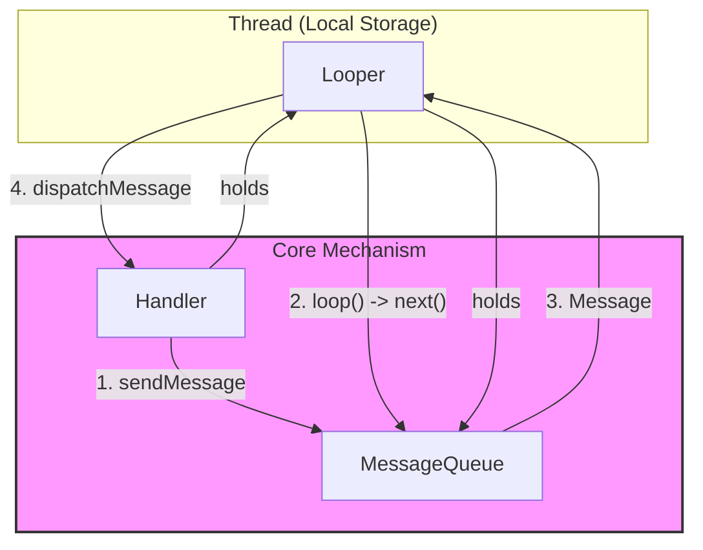
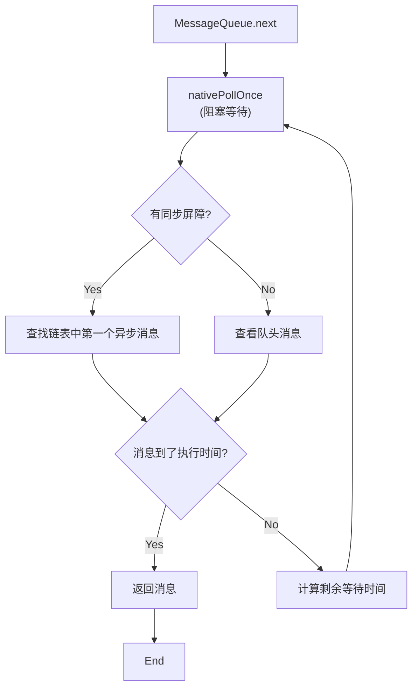
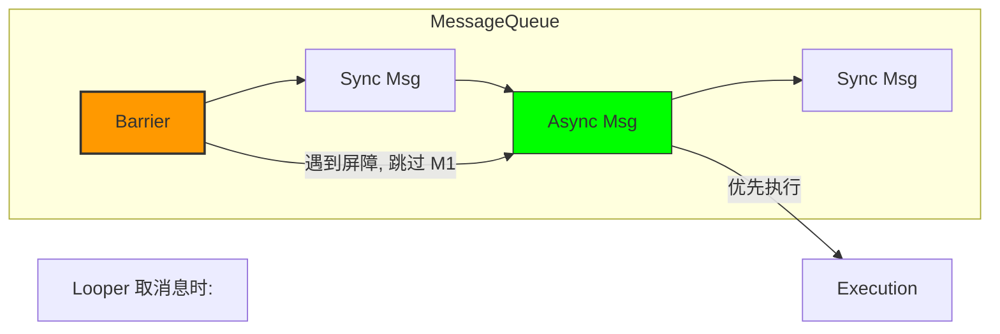

# Android Handler 机制深度解析：Looper, MessageQueue 与 Native 层

这份指南旨在通过可视化图表、源码级深度分析和实战场景，帮助你彻底掌握 Android 的消息机制。

## 1. 核心架构可视化

Android 的消息机制是基于 **生产者-消费者** 模型的事件驱动架构。

- **Handler**: 生产者 (sendMessage) & 消费者 (handleMessage)。
- **MessageQueue**: 优先级队列 (按时间排序的单链表)。
- **Looper**: 轮询器 (无限循环从队列取消息)。
- **Thread**: 载体 (一个线程对应一个 Looper)。



---

## 2. 深度源码流程：从 Java 到 Native

### 2.1 消息循环的心脏：`Looper.loop()`

`Looper.loop()` 是整个机制的动力源。让我们深入源码（基于 Android 14/15 逻辑简化）：

```java
// Looper.java
public static void loop() {
    // 1. 获取当前线程的 Looper 对象
    final Looper me = myLooper();
    if (me == null) {
        throw new RuntimeException("No Looper; Looper.prepare() wasn't called on this thread.");
    }
    final MessageQueue queue = me.mQueue;

    // 2. 死循环
    for (;;) {
        // 3. 获取下一条消息 (可能会阻塞！)
        // next() 方法在没有消息时会调用 nativePollOnce 释放 CPU 进入休眠
        Message msg = queue.next(); 
        
        if (msg == null) {
            // 只有调用 queue.quit() 时，next() 才会返回 null，循环结束
            return;
        }

        // 4. 性能监控点：分发前
        // Printer 是 Looper 提供的日志接口，BlockCanary 等卡顿监控框架就是利用这里
        final Printer logging = me.mLogging;
        if (logging != null) {
            logging.println(">>>>> Dispatching to " + msg.target + " " + msg.callback + ": " + msg.what);
        }

        // 5. 分发消息
        // msg.target 就是发送这条消息的 Handler
        msg.target.dispatchMessage(msg);

        // 6. 性能监控点：分发后
        if (logging != null) {
            logging.println("<<<<< Finished to " + msg.target + " " + msg.callback);
        }

        // 7. 回收消息到对象池，以便复用
        msg.recycleUnchecked();
    }
}
```

### 2.2 阻塞与唤醒：`MessageQueue.next()`

这是整个机制中最精妙的地方。为什么主线程死循环不会卡死 CPU？答案是 **epoll 机制**。



#### Native 层揭秘 (`nativePollOnce`)
当 Java 层调用 `nativePollOnce` 时，会进入 Native 层 (C++)。
- **等待 (Wait)**: 如果没有消息，或者消息时间未到，线程会通过 `epoll_wait` (Linux 系统调用) 进入 **休眠状态**。此时线程挂起，**不占用 CPU 时间片**。
- **唤醒 (Wake)**: 当有新消息入队 (`enqueueMessage`) 时，会调用 `nativeWake`，向 `eventfd` 写入数据。`epoll_wait` 监听到事件，立即返回，线程恢复运行。

### 2.3 消息入队：`enqueueMessage`

消息是按 `when` (执行时间戳) 排序插入链表的。

```java
// MessageQueue.java
boolean enqueueMessage(Message msg, long when) {
    // 必须加锁，因为可能有多个线程同时往同一个 Queue 发消息
    synchronized (this) {
        msg.markInUse();
        msg.when = when;
        Message p = mMessages;
        boolean needWake;

        // 场景 1: 队列为空，或者新消息时间最早 (插在队头)
        if (p == null || when == 0 || when < p.when) {
            msg.next = p;
            mMessages = msg;
            needWake = mBlocked; // 如果当前 Loop 正处于阻塞状态，需要唤醒
        } else {
            // 场景 2: 插入队列中间
            // ... 遍历链表，找到合适的位置插入 ...
            needWake = false; // 通常不需要唤醒，除非插入的是异步消息且有屏障
        }

        // 如果需要唤醒，调用 Native 方法写入 eventfd
        if (needWake) {
            nativeWake(mPtr);
        }
    }
    return true;
}
```

### 2.4 Handler 的分发逻辑：`dispatchMessage`

Handler 处理消息有优先级的：

```java
// Handler.java
public void dispatchMessage(Message msg) {
    // 1. 优先处理 Message 自带的 Runnable (handler.post(Runnable))
    if (msg.callback != null) {
        handleCallback(msg);
    } else {
        // 2. 其次处理 Handler 构造时传入的 Callback 接口
        if (mCallback != null) {
            if (mCallback.handleMessage(msg)) {
                return;
            }
        }
        // 3. 最后调用重写的 handleMessage 方法
        handleMessage(msg);
    }
}
```

---

## 3. 线程隔离的魔法：ThreadLocal

你是否好奇，为什么 `Looper.myLooper()` 能获取到 **当前线程** 的 Looper？为什么不同线程的 Looper 不会混淆？
这归功于 `ThreadLocal`。

### 3.1 什么是 ThreadLocal？
`ThreadLocal` 是一个线程内部的数据存储类。它为 **每个线程** 提供了一个独立的变量副本。
- 在线程 A 中设置的值，只有线程 A 能读到。
- 在线程 B 中设置的值，只有线程 B 能读到。

### 3.2 源码解析

从 Java 层面看，每个 `Thread` 对象内部都有一个 `ThreadLocalMap` 成员变量。

```java
// Thread.java
public class Thread implements Runnable {
    // 存储该线程所有的 ThreadLocal 变量
    ThreadLocal.ThreadLocalMap threadLocals = null;
}
```

当我们调用 `threadLocal.set(value)` 时：

```java
// ThreadLocal.java
public void set(T value) {
    Thread t = Thread.currentThread();
    // 获取当前线程的 Map
    ThreadLocalMap map = getMap(t);
    if (map != null)
        // Key 是 ThreadLocal 对象本身，Value 是我们要存的值 (Looper)
        map.set(this, value);
    else
        createMap(t, value);
}
```

### 3.3 Looper 如何使用 ThreadLocal

`Looper` 使用一个 `static final` 的 `ThreadLocal` 对象来存储 Looper 实例。

```java
// Looper.java
static final ThreadLocal<Looper> sThreadLocal = new ThreadLocal<Looper>();

private static void prepare(boolean quitAllowed) {
    // 1. 检查当前线程是否已经有 Looper 了
    if (sThreadLocal.get() != null) {
        throw new RuntimeException("Only one Looper may be created per thread");
    }
    // 2. 创建 Looper 并存入当前线程的 ThreadLocalMap
    sThreadLocal.set(new Looper(quitAllowed));
}

public static @Nullable Looper myLooper() {
    // 3. 从当前线程的 Map 中取出 Looper
    return sThreadLocal.get();
}
```

**总结**: `ThreadLocal` 就像是线程的“私有口袋”，`Looper` 把自己放进了当前线程的口袋里。

---

## 4. 高级机制：同步屏障 (Sync Barrier)

同步屏障是一种特殊的消息（`target` 为 null），它的作用是 **拦截同步消息，优先执行异步消息**。

### 4.1 原理图解



### 4.2 核心场景：UI 绘制
Android 系统为了保证 UI 流畅，在 `Choreographer` 请求 Vsync 信号时，会发送一个 **同步屏障**。
1.  **VSync 到来**: 系统向主线程发送 Vsync 信号。
2.  **插入屏障**: `ViewRootImpl` 往队列插入屏障。
3.  **优先处理**: 此时队列中只有 `Asynchronous` 消息（如 `doFrame` 绘制任务）会被处理，普通的 Handler 消息被暂停。
4.  **移除屏障**: 绘制完成后，移除屏障，恢复普通消息处理。

> [!WARNING]
> **开发陷阱**: 如果你反射调用了 `postSyncBarrier` 但忘记 `removeSyncBarrier`，主线程的普通消息将永远无法执行（看起来像假死），只有异步消息能跑。

---

## 5. 闲时机制：IdleHandler

当 MessageQueue **空闲**（没消息或消息时间未到）时，会回调 `IdleHandler`。

### 5.1 最佳实践场景
1.  **延迟初始化**: 比如 Activity 启动后，利用空闲时间加载一些非关键的大图或数据。
2.  **GC 优化**: 在空闲时手动触发 GC（系统源码中有使用）。
3.  **性能监控**: 监控主线程空闲情况。

```kotlin
Looper.myQueue().addIdleHandler {
    // 这里是主线程空闲时
    Preloader.preloadHeavyData()
    
    false // 返回 false 表示执行一次后移除；返回 true 表示一直保留
}
```

---

## 6. 常见面试题与避坑指南

### 6.1 内存泄漏 (The Classic Leak)
**现象**: `Activity` 销毁了，但 `Handler` 还没处理完消息。
**原因**: 非静态内部类 (`Handler`) 隐式持有外部类 (`Activity`) 引用。`Message` 持有 `Handler`，`MessageQueue` 持有 `Message`。
**链条**: `GCRoot (MainLooper)` -> `MessageQueue` -> `Message` -> `Handler` -> `Activity`。

**解决方案**:
```java
// 1. 静态内部类 (不持有外部引用)
static class MyHandler extends Handler {
    // 2. 弱引用持有 Activity
    private final WeakReference<Activity> mActivity;

    public MyHandler(Activity activity) {
        mActivity = new WeakReference<>(activity);
    }

    @Override
    public void handleMessage(Message msg) {
        Activity activity = mActivity.get();
        if (activity != null) {
            // ...
        }
    }
}

// 3. Activity 销毁时清空消息
@Override
protected void onDestroy() {
    mHandler.removeCallbacksAndMessages(null);
    super.onDestroy();
}
```

### 6.2 为什么主线程 Loop 不会 ANR？
- **ANR 定义**: 输入事件 5s 未响应 / 广播 10s 未响应。
- **Loop 机制**: Loop 本身就是 Android 运行的基础。ANR 是因为 **Loop 中的某一次 `dispatchMessage` 执行耗时太久**，导致无法处理后续的输入事件消息。
- 只要 Loop 还在转，且处理速度够快，就不会 ANR。

---

## 7. Android 15 (API 35) 新特性与趋势

### 7.1 更严格的后台启动
Android 15 进一步收紧了后台 Activity 启动权限。
- **不要** 在后台 Service 的 Handler 消息中直接 `startActivity`。
- **推荐**: 使用 `Notification` (全屏 Intent) 或 `PendingIntent`。

### 7.2 ANR 诊断增强
系统现在能更精准地识别是哪个 Handler 消息导致了卡顿。
- **建议**: 给 `Handler` 线程起有意义的名字 (`HandlerThread("UploadWorker")`)，方便 Trace 分析。

---

## 8. 总结

| 组件 | 核心职责 | 关键方法 |
| :--- | :--- | :--- |
| **Looper** | 动力引擎，死循环取消息 | `loop()`, `prepare()` |
| **Handler** | 接口，发消息 & 处理消息 | `sendMessage()`, `handleMessage()` |
| **MessageQueue** | 容器，单链表，时间排序 | `enqueueMessage()`, `next()` |
| **Message** | 载体，对象池复用 | `obtain()`, `recycle()` |
| **ThreadLocal** | 隔离，保证线程单例 | `set()`, `get()` |

**一句话总结**: Handler 将消息放入 MessageQueue，Looper 不断从 Queue 中取出消息，并分发给 Handler 处理；Native 层的 epoll 机制保证了空闲时的低功耗阻塞；ThreadLocal 保证了 Looper 与线程的一一对应。
