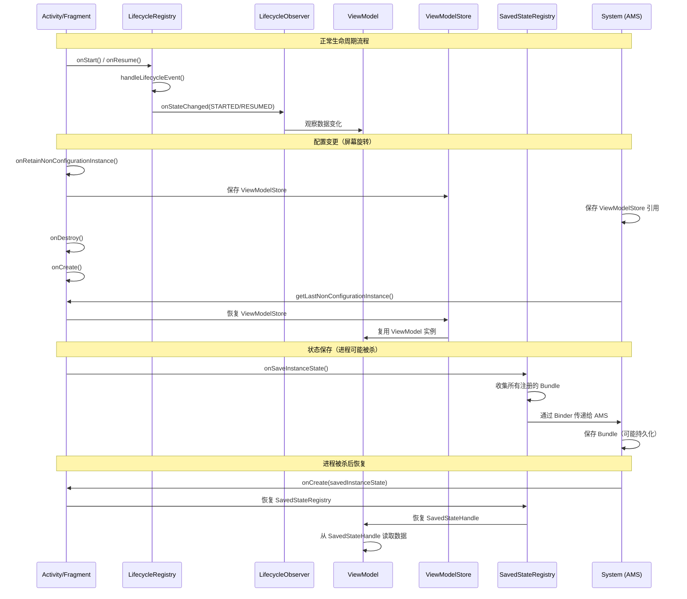
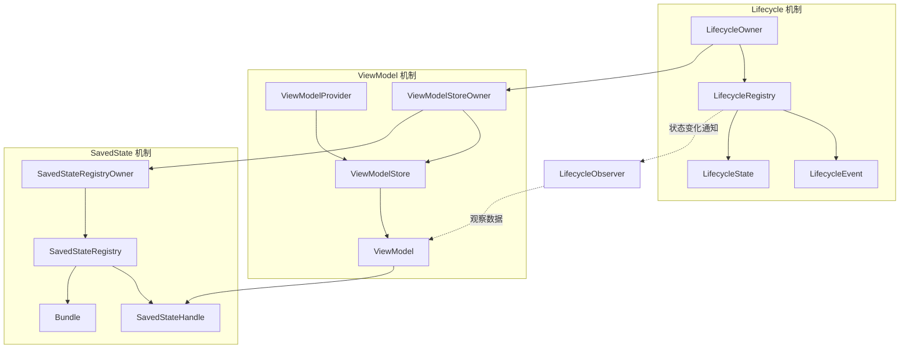
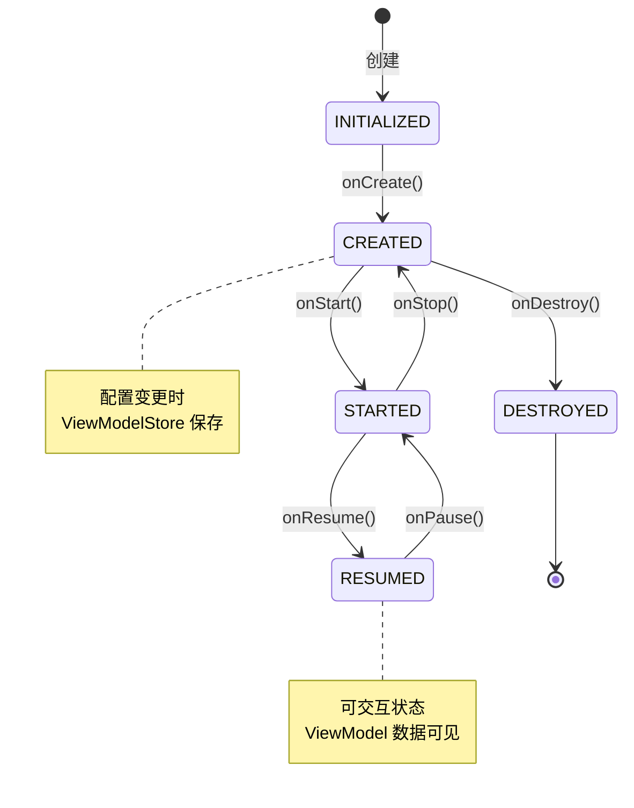
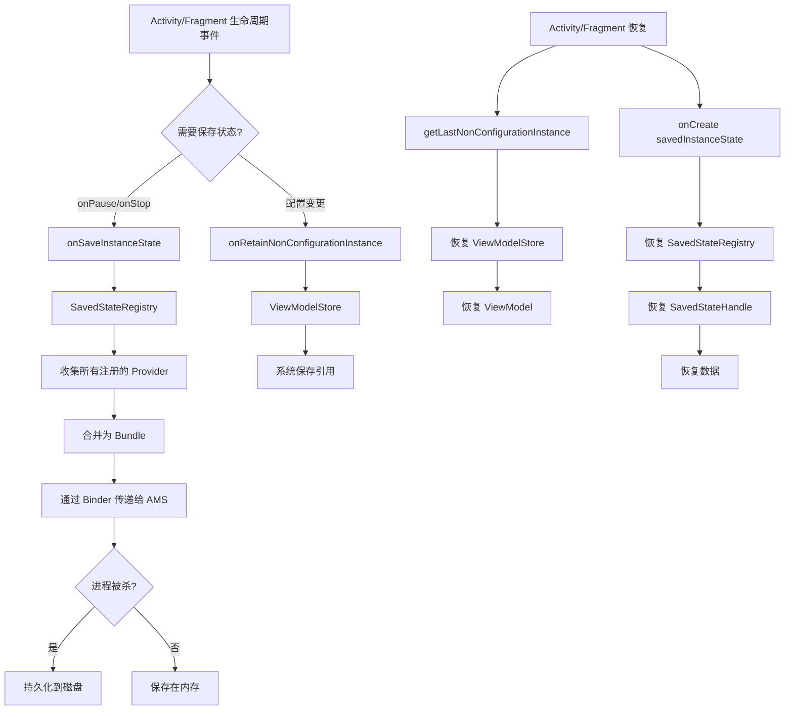
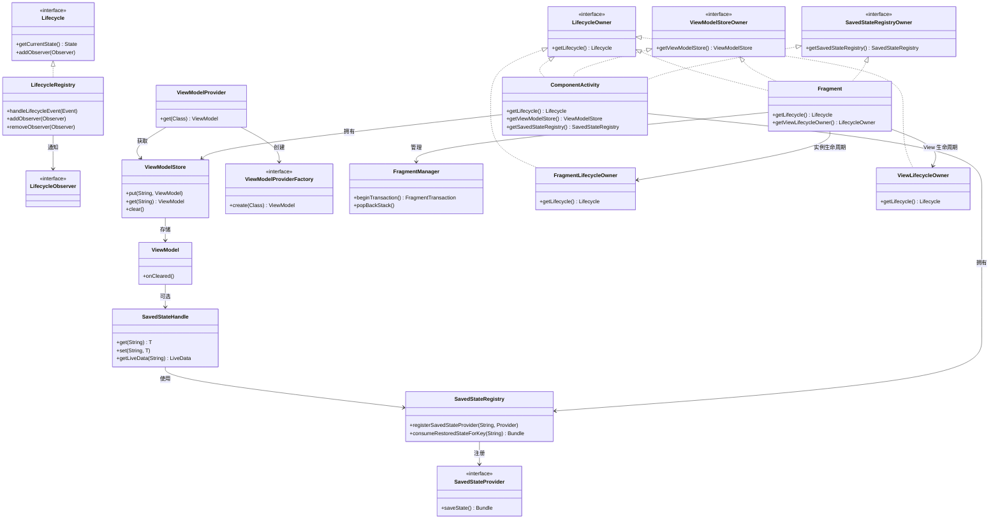
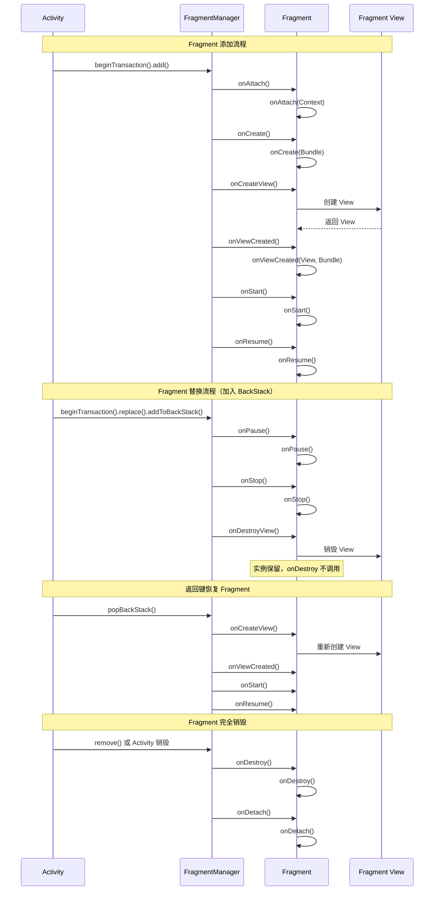
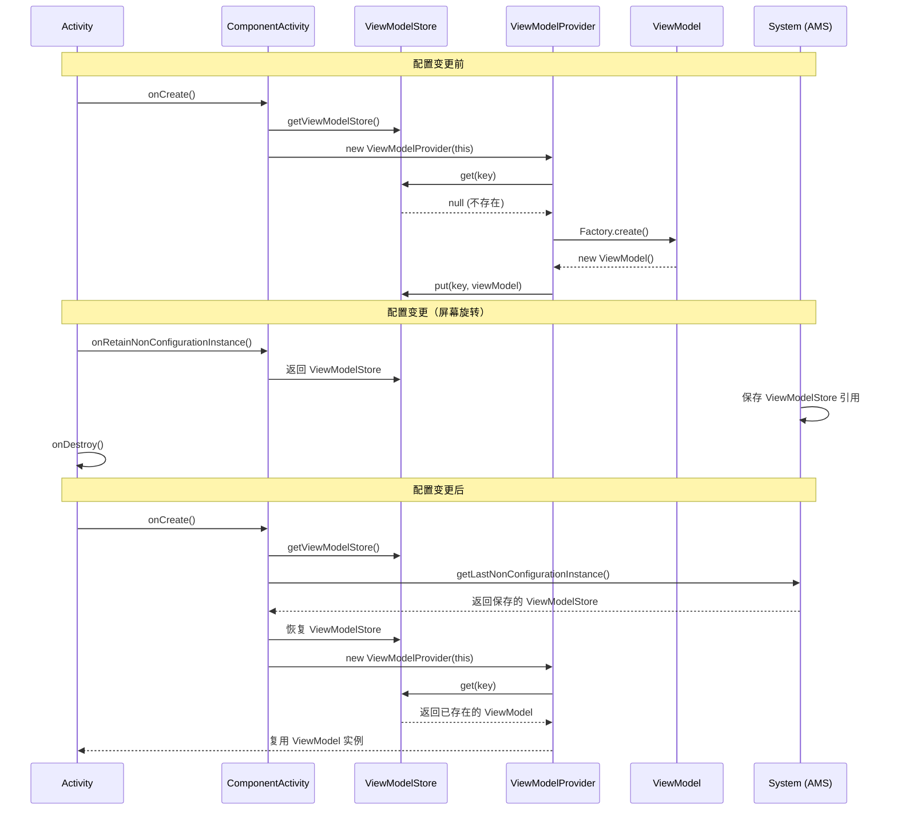
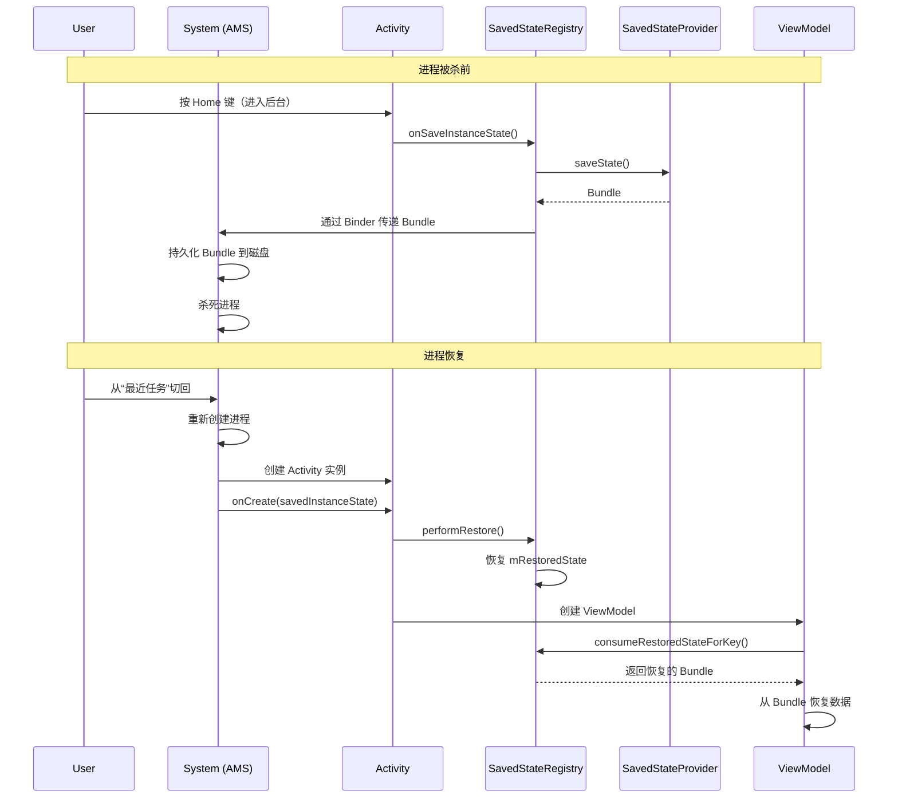

# 生命周期管理与状态恢复深度指南：原理与源码

本文将深入探讨 Android 开发中最容易出错的领域：**生命周期 (Lifecycle)** 与 **状态恢复 (State Restoration)**。我们将超越基础 API，深入 `FragmentManager` 事务、`ViewModelStore` 存储原理以及 Jetpack Compose 的状态机制。

## 0. 核心架构全景图

生命周期管理与状态恢复涉及三个核心机制：**Lifecycle**（生命周期感知）、**ViewModel**（配置变更存活）、**SavedState**（进程被杀恢复）。它们协同工作，构成了 Android 应用状态管理的完整体系。

### 0.1 完整流程：从生命周期事件到状态恢复



### 0.2 三大机制的关系



**关键点**：
- **Lifecycle**：提供生命周期感知能力，让组件知道当前状态
- **ViewModel**：在配置变更时存活，通过 ViewModelStore 保存
- **SavedState**：在进程被杀后恢复，通过 Bundle 持久化

### 0.3 生命周期状态流转



### 0.4 状态保存与恢复的完整链路



**关键流程**：
1. **状态保存**：Activity/Fragment 停止时，SavedStateRegistry 收集所有注册的状态，合并为 Bundle
2. **配置变更**：ViewModelStore 通过 onRetainNonConfigurationInstance 保存
3. **进程被杀**：Bundle 通过 Binder 传递给 AMS，可能持久化到磁盘
4. **状态恢复**：Activity/Fragment 重建时，从 Bundle 和 ViewModelStore 恢复数据

---

## 0.5 关键类及其作用

生命周期管理与状态恢复涉及众多类，理解这些类的作用和关系是掌握机制的基础。本节将详细介绍这些关键类。

### 0.5.1 Lifecycle 相关类

#### LifecycleOwner
- **作用**：生命周期拥有者接口，表示具有生命周期的组件
- **实现类**：`Activity`、`Fragment`、`ViewLifecycleOwner`
- **职责**：
  - 提供 `getLifecycle()` 方法返回 `Lifecycle` 对象
  - 管理组件的生命周期状态
- **关键方法**：`getLifecycle()`
- **使用场景**：作为 `LiveData.observe()` 的第一个参数

#### LifecycleRegistry
- **作用**：`Lifecycle` 接口的实现类，管理生命周期状态和事件
- **职责**：
  - 维护当前生命周期状态（`State`）
  - 分发生命周期事件（`Event`）
  - 管理 `LifecycleObserver` 的注册和通知
- **关键方法**：`handleLifecycleEvent()`、`addObserver()`、`removeObserver()`
- **状态机**：`INITIALIZED` → `CREATED` → `STARTED` → `RESUMED` → `DESTROYED`

#### LifecycleObserver
- **作用**：生命周期观察者接口，用于监听生命周期变化
- **实现方式**：
  - 使用 `@OnLifecycleEvent` 注解（已废弃）
  - 实现 `DefaultLifecycleObserver` 接口（推荐）
  - 实现 `LifecycleEventObserver` 接口
- **关键方法**：`onCreate()`、`onStart()`、`onResume()`、`onPause()`、`onStop()`、`onDestroy()`
- **使用场景**：在组件中观察生命周期，执行相应的初始化或清理操作

#### Lifecycle.State
- **作用**：生命周期状态枚举
- **状态值**：
  - `INITIALIZED`：已初始化，但未创建
  - `CREATED`：已创建（onCreate 之后）
  - `STARTED`：已启动（onStart 之后）
  - `RESUMED`：已恢复（onResume 之后）
  - `DESTROYED`：已销毁（onDestroy 之后）

#### Lifecycle.Event
- **作用**：生命周期事件枚举
- **事件值**：
  - `ON_CREATE`：对应 `onCreate()`
  - `ON_START`：对应 `onStart()`
  - `ON_RESUME`：对应 `onResume()`
  - `ON_PAUSE`：对应 `onPause()`
  - `ON_STOP`：对应 `onStop()`
  - `ON_DESTROY`：对应 `onDestroy()`
  - `ON_ANY`：监听所有事件

### 0.5.2 ViewModel 相关类

#### ViewModel
- **作用**：视图模型，用于存储和管理与 UI 相关的数据
- **职责**：
  - 在配置变更时存活（通过 ViewModelStore 保存）
  - 管理 UI 相关的数据
  - 提供业务逻辑处理
- **生命周期**：从创建到 Activity/Fragment 完全销毁
- **关键方法**：`onCleared()`（清理资源）
- **使用场景**：存储 UI 状态、处理业务逻辑、管理 LiveData/Flow

#### ViewModelStore
- **作用**：ViewModel 的存储容器，管理多个 ViewModel 实例
- **职责**：
  - 存储 ViewModel 实例（HashMap<String, ViewModel>）
  - 在配置变更时保存（通过 onRetainNonConfigurationInstance）
  - 在 Activity/Fragment 销毁时清理所有 ViewModel
- **关键方法**：`put()`、`get()`、`clear()`
- **数据结构**：`HashMap<String, ViewModel>`

#### ViewModelProvider
- **作用**：ViewModel 的提供者，负责创建和获取 ViewModel 实例
- **职责**：
  - 从 ViewModelStore 获取已存在的 ViewModel
  - 通过 Factory 创建新的 ViewModel
  - 管理 ViewModel 的作用域
- **关键方法**：`get()`、`get(Class<T>)`
- **使用场景**：在 Activity/Fragment 中获取 ViewModel 实例

#### ViewModelStoreOwner
- **作用**：ViewModelStore 的拥有者接口
- **实现类**：`Activity`、`Fragment`、`ViewModelStoreOwner` 的自定义实现
- **职责**：
  - 提供 `getViewModelStore()` 方法
  - 管理 ViewModelStore 的生命周期
- **关键方法**：`getViewModelStore()`

#### ViewModelProvider.Factory
- **作用**：ViewModel 的工厂接口，用于创建 ViewModel 实例
- **实现类**：`NewInstanceFactory`、`AndroidViewModelFactory`、`SavedStateViewModelFactory`
- **职责**：
  - 创建 ViewModel 实例
  - 处理 ViewModel 的构造函数参数（如 SavedStateHandle）
- **关键方法**：`create(Class<T>)`

### 0.5.3 SavedState 相关类

#### SavedStateRegistry
- **作用**：状态保存注册表，管理状态保存和恢复
- **职责**：
  - 注册状态保存回调（`SavedStateRegistry.SavedStateProvider`）
  - 收集所有注册的状态，合并为 Bundle
  - 在恢复时分发保存的状态
- **关键方法**：`registerSavedStateProvider()`、`consumeRestoredStateForKey()`、`unregisterSavedStateProvider()`
- **数据结构**：`Map<String, SavedStateProvider>`

#### SavedStateHandle
- **作用**：状态保存句柄，提供键值对方式保存和恢复状态
- **职责**：
  - 保存状态到 Bundle（键值对）
  - 从 Bundle 恢复状态
  - 提供 LiveData 支持（`getLiveData()`）
- **关键方法**：`get()`、`set()`、`getLiveData()`、`contains()`
- **使用场景**：在 ViewModel 中保存和恢复数据

#### SavedStateRegistryOwner
- **作用**：SavedStateRegistry 的拥有者接口
- **实现类**：`Activity`、`Fragment`
- **职责**：
  - 提供 `getSavedStateRegistry()` 方法
  - 管理 SavedStateRegistry 的生命周期
- **关键方法**：`getSavedStateRegistry()`

#### SavedStateRegistry.SavedStateProvider
- **作用**：状态保存提供者接口
- **职责**：
  - 提供 `saveState()` 方法返回 Bundle
  - 在组件需要保存状态时被调用
- **关键方法**：`saveState()`

### 0.5.4 Fragment 相关类

#### Fragment
- **作用**：Fragment 组件，具有独立的生命周期
- **职责**：
  - 管理 Fragment 的生命周期
  - 提供 `getLifecycle()` 和 `getViewLifecycleOwner()`
  - 管理 Fragment 的 View 生命周期
- **关键方法**：`onCreate()`、`onCreateView()`、`onViewCreated()`、`onDestroyView()`、`onDestroy()`
- **生命周期特点**：Fragment 实例生命周期和 View 生命周期可能不同

#### FragmentManager
- **作用**：Fragment 管理器，管理 Fragment 的添加、移除、替换等操作
- **职责**：
  - 执行 FragmentTransaction
  - 管理 BackStack
  - 管理 Fragment 的生命周期
- **关键方法**：`beginTransaction()`、`popBackStack()`、`findFragmentById()`

#### FragmentLifecycleOwner
- **作用**：Fragment 实例的生命周期拥有者
- **职责**：
  - 管理 Fragment 实例的生命周期（从 onAttach 到 onDetach）
  - 在 Fragment 销毁时清理资源
- **生命周期范围**：Fragment 实例的完整生命周期

#### ViewLifecycleOwner
- **作用**：Fragment View 的生命周期拥有者
- **职责**：
  - 管理 Fragment View 的生命周期（从 onCreateView 到 onDestroyView）
  - 在 View 销毁时清理资源（如 LiveData Observer）
- **生命周期范围**：Fragment View 的生命周期
- **使用场景**：在 `onCreateView` 中观察 LiveData 时使用，避免内存泄漏

### 0.5.5 类关系图谱



### 0.5.6 类调用关系总结

**生命周期事件分发链**：
```
Activity/Fragment 生命周期方法
  → LifecycleRegistry.handleLifecycleEvent()
    → 更新 State
    → 通知所有 LifecycleObserver
      → ViewModel / LiveData / 自定义 Observer
```

**ViewModel 创建与获取链**：
```
ViewModelProvider.get()
  → ViewModelStore.get(key)
    → 如果存在，直接返回
    → 如果不存在，通过 Factory.create() 创建
      → 保存到 ViewModelStore
```

**状态保存与恢复链**：
```
Activity.onSaveInstanceState()
  → SavedStateRegistry.performSave()
    → 收集所有 SavedStateProvider.saveState()
      → 合并为 Bundle
        → 通过 Binder 传递给 AMS

Activity.onCreate(savedInstanceState)
  → SavedStateRegistry.performRestore()
    → 从 Bundle 恢复数据
      → SavedStateHandle 恢复数据
        → ViewModel 从 SavedStateHandle 读取
```

---

## 1. Fragment 生命周期与事务内部机制

Fragment 的生命周期不仅依赖 Activity，还受 **FragmentTransaction** 操作的影响。

### 1.1 `add` vs `replace` 的生命周期差异

```mermaid
graph TD
    subgraph Add["Transaction.add()"]
        A1[Fragment A (Existing)] --> A2[Fragment A (Resumed)]
        B1[Fragment B (New)] --> B2[onAttach -> onCreate -> ... -> onResume]
        Note1[Fragment A 不受影响，两者重叠]
    end

    subgraph Replace["Transaction.replace()"]
        C1[Fragment A (Existing)] --> C2[onPause -> onStop -> onDestroyView]
        D1[Fragment B (New)] --> D2[onAttach -> onCreate -> ... -> onResume]
        Note2[Fragment A 视图被销毁，实例保留(若入栈)]
    end
```

-   **add**: 仅仅是将 Fragment 的 View 添加到容器中。原有的 Fragment **不会走任何生命周期回调**（依然是 Resumed 状态）。
-   **replace**: 相当于 `remove(Old)` + `add(New)`。
    -   旧 Fragment 走 `onDestroyView`（如果加入 BackStack，实例保留，不走 `onDestroy`）。
    -   新 Fragment 走完整生命周期。

### 1.2 ViewLifecycleOwner 的由来

为什么 Fragment 有两个生命周期？(`Fragment` 实例 vs `Fragment View`)

当 Fragment 被放入 BackStack 时：
1.  **View 被销毁**: `onDestroyView` 被调用。
2.  **实例仍存活**: `onDestroy` **未**被调用。
3.  **出栈恢复**: 当用户按返回键，Fragment 从 BackStack 恢复，重新走 `onCreateView`。

**陷阱**: 如果你在 `onCreate` 中观察 LiveData，当 Fragment 出栈恢复时，`onCreate` 不会再次调用，但 `onCreateView` 会。如果你在 `onCreateView` 中观察 LiveData 传入 `this` (Fragment)，每次 View 重建都会注册一个新的 Observer，导致 **重复回调**。

**解法**: 永远使用 `viewLifecycleOwner`。

### 1.3 FragmentManager 事务执行流程源码分析

FragmentTransaction 的执行是一个复杂的过程，涉及状态管理、生命周期回调、动画处理等多个环节。

#### 1.3.1 事务的创建与提交

```java
// FragmentManager.java
public FragmentTransaction beginTransaction() {
    return new BackStackRecord(this);
}

// BackStackRecord.java (FragmentTransaction 的实现)
public int commit() {
    return commitInternal(false);
}

private int commitInternal(boolean allowStateLoss) {
    if (mCommitted) {
        throw new IllegalStateException("commit already called");
    }
    
    mCommitted = true;
    if (mAddToBackStack) {
        mIndex = mManager.allocBackStackIndex(this);
    } else {
        mIndex = -1;
    }
    
    // 将事务添加到待执行队列
    mManager.enqueueAction(this, allowStateLoss);
    return mIndex;
}
```

**关键步骤**：
1. 创建 `BackStackRecord` 对象（实现 `FragmentTransaction` 接口）
2. 调用 `commit()` 将事务标记为已提交
3. 如果 `addToBackStack()`，分配 BackStack 索引
4. 通过 `enqueueAction()` 将事务添加到待执行队列

#### 1.3.2 事务的执行流程

```java
// FragmentManager.java
void enqueueAction(OpGenerator action, boolean allowStateLoss) {
    if (!allowStateLoss) {
        checkStateLoss();
    }
    synchronized (mPendingActions) {
        if (mHost == null) {
            throw new IllegalStateException("Activity has been destroyed");
        }
        mPendingActions.add(action);
        scheduleCommit();
    }
}

void scheduleCommit() {
    synchronized (mPendingActions) {
        boolean postponeReady = mPostponedTransactions.size() > 0;
        boolean pendingReady = mPendingActions.size() == 1;
        
        if (postponeReady || pendingReady) {
            mHost.getHandler().post(mExecCommit);
        }
    }
}

final Runnable mExecCommit = new Runnable() {
    @Override
    public void run() {
        execPendingActions(true);
    }
};

boolean execPendingActions(boolean allowStateLoss) {
    boolean didSomething = false;
    while (generateOpsForPendingActions(mTmpRecords, mTmpIsPop)) {
        mExecutingActions = true;
        try {
            removeRedundantOperationsAndExecute(mTmpRecords, mTmpIsPop);
        } finally {
            cleanupExec();
        }
        didSomething = true;
    }
    return didSomething;
}
```

**执行流程**：
1. **入队**：事务添加到 `mPendingActions` 队列
2. **调度**：通过 Handler 在主线程执行
3. **生成操作**：`generateOpsForPendingActions()` 生成操作列表
4. **执行**：`removeRedundantOperationsAndExecute()` 执行操作
5. **清理**：`cleanupExec()` 清理临时状态

#### 1.3.3 操作执行与生命周期回调

```java
// BackStackRecord.java
void executeOps() {
    final int numOps = mOps.size();
    for (int opNum = 0; opNum < numOps; opNum++) {
        final Op op = mOps.get(opNum);
        final Fragment f = op.fragment;
        
        switch (op.cmd) {
            case OP_ADD:
                f.setNextAnim(op.enterAnim);
                mManager.addFragment(f, false);
                break;
            case OP_REPLACE:
                final Fragment old = mManager.findFragmentById(op.containerViewId);
                if (old != null) {
                    old.setNextAnim(op.exitAnim);
                    mManager.removeFragment(old);
                }
                f.setNextAnim(op.enterAnim);
                mManager.addFragment(f, false);
                break;
            case OP_REMOVE:
                f.setNextAnim(op.exitAnim);
                mManager.removeFragment(f);
                break;
            // ... 其他操作
        }
    }
}

// FragmentManager.java
void addFragment(Fragment fragment, boolean moveToStateNow) {
    if (fragment.mDetached) {
        fragment.mDetached = false;
    }
    
    if (!fragment.mAdded) {
        mAdded.add(fragment);
        fragment.mAdded = true;
        
        if (moveToStateNow) {
            moveToState(fragment);
        }
    }
}

void moveToState(Fragment f) {
    int newState = mCurState;
    if (f.mState <= newState) {
        // 向上移动状态
        moveFragmentToExpectedState(f);
    } else {
        // 向下移动状态
        moveFragmentToExpectedState(f);
    }
}

void moveFragmentToExpectedState(Fragment f) {
    if (f == null) {
        return;
    }
    
    int nextState = computeExpectedState(f);
    if (f.mState != nextState) {
        switch (nextState) {
            case Fragment.INITIALIZING:
                // ...
                break;
            case Fragment.CREATED:
                if (f.mState < Fragment.CREATED) {
                    dispatchOnFragmentPreAttached(f);
                    f.onAttach(mHost.getContext());
                    dispatchOnFragmentAttached(f);
                    // ...
                }
                // ...
                break;
            case Fragment.STARTED:
                // ...
                break;
            case Fragment.RESUMED:
                // ...
                break;
        }
        f.mState = nextState;
    }
}
```

**生命周期回调触发**：
- Fragment 的状态通过 `moveToState()` 管理
- 状态变化时触发相应的生命周期方法
- 状态只能向上移动（INITIALIZING → CREATED → STARTED → RESUMED）或向下移动

### 1.4 BackStack 管理机制

BackStack 用于管理 Fragment 的返回栈，支持用户通过返回键返回到上一个 Fragment。

#### 1.4.1 BackStack 的数据结构

```java
// FragmentManager.java
ArrayList<BackStackRecord> mBackStack;  // BackStack 记录列表

// BackStackRecord.java
ArrayList<Op> mOps;  // 操作列表
int mIndex;  // BackStack 索引
```

**数据结构**：
- `mBackStack`：存储所有已提交的事务记录
- `mOps`：每个事务包含的操作列表（ADD、REPLACE、REMOVE 等）
- `mIndex`：事务在 BackStack 中的索引

#### 1.4.2 BackStack 的入栈与出栈

```java
// FragmentManager.java
public void popBackStack() {
    enqueueAction(new PopBackStackState(null, -1, 0), false);
}

public void popBackStack(String name, int flags) {
    enqueueAction(new PopBackStackState(name, -1, flags), false);
}

void popBackStackState(ArrayList<BackStackRecord> records, 
                       ArrayList<Boolean> isRecordPop, 
                       String name, int id, int flags) {
    if (mBackStack == null || mBackStack.isEmpty()) {
        return;
    }
    
    if (name == null && id < 0 && (flags & POP_BACK_STACK_INCLUSIVE) == 0) {
        // 弹出最后一个事务
        int last = mBackStack.size() - 1;
        BackStackRecord bss = mBackStack.remove(last);
        records.add(bss);
        isRecordPop.add(true);
    } else {
        // 根据 name 或 id 查找并弹出
        // ...
    }
}
```

**出栈流程**：
1. 查找要弹出的 BackStack 记录（根据 name、id 或最后一个）
2. 将记录添加到执行队列
3. 执行反向操作（恢复之前的 Fragment，销毁当前的 Fragment）

#### 1.4.3 BackStack 的恢复

```java
// FragmentManager.java
void restoreBackStackState(ArrayList<BackStackState> backStack) {
    if (backStack == null) {
        return;
    }
    
    for (BackStackState state : backStack) {
        BackStackRecord bss = state.instantiate(this);
        mBackStack.add(bss);
        
        if (state.mIndex >= 0) {
            setBackStackIndex(state.mIndex, bss);
        }
    }
}
```

**恢复流程**：
- 从 `savedInstanceState` 恢复 BackStack 状态
- 重新创建 `BackStackRecord` 对象
- 恢复 BackStack 索引

### 1.5 Fragment 状态保存与恢复流程

Fragment 的状态保存与恢复是生命周期管理的重要环节，确保在配置变更或进程被杀后能够恢复 UI 状态。

#### 1.5.1 状态保存流程

```java
// Fragment.java
void performSaveInstanceState(Bundle outState) {
    onSaveInstanceState(outState);
    
    if (mChildFragmentManager != null) {
        Parcelable p = mChildFragmentManager.saveAllState();
        if (p != null) {
            outState.putParcelable(FRAGMENTS_TAG, p);
        }
    }
}

// FragmentManager.java
Parcelable saveAllState() {
    // 保存所有 Fragment 的状态
    ArrayList<FragmentState> active = new ArrayList<>(mActive.size());
    for (Fragment f : mActive.values()) {
        if (f != null) {
            FragmentState fs = new FragmentState(f);
            active.add(fs);
            
            if (f.mState > Fragment.INITIALIZING && fs.mSavedFragmentState == null) {
                fs.mSavedFragmentState = saveFragmentBasicState(f);
            }
        }
    }
    
    // 保存 BackStack
    ArrayList<BackStackState> backStack = null;
    if (mBackStack != null && mBackStack.size() > 0) {
        backStack = new ArrayList<>(mBackStack.size());
        for (BackStackRecord bss : mBackStack) {
            backStack.add(bss.saveState());
        }
    }
    
    FragmentManagerState fms = new FragmentManagerState();
    fms.mActive = active;
    fms.mBackStack = backStack;
    return fms;
}
```

**保存内容**：
1. Fragment 实例状态（通过 `onSaveInstanceState()`）
2. Fragment 的 View 状态（通过 `View.onSaveInstanceState()`）
3. BackStack 状态
4. 子 FragmentManager 状态

#### 1.5.2 状态恢复流程

```java
// FragmentManager.java
void restoreAllState(Parcelable state, FragmentManagerNonConfig nonConfig) {
    if (state == null) {
        return;
    }
    
    FragmentManagerState fms = (FragmentManagerState) state;
    if (fms.mActive == null) {
        return;
    }
    
    // 恢复 Fragment 实例
    for (FragmentState fs : fms.mActive) {
        if (fs != null) {
            Fragment f = fs.instantiate(mHost.getContext().getClassLoader(), 
                                        getFragmentFactory());
            f.mSavedFragmentState = fs.mSavedFragmentState;
            mActive.put(f.mWho, f);
            f.mState = Fragment.INITIALIZING;
        }
    }
    
    // 恢复 BackStack
    if (fms.mBackStack != null) {
        mBackStack = new ArrayList<>(fms.mBackStack.size());
        for (BackStackState bss : fms.mBackStack) {
            BackStackRecord record = bss.instantiate(this);
            mBackStack.add(record);
        }
    }
}

// Fragment.java
void restoreChildFragmentState(Bundle savedInstanceState) {
    if (savedInstanceState != null) {
        Parcelable p = savedInstanceState.getParcelable(FRAGMENTS_TAG);
        if (p != null) {
            mChildFragmentManager.restoreAllState(p, null);
        }
    }
}
```

**恢复流程**：
1. 从 `savedInstanceState` 读取 `FragmentManagerState`
2. 恢复 Fragment 实例（通过 `FragmentState.instantiate()`）
3. 恢复 Fragment 的 View 状态
4. 恢复 BackStack
5. 调用 `onViewStateRestored()` 通知 Fragment

### 1.6 Fragment 生命周期完整时序图



**关键点**：
- **add()**：Fragment 走完整生命周期，不影响已存在的 Fragment
- **replace()**：旧 Fragment 走 `onDestroyView`，新 Fragment 走完整生命周期
- **BackStack**：Fragment 的 View 被销毁，但实例保留，`onDestroy()` 不调用
- **恢复**：从 BackStack 恢复时，重新走 `onCreateView` 到 `onResume`

---

## 2. ViewModel 内部原理：它是如何幸存的？

`ViewModel` 能在配置变更（如旋转屏幕）中存活，靠的是 `Activity` 的 `NonConfigurationInstances` 机制。

### 2.1 源码链路

1.  **Activity 重建**: 当旋转屏幕时，系统销毁 Activity，但会调用 `onRetainNonConfigurationInstance()`。
2.  **保存 ViewModelStore**: `ComponentActivity` 重写了这个方法，将 `mViewModelStore` 对象返回给系统。
3.  **恢复 ViewModelStore**: 新 Activity 启动时，在 `onCreate` 中通过 `getLastNonConfigurationInstance()` 拿回了旧的 `mViewModelStore`。
4.  **关联**: 新 Activity 的 `ViewModelProvider` 从这个复用的 Store 中获取 ViewModel 实例。

```java
// ComponentActivity.java (简化)
public Object onRetainNonConfigurationInstance() {
    // 核心：将 ViewModelStore 作为一个普通对象返回给系统托管
    Object viewModelStore = mViewModelStore;
    return viewModelStore;
}
```

### 2.2 ViewModelStore 的保存与恢复机制详解

ViewModelStore 的保存与恢复是 ViewModel 在配置变更时存活的核心机制。

#### 2.2.1 onRetainNonConfigurationInstance 详细流程

```java
// ComponentActivity.java
public final Object onRetainNonConfigurationInstance() {
    Object custom = onRetainCustomNonConfigurationInstance();
    
    ViewModelStore viewModelStore = mViewModelStore;
    if (viewModelStore == null) {
        // 尝试从之前的 Activity 获取
        Activity.NonConfigurationInstances nc = (Activity.NonConfigurationInstances)
            getLastNonConfigurationInstance();
        if (nc != null) {
            viewModelStore = nc.viewModelStore;
        }
    }
    
    if (viewModelStore == null && custom == null) {
        return null;
    }
    
    Activity.NonConfigurationInstances nci = new Activity.NonConfigurationInstances();
    nci.custom = custom;
    nci.viewModelStore = viewModelStore;
    return nci;
}
```

**关键点**：
- `onRetainNonConfigurationInstance()` 在 Activity 被销毁前调用
- ViewModelStore 被包装在 `NonConfigurationInstances` 中返回
- 系统会保存这个对象，直到新 Activity 创建

#### 2.2.2 getLastNonConfigurationInstance 恢复流程

```java
// ComponentActivity.java
public ViewModelStore getViewModelStore() {
    if (mViewModelStore == null) {
        NonConfigurationInstances nc = (NonConfigurationInstances)
            getLastNonConfigurationInstance();
        if (nc != null) {
            // 恢复之前的 ViewModelStore
            mViewModelStore = nc.viewModelStore;
        }
        if (mViewModelStore == null) {
            mViewModelStore = new ViewModelStore();
        }
    }
    return mViewModelStore;
}
```

**恢复流程**：
1. 新 Activity 创建时，`getViewModelStore()` 被调用
2. 通过 `getLastNonConfigurationInstance()` 获取保存的 `NonConfigurationInstances`
3. 如果存在，恢复 `viewModelStore`；否则创建新的

#### 2.2.3 ViewModelStore 的数据结构

```java
// ViewModelStore.java
public class ViewModelStore {
    private final HashMap<String, ViewModel> mMap = new HashMap<>();
    
    final void put(String key, ViewModel viewModel) {
        ViewModel oldViewModel = mMap.put(key, viewModel);
        if (oldViewModel != null) {
            oldViewModel.onCleared();
        }
    }
    
    final ViewModel get(String key) {
        return mMap.get(key);
    }
    
    public final void clear() {
        for (ViewModel vm : mMap.values()) {
            vm.onCleared();
        }
        mMap.clear();
    }
}
```

**数据结构**：
- `mMap`：HashMap，key 是 ViewModel 的类名（或自定义 key），value 是 ViewModel 实例
- `put()`：存储 ViewModel，如果已存在则先调用 `onCleared()` 清理旧的
- `clear()`：清理所有 ViewModel，调用每个 ViewModel 的 `onCleared()`

### 2.3 ViewModelProvider 的创建流程

ViewModelProvider 负责创建和获取 ViewModel 实例。

#### 2.3.1 ViewModelProvider 的构造

```java
// ViewModelProvider.java
public ViewModelProvider(@NonNull ViewModelStoreOwner owner) {
    this(owner.getViewModelStore(), owner instanceof HasDefaultViewModelProviderFactory
            ? ((HasDefaultViewModelProviderFactory) owner).getDefaultViewModelProviderFactory()
            : NewInstanceFactory.getInstance());
}

public ViewModelProvider(@NonNull ViewModelStore store, @NonNull Factory factory) {
    mViewModelStore = store;
    mFactory = factory;
}
```

**构造流程**：
1. 从 `ViewModelStoreOwner` 获取 `ViewModelStore`
2. 获取 `Factory`（如果 owner 实现了 `HasDefaultViewModelProviderFactory`，使用默认 Factory；否则使用 `NewInstanceFactory`）

#### 2.3.2 ViewModel 的获取与创建

```java
// ViewModelProvider.java
public <T extends ViewModel> T get(@NonNull Class<T> modelClass) {
    String canonicalName = modelClass.getCanonicalName();
    if (canonicalName == null) {
        throw new IllegalArgumentException("Local and anonymous classes can not be ViewModels");
    }
    return get(DEFAULT_KEY + ":" + canonicalName, modelClass);
}

public <T extends ViewModel> T get(@NonNull String key, @NonNull Class<T> modelClass) {
    ViewModel viewModel = mViewModelStore.get(key);
    
    if (modelClass.isInstance(viewModel)) {
        // 如果已存在且类型匹配，直接返回
        return (T) viewModel;
    }
    
    // 如果不存在或类型不匹配，通过 Factory 创建
    if (mFactory instanceof KeyedFactory) {
        viewModel = ((KeyedFactory) mFactory).create(key, modelClass);
    } else {
        viewModel = mFactory.create(modelClass);
    }
    
    // 保存到 ViewModelStore
    mViewModelStore.put(key, viewModel);
    return (T) viewModel;
}
```

**获取流程**：
1. 生成 key（默认格式：`"androidx.lifecycle.ViewModelProvider.DefaultKey:" + canonicalName`）
2. 从 ViewModelStore 获取已存在的 ViewModel
3. 如果存在且类型匹配，直接返回
4. 如果不存在，通过 Factory 创建新的 ViewModel
5. 保存到 ViewModelStore

#### 2.3.3 SavedStateViewModelFactory 的工作原理

```java
// SavedStateViewModelFactory.java
public <T extends ViewModel> T create(@NonNull String key, @NonNull Class<T> modelClass) {
    boolean isAndroidViewModel = AndroidViewModel.class.isAssignableFrom(modelClass);
    
    Constructor<T> constructor;
    if (isAndroidViewModel) {
        constructor = findMatchingConstructor(modelClass, ANDROID_VIEWMODEL_SIGNATURE);
    } else {
        constructor = findMatchingConstructor(modelClass, VIEWMODEL_SIGNATURE);
    }
    
    // 如果找到接受 SavedStateHandle 的构造函数
    if (constructor != null) {
        SavedStateHandleController controller = SavedStateHandleController.create(
            mSavedStateRegistry, mLifecycle, key, mDefaultArgs);
        SavedStateHandle handle = controller.getHandle();
        
        T viewmodel;
        if (isAndroidViewModel) {
            viewmodel = constructor.newInstance(mApplication, handle);
        } else {
            viewmodel = constructor.newInstance(handle);
        }
        
        viewmodel = controller.attachToLifecycle(viewmodel, mSavedStateRegistry, mLifecycle);
        return viewmodel;
    }
    
    // 否则使用默认 Factory
    return mDelegateFactory.create(key, modelClass);
}
```

**工作原理**：
1. 检查 ViewModel 是否接受 `SavedStateHandle` 参数
2. 如果接受，创建 `SavedStateHandleController` 和 `SavedStateHandle`
3. 通过反射调用构造函数创建 ViewModel
4. 将 ViewModel 关联到 Lifecycle 和 SavedStateRegistry

### 2.4 ViewModelScope 的实现原理

ViewModelScope 是 ViewModel 的协程作用域，在 ViewModel 销毁时自动取消所有协程。

#### 2.4.1 ViewModelScope 的创建

```kotlin
// ViewModel.kt
val ViewModel.viewModelScope: CoroutineScope
    get() {
        val scope: CoroutineScope? = this.getTag(JOB_KEY)
        if (scope != null) {
            return scope
        }
        return setTagIfAbsent(
            JOB_KEY,
            CloseableCoroutineScope(SupervisorJob() + Dispatchers.Main.immediate)
        )
    }
```

**关键点**：
- 使用 `getTag()` 和 `setTagIfAbsent()` 确保每个 ViewModel 只有一个 scope
- `SupervisorJob()`：子协程失败不会取消父协程
- `Dispatchers.Main.immediate`：立即在主线程执行（如果已在主线程）

#### 2.4.2 ViewModelScope 的清理

```kotlin
// ViewModel.kt
@MainThread
fun clear() {
    mBagOfTags.clear()
    onCleared()
}

// CloseableCoroutineScope.kt
class CloseableCoroutineScope(context: CoroutineContext) : Closeable, CoroutineScope {
    override val coroutineContext: CoroutineContext = context
    
    override fun close() {
        coroutineContext.cancel()
    }
}
```

**清理流程**：
1. `ViewModel.clear()` 被调用（在 ViewModelStore.clear() 中）
2. `mBagOfTags.clear()` 清理所有 tag（包括 viewModelScope）
3. `CloseableCoroutineScope.close()` 被调用
4. `coroutineContext.cancel()` 取消所有协程

#### 2.4.3 使用示例

```kotlin
class MyViewModel : ViewModel() {
    private val _data = MutableLiveData<String>()
    val data: LiveData<String> = _data
    
    fun loadData() {
        viewModelScope.launch {
            val result = withContext(Dispatchers.IO) {
                // 网络请求或数据库操作
                fetchDataFromNetwork()
            }
            _data.value = result
        }
    }
    
    override fun onCleared() {
        super.onCleared()
        // viewModelScope 会自动取消，无需手动取消
    }
}
```

**最佳实践**：
- 在 ViewModel 中使用 `viewModelScope.launch` 启动协程
- 无需手动取消，ViewModel 销毁时自动取消
- 避免在 ViewModel 中持有 Activity/Fragment 的引用

### 2.5 SavedStateHandle 的注册与恢复流程

SavedStateHandle 是 ViewModel 与 SavedStateRegistry 之间的桥梁。

#### 2.5.1 SavedStateHandleController 的创建

```java
// SavedStateHandleController.java
static SavedStateHandleController create(SavedStateRegistry registry,
                                         Lifecycle lifecycle,
                                         String key,
                                         Bundle defaultArgs) {
    Bundle restoredState = registry.consumeRestoredStateForKey(key);
    SavedStateHandle handle = SavedStateHandle.createHandle(restoredState, defaultArgs);
    SavedStateHandleController controller = new SavedStateHandleController(key, handle);
    controller.attachToLifecycle(registry, lifecycle);
    return controller;
}
```

**创建流程**：
1. 从 SavedStateRegistry 恢复之前保存的状态
2. 创建 SavedStateHandle
3. 创建 SavedStateHandleController
4. 将 Controller 关联到 Lifecycle 和 SavedStateRegistry

#### 2.5.2 SavedStateHandle 的状态保存

```java
// SavedStateHandle.java
public void set(String key, T value) {
    mRegular.put(key, value);
}

// SavedStateHandleController.java
void attachToLifecycle(SavedStateRegistry registry, Lifecycle lifecycle) {
    if (mAttached) {
        throw new IllegalStateException("Already attached to lifecycleOwner");
    }
    mAttached = true;
    lifecycle.addObserver(this);
    
    // 注册状态保存回调
    registry.registerSavedStateProvider(mKey, this::saveState);
}

@Override
public Bundle saveState() {
    return mHandle.savedStateProvider().saveState();
}
```

**保存流程**：
1. `set()` 方法更新状态
2. `attachToLifecycle()` 注册状态保存回调
3. Activity 停止时，`saveState()` 被调用
4. 状态被保存到 Bundle

#### 2.5.3 SavedStateHandle 的状态恢复

```java
// SavedStateHandle.java
public static SavedStateHandle createHandle(Bundle restoredState, Bundle defaultArgs) {
    if (restoredState == null && defaultArgs == null) {
        return new SavedStateHandle();
    }
    
    Map<String, Object> state = new HashMap<>();
    if (defaultArgs != null) {
        state.putAll(defaultArgs);
    }
    if (restoredState != null) {
        state.putAll(restoredState);
    }
    
    return new SavedStateHandle(state);
}

public <T> T get(String key) {
    return (T) mRegular.get(key);
}
```

**恢复流程**：
1. `createHandle()` 从 Bundle 恢复状态
2. 合并 `defaultArgs` 和 `restoredState`
3. 创建 SavedStateHandle 并初始化状态
4. `get()` 方法从恢复的状态中读取值

### 2.6 ViewModel 完整生命周期流程图



**关键点**：
- ViewModelStore 在配置变更时通过 `onRetainNonConfigurationInstance` 保存
- 新 Activity 创建时恢复 ViewModelStore
- ViewModel 实例被复用，不会重新创建

### 2.7 SavedStateRegistry 原理

`SavedStateHandle` 是如何跨进程保存数据的？

-   它利用了 `onSaveInstanceState(Bundle)` 机制。
-   **SavedStateRegistry**: 一个钩子，允许组件（如 ViewModel）注册自己的状态保存回调。
-   **序列化**: 当 Activity 停止时，Registry 收集所有注册者的 Bundle，合并成一个大 Bundle，通过 Binder 传递给 AMS。
-   **反序列化**: Activity 重建时，Registry 从 Bundle 中拆分数据，还原给 `SavedStateHandle`。

---

## 3. Jetpack Compose 生命周期与状态

Compose 没有 Fragment 那样复杂的生命周期回调，它只有 **进入组合 (Enter)**、**重组 (Recompose)** 和 **离开组合 (Leave)**。

### 3.1 `remember` vs `rememberSaveable`

| API | 存活范围 | 存储位置 | 适用场景 |
| :--- | :--- | :--- | :--- |
| `remember` | **重组 (Recomposition)** | SlotTable (内存) | 动画状态、临时 UI 逻辑 |
| `rememberSaveable` | **配置变更 + 进程被杀** | Bundle (SavedStateRegistry) | 用户输入、滚动位置、导航状态 |

### 3.2 源码：`rememberSaveable` 如何工作？

它内部使用了 `DisposableEffect` 向 `LocalSavedStateRegistryOwner` 注册了一个 Provider。

```kotlin
@Composable
fun <T> rememberSaveable(
    inputs: Array<out Any?>,
    saver: Saver<T, out Any>,
    key: String? = null,
    init: () -> T
): T {
    // 1. 获取 Registry
    val registry = LocalSavedStateRegistryOwner.current.savedStateRegistry
    
    // 2. 注册保存回调
    DisposableEffect(registry, key) {
        val provider = { saver.save(value) }
        val entry = registry.registerProvider(finalKey, provider)
        onDispose { entry.unregister() }
    }
    
    // 3. 恢复数据
    val restored = registry.consumeRestored(finalKey)
    return remember { restored ?: init() }
}
```

---

## 3.5 SavedStateRegistry 深度解析

SavedStateRegistry 是状态保存与恢复的核心机制，它允许组件在进程被杀后恢复状态。

### 3.5.1 SavedStateRegistry 的注册与收集流程

#### 3.5.1.1 注册状态保存回调

```java
// SavedStateRegistry.java
public SavedStateRegistry.SavedStateProvider registerSavedStateProvider(
        @NonNull String key,
        @NonNull SavedStateProvider provider) {
    SavedStateProvider previous = mSavedStateProviders.put(key, provider);
    if (previous != null) {
        throw new IllegalArgumentException("SavedStateProvider with the key '" + key
                + "' is already registered");
    }
    return new SavedStateProviderEntry(key, provider);
}

public void unregisterSavedStateProvider(@NonNull String key) {
    SavedStateProvider previous = mSavedStateProviders.remove(key);
    if (previous == null) {
        throw new IllegalArgumentException("SavedStateProvider with the key '" + key
                + "' is not currently registered");
    }
}
```

**注册流程**：
1. 组件调用 `registerSavedStateProvider()` 注册状态保存回调
2. Provider 被存储到 `mSavedStateProviders` HashMap 中
3. 返回 `SavedStateProviderEntry`，用于后续取消注册

#### 3.5.1.2 收集所有注册的状态

```java
// SavedStateRegistry.java
public Bundle saveState() {
    Bundle result = new Bundle();
    if (mRestoredState != null) {
        result.putAll(mRestoredState);
    }
    
    for (Map.Entry<String, SavedStateProvider> entry : mSavedStateProviders.entrySet()) {
        Bundle savedState = entry.getValue().saveState();
        if (savedState != null) {
            result.putBundle(entry.getKey(), savedState);
        }
    }
    
    return result;
}
```

**收集流程**：
1. 创建新的 Bundle
2. 先添加之前恢复的状态（`mRestoredState`）
3. 遍历所有注册的 Provider，调用 `saveState()` 获取状态
4. 将每个 Provider 的状态以 key 为键存储到 Bundle 中

### 3.5.2 Bundle 的序列化与反序列化机制

#### 3.5.2.1 Bundle 的序列化

```java
// Activity.java
protected void onSaveInstanceState(@NonNull Bundle outState) {
    outState.putBundle(WINDOW_HIERARCHY_TAG, mWindow.saveHierarchyState());
    
    Parcelable p = mFragments.saveAllState();
    if (p != null) {
        outState.putParcelable(FRAGMENTS_TAG, p);
    }
    
    // 调用 SavedStateRegistry 保存状态
    mSavedStateRegistry.performSave(outState);
}

// SavedStateRegistry.java
void performSave(@NonNull Bundle outState) {
    Bundle savedState = saveState();
    if (savedState != null) {
        outState.putBundle(SAVED_COMPONENT_KEY, savedState);
    }
}
```

**序列化流程**：
1. Activity 的 `onSaveInstanceState()` 被调用
2. 调用 `SavedStateRegistry.performSave()` 保存状态
3. 所有注册的 Provider 的状态被收集到 Bundle 中
4. Bundle 通过 Binder 传递给 AMS（系统服务）

#### 3.5.2.2 Bundle 的传递与持久化

```java
// ActivityTaskManagerService.java
void saveInstanceState(ActivityRecord r, Bundle outState) {
    // 通过 Binder 调用 Activity 的 onSaveInstanceState
    // Bundle 被序列化并通过 Binder 传递
    // 如果进程被杀，Bundle 会被持久化到磁盘
}
```

**传递流程**：
1. Bundle 通过 Binder IPC 传递给 AMS
2. AMS 保存 Bundle（如果进程被杀，会持久化到磁盘）
3. 进程恢复时，AMS 通过 Binder 将 Bundle 传回

#### 3.5.2.3 Bundle 的反序列化

```java
// Activity.java
protected void onCreate(@Nullable Bundle savedInstanceState) {
    // ...
    if (savedInstanceState != null) {
        mSavedStateRegistry.performRestore(savedInstanceState);
    }
}

// SavedStateRegistry.java
void performRestore(@Nullable Bundle savedState) {
    if (savedState == null) {
        return;
    }
    
    Bundle restoredState = savedState.getBundle(SAVED_COMPONENT_KEY);
    if (restoredState != null) {
        mRestoredState = restoredState;
    }
}

public Bundle consumeRestoredStateForKey(@NonNull String key) {
    if (mRestoredState == null) {
        return null;
    }
    
    Bundle result = mRestoredState.getBundle(key);
    mRestoredState.remove(key);
    return result;
}
```

**反序列化流程**：
1. Activity 的 `onCreate()` 被调用，传入 `savedInstanceState`
2. 调用 `SavedStateRegistry.performRestore()` 恢复状态
3. 从 Bundle 中提取保存的状态，存储到 `mRestoredState`
4. 组件通过 `consumeRestoredStateForKey()` 获取并消费恢复的状态

### 3.5.3 进程被杀后的恢复流程

#### 3.5.3.1 进程被杀场景

当系统内存不足时，可能会杀死应用进程。此时：
1. Activity 的 `onSaveInstanceState()` 已被调用
2. Bundle 已通过 Binder 传递给 AMS
3. AMS 将 Bundle 持久化到磁盘
4. 进程被杀死

#### 3.5.3.2 进程恢复场景

当用户从“最近任务”切回应用时：
1. 系统重新创建应用进程
2. 系统重新创建 Activity 实例
3. AMS 从磁盘读取保存的 Bundle
4. 通过 Binder 将 Bundle 传递给新 Activity
5. Activity 的 `onCreate(savedInstanceState)` 被调用
6. SavedStateRegistry 恢复状态

#### 3.5.3.3 恢复流程的完整时序图



**关键点**：
- Bundle 在进程被杀前已保存并持久化
- 进程恢复时，Bundle 通过 `onCreate(savedInstanceState)` 传入
- SavedStateRegistry 负责分发恢复的状态给各个组件

### 3.5.4 SavedStateHandle 与 SavedStateRegistry 的协作

#### 3.5.4.1 SavedStateHandle 的注册

```java
// SavedStateHandleController.java
void attachToLifecycle(SavedStateRegistry registry, Lifecycle lifecycle) {
    if (mAttached) {
        throw new IllegalStateException("Already attached to lifecycleOwner");
    }
    mAttached = true;
    lifecycle.addObserver(this);
    
    // 注册状态保存回调
    registry.registerSavedStateProvider(mKey, this::saveState);
}

@Override
public Bundle saveState() {
    return mHandle.savedStateProvider().saveState();
}
```

**注册流程**：
1. `SavedStateHandleController` 在创建时注册到 SavedStateRegistry
2. 注册的 key 是 ViewModel 的 key
3. 保存回调返回 SavedStateHandle 的状态

#### 3.5.4.2 SavedStateHandle 的状态恢复

```java
// SavedStateHandleController.java
static SavedStateHandleController create(SavedStateRegistry registry,
                                         Lifecycle lifecycle,
                                         String key,
                                         Bundle defaultArgs) {
    // 从 Registry 恢复状态
    Bundle restoredState = registry.consumeRestoredStateForKey(key);
    SavedStateHandle handle = SavedStateHandle.createHandle(restoredState, defaultArgs);
    SavedStateHandleController controller = new SavedStateHandleController(key, handle);
    controller.attachToLifecycle(registry, lifecycle);
    return controller;
}
```

**恢复流程**：
1. 从 SavedStateRegistry 获取恢复的状态（通过 key）
2. 创建 SavedStateHandle 并初始化状态
3. 创建 SavedStateHandleController 并关联到 Lifecycle

### 3.5.5 状态保存与恢复的最佳实践

#### 3.5.5.1 状态大小限制

```java
// Bundle 的大小限制约为 1MB
// 超过限制会导致 TransactionTooLargeException
```

**最佳实践**：
- 只保存必要的数据（用户输入、滚动位置等）
- 避免保存大对象（图片、大文件等）
- 大对象应该保存到文件或数据库，只保存路径

#### 3.5.5.2 状态序列化

```kotlin
// 支持的类型：基本类型、String、Parcelable、Serializable
class MyViewModel(state: SavedStateHandle) : ViewModel() {
    // ✅ 支持的类型
    val name = state.get<String>("name")
    val count = state.get<Int>("count")
    
    // ❌ 不支持的类型（需要自定义 Saver）
    // val complexObject = state.get<ComplexObject>("complex")
    
    // ✅ 使用自定义 Saver
    val complexObject = state.get<ComplexObject>(
        "complex",
        object : SavedStateHandle.Saver<ComplexObject, Any> {
            override fun save(value: ComplexObject): Any {
                // 序列化逻辑
            }
            override fun restore(value: Any): ComplexObject {
                // 反序列化逻辑
            }
        }
    )
}
```

**最佳实践**：
- 使用支持的类型（基本类型、String、Parcelable、Serializable）
- 复杂对象需要实现自定义 Saver
- 考虑使用 Proto 或 JSON 序列化

#### 3.5.5.3 状态键的设计

```kotlin
// ✅ 好的设计：唯一且稳定
class MyViewModel(state: SavedStateHandle) : ViewModel() {
    companion object {
        private const val KEY_USER_INPUT = "user_input"
        private const val KEY_SCROLL_POSITION = "scroll_position"
    }
    
    val userInput = state.getLiveData<String>(KEY_USER_INPUT, "")
    val scrollPosition = state.getLiveData<Int>(KEY_SCROLL_POSITION, 0)
}

// ❌ 不好的设计：动态生成 key
val data = state.getLiveData<String>("data_${System.currentTimeMillis()}", "")
```

**最佳实践**：
- 使用常量定义 key，确保唯一且稳定
- 避免动态生成 key
- key 应该与数据语义相关

---

## 4. 实战：进程被杀 (Process Death) 模拟与验证

这是开发者最容易忽略的场景。

### 4.1 模拟步骤 (ADB)
这是最真实的模拟方式，比“开发者选项-不保留活动”更靠谱。

1.  打开 App，进入二级页面，输入一些文本。
2.  按 Home 键回到桌面（App 进入后台）。
3.  终端执行：`adb shell am kill <your.package.name>`
4.  从“最近任务”切回 App。

### 4.2 验证清单
-   [ ] **ViewModel**: 数据是否丢失？(如果没用 `SavedStateHandle` 就会丢)
-   [ ] **Compose**: `TextField` 内容还在吗？(如果只用 `remember` 就会丢，必须 `rememberSaveable`)
-   [ ] **Navigation**: 返回栈是否正常？按 Back 键能否回到上一页？

## 5. Lifecycle 源码深度分析

Lifecycle 是生命周期感知的核心机制，它通过状态机管理组件的生命周期状态。

### 5.1 LifecycleRegistry 的状态机实现

#### 5.1.1 状态机的定义

```java
// Lifecycle.java
public enum State {
    DESTROYED,
    INITIALIZED,
    CREATED,
    STARTED,
    RESUMED;
    
    public boolean isAtLeast(@NonNull State state) {
        return compareTo(state) >= 0;
    }
}

public enum Event {
    ON_CREATE,
    ON_START,
    ON_RESUME,
    ON_PAUSE,
    ON_STOP,
    ON_DESTROY,
    ON_ANY;
}
```

**状态转换规则**：
- 状态只能向上移动（INITIALIZED → CREATED → STARTED → RESUMED）
- 状态只能向下移动（RESUMED → STARTED → CREATED → DESTROYED）
- 不能跳过中间状态

#### 5.1.2 handleLifecycleEvent 的详细流程

```java
// LifecycleRegistry.java
public void handleLifecycleEvent(@NonNull Lifecycle.Event event) {
    State next = getStateAfter(event);
    moveToState(next);
}

static State getStateAfter(Event event) {
    switch (event) {
        case ON_CREATE:
        case ON_STOP:
            return CREATED;
        case ON_START:
        case ON_PAUSE:
            return STARTED;
        case ON_RESUME:
            return RESUMED;
        case ON_DESTROY:
            return DESTROYED;
        case ON_ANY:
            break;
    }
    throw new IllegalArgumentException("Unexpected event value " + event);
}

private void moveToState(State next) {
    if (mState == next) {
        return;
    }
    mState = next;
    if (mHandlingEvent || mAddingObserverCounter != 0) {
        mNewEventOccurred = true;
        return;
    }
    mHandlingEvent = true;
    sync();
    mHandlingEvent = false;
}
```

**处理流程**：
1. `handleLifecycleEvent()` 接收生命周期事件
2. `getStateAfter()` 计算事件后的新状态
3. `moveToState()` 更新状态并同步 Observer

#### 5.1.3 Observer 的同步机制

```java
// LifecycleRegistry.java
private void sync() {
    LifecycleOwner lifecycleOwner = mLifecycleOwner.get();
    if (lifecycleOwner == null) {
        return;
    }
    while (!isSynced()) {
        mNewEventOccurred = false;
        if (mState.compareTo(mObserverMap.eldest().getValue().mState) < 0) {
            backwardPass(lifecycleOwner);
        }
        Map.Entry<LifecycleObserver, ObserverWithState> newest = mObserverMap.newest();
        if (!mNewEventOccurred && newest != null
                && mState.compareTo(newest.getValue().mState) > 0) {
            forwardPass(lifecycleOwner);
        }
    }
    mNewEventOccurred = false;
}

private void forwardPass(LifecycleOwner lifecycleOwner) {
    Iterator<Map.Entry<LifecycleObserver, ObserverWithState>> ascendingIterator =
            mObserverMap.iteratorWithAdditions();
    while (ascendingIterator.hasNext() && !mNewEventOccurred) {
        Map.Entry<LifecycleObserver, ObserverWithState> entry = ascendingIterator.next();
        ObserverWithState observer = entry.getValue();
        while ((observer.mState.compareTo(mState) < 0 && !mNewEventOccurred
                && mObserverMap.contains(entry.getKey()))) {
            pushParentState(observer.mState);
            observer.dispatchEvent(lifecycleOwner, upEvent(observer.mState));
            popParentState();
        }
    }
}
```

**同步机制**：
- `forwardPass()`：状态向上移动时，通知 Observer 状态提升
- `backwardPass()`：状态向下移动时，通知 Observer 状态降低
- 确保所有 Observer 的状态与当前状态同步

### 5.2 Observer 的添加与移除机制

#### 5.2.1 Observer 的添加

```java
// LifecycleRegistry.java
@Override
public void addObserver(@NonNull LifecycleObserver observer) {
    State initialState = mState == DESTROYED ? DESTROYED : INITIALIZED;
    ObserverWithState statefulObserver = new ObserverWithState(observer, initialState);
    ObserverWithState previous = mObserverMap.putIfAbsent(observer, statefulObserver);
    
    if (previous != null) {
        return;
    }
    LifecycleOwner lifecycleOwner = mLifecycleOwner.get();
    if (lifecycleOwner == null) {
        return;
    }
    
    boolean isReentrance = mAddingObserverCounter != 0 || mHandlingEvent;
    State targetState = calculateTargetState(observer);
    mAddingObserverCounter++;
    while ((statefulObserver.mState.compareTo(targetState) < 0
            && mObserverMap.contains(observer))) {
        pushParentState(statefulObserver.mState);
        statefulObserver.dispatchEvent(lifecycleOwner, upEvent(statefulObserver.mState));
        popParentState();
        targetState = calculateTargetState(observer);
    }
    if (!isReentrance) {
        sync();
    }
    mAddingObserverCounter--;
}
```

**添加流程**：
1. 创建 `ObserverWithState`，初始状态为 `INITIALIZED`（如果当前状态是 `DESTROYED`，则为 `DESTROYED`）
2. 计算目标状态（当前状态）
3. 如果 Observer 的状态低于目标状态，触发事件使其达到目标状态
4. 同步所有 Observer

#### 5.2.2 Observer 的移除

```java
// LifecycleRegistry.java
@Override
public void removeObserver(@NonNull LifecycleObserver observer) {
    ObserverWithState removed = mObserverMap.remove(observer);
    if (removed == null) {
        return;
    }
    removed.dispatchEvent(mLifecycleOwner.get(), Event.ON_DESTROY);
    removed.dispatchEvent(mLifecycleOwner.get(), Event.ON_ANY);
}
```

**移除流程**：
1. 从 `mObserverMap` 中移除 Observer
2. 触发 `ON_DESTROY` 事件（如果当前状态不是 `DESTROYED`）
3. 触发 `ON_ANY` 事件

### 5.3 状态同步与事件分发

#### 5.3.1 状态同步的时机

```java
// LifecycleRegistry.java
// 状态同步在以下时机触发：
// 1. handleLifecycleEvent() 后
// 2. addObserver() 后（如果不是重入）
// 3. removeObserver() 后（不需要同步）
```

**同步时机**：
- 生命周期事件发生后
- 添加 Observer 后（确保新 Observer 达到当前状态）
- 状态变化时（通过 `sync()` 方法）

#### 5.3.2 事件分发的顺序

```java
// LifecycleRegistry.java
// Observer 按照添加顺序分发事件
// 使用 LinkedHashMap 保持插入顺序
```

**分发顺序**：
- Observer 按照添加顺序接收事件
- 使用 `LinkedHashMap` 保持插入顺序
- 状态提升时，按添加顺序分发 `ON_CREATE`、`ON_START`、`ON_RESUME`
- 状态降低时，按相反顺序分发 `ON_PAUSE`、`ON_STOP`、`ON_DESTROY`

---

## 6. 性能优化实战

生命周期管理与状态恢复的性能优化是确保应用流畅运行的关键。

### 6.1 ViewModel 内存泄漏预防

#### 6.1.1 常见的内存泄漏场景

```kotlin
// ❌ 错误：持有 Activity 引用
class MyViewModel : ViewModel() {
    private var activity: Activity? = null
    
    fun setActivity(activity: Activity) {
        this.activity = activity  // 内存泄漏！
    }
}

// ✅ 正确：使用 WeakReference 或避免持有引用
class MyViewModel : ViewModel() {
    private var activityRef: WeakReference<Activity>? = null
    
    fun setActivity(activity: Activity) {
        this.activityRef = WeakReference(activity)
    }
}

// ✅ 更好的方式：不持有 Activity 引用
class MyViewModel : ViewModel() {
    // 使用 Callback 或 LiveData 通信
    private val _result = MutableLiveData<String>()
    val result: LiveData<String> = _result
}
```

**最佳实践**：
- 不要在 ViewModel 中持有 Activity/Fragment 的强引用
- 使用 LiveData/Flow 进行通信
- 使用 WeakReference（如果必须持有引用）

#### 6.1.2 ViewModelScope 的正确使用

```kotlin
// ✅ 正确：使用 viewModelScope
class MyViewModel : ViewModel() {
    fun loadData() {
        viewModelScope.launch {
            val data = fetchData()
            // 处理数据
        }
    }
}

// ❌ 错误：创建新的 CoroutineScope
class MyViewModel : ViewModel() {
    private val scope = CoroutineScope(Dispatchers.Main)
    
    fun loadData() {
        scope.launch {  // 可能泄漏！
            val data = fetchData()
        }
    }
    
    override fun onCleared() {
        super.onCleared()
        scope.cancel()  // 必须手动取消
    }
}
```

**最佳实践**：
- 始终使用 `viewModelScope`，无需手动取消
- 避免创建新的 CoroutineScope
- 如果必须创建，确保在 `onCleared()` 中取消

### 6.2 LifecycleObserver 的最佳实践

#### 6.2.1 Observer 的注册与移除

```kotlin
// ✅ 正确：在 onCreate 中注册，在 onDestroy 中移除
class MainActivity : AppCompatActivity() {
    private val observer = object : DefaultLifecycleObserver {
        override fun onResume(owner: LifecycleOwner) {
            // 处理逻辑
        }
    }
    
    override fun onCreate(savedInstanceState: Bundle?) {
        super.onCreate(savedInstanceState)
        lifecycle.addObserver(observer)
    }
    
    override fun onDestroy() {
        super.onDestroy()
        lifecycle.removeObserver(observer)
    }
}

// ✅ 更好的方式：使用 LifecycleObserver 自动管理
class MainActivity : AppCompatActivity(), DefaultLifecycleObserver {
    override fun onCreate(savedInstanceState: Bundle?) {
        super.onCreate(savedInstanceState)
        lifecycle.addObserver(this)
    }
    
    override fun onResume(owner: LifecycleOwner) {
        super.onResume(owner)
        // 处理逻辑
    }
}
```

**最佳实践**：
- 在 `onCreate()` 中注册 Observer
- 在 `onDestroy()` 中移除 Observer
- 使用 `DefaultLifecycleObserver` 接口简化实现

#### 6.2.2 Fragment 中使用 viewLifecycleOwner

```kotlin
// ❌ 错误：使用 Fragment 的 lifecycle
class MyFragment : Fragment() {
    override fun onCreateView(inflater: LayoutInflater, container: ViewGroup?, savedInstanceState: Bundle?): View? {
        val view = inflater.inflate(R.layout.fragment_my, container, false)
        
        viewModel.data.observe(this) { data ->  // 内存泄漏！
            // 更新 UI
        }
        return view
    }
}

// ✅ 正确：使用 viewLifecycleOwner
class MyFragment : Fragment() {
    override fun onCreateView(inflater: LayoutInflater, container: ViewGroup?, savedInstanceState: Bundle?): View? {
        val view = inflater.inflate(R.layout.fragment_my, container, false)
        
        viewModel.data.observe(viewLifecycleOwner) { data ->  // 正确！
            // 更新 UI
        }
        return view
    }
}
```

**关键点**：
- Fragment 的 View 在 `onDestroyView()` 时被销毁
- 使用 `this`（Fragment）会导致 Observer 在 View 销毁后仍然存在
- 使用 `viewLifecycleOwner` 确保 Observer 在 View 销毁时自动移除

### 6.3 SavedState 数据大小限制与优化

#### 6.3.1 Bundle 大小限制

```kotlin
// Bundle 大小限制约为 1MB
// 超过限制会导致 TransactionTooLargeException

// ❌ 错误：保存大对象
class MyViewModel(state: SavedStateHandle) : ViewModel() {
    val largeData = state.getLiveData<ByteArray>("large_data")  // 可能超过限制
}

// ✅ 正确：只保存必要的数据
class MyViewModel(state: SavedStateHandle) : ViewModel() {
    val userId = state.getLiveData<String>("user_id", "")
    val scrollPosition = state.getLiveData<Int>("scroll_position", 0)
    
    // 大对象保存到文件或数据库
    private fun saveLargeData(data: ByteArray) {
        // 保存到文件
        val file = File(context.filesDir, "large_data.dat")
        file.writeBytes(data)
        // 只保存文件路径
        state["large_data_path"] = file.absolutePath
    }
}
```

**最佳实践**：
- 只保存必要的数据（用户输入、滚动位置等）
- 大对象保存到文件或数据库，只保存路径
- 避免保存图片、大文件等

#### 6.3.2 状态序列化优化

```kotlin
// ✅ 使用 Parcelable（比 Serializable 更快）
data class User(val id: String, val name: String) : Parcelable {
    constructor(parcel: Parcel) : this(
        parcel.readString()!!,
        parcel.readString()!!
    )
    
    override fun writeToParcel(parcel: Parcel, flags: Int) {
        parcel.writeString(id)
        parcel.writeString(name)
    }
    
    companion object {
        @JvmField
        val CREATOR = object : Parcelable.Creator<User> {
            override fun createFromParcel(parcel: Parcel) = User(parcel)
            override fun newArray(size: Int) = arrayOfNulls<User>(size)
        }
    }
}

// ✅ 使用自定义 Saver（复杂对象）
class MyViewModel(state: SavedStateHandle) : ViewModel() {
    val user = state.getLiveData<User>(
        "user",
        object : SavedStateHandle.Saver<User, String> {
            override fun save(value: User): String {
                return Json.encodeToString(value)  // 使用 JSON 序列化
            }
            override fun restore(value: String): User {
                return Json.decodeFromString(value)
            }
        }
    )
}
```

**最佳实践**：
- 优先使用 Parcelable（比 Serializable 更快）
- 复杂对象使用自定义 Saver
- 考虑使用 Proto 或 JSON 序列化

### 6.4 Fragment 事务性能优化

#### 6.4.1 事务的批量操作

```kotlin
// ❌ 错误：多次提交事务
supportFragmentManager.beginTransaction()
    .add(R.id.container, FragmentA())
    .commit()
supportFragmentManager.beginTransaction()
    .add(R.id.container, FragmentB())
    .commit()

// ✅ 正确：批量操作
supportFragmentManager.beginTransaction()
    .add(R.id.container, FragmentA())
    .add(R.id.container, FragmentB())
    .commit()
```

**最佳实践**：
- 批量操作减少事务提交次数
- 减少状态同步开销

#### 6.4.2 避免不必要的状态保存

```kotlin
// ✅ 使用 setRetainInstance(true)（已废弃，不推荐）
// ✅ 更好的方式：使用 ViewModel 保存状态
class MyFragment : Fragment() {
    private val viewModel: MyViewModel by viewModels()
    
    override fun onViewCreated(view: View, savedInstanceState: Bundle?) {
        super.onViewCreated(view, savedInstanceState)
        // ViewModel 自动保存状态，无需手动保存
    }
}
```

**最佳实践**：
- 使用 ViewModel 保存状态，而不是 Fragment 的 `onSaveInstanceState()`
- 避免保存不必要的 View 状态

---

## 7. 调试方法

掌握调试方法对于排查生命周期和状态恢复问题至关重要。

### 7.1 使用 adb 命令查看生命周期状态

#### 7.1.1 查看 Activity 生命周期

```bash
# 查看 Activity 栈
adb shell dumpsys activity activities

# 查看特定 Activity 的信息
adb shell dumpsys activity activities | grep -A 20 "MainActivity"

# 查看 Activity 的生命周期状态
adb shell dumpsys activity top
```

#### 7.1.2 查看 Fragment 状态

```bash
# Fragment 状态在 Activity 的 dump 输出中
adb shell dumpsys activity activities | grep -A 50 "FragmentManager"
```

### 7.2 使用 Android Studio Profiler 分析 ViewModel 内存

#### 7.2.1 内存分析

1. 打开 Android Studio Profiler
2. 选择设备和应用
3. 点击 "Memory" 标签
4. 执行配置变更（旋转屏幕）
5. 查看 ViewModel 是否被保留

#### 7.2.2 内存泄漏检测

1. 使用 LeakCanary 检测内存泄漏
2. 检查 ViewModel 是否持有 Activity/Fragment 引用
3. 检查 Observer 是否正确移除

### 7.3 使用日志追踪生命周期事件

#### 7.3.1 自定义 LifecycleObserver

```kotlin
class LifecycleLogger : DefaultLifecycleObserver {
    private val tag = "Lifecycle"
    
    override fun onCreate(owner: LifecycleOwner) {
        Log.d(tag, "${owner.javaClass.simpleName} onCreate")
    }
    
    override fun onStart(owner: LifecycleOwner) {
        Log.d(tag, "${owner.javaClass.simpleName} onStart")
    }
    
    override fun onResume(owner: LifecycleOwner) {
        Log.d(tag, "${owner.javaClass.simpleName} onResume")
    }
    
    override fun onPause(owner: LifecycleOwner) {
        Log.d(tag, "${owner.javaClass.simpleName} onPause")
    }
    
    override fun onStop(owner: LifecycleOwner) {
        Log.d(tag, "${owner.javaClass.simpleName} onStop")
    }
    
    override fun onDestroy(owner: LifecycleOwner) {
        Log.d(tag, "${owner.javaClass.simpleName} onDestroy")
    }
}

// 使用
class MainActivity : AppCompatActivity() {
    override fun onCreate(savedInstanceState: Bundle?) {
        super.onCreate(savedInstanceState)
        lifecycle.addObserver(LifecycleLogger())
    }
}
```

#### 7.3.2 过滤日志

```bash
# 过滤生命周期日志
adb logcat | grep -i "lifecycle"

# 过滤特定 Activity 的日志
adb logcat | grep -i "MainActivity"
```

### 7.4 常见问题排查清单

#### 7.4.1 ViewModel 相关问题

- [ ] ViewModel 在配置变更后是否被保留？
- [ ] ViewModel 是否持有 Activity/Fragment 引用？
- [ ] ViewModelScope 中的协程是否正确取消？
- [ ] SavedStateHandle 是否正确恢复数据？

#### 7.4.2 Lifecycle 相关问题

- [ ] Observer 是否正确注册和移除？
- [ ] Fragment 是否使用 `viewLifecycleOwner`？
- [ ] 生命周期事件是否正确触发？
- [ ] 状态同步是否正确？

#### 7.4.3 SavedState 相关问题

- [ ] Bundle 大小是否超过限制？
- [ ] 状态是否正确保存和恢复？
- [ ] 进程被杀后状态是否恢复？
- [ ] 状态序列化是否正确？

---

## 8. 总结

-   **Fragment**: 理解 `ViewLifecycleOwner` 是避免内存泄漏的关键。
-   **ViewModel**: 本质是利用 `onRetainNonConfigurationInstance` 在 Activity 重建间隙“偷渡”对象。
-   **Compose**: `rememberSaveable` 是 View 系统 `onSaveInstanceState` 的声明式替代品，底层机制完全一致。
