# Service & BroadcastReceiver 深度解析：AMS, Binder 与 Native 原理

本文深入探讨 Android 四大组件中的 Service（服务）和 BroadcastReceiver（广播接收器），不仅涵盖应用层使用，更深入到 **AMS (ActivityManagerService)**、**Binder 驱动** 以及 **Native 层** 的实现原理。

## 0. 核心架构全景图

Service 和 BroadcastReceiver 是 Android 四大组件的重要组成部分，它们通过 AMS 进行统一管理，通过 Binder 机制实现跨进程通信。理解它们的完整流程是掌握 Android Framework 的关键。

### 0.1 Service 启动完整流程

从 `startService` 调用到 `Service.onCreate` 执行的完整链路：

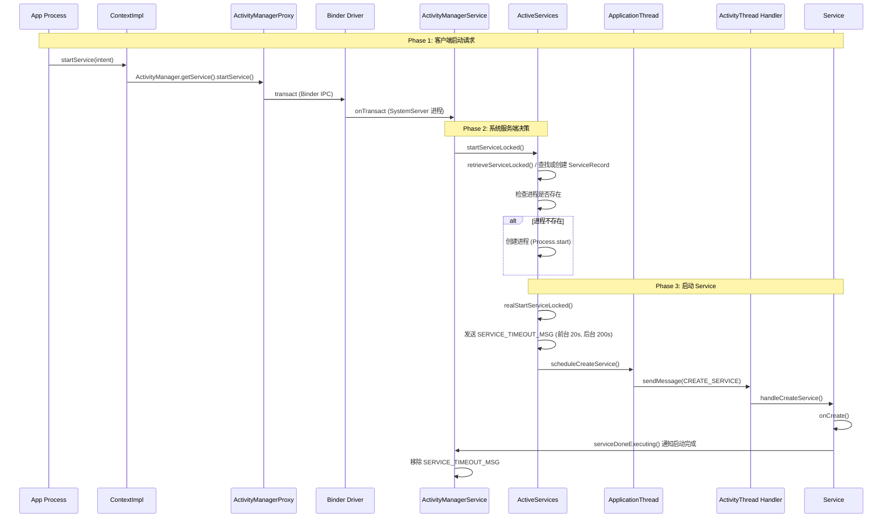
```mermaid
sequenceDiagram
    participant App as App Process
    participant ContextImpl
    participant AMP as ActivityManagerProxy
    participant Binder as Binder Driver
    participant AMS as ActivityManagerService
    participant AS as ActiveServices
    participant AppThread as ApplicationThread
    participant Handler as ActivityThread Handler
    participant Service
    
    Note over App,Service: Phase 1: 客户端启动请求
    App->>ContextImpl: startService(intent)
    ContextImpl->>AMP: ActivityManager.getService().startService()
    AMP->>Binder: transact (Binder IPC)
    Binder->>AMS: onTransact (SystemServer 进程)
    
    Note over AMS,AS: Phase 2: 系统服务端决策
    AMS->>AS: startServiceLocked()
    AS->>AS: retrieveServiceLocked() / 查找或创建 ServiceRecord
    AS->>AS: 检查进程是否存在
    alt 进程不存在
        AS->>AS: 创建进程 (Process.start)
    end
    
    Note over AS,Service: Phase 3: 启动 Service
    AS->>AS: realStartServiceLocked()
    AS->>AS: 发送 SERVICE_TIMEOUT_MSG (前台 20s, 后台 200s)
    AS->>AppThread: scheduleCreateService()
    AppThread->>Handler: sendMessage(CREATE_SERVICE)
    Handler->>Service: handleCreateService()
    Service->>Service: onCreate()
    Service->>AMS: serviceDoneExecuting() 通知启动完成
    AMS->>AMS: 移除 SERVICE_TIMEOUT_MSG
```

**关键阶段**：
1. **Phase 1**：客户端通过 Binder IPC 发送启动请求
2. **Phase 2**：AMS 查找或创建 ServiceRecord，检查进程
3. **Phase 3**：通过 ApplicationThread 回调应用进程，创建 Service 实例

### 0.2 BroadcastReceiver 注册与分发完整流程

从 `registerReceiver` 到 `onReceive` 执行的完整链路：

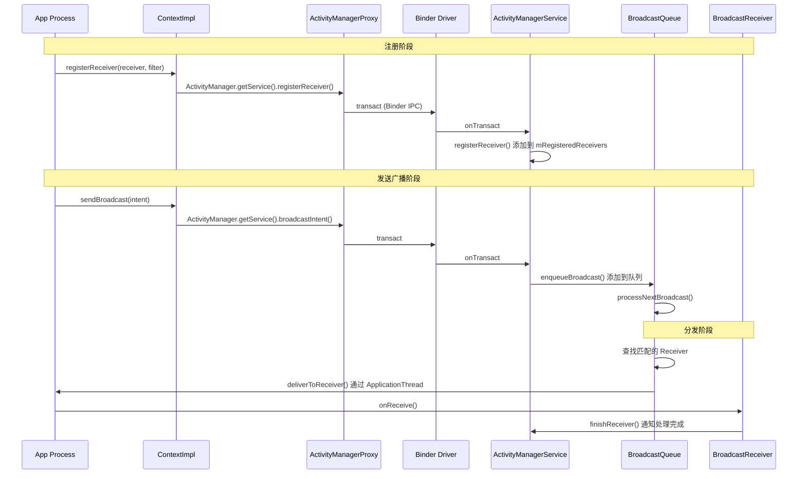
```mermaid
sequenceDiagram
    participant App as App Process
    participant ContextImpl
    participant AMP as ActivityManagerProxy
    participant Binder as Binder Driver
    participant AMS as ActivityManagerService
    participant BQ as BroadcastQueue
    participant Receiver as BroadcastReceiver
    
    Note over App,Receiver: 注册阶段
    App->>ContextImpl: registerReceiver(receiver, filter)
    ContextImpl->>AMP: ActivityManager.getService().registerReceiver()
    AMP->>Binder: transact (Binder IPC)
    Binder->>AMS: onTransact
    AMS->>AMS: registerReceiver() 添加到 mRegisteredReceivers
    
    Note over App,Receiver: 发送广播阶段
    App->>ContextImpl: sendBroadcast(intent)
    ContextImpl->>AMP: ActivityManager.getService().broadcastIntent()
    AMP->>Binder: transact
    Binder->>AMS: onTransact
    AMS->>BQ: enqueueBroadcast() 添加到队列
    BQ->>BQ: processNextBroadcast()
    
    Note over BQ,Receiver: 分发阶段
    BQ->>BQ: 查找匹配的 Receiver
    BQ->>App: deliverToReceiver() 通过 ApplicationThread
    App->>Receiver: onReceive()
    Receiver->>AMS: finishReceiver() 通知处理完成
```

**关键阶段**：
1. **注册阶段**：Receiver 注册到 AMS 的 mRegisteredReceivers
2. **发送阶段**：广播添加到 BroadcastQueue
3. **分发阶段**：AMS 通过 ApplicationThread 回调应用进程

### 0.3 Service 与 BroadcastReceiver 的交互关系

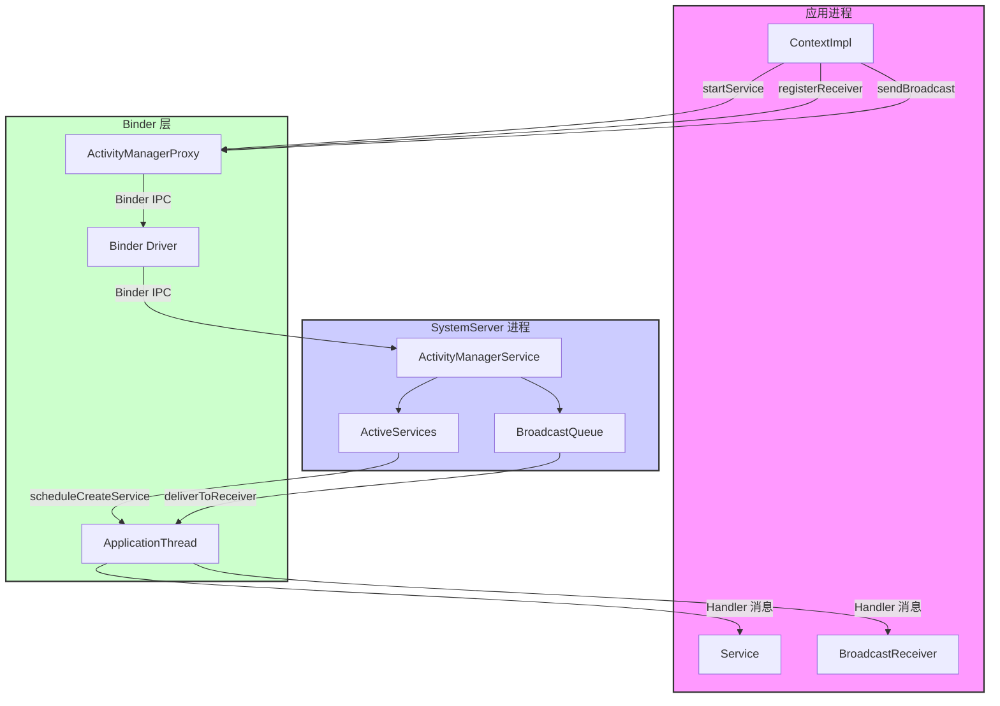
```mermaid
graph TD
    subgraph AppProcess["应用进程"]
        Service[Service]
        Receiver[BroadcastReceiver]
        ContextImpl[ContextImpl]
    end
    
    subgraph SystemServer["SystemServer 进程"]
        AMS[ActivityManagerService]
        AS[ActiveServices]
        BQ[BroadcastQueue]
    end
    
    subgraph BinderLayer["Binder 层"]
        Proxy[ActivityManagerProxy]
        Driver[Binder Driver]
        AppThread[ApplicationThread]
    end
    
    ContextImpl -->|startService| Proxy
    ContextImpl -->|registerReceiver| Proxy
    ContextImpl -->|sendBroadcast| Proxy
    
    Proxy -->|Binder IPC| Driver
    Driver -->|Binder IPC| AMS
    
    AMS --> AS
    AMS --> BQ
    
    AS -->|scheduleCreateService| AppThread
    BQ -->|deliverToReceiver| AppThread
    
    AppThread -->|Handler 消息| Service
    AppThread -->|Handler 消息| Receiver
    
    style AppProcess fill:#f9f,stroke:#333,stroke-width:2px
    style SystemServer fill:#ccf,stroke:#333,stroke-width:2px
    style BinderLayer fill:#cfc,stroke:#333,stroke-width:2px
```

**关键点**：
- Service 和 BroadcastReceiver 都通过 AMS 统一管理
- 都使用 Binder IPC 进行跨进程通信
- 都通过 ApplicationThread 回调应用进程
- 都通过 Handler 消息机制在主线程执行

### 0.4 进程间通信架构

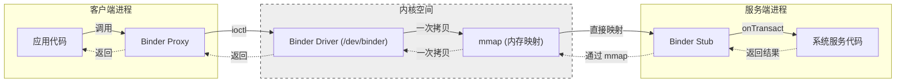
```mermaid
graph LR
    subgraph Client["客户端进程"]
        ClientCode[应用代码]
        Proxy[Binder Proxy]
    end
    
    subgraph Kernel["内核空间"]
        Driver["Binder Driver (/dev/binder)"]
        MMap["mmap (内存映射)"]
    end
    
    subgraph Server["服务端进程"]
        Stub[Binder Stub]
        ServerCode[系统服务代码]
    end
    
    ClientCode -->|调用| Proxy
    Proxy -->|ioctl| Driver
    Driver -->|一次拷贝| MMap
    MMap -->|直接映射| Stub
    Stub -->|onTransact| ServerCode
    ServerCode -.->|返回结果| Stub
    Stub -.->|通过 mmap| MMap
    MMap -.->|一次拷贝| Driver
    Driver -.->|返回| Proxy
    Proxy -.->|返回| ClientCode
    
    style Kernel fill:#eee,stroke:#333,stroke-dasharray: 5 5
```

**Binder 通信特点**：
- **一次拷贝**：通过 mmap 实现，数据只需拷贝一次
- **类型安全**：通过 AIDL 生成强类型接口
- **引用计数**：自动管理 Binder 对象的生命周期

---

## 0.5 关键类及其作用

Service 和 BroadcastReceiver 涉及众多类，理解这些类的作用和关系是掌握机制的基础。本节将详细介绍这些关键类。

### 0.5.1 Service 相关类

#### Service
- **作用**：服务的基类，运行在后台执行长时间运行的操作
- **职责**：
  - 处理业务逻辑（不依赖 UI）
  - 提供跨进程服务（Bound Service）
  - 执行后台任务（Started Service）
- **关键方法**：`onCreate()`、`onStartCommand()`、`onBind()`、`onDestroy()`
- **生命周期**：从创建到销毁，可能比 Activity 更长

#### ServiceRecord
- **作用**：Service 在系统服务端的表示，包含 Service 的状态信息
- **职责**：
  - 存储 Service 的配置信息（来自 Manifest）
  - 管理 Service 的状态（CREATED、STARTING、RUNNING、STOPPING）
  - 维护与客户端 Service 的 Binder 连接
  - 管理 Service 的进程关联
- **关键字段**：`name`、`intent`、`app`、`processName`、`startRequested`
- **数据结构**：存储在 `ActiveServices.mServicesByName` 中

#### ActiveServices
- **作用**：AMS 中管理所有 Service 的类
- **职责**：
  - 管理所有 ServiceRecord（通过 `mServicesByName`）
  - 处理 Service 的启动、停止、绑定
  - 管理 Service 的进程关联
  - 处理 ANR 超时
- **关键方法**：`startServiceLocked()`、`realStartServiceLocked()`、`stopServiceLocked()`、`bindServiceLocked()`
- **数据结构**：`HashMap<String, ServiceRecord> mServicesByName`

#### ServiceConnection
- **作用**：Bound Service 的连接回调接口
- **职责**：
  - 在 Service 绑定成功时回调 `onServiceConnected()`
  - 在 Service 断开连接时回调 `onServiceDisconnected()`
- **关键方法**：`onServiceConnected()`、`onServiceDisconnected()`
- **使用场景**：获取 Bound Service 的 Binder 接口

#### IBinder
- **作用**：Binder 对象的接口，用于跨进程通信
- **职责**：
  - 提供跨进程调用的能力
  - 管理 Binder 对象的生命周期
- **实现类**：`Binder`（服务端）、`BinderProxy`（客户端）
- **使用场景**：Bound Service 返回给客户端的接口

### 0.5.2 BroadcastReceiver 相关类

#### BroadcastReceiver
- **作用**：广播接收器的基类，用于接收系统或应用的广播
- **职责**：
  - 接收广播消息
  - 处理广播事件
- **关键方法**：`onReceive()`
- **生命周期**：一次性执行，`onReceive()` 执行完后对象可能被销毁

#### ReceiverList
- **作用**：接收器列表，管理同一进程中的多个 BroadcastReceiver
- **职责**：
  - 存储同一进程中的多个 Receiver
  - 管理 Receiver 的优先级
  - 维护与 AMS 的 Binder 连接
- **数据结构**：`ArrayList<BroadcastFilter>`
- **关联**：通过 `IBinder`（客户端 Token）关联到进程

#### BroadcastQueue
- **作用**：广播队列，管理待分发的广播
- **职责**：
  - 存储待分发的广播（BroadcastRecord）
  - 调度广播的分发顺序
  - 处理广播的超时
- **队列类型**：
  - `mFgBroadcastQueue`：前台队列（超时 10s）
  - `mBgBroadcastQueue`：后台队列（超时 60s）
- **关键方法**：`enqueueBroadcast()`、`processNextBroadcast()`

#### BroadcastRecord
- **作用**：广播记录，表示一个待分发的广播
- **职责**：
  - 存储广播的 Intent
  - 存储接收者列表
  - 管理广播的状态（PENDING、DELIVERED、FINISHED）
- **关键字段**：`intent`、`receivers`、`ordered`、`delivery`、`timeoutExempt`
- **数据结构**：存储在 `BroadcastQueue.mParallelBroadcasts` 或 `mOrderedBroadcasts` 中

#### BroadcastFilter
- **作用**：广播过滤器，匹配 IntentFilter
- **职责**：
  - 存储 IntentFilter 信息
  - 匹配广播 Intent
  - 关联到 BroadcastReceiver
- **关键字段**：`receiverList`、`intentFilter`、`priority`

### 0.5.3 系统服务相关类

#### ActivityManagerService (AMS)
- **作用**：Activity 和 Service 的管理服务，系统服务端的核心
- **职责**：
  - 接收应用的启动请求（`startService`、`bindService`）
  - 管理所有 Service 和 BroadcastReceiver
  - 进程管理（创建、销毁应用进程）
  - 处理 ANR
- **关键方法**：`startService()`、`bindService()`、`registerReceiver()`、`broadcastIntent()`
- **委托**：将 Service 管理委托给 `ActiveServices`，将广播管理委托给 `BroadcastQueue`

#### ActivityManagerProxy
- **作用**：AMS 的 Binder Proxy，客户端调用系统服务的接口
- **职责**：
  - 封装 Binder 调用
  - 序列化参数（Parcel）
  - 发送 Binder 事务
- **实现**：通过 AIDL 自动生成
- **使用场景**：客户端通过此 Proxy 调用 AMS 的方法

#### IApplicationThread
- **作用**：Binder 接口，系统服务调用应用进程的接口
- **职责**：
  - 定义系统服务调用应用进程的方法
  - 提供 `scheduleCreateService`、`scheduleReceiver` 等方法
- **实现**：`ApplicationThread`（ActivityThread 的内部类）
- **使用场景**：AMS 通过此接口回调应用进程

#### ApplicationThread
- **作用**：ActivityThread 的内部类，实现 `IApplicationThread` Binder 接口
- **职责**：
  - 接收系统服务的 Binder 调用
  - 将 Binder 调用转换为 Handler 消息发送到主线程
  - 实现 `scheduleCreateService`、`scheduleReceiver` 等方法
- **关键方法**：`scheduleCreateService()`、`scheduleReceiver()`、`scheduleBindService()`
- **线程**：运行在 Binder 线程池中，不是主线程

### 0.5.4 Binder 相关类

#### Binder
- **作用**：Binder 的基类，服务端的 Binder 对象
- **职责**：
  - 实现 `onTransact()` 方法处理客户端调用
  - 管理 Binder 对象的生命周期
- **关键方法**：`onTransact()`、`transact()`
- **使用场景**：Bound Service 返回给客户端的 Binder 对象

#### BinderProxy
- **作用**：Binder 的代理对象，客户端的 Binder 对象
- **职责**：
  - 封装跨进程调用
  - 序列化参数并发送给服务端
- **实现**：系统自动生成
- **使用场景**：客户端通过此 Proxy 调用服务端方法

#### Parcel
- **作用**：数据容器，用于 Binder IPC 的数据序列化
- **职责**：
  - 序列化基本类型和对象
  - 跨进程传递数据
- **关键方法**：`writeInt()`、`writeString()`、`readInt()`、`readString()`
- **使用场景**：所有 Binder 调用的参数和返回值都通过 Parcel 传递

### 0.5.5 类关系图谱

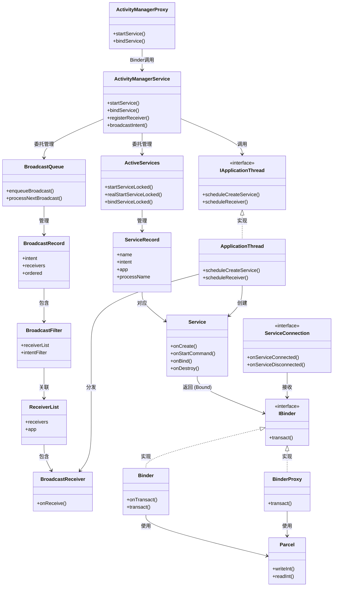
```mermaid
classDiagram
    %% Service 相关
    class Service {
        +onCreate()
        +onStartCommand()
        +onBind()
        +onDestroy()
    }
    class ServiceRecord {
        +name
        +intent
        +app
        +processName
    }
    class ActiveServices {
        +startServiceLocked()
        +realStartServiceLocked()
        +bindServiceLocked()
    }
    class ServiceConnection {
        <<interface>>
        +onServiceConnected()
        +onServiceDisconnected()
    }
    class IBinder {
        <<interface>>
        +transact()
    }
    
    %% BroadcastReceiver 相关
    class BroadcastReceiver {
        +onReceive()
    }
    class ReceiverList {
        +receivers
        +app
    }
    class BroadcastQueue {
        +enqueueBroadcast()
        +processNextBroadcast()
    }
    class BroadcastRecord {
        +intent
        +receivers
        +ordered
    }
    class BroadcastFilter {
        +receiverList
        +intentFilter
    }
    
    %% 系统服务相关
    class ActivityManagerService {
        +startService()
        +bindService()
        +registerReceiver()
        +broadcastIntent()
    }
    class ActivityManagerProxy {
        +startService()
        +bindService()
    }
    class IApplicationThread {
        <<interface>>
        +scheduleCreateService()
        +scheduleReceiver()
    }
    class ApplicationThread {
        +scheduleCreateService()
        +scheduleReceiver()
    }
    
    %% Binder 相关
    class Binder {
        +onTransact()
        +transact()
    }
    class BinderProxy {
        +transact()
    }
    class Parcel {
        +writeInt()
        +readInt()
    }
    
    %% 关系
    ActivityManagerService --> ActiveServices : 委托管理
    ActiveServices --> ServiceRecord : 管理
    ServiceRecord --> Service : 对应
    Service --> IBinder : 返回 (Bound)
    ServiceConnection --> IBinder : 接收
    
    ActivityManagerService --> BroadcastQueue : 委托管理
    BroadcastQueue --> BroadcastRecord : 管理
    BroadcastRecord --> BroadcastFilter : 包含
    BroadcastFilter --> ReceiverList : 关联
    ReceiverList --> BroadcastReceiver : 包含
    
    ActivityManagerService --> IApplicationThread : 调用
    IApplicationThread <|.. ApplicationThread : 实现
    ApplicationThread --> Service : 创建
    ApplicationThread --> BroadcastReceiver : 分发
    
    ActivityManagerProxy --> ActivityManagerService : Binder调用
    IBinder <|.. Binder : 实现
    IBinder <|.. BinderProxy : 实现
    Binder --> Parcel : 使用
    BinderProxy --> Parcel : 使用
```

### 0.5.6 类调用关系总结

**Service 启动调用链**：
```
ContextImpl.startService()
  → ActivityManagerProxy.startService() (Binder)
    → ActivityManagerService.startService()
      → ActiveServices.startServiceLocked()
        → ServiceRecord 创建/查找
        → realStartServiceLocked()
          → ApplicationThread.scheduleCreateService() (Binder)
            → ActivityThread.handleCreateService()
              → Service.onCreate()
```

**BroadcastReceiver 注册调用链**：
```
ContextImpl.registerReceiver()
  → ActivityManagerProxy.registerReceiver() (Binder)
    → ActivityManagerService.registerReceiver()
      → ReceiverList 创建/查找
      → BroadcastFilter 添加到 ReceiverList
```

**广播分发调用链**：
```
ContextImpl.sendBroadcast()
  → ActivityManagerProxy.broadcastIntent() (Binder)
    → ActivityManagerService.broadcastIntent()
      → BroadcastQueue.enqueueBroadcast()
        → processNextBroadcast()
          → ApplicationThread.scheduleReceiver() (Binder)
            → ActivityThread.handleReceiver()
              → BroadcastReceiver.onReceive()
```

---

## 1. Service：从启动到 AMS 的跨进程之旅

### 1.1 启动流程源码解析 (`startService`)

当你调用 `startService` 时，系统发生了什么？这是一个典型的跨进程通信过程。

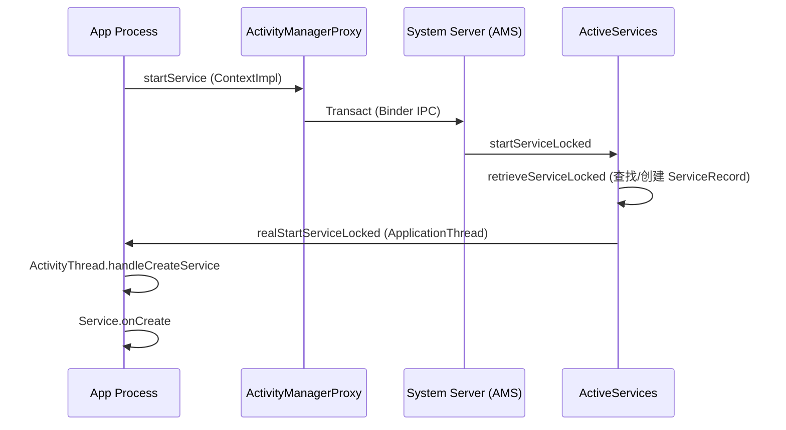
```mermaid
sequenceDiagram
    participant App as App Process
    participant AMP as ActivityManagerProxy
    participant AMS as System Server (AMS)
    participant AS as ActiveServices
    
    App->>AMP: startService (ContextImpl)
    AMP->>AMS: Transact (Binder IPC)
    AMS->>AS: startServiceLocked
    AS->>AS: retrieveServiceLocked (查找/创建 ServiceRecord)
    AS->>App: realStartServiceLocked (ApplicationThread)
    App->>App: ActivityThread.handleCreateService
    App->>App: Service.onCreate
```

1.  **ContextImpl**: `startService` 最终调用 `ActivityManager.getService().startService(...)`。
2.  **Binder IPC**: 通过 `IActivityManager` 接口（AIDL），请求发送到 `SystemServer` 进程的 AMS。
3.  **AMS & ActiveServices**: AMS 将 Service 管理委托给 `ActiveServices` 类。它会检查 Service 是否已存在，进程是否已启动。
4.  **ANR 埋雷**: 在 `realStartServiceLocked` 中，AMS 会向 Handler 发送一个 `SERVICE_TIMEOUT_MSG`（前台 20s，后台 200s）。
5.  **ApplicationThread**: AMS 通过 `IApplicationThread` 回调 App 进程，触发 `ActivityThread` 的 `handleCreateService`。
6.  **ANR 排雷**: 如果 Service 在超时前启动完成，App 会通知 AMS，AMS 移除超时消息。否则，触发 ANR。

### 1.2 Binder 机制深度剖析

Bound Service 的核心是 Binder。它是 Android 的神经系统。

#### 1.2.1 架构图解

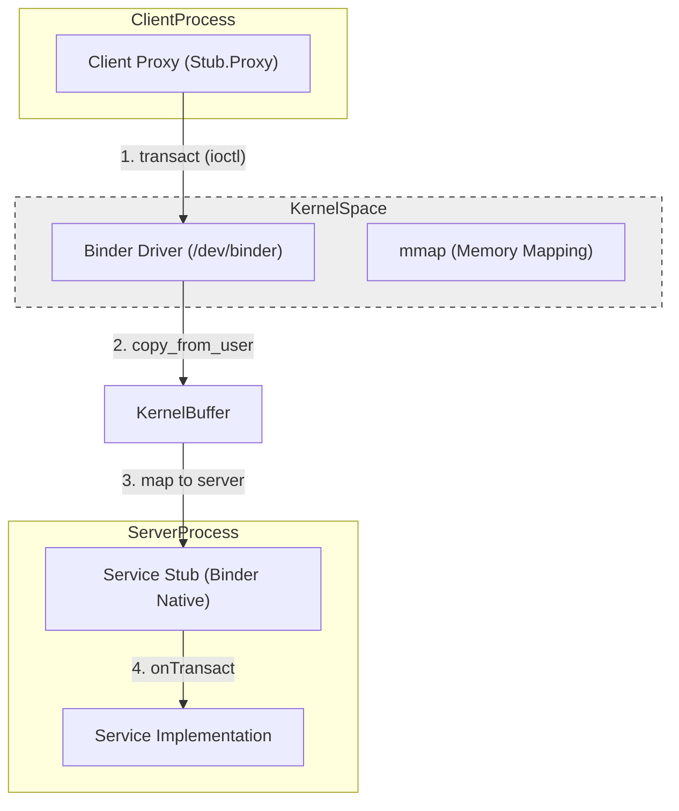
```mermaid
graph TD
    subgraph ClientProcess
        Proxy["Client Proxy (Stub.Proxy)"]
    end
    
    subgraph KernelSpace
        Driver["Binder Driver (/dev/binder)"]
        MMap["mmap (Memory Mapping)"]
    end
    
    subgraph ServerProcess
        Stub["Service Stub (Binder Native)"]
        Impl["Service Implementation"]
    end
    
    Proxy -- "1. transact (ioctl)" --> Driver
    Driver -- "2. copy_from_user" --> KernelBuffer
    KernelBuffer -- "3. map to server" --> Stub
    Stub -- "4. onTransact" --> Impl
    
    style KernelSpace fill:#eee,stroke:#333,stroke-dasharray: 5 5
```

#### 1.2.2 为什么 Binder 高效？(一次拷贝)
-   **传统 IPC (Pipe/Socket)**: 数据从发送方缓存区 -> 内核缓存区 -> 接收方缓存区 (2次拷贝)。
-   **Binder**: 接收方进程的内存空间通过 `mmap` 映射到内核空间。数据从发送方 -> 内核缓存区 (1次拷贝) -> 直接到达接收方地址空间。

#### 1.2.3 AIDL 生成代码分析
当你写一个 `.aidl` 文件，编译器会生成一个 Java 接口，包含：
-   **Stub (抽象类)**: 继承自 `Binder`，运行在服务端。实现了 `onTransact`，用于接收驱动发来的数据包，解析后调用具体方法。
-   **Proxy (内部类)**: 实现了接口，运行在客户端。实现了 `transact`，负责将参数序列化 (`Parcel`) 并发送给驱动。

**AIDL 示例**：
```java
// IMyService.aidl
interface IMyService {
    String getData(int id);
    void setData(String data);
}
```

**生成的代码结构**：
```java
// IMyService.java（自动生成）
public interface IMyService extends android.os.IInterface {
    // Proxy：客户端使用
    public static class Default implements IMyService {
        private android.os.IBinder mRemote;
        
        public String getData(int id) throws android.os.RemoteException {
            android.os.Parcel _data = android.os.Parcel.obtain();
            android.os.Parcel _reply = android.os.Parcel.obtain();
            String _result;
            try {
                _data.writeInterfaceToken(DESCRIPTOR);
                _data.writeInt(id);
                mRemote.transact(Stub.TRANSACTION_getData, _data, _reply, 0);
                _reply.readException();
                _result = _reply.readString();
            } finally {
                _reply.recycle();
                _data.recycle();
            }
            return _result;
        }
    }
    
    // Stub：服务端使用
    public static abstract class Stub extends android.os.Binder implements IMyService {
        @Override
        public boolean onTransact(int code, android.os.Parcel data, android.os.Parcel reply, int flags) {
            switch (code) {
                case TRANSACTION_getData:
                    data.enforceInterface(DESCRIPTOR);
                    int _arg0 = data.readInt();
                    String _result = this.getData(_arg0);
                    reply.writeNoException();
                    reply.writeString(_result);
                    return true;
            }
            return super.onTransact(code, data, reply, flags);
        }
    }
}
```

#### 1.2.4 Binder 驱动工作机制

Binder 驱动是 Linux 内核模块，负责进程间数据的传输和同步。

##### 1.2.4.1 Binder 驱动的初始化

```c
// drivers/android/binder.c（简化）
static int __init binder_init(void) {
    // 1. 创建 Binder 设备节点
    ret = misc_register(&binder_miscdev);
    
    // 2. 初始化 Binder 设备
    binder_dev = kzalloc(sizeof(*binder_dev), GFP_KERNEL);
    binder_dev->miscdev = &binder_miscdev;
    
    // 3. 初始化各种数据结构
    hlist_init(&binder_dev->proc.procs);
    // ...
    
    return ret;
}

// 设备节点：/dev/binder
static struct miscdevice binder_miscdev = {
    .minor = MISC_DYNAMIC_MINOR,
    .name = "binder",
    .fops = &binder_fops
};
```

**关键点**：
- Binder 驱动作为 Linux 内核模块加载
- 创建 `/dev/binder` 设备节点
- 提供 `open`、`ioctl`、`mmap` 等文件操作接口

##### 1.2.4.2 Binder 事务的传输流程

```c
// drivers/android/binder.c
static long binder_ioctl(struct file *filp, unsigned int cmd, unsigned long arg) {
    switch (cmd) {
        case BINDER_WRITE_READ:
            // 处理读写请求
            ret = binder_ioctl_write_read(filp, cmd, arg, thread);
            break;
        case BINDER_SET_CONTEXT_MGR:
            // 设置 ServiceManager
            break;
        // ...
    }
}

static int binder_ioctl_write_read(struct file *filp,
        unsigned int cmd, unsigned long arg,
        struct binder_thread *thread) {
    // 1. 从用户空间读取数据
    if (copy_from_user(&bwr, ubuf, sizeof(bwr))) {
        return -EFAULT;
    }
    
    // 2. 处理写请求（发送数据）
    if (bwr.write_size > 0) {
        ret = binder_thread_write(proc, thread,
                bwr.write_buffer, bwr.write_size, &bwr.write_consumed);
    }
    
    // 3. 处理读请求（接收数据）
    if (bwr.read_size > 0) {
        ret = binder_thread_read(proc, thread, bwr.read_buffer,
                bwr.read_size, &bwr.read_consumed, filp->f_flags & O_NONBLOCK);
    }
    
    // 4. 将结果写回用户空间
    if (copy_to_user(ubuf, &bwr, sizeof(bwr))) {
        return -EFAULT;
    }
    
    return ret;
}
```

**传输流程**：
1. **用户空间 → 内核**：通过 `ioctl` 系统调用，`copy_from_user` 拷贝数据
2. **内核处理**：Binder 驱动处理事务，查找目标进程
3. **内核 → 用户空间**：通过 `mmap` 映射的内存，直接写入接收方地址空间

##### 1.2.4.3 Binder 事务的数据结构

```c
// drivers/android/binder.c
struct binder_transaction {
    int debug_id;
    struct binder_work work;
    struct binder_thread *from;        // 发送线程
    struct binder_proc *to_proc;       // 目标进程
    struct binder_thread *to_thread;   // 目标线程
    unsigned int code;                  // 事务代码
    unsigned int flags;                 // 事务标志
    struct binder_buffer *buffer;       // 数据缓冲区
    // ...
};
```

**事务处理**：
- 每个 Binder 调用对应一个 `binder_transaction`
- 事务包含目标进程、线程、数据缓冲区等信息
- 驱动负责将事务从发送方传递到接收方

#### 1.2.5 mmap 内存映射详解

mmap 是 Binder 实现一次拷贝的关键机制。

##### 1.2.5.1 mmap 的原理

```c
// drivers/android/binder.c
static int binder_mmap(struct file *filp, struct vm_area_struct *vma) {
    struct binder_proc *proc = filp->private_data;
    
    // 1. 分配内核缓冲区
    proc->buffer = kzalloc(sizeof(*proc->buffer), GFP_KERNEL);
    proc->buffer->user_data_offset = vma->vm_start;
    
    // 2. 将内核缓冲区映射到用户空间
    ret = binder_alloc_mmap_handler(&proc->alloc, vma);
    
    return ret;
}
```

**内存映射过程**：
1. **内核分配缓冲区**：在内核空间分配一块内存
2. **建立映射关系**：将内核缓冲区映射到用户空间的虚拟地址
3. **共享内存**：内核和用户空间共享同一块物理内存

##### 1.2.5.2 mmap 的优势

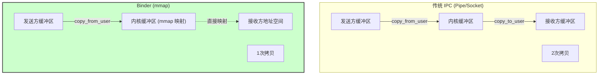
```mermaid
graph TD
    subgraph Traditional["传统 IPC (Pipe/Socket)"]
        S1[发送方缓冲区] -->|copy_from_user| K1[内核缓冲区]
        K1 -->|copy_to_user| R1[接收方缓冲区]
        Note1[2次拷贝]
    end
    
    subgraph Binder["Binder (mmap)"]
        S2[发送方缓冲区] -->|copy_from_user| K2["内核缓冲区 (mmap 映射)"]
        K2 -.->|直接映射| R2[接收方地址空间]
        Note2[1次拷贝]
    end
    
    style Binder fill:#cfc,stroke:#333,stroke-width:2px
```

**性能对比**：

| IPC 方式 | 拷贝次数 | 性能 |
|---------|---------|------|
| **Pipe/Socket** | 2次 | 较慢 |
| **Binder (mmap)** | 1次 | 较快 |
| **共享内存** | 0次 | 最快（但需要同步） |

**为什么 Binder 选择 1 次拷贝而不是 0 次？**
- 安全性：需要内核验证数据
- 权限控制：内核可以检查权限
- 进程隔离：保证进程间数据隔离

##### 1.2.5.3 mmap 的内存布局

```c
// 每个进程的 Binder 内存布局
struct binder_buffer {
    struct list_head entry;         // 链表节点
    struct rb_node rb_node;         // 红黑树节点
    unsigned free:1;                // 是否空闲
    unsigned allow_user_free:1;     // 是否允许用户释放
    struct binder_transaction *transaction;  // 关联的事务
    struct binder_node *target_node;         // 目标节点
    size_t data_size;               // 数据大小
    size_t offsets_size;            // 偏移大小
    uint8_t data[0];                // 实际数据
};
```

**内存管理**：
- 使用红黑树管理缓冲区
- 支持动态分配和释放
- 通过 `binder_alloc` 统一管理

#### 1.2.6 Binder 线程池管理

Binder 服务端使用线程池处理客户端请求，避免阻塞。

##### 1.2.6.1 线程池的创建

```java
// ProcessState.java
static ProcessState self() {
    if (gProcess != null) {
        return gProcess;
    }
    gProcess = new ProcessState();
    return gProcess;
}

ProcessState() {
    // 1. 打开 Binder 设备
    mDriverFD = open_driver();
    
    // 2. mmap 映射内存
    mVMStart = mmap(nullptr, BINDER_VM_SIZE, PROT_READ, MAP_PRIVATE | MAP_NORESERVE, mDriverFD, 0);
    
    // 3. 启动线程池
    mThreadPoolStarted = true;
    spawnPooledThread(true);
}

void spawnPooledThread(bool isMain) {
    if (mThreadPoolStarted) {
        // 创建 Binder 线程
        sp<Thread> t = new PoolThread(isMain);
        t->run("Binder");
    }
}
```

**线程池特点**：
- 默认最大 15 个线程（`MAX_BINDER_THREADS = 15`）
- 主线程（第一个线程）优先级较高
- 线程按需创建，不会一次性创建所有线程

##### 1.2.6.2 线程池的工作机制

```cpp
// ProcessState.cpp
class PoolThread : public Thread {
public:
    PoolThread(bool isMain)
        : mIsMain(isMain) {}
    
private:
    bool threadLoop() {
        IPCThreadState::self()->joinThreadPool(mIsMain);
        return false;
    }
    
    const bool mIsMain;
};

// IPCThreadState.cpp
void IPCThreadState::joinThreadPool(bool isMain) {
    mOut.writeInt32(isMain ? BC_ENTER_LOOPER : BC_REGISTER_LOOPER);
    
    status_t result;
    do {
        // 1. 处理待发送的事务
        result = getAndExecuteCommand();
    } while (result != -ECONNREFUSED && result != -EBADF);
    
    mOut.writeInt32(BC_EXIT_LOOPER);
    talkWithDriver(false);
}
```

**线程工作流程**：
1. 线程调用 `joinThreadPool()` 加入线程池
2. 循环调用 `getAndExecuteCommand()` 处理事务
3. 从驱动读取事务，执行 `onTransact()`
4. 线程退出时发送 `BC_EXIT_LOOPER`

##### 1.2.6.3 事务的线程分配

```cpp
// drivers/android/binder.c
static struct binder_thread *binder_select_thread(struct binder_proc *proc) {
    struct binder_thread *thread = NULL;
    
    // 1. 优先选择空闲线程
    list_for_each_entry(thread, &proc->threads, proc_node) {
        if (thread->transaction_stack == NULL) {
            return thread;
        }
    }
    
    // 2. 如果没有空闲线程，且未达到上限，创建新线程
    if (proc->max_threads == 0 || proc->requested_threads < proc->max_threads) {
        thread = binder_get_thread(proc);
        proc->requested_threads++;
    }
    
    return thread;
}
```

**线程分配策略**：
- 优先使用空闲线程
- 如果没有空闲线程，创建新线程（不超过上限）
- 如果达到上限，等待线程空闲

##### 1.2.6.4 线程池的性能考虑

**线程池大小**：
- 默认最大 15 个线程
- 可以通过 `BINDER_SET_MAX_THREADS` 调整
- 线程过多会增加上下文切换开销

**最佳实践**：
```kotlin
// ❌ 错误：在 Binder 线程中执行耗时操作
class MyService : Service() {
    private val binder = object : IMyService.Stub() {
        override fun getData(id: Int): String {
            // 耗时操作，阻塞 Binder 线程
            Thread.sleep(5000)
            return "data"
        }
    }
}

// ✅ 正确：切换到工作线程
class MyService : Service() {
    private val binder = object : IMyService.Stub() {
        override fun getData(id: Int): String {
            // 切换到工作线程执行
            return runBlocking {
                withContext(Dispatchers.IO) {
                    // 耗时操作
                    fetchDataFromNetwork(id)
                }
            }
        }
    }
}
```

### 1.3 Android 14/15 限制与 FGS

Android 12 起即要求 FGS (Foreground Service) 声明类型；Android 14 进一步加强合规检查（未声明或类型不匹配会被拒绝/ANR）。

```xml
<!-- AndroidManifest.xml -->
<service
    android:name=".SyncService"
    android:foregroundServiceType="dataSync" 
    android:exported="false" />
```

-   **dataSync**: 仍受支持；官方建议大多数数据同步改用 **WorkManager**，但使用 FGS 时必须按声明类型合规。
-   **shortService**: Android 14 新增类型，要求在启动后短时间内调用 `startForeground` 并展示通知；运行时长 < 3 分钟，超时会被系统强制停止，适合少量、即时的小任务。
-   参考来源：Android 12/14 行为变更与 Android Developers Foreground services 文档。

### 1.4 Service 生命周期完整流程

Service 有两种使用方式：**Started Service** 和 **Bound Service**，它们的生命周期有所不同。

#### 1.4.0 Started Service 与 Bound Service 核心区别

**对比表格**：

| 特性 | Started Service | Bound Service |
|------|----------------|---------------|
| **启动方式** | `startService()` | `bindService()` |
| **生命周期独立性** | 独立于启动组件，即使组件销毁也能继续运行 | 与绑定组件关联，所有组件解绑后销毁 |
| **通信方式** | 无直接通信接口，通过 Intent 传递数据 | 通过 `IBinder` 接口直接通信 |
| **返回值** | `onStartCommand()` 返回启动策略 | `onBind()` 返回 `IBinder` 对象 |
| **销毁条件** | 调用 `stopService()` 或 `stopSelf()` | 所有组件调用 `unbindService()` |
| **使用场景** | 后台任务、长期运行的服务 | 提供接口、跨进程服务、组件间通信 |
| **典型应用** | 音乐播放、文件下载、数据同步 | 提供 Binder 接口、跨进程调用 |

**核心区别详解**：

1. **生命周期独立性**
   - **Started Service**：一旦启动，生命周期独立于启动它的组件。即使 Activity 被销毁，Service 仍可继续运行，直到显式停止。
   - **Bound Service**：生命周期与绑定它的组件紧密关联。当所有绑定的组件都解绑时，Service 会自动销毁。

2. **通信机制**
   - **Started Service**：通过 Intent 传递数据，但无法直接获取 Service 的返回值或状态。适合单向任务执行。
   - **Bound Service**：通过 `onBind()` 返回的 `IBinder` 接口，客户端可以直接调用 Service 的方法，实现双向通信。

3. **使用场景差异**
   - **Started Service**：适合执行独立的后台任务，不需要与组件保持持续通信。
   - **Bound Service**：适合需要频繁交互的场景，如提供数据接口、跨进程服务调用。

**使用场景示例**：

**Started Service 适用场景**：

```kotlin
// 场景 1：音乐播放服务
class MusicService : Service() {
    override fun onStartCommand(intent: Intent?, flags: Int, startId: Int): Int {
        val action = intent?.action
        when (action) {
            "PLAY" -> playMusic()
            "PAUSE" -> pauseMusic()
            "STOP" -> stopMusic()
        }
        return START_STICKY  // 服务被杀死后自动重启
    }
}

// 场景 2：文件下载服务
class DownloadService : Service() {
    override fun onStartCommand(intent: Intent?, flags: Int, startId: Int): Int {
        val url = intent?.getStringExtra("url")
        url?.let { downloadFile(it) }
        return START_NOT_STICKY
    }
    
    private fun downloadFile(url: String) {
        // 后台下载文件，即使 Activity 关闭也继续
    }
}

// 场景 3：数据同步服务
class SyncService : Service() {
    override fun onStartCommand(intent: Intent?, flags: Int, startId: Int): Int {
        syncData()  // 定期同步数据
        return START_STICKY
    }
}
```

**Bound Service 适用场景**：

```kotlin
// 场景 1：提供 Binder 接口给其他组件
class CalculatorService : Service() {
    private val binder = object : ICalculatorService.Stub() {
        override fun add(a: Int, b: Int): Int = a + b
        override fun multiply(a: Int, b: Int): Int = a * b
    }
    
    override fun onBind(intent: Intent?): IBinder = binder
}

// 场景 2：跨进程服务（AIDL）
// IDataService.aidl
interface IDataService {
    String getData(int id);
    void setData(String data);
}

class DataService : Service() {
    private val binder = object : IDataService.Stub() {
        override fun getData(id: Int): String = fetchData(id)
        override fun setData(data: String) = saveData(data)
    }
    
    override fun onBind(intent: Intent?): IBinder = binder
}

// 场景 3：组件间共享数据
class LocalService : Service() {
    private val binder = LocalBinder()
    private var data: String = ""
    
    inner class LocalBinder : Binder() {
        fun getService(): LocalService = this@LocalService
    }
    
    override fun onBind(intent: Intent?): IBinder = binder
    
    fun getData(): String = data
    fun setData(data: String) { this.data = data }
}
```

**选择建议**：

- **使用 Started Service 当**：
  - 需要执行独立的后台任务（如音乐播放、文件下载）
  - 任务不需要与组件保持持续通信
  - 需要服务在组件销毁后继续运行
  - 执行一次性或周期性任务

- **使用 Bound Service 当**：
  - 需要提供接口给其他组件调用
  - 需要频繁与组件交互（如获取数据、执行操作）
  - 需要跨进程通信（使用 AIDL）
  - 多个组件需要共享同一个 Service 实例

- **混合使用（Started + Bound）**：
  - 需要长期运行，同时提供接口给组件调用
  - 例如：音乐播放服务（Started 保持运行）+ 提供播放控制接口（Bound）

#### 1.4.1 Started Service 生命周期

Started Service 通过 `startService()` 启动，生命周期独立于启动它的组件。

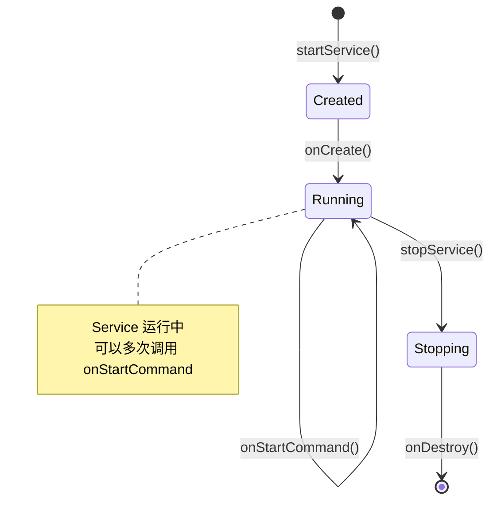
```mermaid
stateDiagram-v2
    [*] --> Created: startService()
    Created --> Running: onCreate()
    Running --> Running: onStartCommand()
    Running --> Stopping: stopService()
    Stopping --> [*]: onDestroy()
    
    note right of Running
        Service 运行中
        可以多次调用 onStartCommand
    end note
```

**生命周期方法**：

| 方法 | 调用时机 | 说明 |
|------|---------|------|
| `onCreate()` | Service 首次创建时 | 只调用一次，用于初始化 |
| `onStartCommand()` | 每次 `startService()` 调用时 | 可能被多次调用 |
| `onDestroy()` | Service 被停止时 | 清理资源 |

**源码流程**：
```java
// ActivityThread.java
private void handleCreateService(CreateServiceData data) {
    // 1. 获取 LoadedApk
    LoadedApk packageInfo = getPackageInfoNoCheck(data.info.applicationInfo, data.compatInfo);
    
    // 2. 创建 Service 实例
    Service service = null;
    try {
        java.lang.ClassLoader cl = packageInfo.getClassLoader();
        service = packageInfo.getAppFactory()
            .instantiateService(cl, data.info.name, data.intent);
    } catch (Exception e) {
        // ...
    }
    
    // 3. 创建 Context
    ContextImpl context = ContextImpl.createAppContext(this, packageInfo);
    context.setOuterContext(service);
    
    // 4. 调用 onCreate
    service.onCreate();
    
    // 5. 保存 Service 实例
    mServices.put(data.token, service);
}
```

#### 1.4.2 Bound Service 生命周期

Bound Service 通过 `bindService()` 绑定，生命周期与绑定它的组件关联。

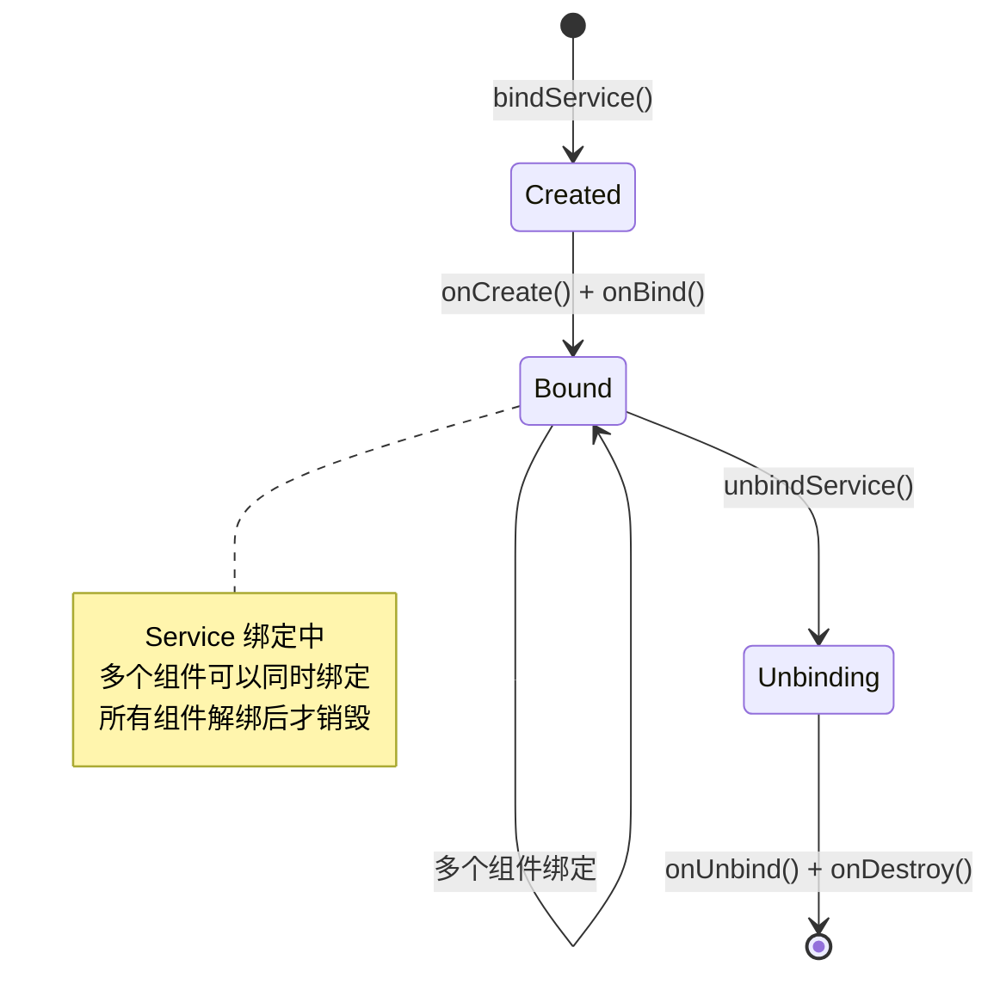
```mermaid
stateDiagram-v2
    [*] --> Created: bindService()
    Created --> Bound: onCreate() + onBind()
    Bound --> Bound: 多个组件绑定
    Bound --> Unbinding: unbindService()
    Unbinding --> [*]: onUnbind() + onDestroy()
    
    note right of Bound
        Service 绑定中
        多个组件可以同时绑定
        所有组件解绑后才销毁
    end note
```

**生命周期方法**：

| 方法 | 调用时机 | 说明 |
|------|---------|------|
| `onCreate()` | Service 首次创建时 | 只调用一次 |
| `onBind()` | 首次绑定时 | 返回 IBinder 接口 |
| `onUnbind()` | 最后一个组件解绑时 | 返回 true 表示支持重新绑定 |
| `onRebind()` | 重新绑定时 | 如果 onUnbind 返回 true |
| `onDestroy()` | 所有组件解绑后 | 清理资源 |

**绑定计数机制**：
```java
// ActiveServices.java
int bindServiceLocked(IApplicationThread caller, IBinder token,
        Intent service, String resolvedType,
        IServiceConnection connection, int flags, String callingPackage,
        int userId) {
    // ...
    ServiceRecord s = retrieveServiceLocked(service, resolvedType,
            callingPackage, Binder.getCallingPid(), Binder.getCallingUid(),
            userId, true, callerFg, false, allowInstant);
    
    // 增加绑定计数
    s.connections.add(new ConnectionRecord(s, connection, flags, ...));
    
    // 如果 Service 未启动，先启动
    if (s.app != null && s.app.thread != null) {
        // Service 已运行，直接绑定
        bringUpServiceLocked(s, service.getFlags(), callerFg, false, false);
    }
    
    // 调用 onBind
    if (s.app != null && s.app.thread != null) {
        s.app.thread.scheduleBindService(s, service.intent, ...);
    }
}
```

#### 1.4.3 混合模式：Started + Bound Service

Service 可以同时是 Started 和 Bound，生命周期更复杂：

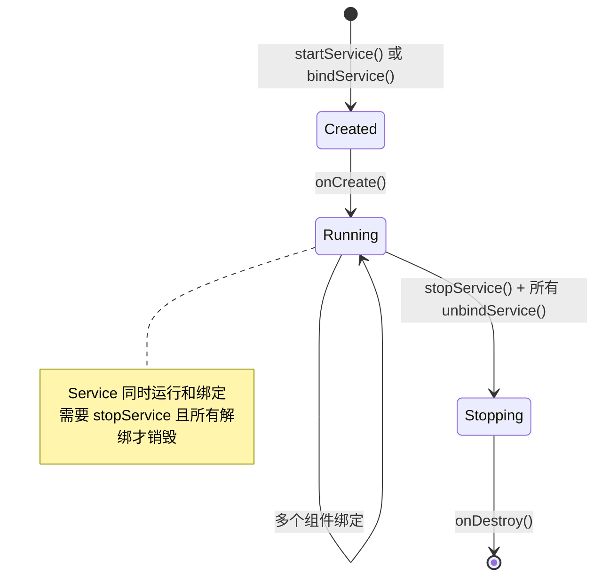
```mermaid
stateDiagram-v2
    [*] --> Created: startService() 或 bindService()
    Created --> Running: onCreate()
    Running --> Running: onStartCommand() (Started)
    Running --> Running: onBind() (Bound)
    Running --> Running: 多个组件绑定
    Running --> Stopping: stopService() + 所有 unbindService()
    Stopping --> [*]: onDestroy()
    
    note right of Running
        Service 同时运行和绑定
        需要 stopService 且所有解绑才销毁
    end note
```

**销毁条件**：
- 必须调用 `stopService()` 或 `stopSelf()`
- 所有绑定的组件必须解绑
- 两个条件都满足才会调用 `onDestroy()`

### 1.5 ServiceRecord 数据结构详解

`ServiceRecord` 是 Service 在系统服务端的表示，包含 Service 的所有状态信息。

#### 1.5.1 ServiceRecord 的关键字段

```java
// ServiceRecord.java（简化）
class ServiceRecord {
    // 基本信息
    final ComponentName name;           // Service 的 ComponentName
    final String instanceName;          // Service 实例名称
    final Intent.FilterComparison intent;  // 启动 Intent
    final ServiceInfo serviceInfo;      // Service 配置信息（来自 Manifest）
    
    // 进程关联
    ProcessRecord app;                  // 所属进程
    String processName;                 // 进程名称
    IApplicationThread appThread;       // 应用进程的 Binder 接口
    
    // 状态管理
    int startRequested;                 // 启动请求计数
    boolean startForeground;            // 是否前台服务
    int foregroundId;                   // 前台通知 ID
    Notification foregroundNotif;       // 前台通知
    
    // 绑定管理
    ArrayMap<IBinder, ArrayList<ConnectionRecord>> connections;  // 绑定连接
    int bindMountPoint;                 // 绑定挂载点
    
    // 生命周期状态
    long createRealTime;                // 创建时间
    long startingBgTimeout;             // 后台启动超时时间
    long executeNesting;                // 执行嵌套计数
    
    // ANR 相关
    long nextRestartTime;               // 下次重启时间
    int restartCount;                   // 重启计数
    int crashCount;                     // 崩溃计数
}
```

#### 1.5.2 ServiceRecord 的状态转换

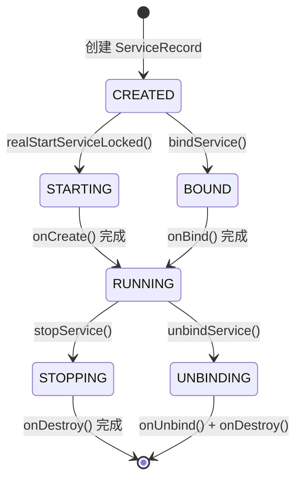
```mermaid
stateDiagram-v2
    [*] --> CREATED: 创建 ServiceRecord
    CREATED --> STARTING: realStartServiceLocked()
    STARTING --> RUNNING: onCreate() 完成
    RUNNING --> STOPPING: stopService()
    STOPPING --> [*]: onDestroy() 完成
    
    CREATED --> BOUND: bindService()
    BOUND --> RUNNING: onBind() 完成
    RUNNING --> UNBINDING: unbindService()
    UNBINDING --> [*]: onUnbind() + onDestroy()
```

**状态说明**：
- **CREATED**：ServiceRecord 已创建，但 Service 实例未创建
- **STARTING**：正在启动 Service（onCreate 执行中）
- **RUNNING**：Service 正在运行
- **STOPPING**：正在停止 Service（onDestroy 执行中）
- **BOUND**：Service 已绑定
- **UNBINDING**：正在解绑 Service（onUnbind 执行中）

#### 1.5.3 ServiceRecord 的存储和管理

```java
// ActiveServices.java
final ArrayMap<ComponentName, ServiceRecord> mServicesByName = new ArrayMap<>();
final ArrayMap<IBinder, ServiceRecord> mServicesByToken = new ArrayMap<>();

ServiceRecord retrieveServiceLocked(Intent service, String resolvedType,
        String callingPackage, int callingPid, int callingUid, int userId,
        boolean createIfNeeded, boolean callingFg, boolean allowInstant,
        boolean isolated) {
    
    ComponentName comp = service.getComponent();
    ServiceRecord r = mServicesByName.get(comp);
    
    if (r == null && createIfNeeded) {
        // 创建新的 ServiceRecord
        r = new ServiceRecord(mAm, this, name, service, resolvedType,
                callingPackage, callingPid, callingUid, userId, serviceInfo,
                appInfo, app, isolated);
        mServicesByName.put(comp, r);
    }
    
    return r;
}
```

**存储结构**：
- `mServicesByName`：以 ComponentName 为 key，快速查找 Service
- `mServicesByToken`：以 IBinder token 为 key，通过 token 查找 Service

### 1.6 ANR 机制详解

Service 启动超时会触发 ANR（Application Not Responding）。理解 ANR 机制对于避免问题至关重要。

#### 1.6.1 SERVICE_TIMEOUT_MSG 的触发

```java
// ActiveServices.java
void realStartServiceLocked(ServiceRecord r, ProcessRecord app, boolean execInFg) {
    // ...
    
    // 发送超时消息
    bumpServiceExecutingLocked(r, execInFg, "create");
    
    // 通过 ApplicationThread 启动 Service
    app.thread.scheduleCreateService(r, r.serviceInfo, ...);
}

void bumpServiceExecutingLocked(ServiceRecord r, boolean fg, String why) {
    // 计算超时时间
    long timeout = SystemClock.uptimeMillis() + (fg ? SERVICE_TIMEOUT : SERVICE_BACKGROUND_TIMEOUT);
    
    // 发送超时消息
    Message msg = mAm.mHandler.obtainMessage(
            ActivityManagerService.SERVICE_TIMEOUT_MSG);
    msg.obj = r;
    mAm.mHandler.sendMessageAtTime(msg, timeout);
}
```

**超时时间**：
- **前台 Service**：20 秒（`SERVICE_TIMEOUT = 20 * 1000`）
- **后台 Service**：200 秒（`SERVICE_BACKGROUND_TIMEOUT = 200 * 1000`）

#### 1.6.2 ANR 的处理流程

```java
// ActivityManagerService.java
final void serviceTimeout(ProcessRecord proc) {
    String anrMessage = null;
    
    synchronized (mGlobalLock) {
        if (proc.executingServices.size() == 0) {
            return;  // Service 已启动完成
        }
        
        long now = SystemClock.uptimeMillis();
        for (int i = proc.executingServices.size() - 1; i >= 0; i--) {
            ServiceRecord sr = proc.executingServices.valueAt(i);
            if (now < sr.executeNesting) {
                // 还在超时时间内
                continue;
            }
            
            // 超时了，触发 ANR
            anrMessage = "executing service " + sr.shortInstanceName;
        }
    }
    
    if (anrMessage != null) {
        // 记录 ANR
        mAnrHelper.appNotResponding(proc, anrMessage);
    }
}
```

**ANR 触发条件**：
1. Service 在超时时间内未完成启动（onCreate 未返回）
2. 系统检测到超时，触发 ANR 处理

#### 1.6.3 如何避免 ANR

**方法 1：快速完成 onCreate**
```kotlin
// ❌ 错误：在 onCreate 中执行耗时操作
class MyService : Service() {
    override fun onCreate() {
        super.onCreate()
        // 耗时操作，可能导致 ANR
        Thread.sleep(5000)
    }
}

// ✅ 正确：异步执行耗时操作
class MyService : Service() {
    override fun onCreate() {
        super.onCreate()
        // 异步执行耗时操作
        lifecycleScope.launch {
            withContext(Dispatchers.IO) {
                // 耗时操作
                initHeavyComponents()
            }
        }
    }
}
```

**方法 2：注意前台服务的超时限制**
```kotlin
// ⚠️ 注意：前台服务超时时间更短（20s），后台服务超时时间更长（200s）
// 前台服务主要用于提升进程优先级，避免被系统杀死，但不能避免 ANR
class MyService : Service() {
    override fun onCreate() {
        super.onCreate()
        // 启动前台服务（提升进程优先级，但超时时间更短）
        startForeground(NOTIFICATION_ID, createNotification())
        // 仍需快速完成初始化，避免 ANR
    }
}
```

**说明**：
- 前台服务超时时间**更短**（20 秒），因为前台服务对用户体验影响更大，需要更快响应
- 后台服务超时时间**更长**（200 秒），可以容忍更长的启动时间
- 使用前台服务主要是为了**提升进程优先级**，避免被系统杀死，而不是为了避免 ANR
- 如果需要在 `onCreate` 中执行耗时操作，应该使用异步方式，而不是依赖更长的超时时间

**方法 3：延迟初始化**
```kotlin
class MyService : Service() {
    override fun onCreate() {
        super.onCreate()
        // 只初始化必要组件
        initEssentialComponents()
        
        // 延迟初始化非关键组件
        Handler(Looper.getMainLooper()).postDelayed({
            initNonEssentialComponents()
        }, 100)
    }
}
```

### 1.7 Bound Service 绑定流程

Bound Service 通过 `bindService()` 绑定，允许组件获取 Service 的 Binder 接口进行跨进程通信。

#### 1.7.1 bindService 的完整流程

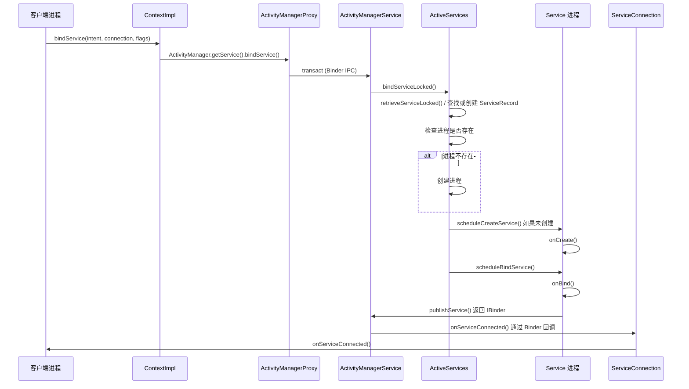
```mermaid
sequenceDiagram
    participant Client as 客户端进程
    participant ContextImpl
    participant AMP as ActivityManagerProxy
    participant AMS as ActivityManagerService
    participant AS as ActiveServices
    participant Service as Service 进程
    participant Connection as ServiceConnection
    
    Client->>ContextImpl: bindService(intent, connection, flags)
    ContextImpl->>AMP: ActivityManager.getService().bindService()
    AMP->>AMS: transact (Binder IPC)
    AMS->>AS: bindServiceLocked()
    AS->>AS: retrieveServiceLocked() / 查找或创建 ServiceRecord
    AS->>AS: 检查进程是否存在
    alt 进程不存在
        AS->>AS: 创建进程
    end
    AS->>Service: scheduleCreateService() 如果未创建
    Service->>Service: onCreate()
    AS->>Service: scheduleBindService()
    Service->>Service: onBind()
    Service->>AMS: publishService() 返回 IBinder
    AMS->>Connection: onServiceConnected() 通过 Binder 回调
    Connection->>Client: onServiceConnected()
```

#### 1.7.2 bindService 的源码分析

```java
// ContextImpl.java
public boolean bindService(Intent service, ServiceConnection conn, int flags) {
    return bindServiceCommon(service, conn, flags, null, mMainThread.getHandler(),
            Process.myUserHandle());
}

private boolean bindServiceCommon(Intent service, ServiceConnection conn, int flags,
        String instanceName, Handler handler, UserHandle user) {
    // 1. 创建 InnerConnection（Binder 对象）
    IServiceConnection sd = mPackageInfo.getServiceDispatcher(conn, getOuterContext(),
            handler, flags);
    
    // 2. 调用 AMS
    int res = ActivityManager.getService().bindService(
            mMainThread.getApplicationThread(), getActivityToken(),
            service, service.resolveTypeIfNeeded(getContentResolver()),
            sd, flags, getOpPackageName(), user.getIdentifier());
    
    return res != 0;
}
```

**关键点**：
- `ServiceConnection` 被包装为 `IServiceConnection`（Binder 接口）
- 通过 `getServiceDispatcher()` 创建 Binder 对象
- 通过 Binder IPC 调用 AMS

#### 1.7.3 ServiceConnection 的 Binder 转换

```java
// LoadedApk.java
public final IServiceConnection getServiceDispatcher(ServiceConnection c,
        Context context, Handler handler, int flags) {
    synchronized (mServices) {
        // 查找或创建 ServiceDispatcher
        ServiceDispatcher sd = mServices.get(c);
        if (sd == null) {
            // 创建 InnerConnection（实现 IServiceConnection）
            sd = new ServiceDispatcher(c, context, handler, flags);
            mServices.put(c, sd);
        }
        return sd.getIServiceConnection();
    }
}

private static class InnerConnection extends IServiceConnection.Stub {
    final WeakReference<LoadedApk.ServiceDispatcher> mDispatcher;
    
    InnerConnection(LoadedApk.ServiceDispatcher sd) {
        mDispatcher = new WeakReference<LoadedApk.ServiceDispatcher>(sd);
    }
    
    public void connected(ComponentName name, IBinder service) {
        LoadedApk.ServiceDispatcher sd = mDispatcher.get();
        if (sd != null) {
            sd.connected(name, service);
        }
    }
}
```

**Binder 转换流程**：
1. `ServiceConnection` 被包装为 `ServiceDispatcher`
2. `ServiceDispatcher` 创建 `InnerConnection`（实现 `IServiceConnection`）
3. `InnerConnection` 是 Binder 对象，可以跨进程传递
4. AMS 通过 `InnerConnection.connected()` 回调客户端

#### 1.7.4 onBind 的返回值处理

```java
// ActivityThread.java
private void handleBindService(BindServiceData data) {
    Service s = mServices.get(data.token);
    if (s != null) {
        try {
            // 调用 onBind
            IBinder binder = s.onBind(data.intent);
            
            // 通知 AMS，发布 Binder 接口
            ActivityManager.getService().publishService(
                    data.token, data.intent, binder);
        } catch (Exception e) {
            // ...
        }
    }
}

// ActiveServices.java
void publishServiceLocked(ServiceRecord r, Intent intent, IBinder service) {
    // 保存 IBinder
    r.connections.forEach(conn -> {
        // 通过 Binder 回调客户端
        conn.conn.connected(r.name, service);
    });
}
```

**关键点**：
- `onBind()` 返回的 `IBinder` 通过 `publishService()` 传递给 AMS
- AMS 通过 `IServiceConnection.connected()` 回调所有绑定的客户端
- 客户端在 `ServiceConnection.onServiceConnected()` 中接收 `IBinder`

#### 1.7.5 绑定计数和生命周期

```java
// ActiveServices.java
boolean unbindServiceLocked(ServiceConnection c, int userId) {
    // 查找 ConnectionRecord
    ConnectionRecord r = findConnectionLocked(c, userId);
    if (r == null) {
        return false;
    }
    
    // 从 ServiceRecord 中移除连接
    r.serviceRecord.connections.remove(c);
    
    // 如果所有连接都解绑，且 Service 未启动，则销毁
    if (r.serviceRecord.connections.isEmpty() && !r.serviceRecord.startRequested) {
        // 调用 onUnbind
        r.serviceRecord.app.thread.scheduleUnbindService(r.serviceRecord, intent);
        
        // 销毁 Service
        destroyServiceLocked(r.serviceRecord);
    }
    
    return true;
}
```

**绑定计数规则**：
- 多个组件可以同时绑定同一个 Service
- 只有当所有组件都解绑，且 Service 未启动时，才会销毁
- 如果 Service 是 Started + Bound，需要同时停止和所有解绑才会销毁

---

## 2. BroadcastReceiver：全局消息总线

### 2.1 注册原理：AMS 中的 ReceiverList

-   **静态注册**: 解析 Manifest 时，PMS (PackageManagerService) 会收集所有 `<receiver>` 标签信息。
-   **动态注册**: `Context.registerReceiver` -> `AMS.registerReceiver`。
    -   AMS 维护一个 `mRegisteredReceivers` (HashMap)，Key 是 `IBinder` (客户端 Token)，Value 是 `ReceiverList`。
    -   这意味着：**如果你忘记 unregister，AMS 会一直持有你的 Binder 引用，导致内存泄漏 (Activity 无法回收)**。
    -   Tips：常见泄漏链路是「Activity -> 匿名/内部类 Receiver -> AMS 持有的 ReceiverList」。未调用 `unregisterReceiver()` 时 AMS 持有该 Receiver 的强引用，进而间接持有 Activity，导致 Activity 无法被 GC 回收。

### 2.2 广播分发机制 (`BroadcastQueue`)

AMS 内部有两个队列：
1.  **Foreground Queue**: 高优先级，超时时间短 (10s)。
2.  **Background Queue**: 低优先级，超时时间长 (60s)。

```java
// AMS 伪代码
public void processNextBroadcast(boolean fromMsg) {
    BroadcastRecord r = mBroadcastQueue.getNext();
    
    // 串行分发 (Ordered Broadcast)
    if (r.ordered) {
        deliverToReceiverLocked(r, r.receivers.get(0));
        return; // 等待接收者处理完 (finishReceiver) 再发下一个
    }
    
    // 并行分发 (Normal Broadcast)
    for (Object target : r.receivers) {
        deliverToReceiverLocked(r, target);
    }
}
```

### 2.3 安全隐患与防御

广播是全局的，容易被嗅探或伪造。

1.  **广播劫持**: 恶意 App 注册同名 Action，拦截有序广播 (`priority` 设很高) 并终止传播 (`abortBroadcast`)。
    -   **防御**: 指定接收者包名 `intent.setPackage(...)`。
2.  **广播伪造**: 恶意 App 发送伪造广播欺骗你的 App。
    -   **防御**: `android:exported="false"` 或声明自定义权限 `<permission>`.

### 2.4 静态注册的解析流程

静态注册的 Receiver 在 Manifest 中声明，系统在应用安装时解析。

#### 2.4.1 Manifest 解析

```xml
<!-- AndroidManifest.xml -->
<receiver
    android:name=".MyReceiver"
    android:exported="true"
    android:enabled="true">
    <intent-filter>
        <action android:name="android.intent.action.BOOT_COMPLETED" />
    </intent-filter>
</receiver>
```

**解析流程**：
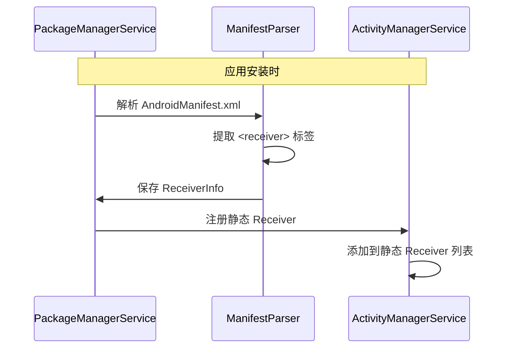
```mermaid
sequenceDiagram
    participant PMS as PackageManagerService
    participant Parser as ManifestParser
    participant AMS as ActivityManagerService
    
    Note over PMS,AMS: 应用安装时
    PMS->>Parser: 解析 AndroidManifest.xml
    Parser->>Parser: 提取 <receiver> 标签
    Parser->>PMS: 保存 ReceiverInfo
    PMS->>AMS: 注册静态 Receiver
    AMS->>AMS: 添加到静态 Receiver 列表
```

#### 2.4.2 静态注册的存储

```java
// PackageManagerService.java
void parsePackage(File apkFile, int parseFlags) {
    // 1. 解析 Manifest
    PackageParser parser = new PackageParser();
    Package pkg = parser.parsePackage(apkFile, parseFlags);
    
    // 2. 提取 Receiver 信息
    for (PackageParser.Activity a : pkg.receivers) {
        ReceiverInfo info = new ReceiverInfo();
        info.name = a.name;
        info.intentFilters = a.intentFilters;
        info.exported = a.exported;
        // ...
    }
    
    // 3. 保存到 Package 对象
    pkg.receivers = receivers;
}
```

**存储位置**：
- `Package.receivers`：存储所有静态 Receiver 信息
- `PackageManagerService.mPackages`：以包名为 key 存储 Package 对象

#### 2.4.3 静态注册的匹配

```java
// ActivityManagerService.java
List<ResolveInfo> queryIntentReceivers(Intent intent, String resolvedType,
        int flags, int userId) {
    // 1. 遍历所有已安装的应用
    for (Package pkg : mPackages.values()) {
        // 2. 匹配 IntentFilter
        for (ReceiverInfo info : pkg.receivers) {
            if (matchIntentFilter(intent, info.intentFilters)) {
                receivers.add(new ResolveInfo(info));
            }
        }
    }
    
    // 3. 按优先级排序
    Collections.sort(receivers, priorityComparator);
    
    return receivers;
}
```

**匹配规则**：
- Action 必须匹配
- Category 必须匹配（如果 Intent 指定了）
- Data（URI、MIME type）必须匹配（如果 Intent 指定了）

### 2.5 动态注册的详细流程

动态注册通过 `registerReceiver()` 在运行时注册，更灵活但需要手动管理生命周期。

#### 2.5.1 registerReceiver 的完整流程

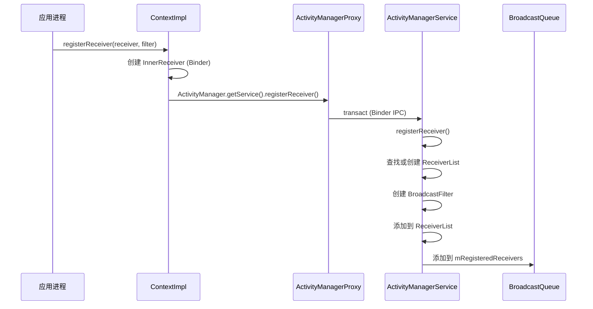
```mermaid
sequenceDiagram
    participant App as 应用进程
    participant ContextImpl
    participant AMP as ActivityManagerProxy
    participant AMS as ActivityManagerService
    participant BQ as BroadcastQueue
    
    App->>ContextImpl: registerReceiver(receiver, filter)
    ContextImpl->>ContextImpl: 创建 InnerReceiver (Binder)
    ContextImpl->>AMP: ActivityManager.getService().registerReceiver()
    AMP->>AMS: transact (Binder IPC)
    AMS->>AMS: registerReceiver()
    AMS->>AMS: 查找或创建 ReceiverList
    AMS->>AMS: 创建 BroadcastFilter
    AMS->>AMS: 添加到 ReceiverList
    AMS->>BQ: 添加到 mRegisteredReceivers
```

#### 2.5.2 AMS.registerReceiver 的源码分析

```java
// ActivityManagerService.java
public Intent registerReceiver(IApplicationThread caller, String callerPackage,
        IIntentReceiver receiver, IntentFilter filter, String permission, int userId,
        int flags) {
    
    // 1. 获取调用者信息
    ProcessRecord callerApp = getRecordForAppLocked(caller);
    if (callerApp == null) {
        throw new SecurityException("Unable to find app for caller");
    }
    
    // 2. 查找或创建 ReceiverList
    ReceiverList rl = mRegisteredReceivers.get(receiver.asBinder());
    if (rl == null) {
        rl = new ReceiverList(this, callerApp, callingPid, callingUid,
                userId, receiver);
        mRegisteredReceivers.put(receiver.asBinder(), rl);
    }
    
    // 3. 创建 BroadcastFilter
    BroadcastFilter bf = new BroadcastFilter(filter, rl, callerPackage,
            permission, callingUid, userId, instantApp, visibleToInstantApps);
    rl.add(bf);
    
    // 4. 添加到 IntentResolver
    mReceiverResolver.addFilter(bf);
    
    return sticky;
}
```

**关键数据结构**：
- `mRegisteredReceivers`：以 `IBinder` 为 key，存储 `ReceiverList`
- `mReceiverResolver`：IntentResolver，用于快速匹配 Intent

#### 2.5.3 ReceiverList 的数据结构

```java
// ActivityManagerService.java
final class ReceiverList extends ArrayList<BroadcastFilter>
        implements IBinder.DeathRecipient {
    final ActivityManagerService owner;
    final IIntentReceiver receiver;     // Binder 接口
    final ProcessRecord app;             // 所属进程
    final int pid;                       // 进程 ID
    final int uid;                       // 用户 ID
    final int userId;                    // 用户 ID
    boolean linkedToDeath = false;      // 是否已注册死亡通知
    
    ReceiverList(ActivityManagerService owner, ProcessRecord app,
            int pid, int uid, int userId, IIntentReceiver receiver) {
        this.owner = owner;
        this.app = app;
        this.pid = pid;
        this.uid = uid;
        this.userId = userId;
        this.receiver = receiver;
    }
}
```

**关键点**：
- `ReceiverList` 继承自 `ArrayList<BroadcastFilter>`
- 实现 `IBinder.DeathRecipient`，监听进程死亡
- 一个进程可以有多个 Receiver，存储在同一个 `ReceiverList` 中

#### 2.5.4 内存泄漏的风险

```java
// ActivityManagerService.java
void unregisterReceiver(IIntentReceiver receiver) {
    ReceiverList rl = mRegisteredReceivers.get(receiver.asBinder());
    if (rl != null) {
        // 移除 ReceiverList
        mRegisteredReceivers.remove(receiver.asBinder());
        
        // 从 IntentResolver 中移除所有 Filter
        for (int i = rl.size() - 1; i >= 0; i--) {
            BroadcastFilter bf = rl.get(i);
            mReceiverResolver.removeFilter(bf);
        }
    }
}
```

**内存泄漏场景**：
```kotlin
// ❌ 错误：忘记 unregister
class MainActivity : AppCompatActivity() {
    private val receiver = object : BroadcastReceiver() {
        override fun onReceive(context: Context?, intent: Intent?) {
            // 处理广播
        }
    }
    
    override fun onCreate(savedInstanceState: Bundle?) {
        super.onCreate(savedInstanceState)
        registerReceiver(receiver, IntentFilter("MY_ACTION"))
        // 忘记 unregister，导致内存泄漏
    }
}

// ✅ 正确：在 onDestroy 中 unregister
class MainActivity : AppCompatActivity() {
    private val receiver = object : BroadcastReceiver() {
        override fun onReceive(context: Context?, intent: Intent?) {
            // 处理广播
        }
    }
    
    override fun onCreate(savedInstanceState: Bundle?) {
        super.onCreate(savedInstanceState)
        registerReceiver(receiver, IntentFilter("MY_ACTION"))
    }
    
    override fun onDestroy() {
        super.onDestroy()
        unregisterReceiver(receiver)  // 必须 unregister
    }
}
```

### 2.6 BroadcastQueue 的调度机制

BroadcastQueue 负责管理待分发的广播，根据优先级和类型进行调度。

#### 2.6.1 队列的分类

```java
// ActivityManagerService.java
final BroadcastQueue mFgBroadcastQueue;  // 前台队列
final BroadcastQueue mBgBroadcastQueue;  // 后台队列

BroadcastQueue(ActivityManagerService service, String name,
        long timeoutPeriod, boolean allowDelayBehindServices) {
    mService = service;
    mQueueName = name;
    mTimeoutPeriod = timeoutPeriod;  // 超时时间
    mAllowDelayBehindServices = allowDelayBehindServices;
}
```

**队列特点**：

| 队列类型 | 超时时间 | 优先级 | 使用场景 |
|---------|---------|--------|---------|
| **Foreground Queue** | 10 秒 | 高 | 前台应用发送的广播 |
| **Background Queue** | 60 秒 | 低 | 后台应用发送的广播 |

#### 2.6.2 广播的入队

```java
// BroadcastQueue.java
public void enqueueBroadcast(Intent intent, ProcessRecord callerApp,
        int callerAppId, String callerPackage, int callingUid, int callingPid,
        String resolvedType, String requiredPermission, int appOp,
        BroadcastOptions options, List receivers, IIntentReceiver resultTo,
        int flags, boolean ordered, boolean sticky, int userId) {
    
    // 1. 创建 BroadcastRecord
    BroadcastRecord r = new BroadcastRecord(intent, callerApp, callerAppId,
            callerPackage, callingUid, callingPid, resolvedType,
            requiredPermission, appOp, options, receivers, resultTo, flags,
            ordered, sticky, userId);
    
    // 2. 根据类型选择队列
    BroadcastQueue queue = (flags & Intent.FLAG_RECEIVER_FOREGROUND) != 0
            ? mFgBroadcastQueue : mBgBroadcastQueue;
    
    // 3. 添加到队列
    if (ordered) {
        queue.mOrderedBroadcasts.add(r);
    } else {
        queue.mParallelBroadcasts.add(r);
    }
    
    // 4. 触发分发
    queue.scheduleBroadcastsLocked();
}
```

**队列选择规则**：
- 如果 Intent 包含 `FLAG_RECEIVER_FOREGROUND`，使用前台队列
- 否则使用后台队列

#### 2.6.3 广播的分发调度

```java
// BroadcastQueue.java
public void scheduleBroadcastsLocked() {
    if (mBroadcastsScheduled) {
        return;  // 已经调度，避免重复
    }
    
    // 发送 Handler 消息，异步处理
    mHandler.sendMessage(mHandler.obtainMessage(BROADCAST_INTENT_MSG, this));
    mBroadcastsScheduled = true;
}

final void processNextBroadcast(boolean fromMsg) {
    synchronized (mService) {
        // 1. 处理并行广播（Normal Broadcast）
        while (mParallelBroadcasts.size() > 0) {
            BroadcastRecord r = mParallelBroadcasts.remove(0);
            final int N = r.receivers.size();
            for (int i = 0; i < N; i++) {
                Object target = r.receivers.get(i);
                deliverToReceiverLocked(r, target, false);
            }
        }
        
        // 2. 处理有序广播（Ordered Broadcast）
        if (mOrderedBroadcasts.size() > 0) {
            BroadcastRecord r = mOrderedBroadcasts.get(0);
            if (r.receivers.size() > 0) {
                // 分发第一个接收者
                deliverToReceiverLocked(r, r.receivers.get(0), true);
            } else {
                // 所有接收者处理完，移除
                mOrderedBroadcasts.remove(0);
            }
        }
    }
}
```

**分发策略**：
- **并行广播**：同时分发给所有接收者
- **有序广播**：按优先级顺序，一个接一个分发

#### 2.6.4 超时机制

```java
// BroadcastQueue.java
void broadcastTimeoutLocked(boolean fromMsg) {
    if (mOrderedBroadcasts.size() == 0) {
        return;
    }
    
    BroadcastRecord r = mOrderedBroadcasts.get(0);
    if (r.receiverTime > 0) {
        // 检查是否超时
        long now = SystemClock.uptimeMillis();
        if (now > r.receiverTime + mTimeoutPeriod) {
            // 超时了，跳过当前接收者
            Slog.w(TAG, "Receiver timeout: " + r);
            finishReceiverLocked(r, r.resultCode, r.resultData,
                    r.resultExtras, r.resultAbort, false);
        }
    }
}
```

**超时处理**：
- 前台队列：10 秒超时
- 后台队列：60 秒超时
- 超时后跳过当前接收者，继续下一个

### 2.7 有序广播与普通广播的分发差异

有序广播和普通广播在分发机制上有本质区别。

#### 2.7.1 普通广播（Normal Broadcast）

```java
// 发送普通广播
Intent intent = new Intent("MY_ACTION");
sendBroadcast(intent);  // 并行分发
```

**特点**：
- 所有接收者**同时**收到广播
- 接收者之间**互不影响**
- 无法终止广播传播
- 无法传递结果给下一个接收者

**分发流程**：
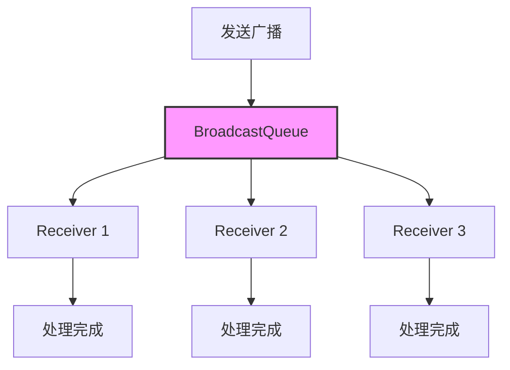
```mermaid
graph TD
    S[发送广播] --> Q[BroadcastQueue]
    Q --> R1[Receiver 1]
    Q --> R2[Receiver 2]
    Q --> R3[Receiver 3]
    R1 --> E1[处理完成]
    R2 --> E2[处理完成]
    R3 --> E3[处理完成]
    
    style Q fill:#f9f,stroke:#333,stroke-width:2px
```

#### 2.7.2 有序广播（Ordered Broadcast）

```java
// 发送有序广播
Intent intent = new Intent("MY_ACTION");
sendOrderedBroadcast(intent, null);  // 串行分发
```

**特点**：
- 接收者**按优先级顺序**接收
- 可以**终止**广播传播（`abortBroadcast()`）
- 可以**传递结果**给下一个接收者
- 一个接收者处理完，下一个才开始

**分发流程**：
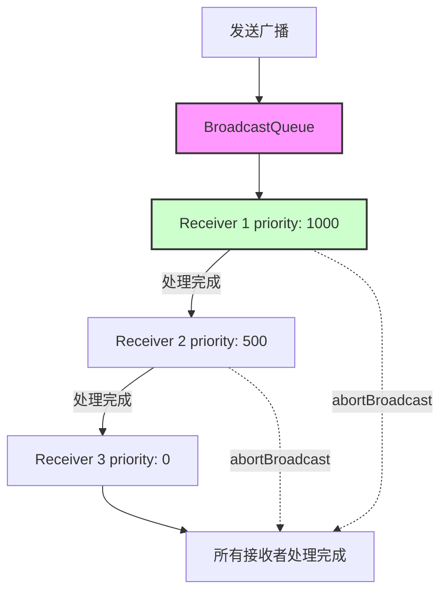
```mermaid
graph TD
    S[发送广播] --> Q[BroadcastQueue]
    Q --> R1["Receiver 1 priority: 1000"]
    R1 -->|处理完成| R2["Receiver 2 priority: 500"]
    R2 -->|处理完成| R3["Receiver 3 priority: 0"]
    R3 --> E[所有接收者处理完成]
    
    R1 -.->|abortBroadcast| E
    R2 -.->|abortBroadcast| E
    
    style Q fill:#f9f,stroke:#333,stroke-width:2px
    style R1 fill:#cfc,stroke:#333,stroke-width:2px
```

#### 2.7.3 优先级排序

```java
// ActivityManagerService.java
void sortReceivers(List<ResolveInfo> receivers) {
    // 按 priority 降序排序
    Collections.sort(receivers, new Comparator<ResolveInfo>() {
        @Override
        public int compare(ResolveInfo a, ResolveInfo b) {
            return b.priority - a.priority;  // 降序
        }
    });
}
```

**优先级规则**：
- 优先级高的先接收
- 相同优先级按注册顺序
- 静态注册的优先级在 Manifest 中指定
- 动态注册的优先级在 `registerReceiver()` 时指定

#### 2.7.4 终止广播传播

```java
// BroadcastReceiver.java
public final void abortBroadcast() {
    if (mPendingResult != null) {
        mPendingResult.mAbortBroadcast = true;
    }
}

// BroadcastQueue.java
void finishReceiverLocked(BroadcastRecord r, int resultCode, String resultData,
        Bundle resultExtras, boolean resultAbort, boolean resultAsync) {
    if (resultAbort) {
        // 广播被终止，不再分发给后续接收者
        r.receivers.clear();
    } else {
        // 继续分发给下一个接收者
        r.receivers.remove(0);
    }
}
```

**使用场景**：
- 系统广播：系统发送的有序广播，应用可以拦截
- 自定义广播：应用内部的有序广播，可以控制传播

### 2.8 goAsync 的实现原理

`goAsync()` 允许 BroadcastReceiver 在 `onReceive()` 返回后继续处理广播，避免 ANR。

#### 2.8.1 goAsync 的使用

```kotlin
class MyReceiver : BroadcastReceiver() {
    override fun onReceive(context: Context, intent: Intent) {
        // 获取 PendingResult
        val pendingResult = goAsync()
        
        // 异步处理
        lifecycleScope.launch {
            withContext(Dispatchers.IO) {
                // 耗时操作
                processData(intent)
            }
            
            // 通知处理完成
            pendingResult.finish()
        }
    }
}
```

**关键点**：
- `goAsync()` 返回 `PendingResult` 对象
- `onReceive()` 可以立即返回，不会阻塞
- 处理完成后必须调用 `pendingResult.finish()`

#### 2.8.2 PendingResult 的实现

```java
// BroadcastReceiver.java
public final PendingResult goAsync() {
    PendingResult res = mPendingResult;
    if (res != null) {
        mPendingResult = null;  // 防止重复调用
    }
    return res;
}

public static class PendingResult {
    final int mResultCode;
    final String mResultData;
    final Bundle mResultExtras;
    final boolean mOrderedHint;
    final boolean mInitialStickyHint;
    BroadcastReceiver mReceiver;
    boolean mFinished = false;
    
    public final void finish() {
        if (mFinished) {
            throw new IllegalStateException("Finish has already been called");
        }
        
        // 通知 AMS 处理完成
        IActivityManager mgr = ActivityManager.getService();
        try {
            mgr.finishReceiver(mToken, mResultCode, mResultData,
                    mResultExtras, mAbortBroadcast, mFlags);
        } catch (RemoteException e) {
            // ...
        }
        
        mFinished = true;
    }
}
```

**工作机制**：
1. `goAsync()` 返回 `PendingResult`，保存当前广播的状态
2. `onReceive()` 立即返回，不阻塞主线程
3. 异步处理完成后，调用 `pendingResult.finish()`
4. `finish()` 通知 AMS 处理完成，继续下一个接收者

#### 2.8.3 goAsync 的注意事项

**必须调用 finish()**：
```kotlin
// ❌ 错误：忘记调用 finish()
class MyReceiver : BroadcastReceiver() {
    override fun onReceive(context: Context, intent: Intent) {
        val pendingResult = goAsync()
        
        // 异步处理
        Thread {
            processData(intent)
            // 忘记调用 finish()，导致广播卡住
        }.start()
    }
}

// ✅ 正确：确保调用 finish()
class MyReceiver : BroadcastReceiver() {
    override fun onReceive(context: Context, intent: Intent) {
        val pendingResult = goAsync()
        
        // 异步处理
        Thread {
            try {
                processData(intent)
            } finally {
                pendingResult.finish()  // 必须调用
            }
        }.start()
    }
}
```

**使用场景**：
- 需要网络请求
- 需要数据库操作
- 需要文件 I/O
- 任何可能超过 10 秒的操作

---

## 3. Service 与 BroadcastReceiver 生命周期对比

Service 和 BroadcastReceiver 虽然都是 Android 组件，但它们的生命周期特性有显著差异。理解这些差异有助于正确使用它们。

### 3.1 Service 生命周期状态机

Service 的生命周期相对复杂，支持多种状态转换。

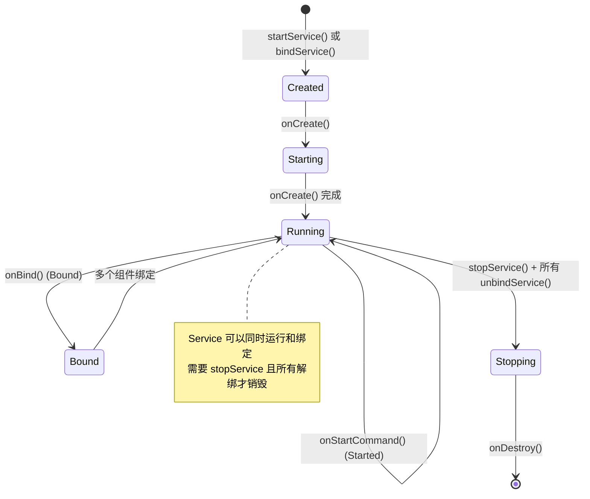
```mermaid
stateDiagram-v2
    [*] --> Created: startService() 或 bindService()
    Created --> Starting: onCreate()
    Starting --> Running: onCreate() 完成
    Running --> Running: onStartCommand() (Started)
    Running --> Bound: onBind() (Bound)
    Bound --> Running: 多个组件绑定
    Running --> Stopping: stopService() + 所有 unbindService()
    Stopping --> [*]: onDestroy()
    
    note right of Running
        Service 可以同时运行和绑定
        需要 stopService 且所有解绑才销毁
    end note
```

**状态说明**：
- **Created**：Service 对象已创建，但未初始化
- **Starting**：正在执行 `onCreate()`
- **Running**：Service 正在运行，可以处理请求
- **Bound**：Service 已绑定，可以返回 Binder 接口
- **Stopping**：正在执行 `onDestroy()`

### 3.2 BroadcastReceiver 的一次性执行特性

BroadcastReceiver 的生命周期非常简单，是一次性的。

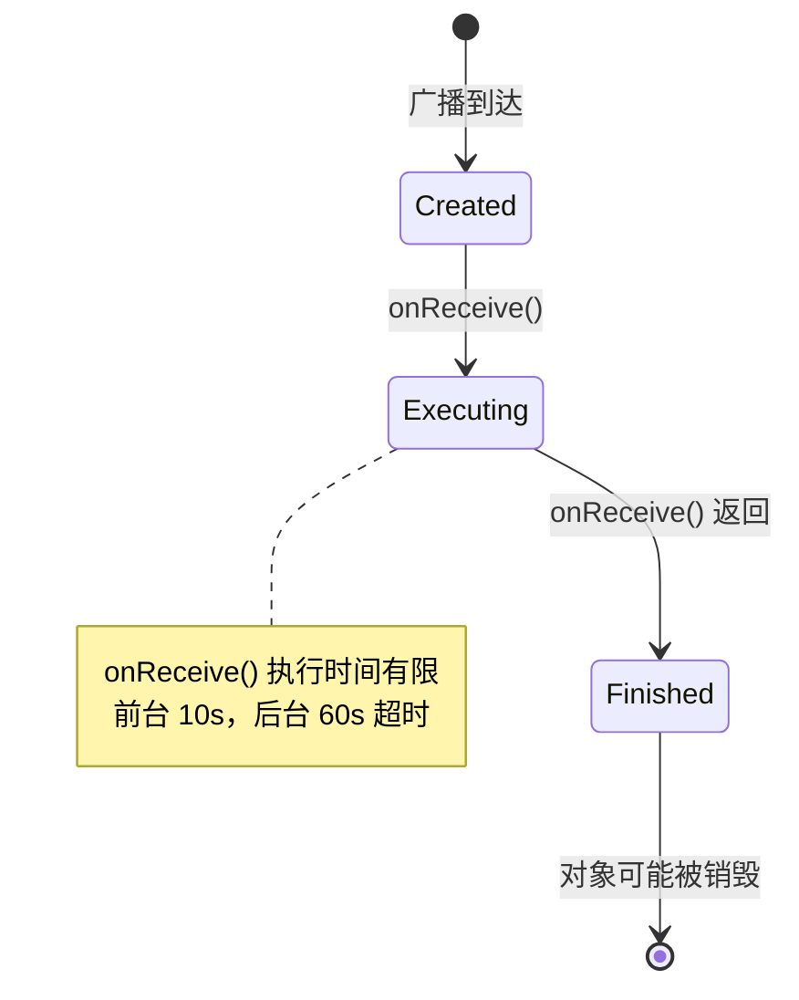
```mermaid
stateDiagram-v2
    [*] --> Created: 广播到达
    Created --> Executing: onReceive()
    Executing --> Finished: onReceive() 返回
    Finished --> [*]: 对象可能被销毁
    
    note right of Executing
        onReceive() 执行时间有限
        前台 10s，后台 60s 超时
    end note
```

**关键特点**：
- **实例复用**：动态注册时同一进程生命周期内复用同一个实例；静态注册由系统按需实例化，进程常驻时也可能复用
- **短暂**：`onReceive()` 必须在超时前完成（前台 10s，后台 60s）
- **无状态**：应避免持有重资源或长生命周期引用，处理完可能被销毁

### 3.3 进程优先级的影响

Service 和 BroadcastReceiver 对进程优先级的影响不同。

#### 3.3.1 Service 对进程优先级的影响

```java
// ProcessRecord.java
void updateProcessState(int newState) {
    if (newState == PROCESS_STATE_SERVICE) {
        // Service 运行中，进程优先级提升
        mCurProcState = PROCESS_STATE_SERVICE;
    } else if (newState == PROCESS_STATE_FOREGROUND_SERVICE) {
        // 前台 Service，进程优先级更高
        mCurProcState = PROCESS_STATE_FOREGROUND_SERVICE;
    }
}
```

**进程优先级**：

| Service 类型 | 进程优先级 | 说明 |
|------------|-----------|------|
| **前台 Service** | `PROCESS_STATE_FOREGROUND_SERVICE` | 高优先级，不易被杀死 |
| **后台 Service** | `PROCESS_STATE_SERVICE` | 中等优先级 |
| **Bound Service** | 取决于绑定者 | 如果绑定者是前台，Service 也是前台 |

#### 3.3.2 BroadcastReceiver 对进程优先级的影响

```java
// ActivityManagerService.java
void finishReceiver(IBinder who, int resultCode, String resultData,
        Bundle resultExtras, boolean resultAbort, int flags) {
    // Receiver 处理完成，进程优先级可能降低
    ProcessRecord app = getRecordForAppLocked(caller);
    if (app != null) {
        updateOomAdjLocked(app);
    }
}
```

**进程优先级**：
- **处理中**：进程优先级临时提升
- **处理完成**：进程优先级可能降低
- **无 Activity**：进程可能被系统杀死

### 3.4 生命周期对比表格

| 特性 | Service | BroadcastReceiver |
|------|---------|------------------|
| **生命周期** | 长期运行 | 一次性执行 |
| **状态保存** | 支持 | 不支持 |
| **进程优先级** | 持续提升 | 临时提升 |
| **ANR 超时** | 20s/200s | 10s/60s |
| **创建方式** | 手动创建 | 系统自动创建 |
| **销毁时机** | 手动停止或解绑 | 自动销毁 |
| **跨进程** | 支持（Bound Service） | 支持（静态注册） |
| **状态机** | 复杂（多状态） | 简单（单次执行） |

### 3.5 使用场景对比

#### 3.5.1 Service 适用场景

- **长期运行的任务**：音乐播放、文件下载
- **后台处理**：数据同步、位置更新
- **跨进程服务**：提供 Binder 接口给其他应用
- **需要状态保存**：保存处理进度、连接状态

#### 3.5.2 BroadcastReceiver 适用场景

- **事件通知**：系统事件（开机、网络变化）
- **应用间通信**：发送广播通知其他应用
- **一次性处理**：处理简单的事件响应
- **不需要状态**：处理完即销毁

### 3.6 混合使用的注意事项

在实际开发中，Service 和 BroadcastReceiver 经常配合使用。

#### 3.6.1 常见模式：Receiver 启动 Service

```kotlin
class BootReceiver : BroadcastReceiver() {
    override fun onReceive(context: Context, intent: Intent) {
        // Receiver 处理完，启动 Service 执行长期任务
        val serviceIntent = Intent(context, MyService::class.java)
        context.startService(serviceIntent)
    }
}
```

**原因**：
- Receiver 执行时间有限（10-60 秒）
- Service 可以长期运行
- 适合需要持续处理的任务

#### 3.6.2 常见模式：Service 发送广播

```kotlin
class MyService : Service() {
    override fun onStartCommand(intent: Intent?, flags: Int, startId: Int): Int {
        // Service 处理完成后，发送广播通知
        val broadcastIntent = Intent("ACTION_TASK_COMPLETE")
        sendBroadcast(broadcastIntent)
        return START_NOT_STICKY
    }
}
```

**原因**：
- Service 处理完成后需要通知其他组件
- 广播是解耦的通信方式
- 多个组件可以同时接收广播

---

## 4. 性能优化实战

在实际开发中，合理优化 Service 和 BroadcastReceiver 的使用可以显著提升应用性能和用户体验。

### 4.1 Service 启动优化

#### 4.1.1 延迟初始化

```kotlin
// ❌ 错误：在 onCreate 中初始化所有组件
class MyService : Service() {
    override fun onCreate() {
        super.onCreate()
        // 初始化所有组件，可能导致启动慢
        initDatabase()
        initNetwork()
        initCache()
    }
}

// ✅ 正确：延迟初始化非关键组件
class MyService : Service() {
    override fun onCreate() {
        super.onCreate()
        // 只初始化关键组件
        initEssentialComponents()
        
        // 延迟初始化非关键组件
        Handler(Looper.getMainLooper()).postDelayed({
            initNonEssentialComponents()
        }, 100)
    }
}
```

#### 4.1.2 使用前台服务

```kotlin
// 前台服务有更长的超时时间（20s vs 200s）
class MyService : Service() {
    override fun onCreate() {
        super.onCreate()
        // 启动前台服务，提升优先级
        startForeground(NOTIFICATION_ID, createNotification())
    }
}
```

#### 4.1.3 避免重复启动

```kotlin
// ❌ 错误：重复启动 Service
fun startService() {
    startService(Intent(this, MyService::class.java))
    startService(Intent(this, MyService::class.java))  // 重复启动
}

// ✅ 正确：检查 Service 是否已运行
fun startService() {
    if (!isServiceRunning(MyService::class.java)) {
        startService(Intent(this, MyService::class.java))
    }
}
```

### 4.2 BroadcastReceiver 注册优化

#### 4.2.1 及时注销

```kotlin
// ❌ 错误：忘记注销
class MainActivity : AppCompatActivity() {
    private val receiver = MyReceiver()
    
    override fun onCreate(savedInstanceState: Bundle?) {
        super.onCreate(savedInstanceState)
        registerReceiver(receiver, IntentFilter("MY_ACTION"))
        // 忘记注销，导致内存泄漏
    }
}

// ✅ 正确：在 onDestroy 中注销
class MainActivity : AppCompatActivity() {
    private val receiver = MyReceiver()
    
    override fun onCreate(savedInstanceState: Bundle?) {
        super.onCreate(savedInstanceState)
        registerReceiver(receiver, IntentFilter("MY_ACTION"))
    }
    
    override fun onDestroy() {
        super.onDestroy()
        unregisterReceiver(receiver)  // 必须注销
    }
}
```

#### 4.2.2 使用静态注册

```kotlin
// 对于系统广播，使用静态注册更高效
// AndroidManifest.xml
<receiver android:name=".BootReceiver">
    <intent-filter>
        <action android:name="android.intent.action.BOOT_COMPLETED" />
    </intent-filter>
</receiver>
```

**优势**：
- 不需要手动注册/注销
- 应用未运行时也能接收广播
- 减少内存泄漏风险

### 4.3 Binder 通信优化

#### 4.3.1 减少 Binder 调用次数

```kotlin
// ❌ 错误：频繁的 Binder 调用
class MyService : Service() {
    private val binder = object : IMyService.Stub() {
        override fun getData(id: Int): String {
            return fetchData(id)  // 每次调用都访问数据库
        }
    }
}

// ✅ 正确：批量获取数据
class MyService : Service() {
    private val binder = object : IMyService.Stub() {
        override fun getDataList(ids: IntArray): Array<String> {
            return fetchDataList(ids)  // 一次获取多个数据
        }
    }
}
```

#### 4.3.2 避免在 Binder 线程中执行耗时操作

```kotlin
// ❌ 错误：在 Binder 线程中执行耗时操作
class MyService : Service() {
    private val binder = object : IMyService.Stub() {
        override fun processData(data: String): String {
            // 耗时操作，阻塞 Binder 线程
            Thread.sleep(5000)
            return process(data)
        }
    }
}

// ✅ 正确：切换到工作线程
class MyService : Service() {
    private val binder = object : IMyService.Stub() {
        override fun processData(data: String): String {
            return runBlocking {
                withContext(Dispatchers.IO) {
                    // 在工作线程执行
                    process(data)
                }
            }
        }
    }
}
```

### 4.4 避免 ANR 的最佳实践

#### 4.4.1 Service ANR 预防

```kotlin
// ✅ 正确：快速完成 onCreate
class MyService : Service() {
    override fun onCreate() {
        super.onCreate()
        // 只做必要的初始化
        initEssentialComponents()
        
        // 耗时操作异步执行
        lifecycleScope.launch {
            withContext(Dispatchers.IO) {
                initHeavyComponents()
            }
        }
    }
}
```

#### 4.4.2 BroadcastReceiver ANR 预防

```kotlin
// ✅ 正确：使用 goAsync()
class MyReceiver : BroadcastReceiver() {
    override fun onReceive(context: Context, intent: Intent) {
        val pendingResult = goAsync()
        
        lifecycleScope.launch {
            withContext(Dispatchers.IO) {
                // 耗时操作
                processData(intent)
            }
            pendingResult.finish()
        }
    }
}
```

### 4.5 内存泄漏预防

#### 4.5.1 Service 内存泄漏预防

```kotlin
// ❌ 错误：持有 Activity 引用
class MyService : Service() {
    private var activity: Activity? = null  // 可能导致泄漏
    
    fun setActivity(activity: Activity) {
        this.activity = activity
    }
}

// ✅ 正确：使用弱引用
class MyService : Service() {
    private var activityRef: WeakReference<Activity>? = null
    
    fun setActivity(activity: Activity) {
        this.activityRef = WeakReference(activity)
    }
}
```

#### 4.5.2 BroadcastReceiver 内存泄漏预防

```kotlin
// ✅ 正确：及时注销
class MainActivity : AppCompatActivity() {
    private val receiver = MyReceiver()
    
    override fun onDestroy() {
        super.onDestroy()
        try {
            unregisterReceiver(receiver)
        } catch (e: IllegalArgumentException) {
            // 已经注销，忽略异常
        }
    }
}
```

---

## 5. 调试方法

掌握调试方法对于排查 Service 和 BroadcastReceiver 的问题至关重要。

### 5.1 使用 adb 命令查看 Service 状态

#### 5.1.1 查看所有 Service

```bash
# 查看所有 Service
adb shell dumpsys activity services

# 查看指定包的 Service
adb shell dumpsys activity services com.example.app
```

**输出示例**：
```
ACTIVITY MANAGER SERVICES (dumpsys activity services)
  Active services:
    * ServiceRecord{...} com.example.app/.MyService
      app=ProcessRecord{...}
      isForeground=true
      ...
```

#### 5.1.2 查看 Service 详细信息

```bash
# 查看 Service 详细信息
adb shell dumpsys activity services com.example.app/.MyService
```

**关键信息**：
- Service 状态（Running、Stopped）
- 绑定连接数
- 进程信息
- 启动时间

### 5.2 使用 adb 命令查看 BroadcastReceiver 注册

#### 5.2.1 查看所有注册的 Receiver

```bash
# 查看所有注册的 Receiver
adb shell dumpsys activity broadcasts

# 查看指定包的 Receiver
adb shell dumpsys activity broadcasts com.example.app
```

**输出示例**：
```
ACTIVITY MANAGER BROADCAST STATE (dumpsys activity broadcasts)
  Registered Receivers:
    * ReceiverList{...} com.example.app/.MyReceiver
      filter=IntentFilter{...}
      ...
```

#### 5.2.2 查看广播队列

```bash
# 查看广播队列
adb shell dumpsys activity broadcasts | grep -A 20 "BroadcastQueue"
```

**关键信息**：
- 待分发的广播
- 正在处理的广播
- 广播超时信息

### 5.3 使用 Android Studio Profiler 分析 Binder 调用

#### 5.3.1 启用 Binder 跟踪

```bash
# 启用 Binder 跟踪
adb shell setprop debug.binder.trace true

# 查看 Binder 调用
adb logcat | grep Binder
```

#### 5.3.2 使用 Profiler 分析

1. 打开 Android Studio Profiler
2. 选择应用进程
3. 查看 CPU 性能
4. 分析 Binder 调用耗时

### 5.4 使用 Systrace 分析 Service 启动流程

#### 5.4.1 生成 Systrace

```bash
# 生成 Systrace
python systrace.py -t 10 -o trace.html sched freq idle am wm gfx view binder_driver hal dalvik camera input res
```

#### 5.4.2 分析 Service 启动

在 Systrace 中查找：
- `startService` 调用
- Binder 事务
- `onCreate` 执行时间
- ANR 超时

### 5.5 常见问题排查清单

#### 5.5.1 Service 启动失败

1. 检查 Service 是否在 Manifest 中声明
2. 检查权限是否足够
3. 检查进程是否已创建
4. 查看 logcat 错误日志

#### 5.5.2 BroadcastReceiver 未接收广播

1. 检查 Receiver 是否注册
2. 检查 IntentFilter 是否匹配
3. 检查权限是否足够
4. 检查进程是否运行

#### 5.5.3 ANR 问题

1. 检查 `onCreate` 是否耗时过长
2. 检查是否有死锁
3. 查看 ANR 日志（`/data/anr/traces.txt`）
4. 使用 Systrace 分析

---

## 6. 异常处理

在实际开发中，正确处理异常可以提升应用的稳定性和用户体验。

### 6.1 Service 启动失败的处理

#### 6.1.1 权限失败

```kotlin
// 检查权限
fun startService() {
    if (ContextCompat.checkSelfPermission(this, Manifest.permission.XXX) 
            != PackageManager.PERMISSION_GRANTED) {
        // 请求权限
        ActivityCompat.requestPermissions(this, arrayOf(...), REQUEST_CODE)
        return
    }
    
    // 启动 Service
    startService(Intent(this, MyService::class.java))
}
```

#### 6.1.2 Service 未注册

```kotlin
// 检查 Service 是否存在
fun startService() {
    val intent = Intent(this, MyService::class.java)
    if (intent.resolveActivity(packageManager) != null) {
        startService(intent)
    } else {
        Log.e(TAG, "Service not found")
    }
}
```

#### 6.1.3 进程创建失败

```kotlin
// 监听 Service 启动结果
val serviceConnection = object : ServiceConnection {
    override fun onServiceConnected(name: ComponentName?, service: IBinder?) {
        // Service 连接成功
    }
    
    override fun onServiceDisconnected(name: ComponentName?) {
        // Service 断开连接（进程可能被杀死）
        // 重新连接
        bindService(Intent(this@MainActivity, MyService::class.java), 
                this, Context.BIND_AUTO_CREATE)
    }
}
```

### 6.2 BroadcastReceiver 未注册的处理

#### 6.2.1 动态注册检查

```kotlin
// 检查 Receiver 是否已注册
fun registerReceiver() {
    if (receiverRegistered) {
        return  // 已注册，跳过
    }
    
    try {
        registerReceiver(receiver, IntentFilter("MY_ACTION"))
        receiverRegistered = true
    } catch (e: Exception) {
        Log.e(TAG, "Failed to register receiver", e)
    }
}
```

#### 6.2.2 静态注册检查

```kotlin
// 检查静态注册的 Receiver 是否存在
fun checkStaticReceiver() {
    val intent = Intent("MY_ACTION")
    val receivers = packageManager.queryBroadcastReceivers(intent, 0)
    if (receivers.isEmpty()) {
        Log.w(TAG, "No static receiver found")
    }
}
```

### 6.3 Binder 死亡通知的处理（linkToDeath）

#### 6.3.1 注册死亡通知

死亡通知应由**客户端**对“远端 Binder 代理”注册；对服务端本地 Stub 调用会抛异常且无意义。服务端只需返回 Binder。

```kotlin
class MyService : Service() {
    private val binder = object : IMyService.Stub() {
        // Service 实现
    }

    override fun onBind(intent: Intent?): IBinder = binder
}
```

#### 6.3.2 客户端处理 Binder 死亡

```kotlin
class MainActivity : AppCompatActivity() {
    private var service: IMyService? = null
    private val serviceConnection = object : ServiceConnection {
        override fun onServiceConnected(name: ComponentName?, binder: IBinder?) {
            service = IMyService.Stub.asInterface(binder)
            
            // 注册死亡通知
            binder?.linkToDeath(object : IBinder.DeathRecipient {
                override fun binderDied() {
                    // Binder 死亡，重新绑定
                    service = null
                    bindService(Intent(this@MainActivity, MyService::class.java),
                            this, Context.BIND_AUTO_CREATE)
                }
            }, 0)
        }
        
        override fun onServiceDisconnected(name: ComponentName?) {
            service = null
        }
    }
}
```

### 6.4 ANR 的预防与处理

#### 6.4.1 Service ANR 预防

```kotlin
// ✅ 正确：快速完成 onCreate
class MyService : Service() {
    override fun onCreate() {
        super.onCreate()
        // 只做必要的初始化
        initEssentialComponents()
        
        // 耗时操作异步执行
        Handler(Looper.getMainLooper()).postDelayed({
            initHeavyComponents()
        }, 100)
    }
}
```

#### 6.4.2 BroadcastReceiver ANR 预防

```kotlin
// ✅ 正确：使用 goAsync()
class MyReceiver : BroadcastReceiver() {
    override fun onReceive(context: Context, intent: Intent) {
        val pendingResult = goAsync()
        
        Thread {
            try {
                // 耗时操作
                processData(intent)
            } finally {
                pendingResult.finish()
            }
        }.start()
    }
}
```

#### 6.4.3 ANR 日志分析

```bash
# 查看 ANR 日志
adb pull /data/anr/traces.txt

# 分析 ANR 原因
# 1. 查找主线程堆栈
# 2. 查找 Service 相关调用
# 3. 查找 Binder 调用
```

### 6.5 常见异常场景和解决方案

#### 6.5.1 Service 启动超时

**原因**：`onCreate` 执行时间过长

**解决方案**：
- 延迟初始化非关键组件
- 使用异步初始化
- 使用前台服务（更长超时时间）

#### 6.5.2 BroadcastReceiver 内存泄漏

**原因**：忘记注销动态注册的 Receiver

**解决方案**：
- 在 `onDestroy` 中注销
- 使用静态注册（系统自动管理）
- 使用 `LifecycleObserver` 自动管理

#### 6.5.3 Binder 调用失败

**原因**：服务端进程死亡或 Binder 对象无效

**解决方案**：
- 注册 `linkToDeath` 监听
- 实现重连机制
- 检查 Binder 对象有效性

---

## 7. 进阶面试题

1.  **Binder 的 `linkToDeath` 是什么？**
    -   **场景**: 客户端绑定了服务端，服务端进程意外挂了。
    -   **机制**: 客户端注册 `linkToDeath` 回调。当 Binder 驱动检测到服务端进程死亡，会发送通知给客户端，客户端可以在 `binderDied` 中清理资源或重新连接。

2.  **为什么不能在 BroadcastReceiver 中做耗时操作？**
    -   **主线程**: `onReceive` 默认在主线程执行。
    -   **ANR**: 前台广播 10s，后台 60s 超时。
    -   **生命周期**: `onReceive` 结束后，Receiver 对象即被销毁，进程优先级变低，容易被系统杀掉。
    -   **错误解法**: 在 `onReceive` 开子线程？不行，因为进程可能随之被杀。
    -   **正确解法**: `goAsync()` (短期) 或 `startService` / `WorkManager` (长期)。

3.  **LocalBroadcastManager 原理？(已废弃)**
    -   它不是 Binder IPC，而是 **Handler + Message 机制**。
    -   它只在当前进程内分发，高效且安全。
    -   **替代**: `SharedFlow` (Kotlin Coroutines) 或 `LiveData`。

## 8. 总结

-   **Service**: 核心是 AMS 的调度与 Binder IPC。理解 `Stub/Proxy` 模式是掌握 Framework 的钥匙。
-   **Broadcast**: 核心是 AMS 的 `BroadcastQueue`。注意注册泄漏与安全边界。
-   **趋势**: 随着 Android 版本迭代，后台权限越来越小，**WorkManager** 逐渐接管了 Service 的大部分后台职责。
