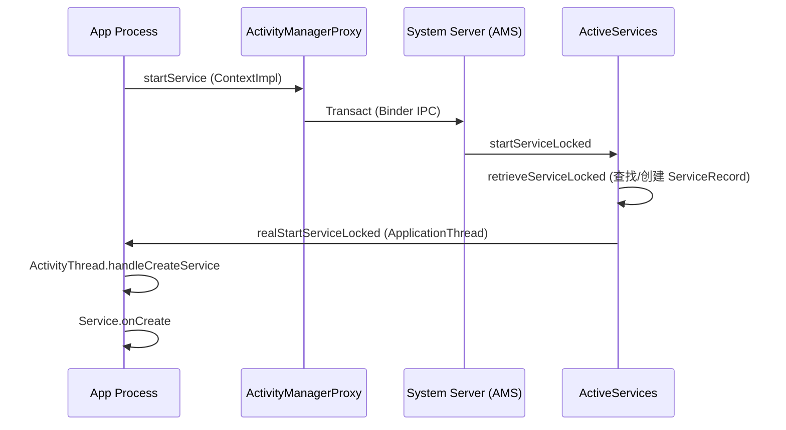

# Service & BroadcastReceiver 深度解析：AMS, Binder 与 Native 原理

本文深入探讨 Android 四大组件中的 Service（服务）和 BroadcastReceiver（广播接收器），不仅涵盖应用层使用，更深入到 **AMS (ActivityManagerService)**、**Binder 驱动** 以及 **Native 层** 的实现原理。

## 1. Service：从启动到 AMS 的跨进程之旅

### 1.1 启动流程源码解析 (`startService`)

当你调用 `startService` 时，系统发生了什么？这是一个典型的跨进程通信过程。



1.  **ContextImpl**: `startService` 最终调用 `ActivityManager.getService().startService(...)`。
2.  **Binder IPC**: 通过 `IActivityManager` 接口（AIDL），请求发送到 `SystemServer` 进程的 AMS。
3.  **AMS & ActiveServices**: AMS 将 Service 管理委托给 `ActiveServices` 类。它会检查 Service 是否已存在，进程是否已启动。
4.  **ANR 埋雷**: 在 `realStartServiceLocked` 中，AMS 会向 Handler 发送一个 `SERVICE_TIMEOUT_MSG`（前台 20s，后台 200s）。
5.  **ApplicationThread**: AMS 通过 `IApplicationThread` 回调 App 进程，触发 `ActivityThread` 的 `handleCreateService`。
6.  **ANR 排雷**: 如果 Service 在超时前启动完成，App 会通知 AMS，AMS 移除超时消息。否则，触发 ANR。

### 1.2 Binder 机制深度剖析

Bound Service 的核心是 Binder。它是 Android 的神经系统。

#### 1.2.1 架构图解

```mermaid
graph TD
    subgraph ClientProcess
        Proxy[Client Proxy (Stub.Proxy)]
    end
    
    subgraph KernelSpace
        Driver[Binder Driver (/dev/binder)]
        MMap[mmap (Memory Mapping)]
    end
    
    subgraph ServerProcess
        Stub[Service Stub (Binder Native)]
        Impl[Service Implementation]
    end
    
    Proxy -- "1. transact (ioctl)" --> Driver
    Driver -- "2. copy_from_user" --> KernelBuffer
    KernelBuffer -- "3. map to server" --> Stub
    Stub -- "4. onTransact" --> Impl
    
    style KernelSpace fill:#eee,stroke:#333,stroke-dasharray: 5 5
```

#### 1.2.2 为什么 Binder 高效？(一次拷贝)
-   **传统 IPC (Pipe/Socket)**: 数据从发送方缓存区 -> 内核缓存区 -> 接收方缓存区 (2次拷贝)。
-   **Binder**: 接收方进程的内存空间通过 `mmap` 映射到内核空间。数据从发送方 -> 内核缓存区 (1次拷贝) -> 直接到达接收方地址空间。

#### 1.2.3 AIDL 生成代码分析
当你写一个 `.aidl` 文件，编译器会生成一个 Java 接口，包含：
-   **Stub (抽象类)**: 继承自 `Binder`，运行在服务端。实现了 `onTransact`，用于接收驱动发来的数据包，解析后调用具体方法。
-   **Proxy (内部类)**: 实现了接口，运行在客户端。实现了 `transact`，负责将参数序列化 (`Parcel`) 并发送给驱动。

### 1.3 Android 14/15 限制与 FGS

Android 14 强制要求 FGS (Foreground Service) 声明类型。

```xml
<!-- AndroidManifest.xml -->
<service
    android:name=".SyncService"
    android:foregroundServiceType="dataSync" 
    android:exported="false" />
```

-   **dataSync**: 未来可能被废弃，Google 强推 **WorkManager**。
-   **shortService**: Android 14 新增。
    -   **特点**: 只能运行 < 3 分钟。无需通知。
    -   **超时**: 严格强制停止 (ANR 或 Crash)。
    -   **场景**: 发送一条消息、保存少量数据。

---

## 2. BroadcastReceiver：全局消息总线

### 2.1 注册原理：AMS 中的 ReceiverList

-   **静态注册**: 解析 Manifest 时，PMS (PackageManagerService) 会收集所有 `<receiver>` 标签信息。
-   **动态注册**: `Context.registerReceiver` -> `AMS.registerReceiver`。
    -   AMS 维护一个 `mRegisteredReceivers` (HashMap)，Key 是 `IBinder` (客户端 Token)，Value 是 `ReceiverList`。
    -   这意味着：**如果你忘记 unregister，AMS 会一直持有你的 Binder 引用，导致内存泄漏 (Activity 无法回收)**。

### 2.2 广播分发机制 (`BroadcastQueue`)

AMS 内部有两个队列：
1.  **Foreground Queue**: 高优先级，超时时间短 (10s)。
2.  **Background Queue**: 低优先级，超时时间长 (60s)。

```java
// AMS 伪代码
public void processNextBroadcast(boolean fromMsg) {
    BroadcastRecord r = mBroadcastQueue.getNext();
    
    // 串行分发 (Ordered Broadcast)
    if (r.ordered) {
        deliverToReceiverLocked(r, r.receivers.get(0));
        return; // 等待接收者处理完 (finishReceiver) 再发下一个
    }
    
    // 并行分发 (Normal Broadcast)
    for (Object target : r.receivers) {
        deliverToReceiverLocked(r, target);
    }
}
```

### 2.3 安全隐患与防御

广播是全局的，容易被嗅探或伪造。

1.  **广播劫持**: 恶意 App 注册同名 Action，拦截有序广播 (`priority` 设很高) 并终止传播 (`abortBroadcast`)。
    -   **防御**: 指定接收者包名 `intent.setPackage(...)`。
2.  **广播伪造**: 恶意 App 发送伪造广播欺骗你的 App。
    -   **防御**: `android:exported="false"` 或声明自定义权限 `<permission>`.

---

## 3. 进阶面试题

1.  **Binder 的 `linkToDeath` 是什么？**
    -   **场景**: 客户端绑定了服务端，服务端进程意外挂了。
    -   **机制**: 客户端注册 `linkToDeath` 回调。当 Binder 驱动检测到服务端进程死亡，会发送通知给客户端，客户端可以在 `binderDied` 中清理资源或重新连接。

2.  **为什么不能在 BroadcastReceiver 中做耗时操作？**
    -   **主线程**: `onReceive` 默认在主线程执行。
    -   **ANR**: 前台广播 10s，后台 60s 超时。
    -   **生命周期**: `onReceive` 结束后，Receiver 对象即被销毁，进程优先级变低，容易被系统杀掉。
    -   **错误解法**: 在 `onReceive` 开子线程？不行，因为进程可能随之被杀。
    -   **正确解法**: `goAsync()` (短期) 或 `startService` / `WorkManager` (长期)。

3.  **LocalBroadcastManager 原理？(已废弃)**
    -   它不是 Binder IPC，而是 **Handler + Message 机制**。
    -   它只在当前进程内分发，高效且安全。
    -   **替代**: `SharedFlow` (Kotlin Coroutines) 或 `LiveData`。

## 4. 总结

-   **Service**: 核心是 AMS 的调度与 Binder IPC。理解 `Stub/Proxy` 模式是掌握 Framework 的钥匙。
-   **Broadcast**: 核心是 AMS 的 `BroadcastQueue`。注意注册泄漏与安全边界。
-   **趋势**: 随着 Android 版本迭代，后台权限越来越小，**WorkManager** 逐渐接管了 Service 的大部分后台职责。
