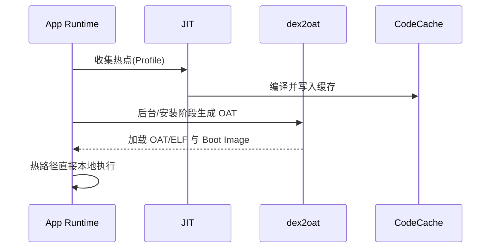
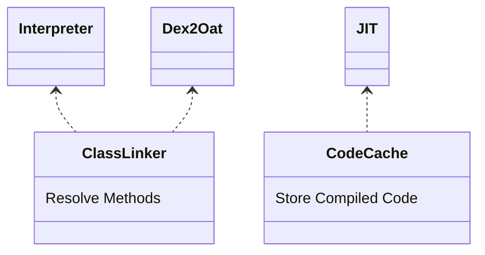

# ART 入门与编译模式

## 总览

- ART 是 Android 的运行时，负责字节码执行、内存管理与垃圾回收
- 执行路径包含解释执行、JIT（运行时热点编译）与 AOT（安装期静态编译）
- 现代 Android 采用“混合编译”与“Profile 引导”以平衡启动速度与运行性能

## dex 与验证

- 应用代码以 `dex` 格式打包，安装时可进行校验与优化
- 验证阶段确保类型安全与栈正确性，必要时进行指令 quickening 优化

## 编译模式

- 解释器：冷路径按字节码逐条解释，启动占用低但性能一般
- JIT：运行时收集热点（Profile），对热点方法编译成本地代码，提升性能
- AOT（dex2oat）：在安装或设备空闲时将 dex 转为 OAT/ELF，本地可执行；改善冷启动与稳定性能
- 混合策略：启动阶段以解释/JIT 为主，后台 Profile 指导 AOT，形成“热路径本地化”

## OAT/ELF 与引导镜像

- Boot Image 预装系统类的编译产物，加速系统类加载与方法调用
- 应用侧 OAT/ELF 存储编译结果，随版本与设备策略生成或更新

## GC 与内存管理（概览）

- 多种收集器：并发标记清除、代际收集、粘性标记清除等，目标是缩短暂停时间并减少抖动
- 堆组织与分配：分代、对象对齐、TLS/TLAB 加速分配；大对象区单独管理

## 类加载与反射

- ClassLoader 链按双亲委派优先搜索，插件化/热修复会影响链路与可见性
- 反射存在性能与混淆兼容问题，需谨慎使用与保留规则

## 启动与热路径优化

- Profile-Guided Compilation：根据真实运行采样，将常用方法 AOT
- 与启动优化联动：关键初始化合并与延后、减少反射与 I/O、Baseline Profiles

## 调试与分析

- `perfetto/systrace`：观察线程与调度、JIT/AOT 影响、GC 暂停
- `traceview`/Method tracing：方法级热点识别，结合 Profile 做针对性编译

## 面试答题框架

- 解释执行/JIT/AOT 的差异与权衡
- dex2oat/OAT/ELF/Boot Image 的作用与关系
- GC 策略与暂停时间优化的思路
- Profile 引导与现代 Android 的混合编译实践

---

## 原理

- 解释器按字节码顺序执行，适用于冷路径与快速启动场景。
- JIT 在运行期对热点方法进行本地编译，基于 Profile 数据持续优化。
- AOT 在安装/空闲阶段通过 `dex2oat` 生成 OAT/ELF，减少运行时编译成本，提升冷启动。
- Boot Image 预编译系统类，降低类加载与方法调用开销；应用侧通过 Baseline Profiles 引导关键路径提前 AOT。
- 混合策略：冷启动阶段以解释/JIT 为主保证安装与存储成本，后台 Profile 合并后再 AOT 热路径，形成分层编译。
- 验证与 quickening：dex 验证确保类型与栈正确性，quickening 将高层指令替换为高效入口，加速解释执行。
- 代码入口：`ArtMethod` 关联解释/编译入口，JIT 编译成功后会切换入口指针，失败回退解释。

### ClassLinker 调用链与镜像关联

- `ClassLinker::InitFromImage` 读取镜像中的类与方法表，建立运行时的链接关系；解析与内联缓存提升调用效率。
- 类型解析：符号引用解析为具体类/方法字段，失败时抛验证错误或回退解释路径。

### 设计考量

- 启动速度与运行性能的平衡：过度 AOT 增加安装时间与存储；纯解释/JIT 可能导致首次交互迟滞。
- 设备差异与能耗：编译与 GC 的暂停时间需要控制在可接受范围，避免卡顿。

## 源码解析（线索）

- 解释器路径：`art/runtime/interpreter/interpreter.cc` 执行指令；`art/runtime/art_method.cc` 关联入口。
- JIT 管线：`art/runtime/jit/jit.cc`、`jit_code_cache.cc` 管理热点与代码缓存。
- AOT 工具链：`art/dex2oat`、`oat_file.cc`、`image_space.cc` 生成与加载编译产物。
- 类链接与加载：`ClassLinker` 负责 dex 合并、方法解析与图像空间关联。
- GC 收集器：`gc/collector/*`（如 CMS、Sticky、Young）对应不同暂停与吞吐策略。

## 示例

### Baseline Profiles（Gradle 配置片段）

```groovy
plugins {
  id 'com.android.application'
  id 'androidx.baselineprofile'
}

android {
  defaultConfig { }
}

baselineProfile {
  saveInSrc = true
}
```

### Kotlin：关键路径埋点与优化候选识别

```kotlin
object StartupTracer {
  fun mark(name: String) {
    android.os.Trace.beginSection(name)
    android.os.Trace.endSection()
  }
}

class App : Application() {
  override fun onCreate() {
    super.onCreate()
    StartupTracer.mark("init-logger")
    StartupTracer.mark("init-network")
  }
}
```

## 时序图：JIT/AOT 协同



## 组件关系图



## 性能与瓶颈

- 代码缓存抖动与回收导致方法回退解释执行，需合理配额与清理策略。
- 过度反射与动态代理增加验证与调用开销，应以生成代码或直接调用替代关键路径。
- GC 暂停时间控制：避免在动画与输入高频阶段触发完整收集，合理分配堆与触发阈值。

## 运行时启动与关键调用链

- 进程启动：`ZygoteInit.main` → `startSystemServer`/`forkSystemServer` → 普通进程通过 `forkAndSpecialize` 继承 Zygote 的 Boot Image/zygote-space。
- 类加载：`ClassLinker::InitFromImage` 读取 Boot Image 中的类与方法表；`LoadClass` 解析 dex 到内存，`ResolveMethodField` 建立入口缓存。
- 解释/编译入口：`artMethod::Invoke` → `EntryPoints` 决定走解释器或已编译代码；JIT 通过 `jit::Jit::CompileMethod` 将热点写入 `jit_code_cache`。
- dex2oat/AOT：安装或后台触发 `dex2oat`，`ImageWriter` 生成 image/odex/oat；`OatFile::Open` 加载到内存。
- GC 调度：`Runtime::Heap` 管理多收集器，`gc::TaskProcessor` 安排并发/增量收集；`sticky/partial/full` 不同暂停窗口。

## Android 15(API 35) 重点与迁移

- ART Mainline 持续更新：编译器与 GC 行为可通过 Play 系统更新下发，需在基线 Profile/启动性能回归中关注变化。
- Baseline/Profile：依旧推荐生成 Baseline Profiles 与 Cloud-delivered Profiles（Play 下发），API 35 上提升冷启动与滚动性能仍依赖这些 Profile。
- 安全与完整性：动态加载/反射受混淆与验证约束，保持 Proguard/R8 keep 规则避免运行时崩溃；大体与 API 34 一致。
