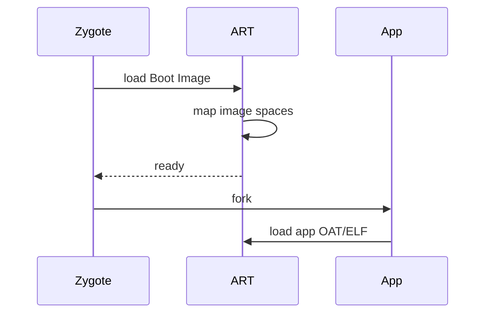
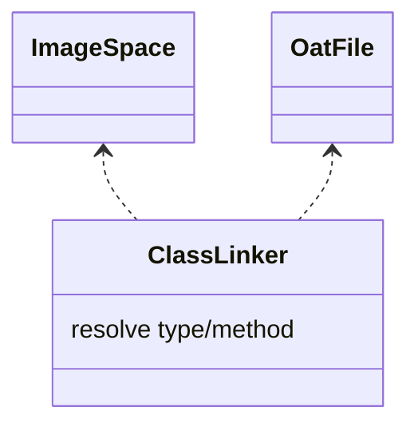

# Boot Image 与 OAT/ELF 产物细节（深入）

## 原理

- Boot Image：系统类与常用方法的预编译镜像，加速类加载与方法调用；随系统版本构建并在引导时加载。
- OAT/ELF：应用侧编译产物，dex 经 `dex2oat` 转换为 OAT，最终链接为 ELF 格式以便加载执行。
- 作用：缩短冷启动路径与方法首次调用延迟，减少解释/JIT 压力。
- 加载流程：Zygote 启动时映射 Boot Image 与关联 OAT；应用进程 fork 后共享镜像，按需加载自身 OAT/ELF。
- 索引与解析：`ClassLinker` 通过 OAT 中的 dex 索引定位方法/类入口，失败时回退解释或 JIT。
- 性能权衡：镜像/OAT 体积与页命中率影响启动；Profile 引导选择性 AOT 保持体积与性能平衡。

## 源码（线索）

- `art/runtime/image_space.cc`：镜像加载与空间管理。
- `art/runtime/oat_file.cc`：OAT 文件解析与入口。
- `art/dex2oat`：编译流程工具链。
- `class_linker.cc`：类解析、方法链接与镜像关联。

## 示例

### Gradle：Baseline Profiles 配置联动

```groovy
plugins { id 'androidx.baselineprofile' }
baselineProfile { saveInSrc = true }
```

### Kotlin：关键路径预热

```kotlin
fun prewarm() {
  android.os.Trace.beginSection("prewarm")
  Class.forName("com.example.HomeViewModel")
  android.os.Trace.endSection()
}
```

## 对比与取舍

- 全量 AOT vs 混合：全量提升稳定性能但安装时间长、存储占用高；混合以 Profile 引导更均衡。
- 预热策略：提前加载与反射可改善首帧，但需控制代价与副作用。

## 加载时序图



## 组件关系图



## 方法级细节与优化

- 镜像映射与页命中影响启动性能；减少随机 I/O 与懒加载抖动。
- Profile 引导可将常用方法提前 AOT；避免过度反射与动态生成代码。

## 字段结构（概览示意）

- Boot Image Header：镜像起始地址、大小、入口点、校验信息与关联的 OAT 引用（概念字段）。
- OAT Header：版本、Dex 文件计数、方法与类的偏移索引、校验信息（概念字段）。
- ELF：节区表与符号表（text/data/bss），用于最终装载与链接。

## 方法调用路径（概览）

- `ImageSpace::Create` → 加载镜像与映射页 → 返回镜像空间引用
- `ClassLinker::InitFromImage` → 绑定镜像中的类与方法表 → 建立运行时链接
- `OatFile::Open` → 校验并映射 OAT → 提供方法查找入口

### 设计权衡与性能影响

- 镜像大小与页映射影响 I/O 命中率；OAT/ELF 索引布局影响查找效率。
- 安装期 AOT 与运行期 JIT 的平衡：安装时间、存储占用与首次运行性能的取舍。

## 自测题

- Boot Image 与 OAT/ELF 的职责分别是什么？答：镜像预编译系统类，OAT/ELF 为应用侧编译产物用于加载执行。
- 加载链路关键方法有哪些？答：`ImageSpace::Create`、`ClassLinker::InitFromImage`、`OatFile::Open`（概览）。
- 字段结构中哪些信息影响启动性能？答：镜像映射与页命中、索引偏移与校验、节区组织。

## 面试答题框架

- 解释 Boot Image/OAT/ELF 的关系与加载流程。
- 描述类链接与镜像关联的关键路径。
- 结合工程策略：Baseline Profiles、预热与反射取舍。

## Android 15(API 35) 提示

- ART Mainline 持续下发镜像/编译优化，Boot Image 版本随系统更新；应用侧需在升级后重跑基线/启动基准。
- 设备可通过 Play 更新 ART 模块，OAT 兼容性保持但若依赖反射/动态生成需确认 keep 规则与 ABI 覆盖。
