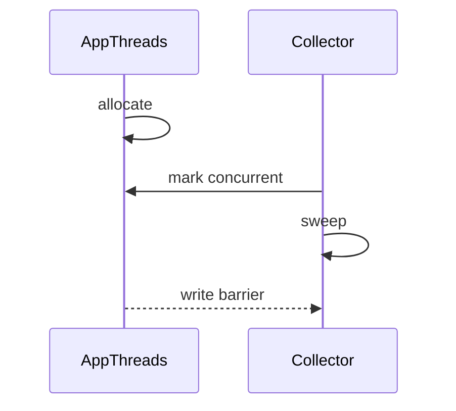
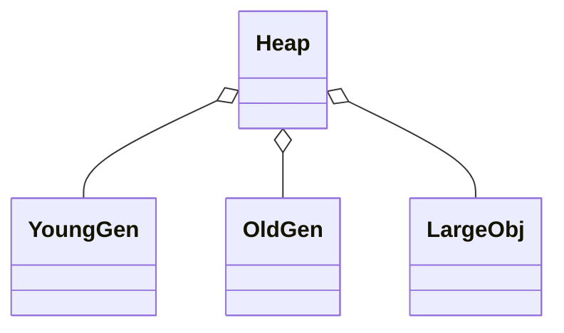

# ART GC 策略与暂停时间优化（深入）

## 原理

- 目标：在保证吞吐的同时控制暂停时间，避免用户可感知的卡顿。
- 策略：并发标记清除（CMS）、粘性标记清除（Sticky）、分代收集（Young/Partial/Full），按对象年龄与存活率选择收集范围。
- 机制：写屏障维护增量/并发标记正确性，根集扫描涵盖线程栈、JNI 全局引用、类静态字段等。
- 堆组织：新生代/老年代/大对象区分治，TLAB 快速分配，小对象先入新生代再晋升；大对象单独区域减少复制。
- 暂停拆解：Safepoint 停顿用于根快照，随后并发标记/清理；Full GC 需停顿更长时间，需通过容量/阈值与对象池减少触发。
- 写屏障类型：卡表/Remembered Set 记录跨代引用，确保并发标记期间新写入对象不会被遗漏。

### 触发条件与暂停拆解

- 触发：分配失败、堆达到阈值、晋升压力过大、大对象区占用过高。
- 暂停来源：根集快照、线程安全点、栈扫描与对象标记；并发阶段降低暂停但提升 CPU。

## 源码（线索）

- `art/runtime/gc/collector`：各收集器实现与调度。
- `art/runtime/gc/heap.cc`：堆组织、分配与阈值。
- `art/runtime/thread_list.cc`：根集扫描相关。
- `art/runtime/base`：栈与引用处理。

## 示例

### Kotlin：内存压力模拟与观测

```kotlin
suspend fun allocateBitmaps(n: Int): List<Bitmap> = withContext(Dispatchers.Default) {
  val r = mutableListOf<Bitmap>()
  repeat(n) { r.add(Bitmap.createBitmap(800, 600, Bitmap.Config.ARGB_8888)) }
  r
}
```

### Kotlin：对象池与重用

```kotlin
object Pool {
  private val q: ArrayDeque<ByteArray> = ArrayDeque()
  fun get(size: Int): ByteArray = (q.firstOrNull { it.size >= size } ?: ByteArray(size)).also { }
  fun put(buf: ByteArray) { q.addLast(buf) }
}
```

## 对比与取舍

- CMS vs Sticky：前者覆盖更广，暂停略长；后者针对新生代与增量修改，暂停更短。
- 并发 vs 停止世界：并发降低暂停但提高实现复杂度与 CPU 占用，需平衡。
- 大对象区独立管理减少碎片与拷贝成本。

## 时序图：并发标记清除



## 堆结构图



## 方法级细节与优化

- 触发阈值与回收粒度影响暂停；合理设置堆大小与图片缓存策略。
- 避免在动画与输入高频阶段触发完整收集；后台任务分批处理内存重活。
- JNI 引用泄漏与大对象分配是常见问题，应规范管理。

## 面试答题框架

- 解释收集器类型与目标，描述并发与写屏障作用。
- 给出堆组织与触发阈值对暂停的影响。
- 提供工程实践：对象池、图片管理、后台分批与观测方法。

## 统一 5 点面试框架（模板）

- 定义：GC 目标与暂停时间
- 原理：并发标记/写屏障/根集
- 方法：收集器触发与堆管理
- 实践：对象池与阶段性处理
- 性能/风险：触发时机与动画卡顿

## 源码片段（示意）

```cpp
// 伪代码：并发标记阶段
void ConcurrentMarking() {
  // 扫描根集
  ScanRoots();
  // 并发遍历引用图
  while (!mark_stack.empty()) {
    Object* obj = mark_stack.pop();
    for (auto ref : obj->References()) {
      if (!IsMarked(ref)) { Mark(ref); mark_stack.push(ref); }
    }
  }
}
```

```cpp
// 伪代码：写屏障
inline void WriteBarrier(Object* dst, Object* ref) {
  if (ConcurrentMarkingActive()) RememberSetAdd(dst);
  dst->SetField(ref);
}
```

## 自测题

- 为什么需要写屏障？答：保证并发标记期间对新写入引用的可达性记录，避免遗漏。
- Sticky 与 CMS 的暂停时间差异源于什么？答：覆盖范围不同与增量/并发策略差异。
- 哪些根集需扫描？答：线程栈、本地变量、JNI 全局引用、静态字段等。

## Android 15(API 35) 注意

- ART GC 细节可随 Mainline 更新变化，升级系统后需要重新采集 Perfetto/内存基准评估暂停时间。
- 大对象与图片：继续使用 Bitmap 池/硬件位图，避免在动画帧内创建/回收大对象；后台分批释放降低前台 GC 抖动。
