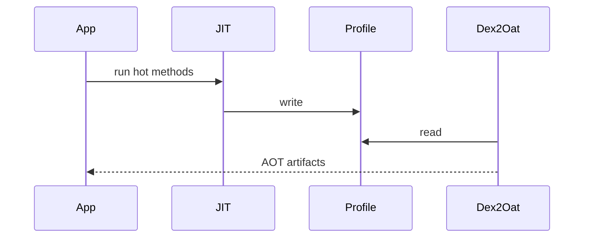
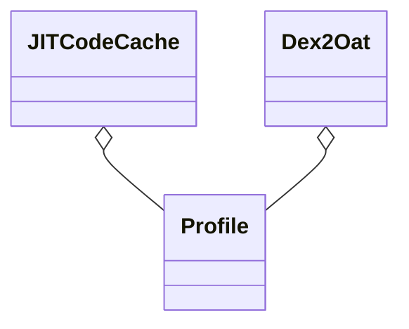

# Profile-Guided Compilation 实战（深入）

## 原理

- PGC 通过采集运行期 Profile，将冷/热/常用方法分类，并指导 AOT 优化关键路径；提升冷启动与交互性能。
- Baseline Profiles 在构建期提供一组静态路径，避免首次运行的解释开销。
- Profile 数据：记录方法/类的热度与调用轮廓，dex2oat 根据热度决定编译级别（解释/JIT/AOT）；运行期 Profile 与基线合并后决定最终编译集合。
- 编译策略：冷热分层，热路径 AOT 提前本地化，冷路径保持解释或轻量 JIT，平衡安装体积与运行性能。

## 源码（线索）

- `art/runtime/jit/jit_code_cache.cc`：热点方法收集与存储。
- `art/runtime/profile/profile.cc`：Profile 文件结构与合并。
- `art/dex2oat`：根据 Profile 进行目标编译输出。

## 示例

### Gradle 与 AndroidX Baseline Profiles

```groovy
plugins { id 'androidx.baselineprofile' }
android { defaultConfig { } }
baselineProfile { saveInSrc = true }
```

### Kotlin：关键路径采样与导出占位

```kotlin
object Startup {
  fun mark(name: String) {
    android.os.Trace.beginSection(name)
    android.os.Trace.endSection()
  }
}
```

## 对比与取舍

- 纯运行期采样 vs 基线：前者真实但首次性能欠佳；后者快速但需维护。
- 全量 AOT vs 选择性：选择性更节约资源并更贴近业务路径。

## 时序图：Profile 采集与应用



## 组件关系图



## 方法级细节与优化

- 控制 Profile 合并与清理，避免陈旧路径影响编译质量。
- 结合启动阶段埋点与页面热点路径，确保编译资源投入在收益最大的地方。

## 文件结构与规则示例（概览）

- 运行期 Profile（概念）：记录方法/类的热点信息与调用频度，用于指导 AOT；包含方法轮廓、类型引用等（概念字段）。
- 基线 Profile（文本规则）：按类与方法签名列出关键路径，示例：

```
Lcom/example/HomeActivity;->onCreate(Landroid/os/Bundle;)V
Lcom/example/Repo;->list()Ljava/util/List;
Lcom/example/UploadWorker;->doWork()Landroidx/work/ListenableWorker$Result;
```

## 合并与覆盖策略（概览）

- 合并：新采样叠加历史，按权重选取常用方法；避免陈旧路径长期保留。
- 覆盖更新：发布时将新的基线 Profile 随版本分发，安装后与运行期 Profile 协同。

### 源码路径

- `art/runtime/profile/profile.cc` 字段解析与合并逻辑
- `art/dex2oat` 读取 Profile 指导 AOT 的方法选择

## 自测题

- 基线 Profile 的作用是什么？答：在首次运行前为关键路径提供编译提示，减少解释/JIT 开销。
- 运行期与基线 Profile 如何协同？答：运行期采样真实热点，基线提供初始覆盖，最终共同指导 AOT。
- 为什么需要合并与清理？答：避免过时路径影响编译质量，保持资源聚焦在真实热点。

## 面试答题框架

- 解释 PGC 与 Baseline Profiles 的关系与适用场景。
- 源码线索与文件结构说明，描述编译应用时序。
- 工程实践：采样、导出、校验与回归评估。

## Android 15(API 35) 提示

- ART Mainline 下发的 Cloud Profile/编译器优化可能变化，升级后需重新生成/验证 Baseline Profiles 与基准测试。
- 设备侧 Profile 位置与合并逻辑保持兼容，但清理/覆盖策略应在每次大版本升级后重跑，避免陈旧路径影响新版本。
