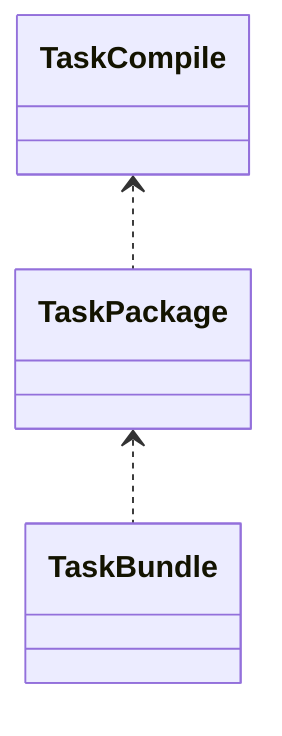

# Gradle/AGP 构建优化（深入）

## 原理

- 生命周期分层：初始化→配置→执行。只有配置阶段纯计算结果可以被 configuration-cache 复用；执行阶段依赖 inputs/outputs 判定 up-to-date 与增量。
- 任务输入输出声明：精确的 `@Input/@Output`/`Property` 声明让 Gradle 判断是否可跳过、增量或命中缓存；缺失声明会导致全量执行。
- Task Avoidance：`tasks.register` 懒创建、避免不必要的任务实例化；不被依赖的任务不会执行。
- 缓存体系：构建缓存（本地/远程）缓存任务产物；配置缓存缓存配置阶段的计算。缓存命中要求环境/参数一致，且不读取不确定外部状态。
- 并行与隔离：`org.gradle.parallel` 让无依赖的任务并行；Worker API 将 CPU/I/O 工作封装为可并行的隔离单元，减少主线程阻塞。

### 配置缓存失效源

- 动态读取项目状态或环境变量导致不可缓存；`afterEvaluate` 中修改任务属性破坏缓存。
- 自定义任务未声明 `@Input/@Output` 导致增量与缓存失效。

## 源码（线索）

- AGP 插件任务：`compile*`、`package*`、`bundle*`、`test*`
- Gradle 配置阶段与执行阶段（概览）

## 示例

### Gradle：开启缓存与并行

```properties
org.gradle.caching=true
org.gradle.parallel=true
org.gradle.configureondemand=true
```

### Gradle：配置缓存与守护进程

```properties
org.gradle.configuration-cache=true
org.gradle.daemon=true
```

## 对比与取舍

- KTS vs Groovy：KTS 更类型安全与可维护；Groovy 灵活但易产生隐式成本。
- 多模块 vs 单模块：多模块便于并行与隔离，但任务图复杂。

## 图表：任务依赖（示意）



## 方法级细节与优化

- 明确 `inputs/outputs` 与 `@CacheableTask`；自定义任务支持缓存。
- 减少 `afterEvaluate` 动态修改，避免配置缓存失效。
- 依赖最小化与版本锁定；避免传递依赖膨胀。

## 性能与瓶颈

- KAPT/KSP 注解处理成本高；按需启用与缓存。
- 多变体/多 ABI 构建导致任务爆炸；裁剪与按需构建。

## 面试答题框架

- 解释增量/并行/缓存与任务图优化。
- 提供 Gradle 参数与 AGP 任务实践。
- 指出注解处理、依赖与变体的治理方法。

## AGP 8.5/8.6 关键任务链（API 35 对应时代）

- 变体创建：`VariantManager` 构建变体模型 → `TaskManager` 注册编译/打包任务。
- Java/Kotlin 编译：`compile{variant}JavaWithJavac`、`compile{variant}Kotlin` → `kapt{variant}Kotlin`/`ksp{variant}Kotlin`。
- Dex/OAT：`merge{variant}Dex` → `package{variant}` 生成 APK/AAB；R8 后台 shrink/obfuscate。
- App Bundle：`bundle{variant}` 生成 AAB；`extractApks`/`bundletool` 设备拆分；Play 分发按设备特征下发。
- 资源：`mergeResources` → `processResources`（aapt2）→ `mergeAssets`；增量受资源变化粒度影响。

## 配置/执行时优化清单

- 配置阶段：避免 `afterEvaluate` 动态改任务；使用 `Provider`/`Property` API；开启 `configuration-cache` 并修复不兼容插件。
- 执行阶段：标注自定义任务为 `@CacheableTask`，声明 inputs/outputs；拆分大型任务为可增量子任务；依赖锁定减少下载/解压。
- CI 与远程缓存：启用 Gradle Enterprise/本地构建缓存；CI 与本地共享缓存目录；缓存失败时回退而非全量。

## Android 15(API 35) 发布注意

- 目标 SDK 需符合 API 35 行为变更（前台服务类型、权限、后台限制）；构建脚本中设置 `targetSdkVersion 35` 后回归测试。
- Play 上线：检查新敏感权限声明（如媒体可见性、通知）与 Data Safety 表达；Bundle 签名与 V4 方案保持最新。
