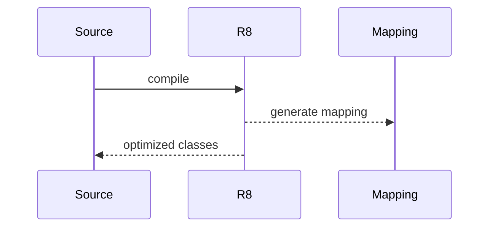

# R8 规则与反射保留（深入）

## 原理

- R8：代码压缩与优化（树摇/内联/重命名），相较 ProGuard 更高效。
- 反射保留：通过 `-keep` 规则确保运行时反射类/成员不被移除或重命名。
- 管线：解析字节码 → 应用 keep 规则 → 树摇删除未引用符号 → 内联/常量传播 → 重命名 → 输出 dex/映射；规则精度决定体积与兼容性。
- 兼容性：反射/序列化/注解处理依赖符号名称与属性，需通过 keep/keepattributes 保留；过宽规则增加体积，过窄会崩溃。

### 映射与规则管理

- `mapping.txt` 记录混淆前后映射；发布时保留以支持崩溃堆栈还原。
- 最小保留：仅保留反射路径所需的类与成员，避免体积膨胀。

## 源码（线索）

- R8 配置与映射文件（`mapping.txt`）
- 规则：`-keep/-keepclassmembers/-keepattributes` 等

## 示例

### 规则：保留注解与反射目标

```
-keep class com.example.model.** { *; }
-keepclassmembers class * {
  @com.squareup.moshi.JsonAdapter *;
}
-keepattributes *Annotation*, InnerClasses
```

### 规则：仅保留构造函数与指定方法

```
-keepclassmembers class com.example.Factory {
  public <init>(...);
  public static create(...);
}
```

## 对比与取舍

- 粗粒度 keep vs 精细保留：粗粒度安全但体积增大；精细保留需维护成本。
- 反射 vs 生成代码：生成代码避免 keep 负担与反射开销。

## 流程图（压缩流程示意）



## 方法级细节与优化

- 保留属性：`Signature`、`EnclosingMethod` 等影响反射与序列化。
- 依赖库的保留规则需合并，避免覆盖或冲突。

## 性能与瓶颈

- 过多 keep 导致体积与方法数上升；按需最小化。
- 反射路径的调用成本与混淆兼容问题。

## 面试答题框架

- 解释 R8 的作用与与 ProGuard 的差异；反射保留策略。
- 提供规则示例与工程化维护方法。
- 指出体积控制与反射的性能权衡。

## 调用链与验证

- 构建：`R8Task` 在编译阶段执行 shrink/obfuscate → 生成 `mapping.txt` 与优化产物。
- 规则解析：R8 解析 `-keep/-assumenosideeffects` 等规则，决定移除/重命名/保留。
- 反射路径验证：结合 `-whyareyoukeeping` 分析规则影响；使用自动化测试覆盖反射入口。

## Android 15(API 35) 发布提示

- 目标 SDK 35 后权限/前台服务声明更严格，R8 混淆不影响但需确保 Data Safety 与权限文档匹配；敏感权限相关类若通过反射访问需 keep。
- 若使用 Play Feature Delivery/分拆模块，确保各模块的 keep 规则合并正确，避免动态加载类被移除。
