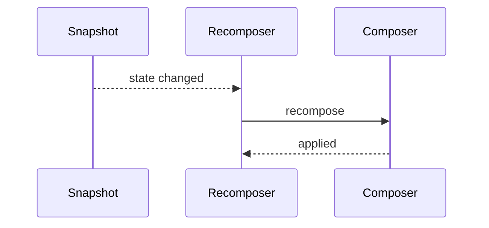
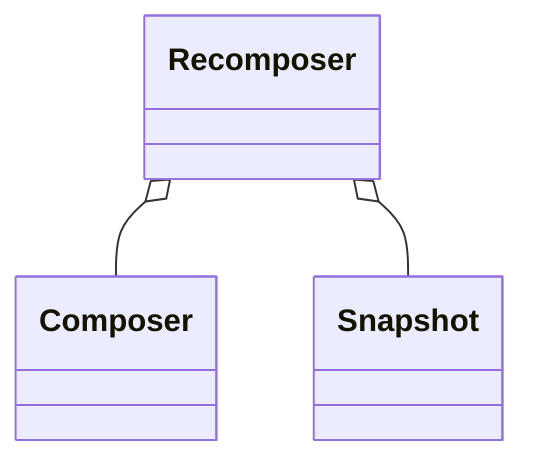

# Compose 重组与状态（深入）

## 原理

- 快照系统：状态读取与写入通过快照跟踪，触发受影响的 Composable 重组。
- 稳定性：类型稳定（Stable）减少不必要重组；不可变与等值判断是关键。
- 关键 API：`remember`、`derivedStateOf`、`mutableStateOf`、`LaunchedEffect`、`DisposableEffect`。
- 运行时结构：`Composer` 维护 SlotTable 记录 UI 树形与组界限；`Recomposer` 监听快照脏集，在帧或信号到来时触发重组；`Applier` 将变更应用到真实 UI（View/RenderNode）。
- 脏集与匹配：`startGroup/endGroup` 标记组边界，`key` 与稳定性用于节点匹配；状态写入记录读集，下一轮仅重组受影响组。
- 渲染耦合：重组生成的 UI 变更交给布局/绘制流水线（`measure/layout/draw`），重组频率与渲染性能耦合，需控制粒度与稳定数据模型。

### 快照系统内部数据流

- 状态写入触发快照变更，`Recomposer` 收集受影响的读集并安排重组；`Composer` 应用变更并生成新的 UI 层次。

## 源码（线索）

- `Recomposer`、`Snapshot`、`Composer`（概览级）
- 状态读取与快照订阅关系

## 示例

### Kotlin：状态提升与避免过度重组

```kotlin
@Composable
fun Counter() {
  var count by remember { mutableStateOf(0) }
  Button(onClick = { count++ }) { Text("$count") }
}
```

### Kotlin：derivedStateOf 降低计算成本

```kotlin
val bigList = remember { mutableStateListOf<Int>() }
val even by remember { derivedStateOf { bigList.filter { it % 2 == 0 } } }
```

## 对比与取舍

- 状态局部 vs 提升：局部便捷，提升利于共享与测试；按数据流选择。
- remember vs rememberSaveable：后者支持进程/配置变更恢复，成本更高。

## 时序图：重组触发



## 类关系图



## 方法级细节与优化

- 减少在 `@Composable` 中创建对象；使用 `remember` 缓存。
- 细粒度状态拆分，避免父级重组影响整树。
- 使用 `LazyColumn` 的 `key` 保持稳定项，配合 `immutable` 数据模型。

## 可运行示例与验证

```kotlin
@Composable
fun RecomposeCounter() {
  var count by remember { mutableStateOf(0) }
  var recomposes by remember { mutableStateOf(0) }
  SideEffect { recomposes++ }
  Column {
    Text("recomposes=$recomposes")
    Button(onClick = { count++ }) { Text("$count") }
  }
}
```

- 验证步骤：
  - 点击按钮观察 `recomposes` 增长，评估重组次数
  - 将部分计算移入 `derivedStateOf`，比较重组次数与耗时变化

### 预期输出

- 每次点击触发重组计数递增；将重计算放入 `derivedStateOf` 后，重组次数相对下降或耗时降低。

### 常见失败原因

- 在 `@Composable` 中创建大量短生命周期对象未使用 `remember` 缓存导致过度重组。
- 共享状态未拆分，父级状态变化引发整树重组。

## 性能与瓶颈

- 大量重组导致帧掉失；监控重组次数与耗时。
- 复杂 Modifier 链增加测量成本；合并与复用。

## 最佳实践

- 稳定数据模型与不可变集合，减少等值变化引发的重组。
- 细粒度状态拆分与局部重组，避免父级牵连整树。
- `remember/derivedStateOf` 合理使用，降低重计算开销。

## 面试答题框架

- 解释快照与重组机制；稳定性与不可变数据作用。
- 给出状态提升/保存与优化策略；示例展示。
- 指出常见瓶颈与监控方法。

## 重组调用链与源码脉络

- `Recomposer.runRecomposeAndApplyChanges`：收集 `Snapshot` 脏集，驱动 `applyChanges`。
- `MonotonicFrameClock` → `Recomposer#awaitWorkAvailable`：在帧或快照变更时唤醒重组。
- `Composer#recompose` → `SlotTable` 游标对比 → `Applier` 应用 UI 变更；`remember`/`key` 影响节点匹配。
- 稳定性判定：编译器插件为 `@Composable` 插入稳定性检查，`Stable`/`Immutable` 避免不必要重组。
- 渲染路径：`androidx.compose.ui.platform.AndroidComposeView` 收到变更 → `measure/layout/draw` → `RenderNode`/`DisplayList`。

## 编译器与运行时细节（1.7.x）

- Compose Compiler 1.5.x 为 1.7.x 生成 Group/Slot 标记与稳定性元数据，低版本编译器将导致运行时报错。
- IR 插桩：`ComposableLambdaImpl` 保存参数快照，`recomposeScope.invalidate()` 标记脏区；`startGroup/endGroup` 用于对比。
- 运行时快照：`SnapshotMutableStateImpl` 记录读/写集；`Snapshot` 合并策略决定是否触发重组。
- Lazy 系列：`LazyListItemProvider` + `LazyLayoutMeasureScope` 支撑按需测量，`itemKey`/`contentType` 保持稳定性与回收。

## Android 15 / Compose 1.7.x 行为与迁移提示

- API 35 对 Compose 无额外限制，但需要适配新的前台服务/权限变更（如通知权限、媒体权限），避免在重组中发起受限操作。
- 依赖升级：同步 Compose BOM 到 1.7.x 且确保编译器与 Kotlin 版本匹配官方矩阵；升级后重跑基准测试关注重组次数与测量耗时变化。
- 硬件加速/RenderThread 在 API 33+ 默认稳定，API 35 上仍建议保持 GPU 友好（减少过度绘制/合成层）。
