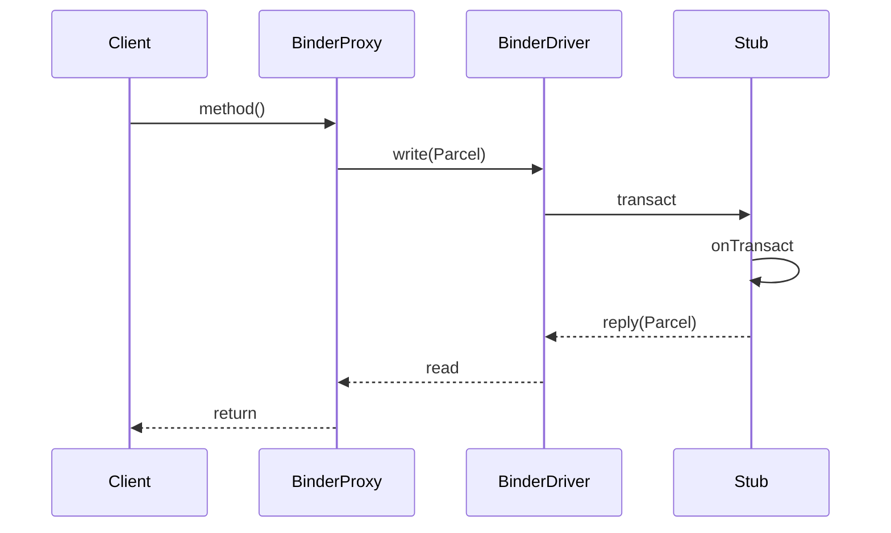
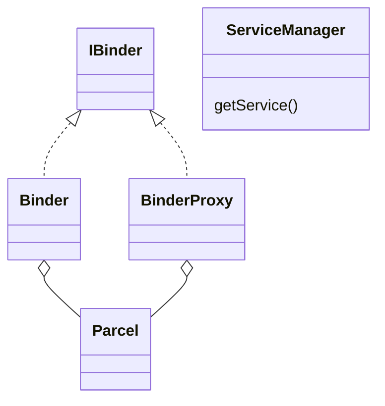

# Binder 原理与实现（深入）

## 原理

- Binder 是 Android 的 IPC 机制，用户态通过 `IBinder` 接口与代理对象完成跨进程调用；内核态由 Binder 驱动维护进程间的事务队列与引用计数。
- 组成：`BinderProxy`（客户端代理）、`Binder`/`Stub`（服务端）、`Parcel`（序列化容器）、`ServiceManager`（服务注册与查找）。
- 流程概览：客户端通过代理封装方法调用为 `Parcel`，经 `/dev/binder` 写入到内核队列，驱动唤醒服务端线程读取并执行，返回结果再回传到客户端。
- 设计目标：零拷贝优化、强类型接口、稳定的引用管理与安全的跨进程边界。
- 内核职责：维护 per-process 待处理事务队列、引用计数（strong/weak）、死亡通知；调度 Binder 线程池以消费事务。
- 内存与性能：数据通过内核共享内存页映射实现近似零拷贝；大对象应传递文件描述符或共享内存，避免复制占用。
- 线程模型：服务端 Binder 线程池有限，耗时逻辑应切到业务线程；`ONEWAY` 异步调用避免客户端等待但需幂等。

### 数据结构与算法逻辑

- 驱动队列：每进程维护事务队列与死亡通知，跨进程传输通过 `binder_transaction` 结构组织。
- 引用计数：Binder 引用与强/弱引用维护对象生命周期，避免悬挂引用。
- 事务标志：`ONEWAY` 表示单向异步调用，客户端不等待返回，适合通知类调用。

### 核心调用链

- 客户端：`transact()` → 驱动写入 → 服务端唤醒 → `onTransact()`
- 线程池上限与调度：服务端 Binder 线程池有上限，需避免长耗时阻塞。

### 安全模型

- SELinux 与权限校验：系统服务注册与访问受策略控制，避免越权调用。

## 源码（线索）

- 用户态 Java：`frameworks/base/core/java/android/os/IBinder.java`、`Binder.java`、`BinderProxy.java`、`Parcel.java`
- Native 层：`frameworks/native/libs/binder`（`BpBinder`、`BBinder`、`Parcel`、`ProcessState`、`IPCThreadState`）
- 内核：`drivers/android/binder.c`（事务队列、引用计数、线程池唤醒）
- 服务发现：`ServiceManager` 与 `handle` 管理；系统服务在 `system_server` 注册。

## 示例

### AIDL 与 Messenger 对比示例（Kotlin）

```kotlin
// AIDL: 强类型接口
interface IAccount : android.os.IInterface {
  fun getUser(id: String): String
}

// Messenger: 基于 Message 的弱类型通信
class MsgHandler(looper: Looper) : Handler(looper) {
  override fun handleMessage(msg: Message) {
    if (msg.what == 1) { val data = msg.data.getString("id") }
  }
}
```

### 服务端注册与客户端获取（Kotlin）

```kotlin
// 服务端在 system_server 注册服务
class AccountService : Binder(), IAccount {
  override fun getUser(id: String): String = id
}

// 客户端通过 ServiceManager 查找
val binder = android.os.ServiceManager.getService("account")
val proxy = IAccount.Stub.asInterface(binder)
val name = proxy.getUser("42")
```

## 对比与取舍

- AIDL：强类型、编译期生成 Stub/Proxy，性能与安全较优；适合稳定接口。
- Messenger：轻量，易与 Handler 生态结合；弱类型，消息协议需谨慎定义。
- ContentProvider：更适合数据共享与查询场景；语义与安全模型不同。

## 时序图（跨进程调用）



## 组件关系图



## 方法级细节

- `Binder#onTransact(int code, Parcel data, Parcel reply, int flags)`：服务端分发入口。
- `BinderProxy#transactNative(int code, Parcel data, Parcel reply, int flags)`：客户端发起事务。
- `Parcel#write* / read*`：序列化基础类型与 Binder 对象引用。
- `IPCThreadState::transact`：Native 调用链封装与驱动交互。

## 性能与瓶颈

- 频繁小对象传输提升系统调用与队列压力；应合并调用或批量传输。
- 大数据传输建议共享内存或文件描述符方式减少拷贝。
- 线程池与唤醒策略影响延迟；服务端应避免耗时阻塞在 Binder 线程。

## 面试答题框架

- 解释用户态/内核态角色与事务流转；给出 `onTransact`/`transact` 关键方法。
- 对比 AIDL/Messenger/Provider 的适用场景与优劣。
- 指出性能优化点：批量、共享内存、线程模型与安全校验。

## 统一 5 点面试框架（模板）

- 定义：场景与问题边界
- 原理：机制与关键数据结构
- 方法：核心类/方法调用链
- 实践：工程化落地与示例
- 性能/风险：优化点与坑位

## 源码片段（示意）

```java
// Binder 服务端分发入口
@Override
public boolean onTransact(int code, Parcel data, Parcel reply, int flags) {
  switch (code) {
    case TRANSACTION_getUser: {
      String id = data.readString();
      String ret = this.getUser(id);
      reply.writeString(ret);
      return true;
    }
  }
  return super.onTransact(code, data, reply, flags);
}
```

```java
// 客户端代理发起事务（示意）
public String getUser(String id) throws RemoteException {
  Parcel data = Parcel.obtain();
  Parcel reply = Parcel.obtain();
  try {
    data.writeString(id);
    mRemote.transact(TRANSACTION_getUser, data, reply, 0);
    return reply.readString();
  } finally {
    data.recycle();
    reply.recycle();
  }
}
```

## 调用链更细粒度（含 Native）

- Java 客户端：`BinderProxy#transact` → JNI `android_os_BinderProxy_transact` → `IPCThreadState::transact`。
- Native 客户端：`BpBinder::transact` → `IPCThreadState::transact` → `/dev/binder`。
- 内核：`binder_ioctl` 处理 `BC_TRANSACTION/BC_REPLY`，维护事务栈与引用计数。
- 服务端：`binder_thread_read` 唤醒 Binder 线程 → `IPCThreadState::executeCommand` → `onTransact` → 返回结果。
- 线程池：`ProcessState::self()->startThreadPool()` 限制最大线程数，耗时任务应切到业务线程避免阻塞 Binder 线程。

## Android 15(API 35) 注意

- Binder 线程池与调度模型保持稳定；主线 ART/Framework 通过 Mainline 更新 Binder 驱动用户态库，保持兼容但建议避免过大事务（>1MB 仍被拒绝）。
- 前台服务与权限收紧：跨进程调用系统服务时需匹配声明权限与 SELinux 策略，避免在后台进程频繁同步调用造成延迟或被限流。
## 自测题

- 事务流从 `transact` 到 `onTransact` 的关键环节是什么？答：代理写入 Parcel → 驱动入队 → 服务端唤醒 → onTransact 读取 → 回复。
- 何时应选择共享内存或 FD 传输？答：当数据量较大或频繁传输时减少拷贝。
- AIDL 与 Messenger 的主要差异与各自适用场景？答：强类型 RPC vs 基于 Message 的弱类型通信。
