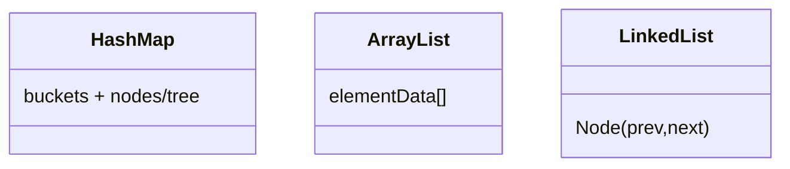

# Java 集合源码与性能（深入）

## 原理

- HashMap：数组 + 链表/红黑树（JDK 8+），按 `hash(key)` 定位桶；高负载因子触发扩容与 rehash。链表树化触发：桶内元素数量超过阈值且数组容量达到最小树化容量时转为红黑树。
- ArrayList：动态数组，按容量倍增；`ensureCapacity` 避免频繁扩容。
- LinkedList：双向链表；插入/删除 O(1) 相对稳定，随机访问 O(n)。
- 负载与扩容：默认负载因子 0.75 在空间与冲突间折衷；提前预估容量减少 rehash 抖动与内存碎片。
- 访问顺序：HashMap 无序，LinkedHashMap 维护插入/访问顺序，适合 LRU；选择容器需结合访问模式。

### 数据结构与算法逻辑

- HashMap `hash()`：高位参与扰动，减少碰撞；`resize()`：新表容量为原容量的倍增，节点按位再分配（低位/高位）。
- 红黑树：插入/删除保持近似平衡，旋转与颜色翻转保证性质；树化/反树化维护性能与空间。
- Fail-Fast 迭代器：结构修改计数 `modCount` 变化时抛出 `ConcurrentModificationException`。

### 核心调用链

- `put()` → `putVal()` → 桶命中（链/树）→ 可能 `resize()` 或 `treeifyBin()`
- `get()` → `getNode()` → 桶查找（链遍历或树查找）

### 设计权衡与性能影响

- 树化减少链表退化 O(n) 的风险，但在小桶上维护树结构有额外开销。
- 扩容成本包括数组拷贝与节点再分配；预估容量可显著降低抖动。

### 源码路径

- `java.util.HashMap#putVal/getNode/treeifyBin/resize`
- `java.util.LinkedHashMap#accessOrder`

### 对比补充：ConcurrentHashMap

- 分段/桶锁与 CAS 协作扩容；弱一致性迭代；在高并发场景优于加锁的 HashMap。

## 源码（线索）

- `java.util.HashMap`：`putVal/getNode/treeifyBin/resize`、`Node`/`TreeNode`
- `java.util.ArrayList`：`grow/add/ensureCapacity`、`elementData`
- `java.util.LinkedList`：`linkLast/unlink`、`Node`

## 示例

```java
// HashMap 树化阈值影响性能
Map<Integer, String> m = new HashMap<>();
for (int i = 0; i < 100000; i++) m.put(i, "v" + i);
System.out.println(m.get(42));
```

```java
// ArrayList 预分配减少扩容
List<String> list = new ArrayList<>(1000);
```

## 对比与取舍

- HashMap vs LinkedHashMap：前者无序，后者维护插入或访问顺序，适合 LRU 场景。
- ArrayList vs LinkedList：前者随机访问快；后者插入删除稳定但迭代更优。

## 图表



## 性能与瓶颈

- HashMap 冲突与退化链表影响性能；合理选择 key 的 `hashCode/equals`。
- 扩容成本：ArrayList/HashMap 扩容伴随内存拷贝与 rehash；预估容量减少抖动。

## 面试答题框架

- 定义：集合结构与适用场景
- 原理：底层数据结构与扩容机制
- 方法：核心方法调用链（`put/get/resize`）
- 实践：预分配与顺序维护策略
- 性能/风险：冲突、扩容与迭代成本

## 调用链与补充细节

- HashMap 插入：`put` → `putVal` → 桶查找/树化 → 可能触发 `resize`；扩容时节点分拆为低位/高位链。
- 扩容策略：负载因子默认 0.75，`threshold = capacity * loadFactor`；预估容量 `new HashMap<>((int)(n/0.75)+1)`。
- ArrayList：`add` → `ensureCapacityInternal` → `grow`（1.5x 扩容）；`toArray` 复制成本需关注。
- ConcurrentHashMap：`putVal` 使用 CAS 与节点锁，`transfer` 渐进式扩容，线程安全下避免全表锁。

## Android 相关提示

- ART/Android SDK 仍基于 OpenJDK 的集合实现；移动端内存更敏感，预估容量可显著减少 GC。
- 避免在热路径创建临时集合；可复用 `ArrayMap/SparseArray` 等 Android 优化容器处理 int/long key。
