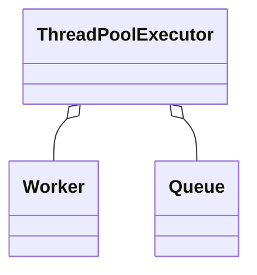

# Java 并发与线程池（深入）

## 原理

- 线程与可见性：`volatile` 保证可见性与一定的有序性（禁止重排序），`synchronized`/`Lock` 提供互斥与进入/退出的内存屏障语义。
- 线程池：`ThreadPoolExecutor` 由核心/最大线程、队列、拒绝策略构成；任务提交与执行生命周期包括添加 Worker、运行 Worker、回收/终止。
- 有序性/原子性：Happens-Before 规则决定读写顺序的可见性；CAS 提供无锁原子更新基础。
- 线程池调度：核心线程数决定并发度，队列类型决定排队策略，最大线程用于高峰回退；拒绝策略保障过载时的退路。
- 锁实现：`ReentrantLock` 通过 AQS 队列维护获取/释放；公平与非公平影响吞吐与饥饿。

### 数据结构与算法逻辑

- Happens-Before：锁释放先于同一锁后续获取、写入 `volatile` 先于后续读取、线程启动与终止的有序关系。
- 队列选择：`SynchronousQueue`（直接移交，适合高吞吐低排队）、`LinkedBlockingQueue`（无界/有界链式）、`ArrayBlockingQueue`（有界数组，固定容量与更稳定内存）。

### 核心调用链

- `execute()` → `addWorker()` → `runWorker()`（循环从队列取任务执行）→ `processWorkerExit()`
- `ReentrantLock#lock/unlock` → 公平/非公平获取路径，条件队列 `Condition#await/signal`。

### 设计权衡与性能影响

- 队列有界更安全但需要拒绝策略；无界队列可能导致延迟与内存膨胀。
- 公平锁减少饥饿但吞吐较低；非公平锁吞吐高但可能倾斜。

### 源码路径

- `java.util.concurrent.ThreadPoolExecutor#execute/addWorker/runWorker`
- `java.util.concurrent.locks.ReentrantLock#lock/unlock`

## 源码（线索）

- `java.util.concurrent.ThreadPoolExecutor`：`execute/addWorker/runWorker`、`RejectedExecutionHandler`
- `java.util.concurrent.locks.ReentrantLock`：`lock/unlock`、公平与非公平实现
- `java.util.concurrent` 原子类：`AtomicInteger/Long/Reference`

## 示例

```java
ExecutorService es = new ThreadPoolExecutor(
  2, 4, 60, TimeUnit.SECONDS,
  new LinkedBlockingQueue<>(100),
  new ThreadPoolExecutor.CallerRunsPolicy()
);
es.submit(() -> System.out.println(Thread.currentThread().getName()));
```

```java
class Counter { private volatile int v; synchronized void inc(){ v++; } }
```

## 对比与取舍

- `synchronized` vs `ReentrantLock`：前者简单，后者支持可中断、公平锁、条件队列；按场景选择。
- 队列：有界 vs 无界；有界更安全但需拒绝策略。

## 图表



## 性能与瓶颈

- 过大队列导致延迟与资源占用；拒绝策略需明确可回退路径。
- 锁竞争与热点同步：拆分、减少临界区、使用原子类或无锁结构。

## 面试答题框架

- 定义：并发问题与线程池模型
- 原理：内存语义与执行生命周期
- 方法：核心方法与拒绝策略
- 实践：参数设计与监控
- 性能/风险：锁与队列权衡

## 调用链与源码细节

- 提交：`ThreadPoolExecutor.execute` → `addWorker` 决定新建线程或入队。
- 执行：`Worker.run` → `runWorker` 循环从队列取任务；异常处理后返回池。
- 关闭：`shutdown` 设置状态并中断空闲工作线程；`shutdownNow` 试图中断正在运行线程并返回未执行任务。
- 锁：`ReentrantLock` 公平/非公平两条获取路径；`Condition` 实现等待/通知。
- 原子类：`Unsafe.compareAndSwap` 支撑 CAS；`LongAdder`/`Striped64` 降低竞争。

## 工程提示（Android 场景）

- 避免在主线程使用阻塞锁/长任务；UI 线程应使用 Handler/协程切换到后台。
- 与 WorkManager/JobScheduler 协作：长任务放入系统调度，线程池仅处理应用进程存活期内的计算。
