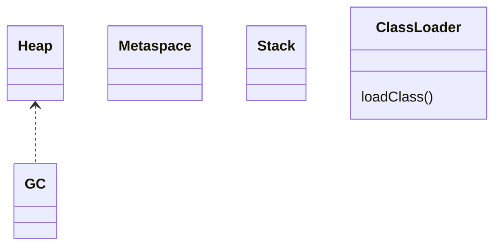

# JVM 内存模型/GC/类加载（深入）

## 原理

- 内存模型：堆/方法区（元空间）/栈/本地方法栈；对象分配与逃逸分析影响栈上分配。
- GC：分代收集、标记-清除/压缩、并发收集器（如 G1）；暂停时间与吞吐权衡。卡表（Card Table）与 Remembered Set 用于跨代引用记录，降低全堆扫描成本。
- 类加载：双亲委派，`ClassLoader` 逐级委派查找；解析（符号引用→直接引用）、链接与初始化阶段的严格顺序。
- 分配与晋升：新生代快速分配（TLAB），存活对象晋升老年代；晋升失败/空间不足触发 Full GC。
- Safepoint 与屏障：GC 在 Safepoint 暂停线程以保证一致性；写屏障记录跨代引用或并发标记期间的变更。
- 初始化时机：类在首次主动使用时触发 `<clinit>`；反射/ServiceLoader 可能隐式触发类加载与初始化。

### 数据结构与算法逻辑

- G1 分区（Region）与回收集选择；并发标记的根集识别与写屏障记录。
- 类加载流程：加载→验证→准备→解析→初始化；打破双亲委派可能引起类可见性与安全风险。

### 核心调用链

- `ClassLoader#loadClass` → 委派父加载器 → 自身 `findClass`
- GC 触发路径：分配失败/阈值触发 → 标记阶段 → 清除/压缩 → 晋升策略。

### 设计权衡与性能影响

- 收集器选择影响暂停与吞吐：G1 对大堆可控暂停更优；CMS 已逐步退出。
- 反射/类加载的热路径应缓存或预热，避免首次调用延迟。

### 源码路径

- OpenJDK HotSpot：`gc/g1/*`、`classfile/*`（概览）
- `java.lang.ClassLoader#loadClass/findClass`

## 源码（线索）

- OpenJDK HotSpot：`src/hotspot`（概览），GC 收集器与类加载子系统
- `java.lang.ClassLoader`：`loadClass/findClass`

## 示例

```java
ClassLoader cl = new URLClassLoader(new URL[]{ new URL("file:/plugins/") });
Class<?> c = cl.loadClass("com.example.Plugin");
```

```java
// 建议：减少逃逸与短生命周期对象，降低 GC 压力
```

## 对比与取舍

- CMS/G1：G1 更适合大堆与可控暂停；CMS 已逐步退出。
- 双亲委派 vs 自定义打破：安全与稳定 vs 插件化灵活性。

## 图表



## 性能与瓶颈

- 暂停时间与吞吐：收集器选择与参数调优。
- 类加载与反射成本：缓存与预热，避免热路径反射。

## 面试答题框架

- 定义：内存区域与对象生命周期
- 原理：收集器与双亲委派
- 方法：`loadClass` 与 GC 触发
- 实践：逃逸分析/预热与缓存
- 性能/风险：暂停时间与隔离问题

## 调用链与实现细节

- 类加载：`ClassLoader#loadClass` → 父委派 → `findClass` 解析字节码 → `defineClass` → `resolveClass`；初始化在首次主动使用时触发。
- GC 触发：分配失败/阈值触发 → `VMThread` 触发 Safepoint → 标记根集 → 清理/压缩 → 晋升/回收。
- 写屏障：G1/分代写屏障在引用写入时记录卡表，降低跨代扫描成本。
- 逃逸分析：JIT/编译器判断对象未逃逸可做栈上分配/锁消除。

## Android/ART 提示

- Android 使用 ART 而非 HotSpot，但概念类似：堆/栈/元数据、JIT/AOT/GC；ART Mainline 可更新收集器与编译器。
- 反射/类加载在移动端性能敏感：避免热路径反射，必要时使用生成代码/缓存 Class 对象。
- 混淆与 keep 规则：确保反射/序列化的类与字段在 R8/Proguard 中保留，避免运行期崩溃。
