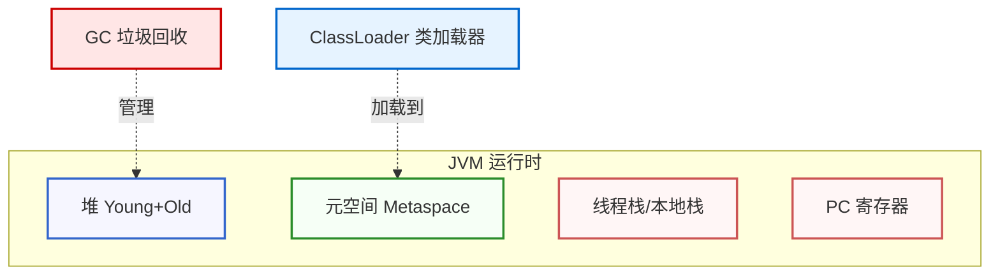
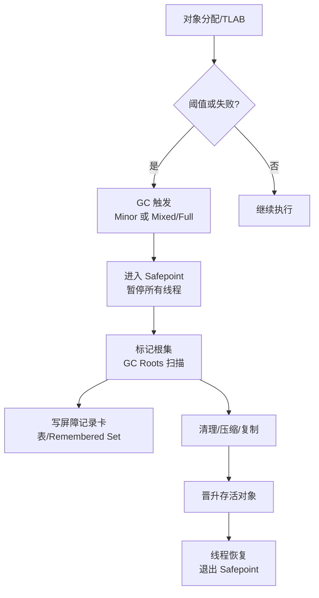
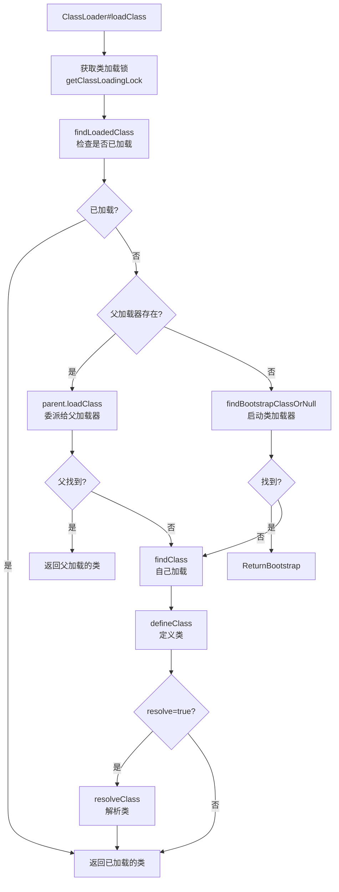

# JVM 内存模型 / GC / 类加载（深入提升版）

这份指南旨在通过可视化图表、源码级深度分析和实战场景，帮助你彻底掌握 JVM 的内存管理、垃圾回收机制和类加载体系。我们将深入探讨 Java 内存模型（JMM）、GC 算法实现、Safepoint 机制、类加载源码流程等核心原理。

## 0. 总览与可视化



## 1. Java 内存模型（JMM）深度解析

Java 内存模型（Java Memory Model, JMM）定义了多线程环境下，共享变量的可见性、有序性和原子性规则。它是 Java 并发编程的理论基础。

### 1.1 核心概念：happens-before 规则

happens-before 是 JMM 的核心，它定义了**可见性保证**：如果操作 A happens-before 操作 B，那么 A 的结果对 B 可见。

#### 八大 happens-before 规则

1. **程序顺序规则**：同一线程内，书写在前面的操作 happens-before 书写在后面的操作（但允许重排序，只要不影响单线程语义）。
2. **volatile 规则**：对 volatile 变量的写操作 happens-before 后续对该变量的读操作。
3. **监视器锁规则**：对一个锁的解锁 happens-before 后续对该锁的加锁。
4. **线程启动规则**：`Thread.start()` happens-before 该线程的任意操作。
5. **线程终止规则**：线程中的所有操作 happens-before 其他线程检测到该线程已终止（如 `Thread.join()` 返回）。
6. **线程中断规则**：对线程 `interrupt()` 的调用 happens-before 被中断线程检测到中断事件。
7. **对象终结规则**：对象的构造函数执行结束 happens-before `finalize()` 方法的开始。
8. **传递性**：如果 A happens-before B，B happens-before C，那么 A happens-before C。

```java
// 示例：volatile 的 happens-before 保证
class VolatileExample {
    private volatile boolean flag = false;
    private int value = 0;
    
    // 线程 A
    void writer() {
        value = 42;        // 1. 普通写
        flag = true;       // 2. volatile 写
    }
    
    // 线程 B
    void reader() {
        if (flag) {        // 3. volatile 读（happens-before 保证）
            // 这里一定能看到 value = 42
            // 因为规则 2：volatile 写 happens-before volatile 读
            // 规则 1：程序顺序，value = 42 happens-before flag = true
            // 规则 8：传递性，value = 42 happens-before 这里的读
            System.out.println(value); // 输出 42
        }
    }
}
```

### 1.2 volatile 语义深度解析

`volatile` 关键字提供了两个核心保证：

#### 可见性保证
- 对 volatile 变量的写会**立即刷新到主内存**，并**使其他 CPU 缓存失效**。
- 对 volatile 变量的读会**从主内存读取最新值**，而不是使用本地缓存。

#### 禁止重排序
volatile 通过**内存屏障（Memory Barrier）**禁止编译器与 CPU 的重排序。

```java
// 内存屏障示例（概念示意，实际由 JVM 插入）
volatile int x = 0;
int y = 0;

void write() {
    y = 1;           // 普通写
    // StoreStore Barrier（volatile 写前）
    x = 1;           // volatile 写
    // StoreLoad Barrier（volatile 写后，最重）
}

void read() {
    int localX = x;  // volatile 读
    // LoadLoad Barrier（volatile 读后）
    // LoadStore Barrier（volatile 读后）
    int localY = y;  // 普通读
}
```

**四种内存屏障**：
- **LoadLoad**：确保 Load1 在 Load2 之前完成
- **StoreStore**：确保 Store1 在 Store2 之前完成
- **LoadStore**：确保 Load1 在 Store2 之前完成
- **StoreLoad**：最重，确保 Store1 在 Load2 之前完成（volatile 写后通常插入此屏障）

**CPU 层面实现**（x86 为例）：
- x86 的 `mfence` 指令相当于 StoreLoad 屏障
- `lock` 前缀指令（如 `lock addl $0,0(%%rsp)`）也能实现内存屏障效果

### 1.3 synchronized 内存语义

`synchronized` 不仅提供互斥，还提供内存可见性保证。

```java
// synchronized 的内存语义
class SyncExample {
    private int x = 0;
    private final Object lock = new Object();
    
    void writer() {
        synchronized (lock) {
            x = 42;  // 临界区内的写
        }
        // 释放锁时：所有在临界区内的写操作都会刷新到主内存
        // 相当于插入 StoreStore + StoreLoad 屏障
    }
    
    void reader() {
        synchronized (lock) {
            // 获取锁时：清空本地缓存，从主内存读取最新值
            // 相当于插入 LoadLoad + LoadStore 屏障
            System.out.println(x); // 一定能看到 42
        }
    }
}
```

**字节码层面**：
```java
// 编译后的字节码（简化）
monitorenter    // 获取锁，插入内存屏障
// ... 临界区代码 ...
monitorexit     // 释放锁，插入内存屏障
```

### 1.4 final 字段的可见性保证

`final` 字段在构造函数中赋值后，对**所有线程可见**，无需同步。

```java
class FinalExample {
    private final int x;
    private int y;  // 非 final
    
    FinalExample(int value) {
        y = value;      // 可能被重排序到构造函数外
        x = value;      // final 写，不会被重排序到构造函数外
    }
    
    void reader() {
        // 如果对象已完全构造（构造函数执行完毕），
        // 这里一定能看到 x 的最终值，但 y 可能看到 0（未初始化）
        System.out.println(x); // 安全
        System.out.println(y); // 可能不安全
    }
}
```

**初始化安全性**：JMM 保证，只要对象引用对线程可见，且对象已完全构造，那么该对象的所有 final 字段的值对线程可见。

### 1.5 指令重排序详解

#### as-if-serial 语义
单线程内，只要不影响程序结果，编译器和 CPU 可以任意重排序。

```java
int a = 1;
int b = 2;
int c = a + b;  // c 依赖 a 和 b，不能重排序到 a、b 之前
```

#### 数据依赖与控制依赖
- **数据依赖**：后一条指令依赖前一条指令的结果，不能重排序。
- **控制依赖**：条件分支后的指令依赖条件判断，可能被重排序（CPU 分支预测）。

```java
// 可能被重排序的示例
int x = 0;
boolean flag = false;

void writer() {
    x = 42;        // 1
    flag = true;   // 2：可能被重排序到 1 之前（单线程不影响结果）
}

void reader() {
    if (flag) {    // 3
        // 如果 1 和 2 被重排序，这里可能看到 x = 0
        System.out.println(x);
    }
}
```

**解决方案**：使用 `volatile` 或 `synchronized` 禁止重排序。

### 1.6 原子操作：CAS 原理

CAS（Compare-And-Swap）是 CPU 提供的原子操作，Java 通过 `Unsafe` 类调用。

```java
// CAS 的伪代码实现（概念）
public final boolean compareAndSet(int expect, int update) {
    // 原子操作：如果当前值 == expect，则更新为 update，返回 true
    // 否则返回 false
    return unsafe.compareAndSwapInt(this, valueOffset, expect, update);
}
```

**CPU 指令层面**（x86）：
```assembly
lock cmpxchg [内存地址], 新值
; lock 前缀确保原子性，cmpxchg 是比较并交换指令
```

**Atomic 类的实现**：
```java
// AtomicInteger 的部分实现
public class AtomicInteger {
    private static final Unsafe unsafe = Unsafe.getUnsafe();
    private static final long valueOffset;
    
    static {
        try {
            valueOffset = unsafe.objectFieldOffset
                (AtomicInteger.class.getDeclaredField("value"));
        } catch (Exception ex) { throw new Error(ex); }
    }
    
    private volatile int value;  // 用 volatile 保证可见性
    
    public final int getAndIncrement() {
        return unsafe.getAndAddInt(this, valueOffset, 1);
        // 内部使用 CAS 循环，直到成功
    }
}
```

### 1.7 双重检查锁定（DCL）的正确实现

**错误实现**（可能看到未完全初始化的对象）：
```java
class Singleton {
    private static Singleton instance;  // 错误：没有 volatile
    
    public static Singleton getInstance() {
        if (instance == null) {              // 第一次检查
            synchronized (Singleton.class) {
                if (instance == null) {      // 第二次检查
                    instance = new Singleton(); // 可能被重排序！
                }
            }
        }
        return instance;
    }
}
```

**问题**：`new Singleton()` 可能被重排序为：
1. 分配内存
2. 写入默认值（半初始化对象）
3. 调用构造函数（初始化）
4. 赋值给 instance

如果 3 和 4 被重排序，其他线程可能看到半初始化对象。

**正确实现**：
```java
class Singleton {
    private static volatile Singleton instance;  // 关键：volatile
    
    public static Singleton getInstance() {
        if (instance == null) {
            synchronized (Singleton.class) {
                if (instance == null) {
                    instance = new Singleton(); // volatile 禁止重排序
                }
            }
        }
        return instance;
    }
}
```

**volatile 的作用**：
- 禁止 `new Singleton()` 内部的重排序
- 保证写入 instance 后，其他线程能立即看到完整初始化的对象

## 2. JVM 运行时内存区域与分配
- 堆：新生代（Eden+Survivor）/老年代；TLAB 线程私有缓冲区快速分配；大对象可能直入老年代。
- 元空间：存放类元数据、常量池；大小受 `-XX:MaxMetaspaceSize` 限制。
- 栈：方法栈帧、局部变量、部分逃逸优化可栈上分配。
- 逃逸分析：未逃逸对象可栈上分配/标量替换/锁消除；减少 GC 压力。

## 3. GC 体系与算法实现细节

### 3.1 GC 触发流程



**触发条件**：
- **分配失败**：Eden 区或 TLAB 分配失败
- **占用比例阈值**：老年代占用超过 `-XX:InitiatingHeapOccupancyPercent`（G1）
- **系统调用**：`jcmd <pid> GC.run`
- **显式调用**：`System.gc()`（可被 `-XX:+DisableExplicitGC` 禁用）

### 3.2 标记-清除算法详解

#### 三色标记法
标记过程使用**三色标记**来追踪对象状态：

- **白色**：未被访问，可能是垃圾
- **灰色**：已被访问，但其引用的对象还未扫描
- **黑色**：已被访问，且其引用的对象都已扫描

```java
// 三色标记的伪代码（概念）
void markFromRoots() {
    // 1. 初始：所有对象都是白色
    // 2. 从 GC Roots 开始，标记为灰色
    for (Object root : gcRoots) {
        markGray(root);
    }
    
    // 3. 处理灰色对象
    while (hasGrayObjects()) {
        Object gray = getGrayObject();
        scan(gray);  // 扫描其引用的对象
        markBlack(gray);  // 标记为黑色
    }
    
    // 4. 所有白色对象都是垃圾，可以回收
    sweep();
}
```

#### 根集（GC Roots）扫描
GC Roots 包括：
- 虚拟机栈中引用的对象（局部变量表）
- 方法区中静态属性引用的对象
- 方法区中常量引用的对象
- 本地方法栈中 JNI 引用的对象
- 同步锁持有的对象
- 内部引用（如 Class 对象、异常对象等）

### 3.3 标记-复制算法（新生代）

新生代使用**复制算法**，将存活对象从一个 Survivor 区复制到另一个。

```java
// 复制算法的简化流程
void copyGC() {
    // Eden + Survivor0 -> Survivor1
    // 1. 扫描 Eden 和 Survivor0 的存活对象
    for (Object obj : eden + survivor0) {
        if (isAlive(obj)) {
            // 2. 复制到 Survivor1，并更新引用
            Object newObj = copyToSurvivor1(obj);
            updateReferences(obj, newObj);
        }
    }
    
    // 3. 清空 Eden 和 Survivor0
    clear(eden);
    clear(survivor0);
    
    // 4. 交换 Survivor0 和 Survivor1
    swap(survivor0, survivor1);
}
```

**年龄晋升**：
- 对象每经历一次 Minor GC，年龄 +1
- 当年龄达到 `-XX:MaxTenuringThreshold`（默认 15）时，晋升到老年代
- 或者 Survivor 区空间不足时，提前晋升

### 3.4 标记-压缩算法（老年代）

老年代使用**标记-压缩**，避免碎片化。

```java
// 滑动压缩算法（简化）
void markCompact() {
    // 1. 标记阶段
    markFromRoots();
    
    // 2. 计算每个存活对象的最终位置
    int newAddr = heapStart;
    for (Object obj : heap) {
        if (isMarked(obj)) {
            obj.forwardingAddress = newAddr;
            newAddr += obj.size;
        }
    }
    
    // 3. 更新所有引用
    updateReferences();
    
    // 4. 移动对象到新位置
    for (Object obj : heap) {
        if (isMarked(obj)) {
            move(obj, obj.forwardingAddress);
        }
    }
}
```

**并发压缩的挑战**：
- 压缩过程中，应用线程可能修改对象引用
- 需要**读屏障**或**写屏障**来跟踪引用变化
- G1 使用**增量压缩**，分多次完成

### 3.5 写屏障（Write Barrier）深度解析

写屏障是 GC 的关键机制，用于**记录跨代/跨区引用**。

#### 分代写屏障（Generational Write Barrier）

```java
// 写屏障的伪代码（概念）
void writeBarrier(Object field, Object newValue) {
    // 1. 执行实际的写操作
    field = newValue;
    
    // 2. 检查是否需要记录
    if (isInYoungGen(newValue) && isInOldGen(field)) {
        // 老年代对象引用了新生代对象
        // 记录到卡表（Card Table）
        markCard(field);
    }
}
```

**卡表（Card Table）机制**：
- 将堆划分为**卡页**（通常 512 字节）
- 每个卡页对应卡表的一个字节
- 当老年代对象引用新生代对象时，标记对应的卡页为**脏**（dirty）
- Minor GC 时，只需扫描脏卡页，而不是整个老年代

```java
// 卡表的结构（简化）
byte[] cardTable;  // 每个元素对应一个卡页

void markCard(Object obj) {
    int cardIndex = getCardIndex(obj);
    cardTable[cardIndex] = DIRTY;  // 标记为脏
}

void scanDirtyCards() {
    for (int i = 0; i < cardTable.length; i++) {
        if (cardTable[i] == DIRTY) {
            scanCardPage(i);  // 只扫描脏卡页
        }
    }
}
```

#### G1 的 Remembered Set（RSet）

G1 使用 **Remembered Set** 记录跨 Region 的引用：

```java
// Remembered Set 的结构（概念）
class RememberedSet {
    // 每个 Region 有一个 RSet
    // RSet 记录哪些其他 Region 引用了当前 Region 的对象
    Map<Region, Set<Card>> rset;
    
    void addReference(Region from, Region to, Card card) {
        rset.get(to).add(card);  // 记录引用关系
    }
    
    void scanForGC(Region region) {
        // GC 时，只需扫描 RSet 中记录的引用
        for (Card card : rset.get(region)) {
            scanCard(card);
        }
    }
}
```

**写屏障实现**（G1）：
```cpp
// G1 写屏障的 C++ 实现（简化，来自 HotSpot 源码）
void G1SATBCardTableLoggingModRefBS::write_ref_field_post(void* field, oop new_val) {
    if (new_val == NULL) return;
    
    // 检查是否需要记录
    if (is_in_young(new_val)) {
        // 新值是新生代对象，标记卡页
        mark_card_dirty(field);
    }
}
```

### 3.6 Safepoint 机制深度解析

Safepoint（安全点）是 JVM 中**所有线程必须暂停**的执行点，用于 GC、类卸载、偏向锁撤销等操作。

#### 为什么需要 Safepoint？

GC 需要**一致性快照**：
- 标记阶段需要知道哪些对象是存活的
- 如果线程在移动对象时还在运行，可能访问到错误的内存地址
- 必须在 Safepoint 暂停所有线程，确保堆状态一致

#### Safepoint 的触发条件

1. **GC 操作**：所有 GC 都需要 Safepoint
2. **类卸载**：需要确保没有线程在使用要卸载的类
3. **偏向锁撤销**：需要暂停持有偏向锁的线程
4. **JIT 编译优化**：某些优化需要 Safepoint

#### 线程如何进入 Safepoint？

**主动轮询**（最常见）：
- JVM 在**循环跳转**、**方法返回**、**异常跳转**等位置插入**轮询指令**
- 轮询指令检查 Safepoint 标志，如果为 true，则进入 Safepoint

```java
// 轮询指令的伪代码（概念）
void pollForSafepoint() {
    if (safepointFlag) {
        // 进入 Safepoint，等待 GC 完成
        enterSafepoint();
    }
}

// JIT 编译后的代码（简化）
void compiledMethod() {
    // ... 业务代码 ...
    call pollForSafepoint();  // 在循环或方法返回前插入
    // ... 业务代码 ...
}
```

**抢占式进入**（JNI 调用）：
- 长时间执行 JNI 代码的线程可能无法主动轮询
- JVM 使用**信号**（如 SIGUSR1）中断线程，强制进入 Safepoint

#### 长时间不进入 Safepoint 的问题

```java
// 问题示例：长时间循环，没有方法调用
void tightLoop() {
    for (int i = 0; i < Integer.MAX_VALUE; i++) {
        // 如果这个循环没有方法调用，可能长时间不进入 Safepoint
        // 导致 GC 等待，应用暂停
        doWork(i);
    }
}

// 解决方案：在循环中插入检查点
void tightLoopFixed() {
    for (int i = 0; i < Integer.MAX_VALUE; i++) {
        doWork(i);
        // JIT 会在循环中插入轮询指令
        // 或者手动调用：Thread.yield() 或检查中断
    }
}
```

**诊断 Safepoint 停顿**：
```bash
# 开启 Safepoint 日志
-XX:+PrintSafepointStatistics
-XX:PrintSafepointStatisticsCount=1

# 输出示例
vmop                    [threads: total initially_running wait_to_block]
total: 1234, init_running: 5, wait_to_block: 0
```

- **触发**：分配失败、占用比例阈值、系统调用（jcmd）、显式 `System.gc()`（可被禁用）。
- **晋升失败/空间不足**：可能触发 Full GC；持续失败会 OOM。

### 收集器速查表（HotSpot）

| 收集器 | 代 | 特点 | 适用 |
| --- | --- | --- | --- |
| Serial/Serial Old | 新生/老 | 单线程，简单 | 小堆、单核 |
| Parallel/Parallel Old | 新生/老 | 吞吐优先，多线程 | 批处理 |
| CMS | 老 | 并发标记，碎片风险 | 旧系统，已弱化 |
| G1 | 分区 | 可控暂停，分区回收 | 大堆通用 |
| ZGC/Shenandoah | 区域+染色指针 | 超低停顿 | 低延迟场景 |

## 4. 类加载源码级深度解析

### 4.1 ClassLoader.loadClass 完整源码流程

```java
// ClassLoader.java（OpenJDK 源码，简化版）
protected Class<?> loadClass(String name, boolean resolve) throws ClassNotFoundException {
    synchronized (getClassLoadingLock(name)) {
        // 1. 首先检查类是否已被加载
        Class<?> c = findLoadedClass(name);
        if (c == null) {
            try {
                // 2. 双亲委派：先让父加载器加载
                if (parent != null) {
                    c = parent.loadClass(name, false);
                } else {
                    // 3. 父加载器为 null，使用启动类加载器（Bootstrap）
                    c = findBootstrapClassOrNull(name);
                }
            } catch (ClassNotFoundException e) {
                // 父加载器找不到，继续
            }
            
            // 4. 父加载器找不到，自己加载
            if (c == null) {
                c = findClass(name);  // 子类实现：读取字节码
            }
        }
        
        // 5. 解析类（可选）
        if (resolve) {
            resolveClass(c);
        }
        return c;
    }
}
```

**关键点**：
- **同步锁**：`getClassLoadingLock(name)` 确保同一个类只被加载一次
- **双亲委派**：先让父加载器尝试，失败后才自己加载
- **缓存机制**：`findLoadedClass` 检查已加载的类，避免重复加载

### 4.2 双亲委派的实现细节



**双亲委派的安全考虑**：
- **防止核心类被替换**：`java.lang.String` 等核心类只能由启动类加载器加载
- **避免类冲突**：同一个类在不同加载器下被视为不同类
- **隔离性**：不同加载器加载的类互不可见（除非显式传递引用）

### 4.3 defineClass 的字节码验证过程

```java
// ClassLoader.java
protected final Class<?> defineClass(String name, byte[] b, int off, int len,
                                     ProtectionDomain protectionDomain) {
    // 1. 验证字节码格式
    protectionDomain = preDefineClass(name, protectionDomain);
    
    // 2. 解析类文件格式
    Class<?> c = defineClass1(name, b, off, len, protectionDomain);
    
    // 3. 后处理
    postDefineClass(c, protectionDomain);
    return c;
}
```

**字节码验证阶段**（`defineClass1` 内部）：
1. **格式验证**：魔数（0xCAFEBABE）、版本号、常量池格式
2. **语义验证**：类型检查、方法调用合法性、字段访问权限
3. **数据流分析**：操作数栈深度、局部变量类型
4. **符号引用验证**：引用的类、方法、字段是否存在

```java
// 验证失败的示例
class InvalidClass {
    void method() {
        int a = 1;
        long b = a;  // 类型不匹配，验证失败
        // 或者
        return;      // 方法声明返回 void，但实际返回 int，验证失败
    }
}
```

### 4.4 类加载的五个阶段

#### 1. 加载（Loading）
- **动作**：读取字节码文件，创建 `Class` 对象
- **触发**：`ClassLoader.loadClass()` 或 `Class.forName()`
- **结果**：在方法区（元空间）创建类的运行时数据结构

#### 2. 验证（Verification）
- **动作**：验证字节码的合法性、安全性
- **检查项**：
  - 文件格式验证（魔数、版本）
  - 元数据验证（类型、继承关系）
  - 字节码验证（数据流、控制流）
  - 符号引用验证（类、方法、字段是否存在）

#### 3. 准备（Preparation）
- **动作**：为**静态变量**分配内存并设置**默认值**（不是初始值）
- **示例**：
```java
public static int value = 123;  // 准备阶段：value = 0（默认值）
                                // 初始化阶段：value = 123（初始值）
```

#### 4. 解析（Resolution）
- **动作**：将常量池中的**符号引用**转换为**直接引用**
- **符号引用**：类的全限定名、方法名和描述符
- **直接引用**：指向方法区中类、方法、字段的实际内存地址

```java
// 符号引用 -> 直接引用的转换
// 符号引用：java/lang/String
// 直接引用：指向方法区中 String 类的实际地址
```

#### 5. 初始化（Initialization）
- **动作**：执行 `<clinit>()` 方法，初始化静态变量和静态代码块
- **触发时机**：首次"主动使用"类时

### 4.5 初始化时机：<clinit> 的执行

**主动使用**（会触发初始化）：
1. **创建实例**：`new MyClass()`
2. **访问静态字段**：`MyClass.staticField`（非常量）
3. **调用静态方法**：`MyClass.staticMethod()`
4. **反射**：`Class.forName("MyClass")`
5. **子类初始化**：子类初始化会触发父类初始化
6. **接口默认方法**：接口实现类初始化会触发接口初始化

**被动使用**（不会触发初始化）：
- 访问**常量字段**（编译期确定）：`MyClass.CONSTANT`
- 通过数组定义引用类：`MyClass[] arr = new MyClass[10]`
- 通过子类引用父类静态字段：`SubClass.parentStaticField`

```java
// 初始化示例
class Parent {
    static {
        System.out.println("Parent 初始化");
    }
    static int value = 123;
}

class Child extends Parent {
    static {
        System.out.println("Child 初始化");
    }
}

// 测试
public class Test {
    public static void main(String[] args) {
        // 输出：
        // Parent 初始化
        // Child 初始化
        // 123
        System.out.println(Child.value);  // 子类访问父类静态字段，触发两者初始化
    }
}
```

**<clinit> 的线程安全**：
- JVM 保证 `<clinit>()` 方法**只执行一次**
- 多个线程同时初始化同一个类时，只有一个线程执行，其他线程阻塞等待

### 4.6 打破双亲委派的风险与场景

**为什么需要打破？**
- **OSGi**：模块化框架，需要类隔离
- **Tomcat**：Web 应用隔离，每个应用有自己的 ClassLoader
- **插件系统**：动态加载插件，需要隔离插件类

**如何打破？**
```java
// 打破双亲委派的示例（Tomcat 的 WebappClassLoader）
public class WebappClassLoader extends URLClassLoader {
    @Override
    public Class<?> loadClass(String name, boolean resolve) {
        // 1. 先检查本地缓存
        Class<?> clazz = findLoadedClass(name);
        if (clazz != null) return clazz;
        
        // 2. 某些类必须由父加载器加载（安全类）
        if (isSecurityClass(name)) {
            return super.loadClass(name, resolve);
        }
        
        // 3. 打破委派：先自己加载，找不到再委派
        try {
            clazz = findClass(name);  // 自己先找
        } catch (ClassNotFoundException e) {
            // 找不到，再委派给父加载器
            clazz = super.loadClass(name, resolve);
        }
        
        return clazz;
    }
}
```

**风险**：
- **类冲突**：同一个类被不同加载器加载，被视为不同类
- **类型转换异常**：`ClassCastException`（即使类名相同）
- **安全漏洞**：恶意类可能替换核心类
- **内存泄漏**：ClassLoader 无法卸载，导致 Metaspace 泄漏

- 初始化触发时机：首次"主动使用"（new、静态方法/字段、反射、MethodHandle、ServiceLoader、子类初始化等）。
- 打破委派风险：类冲突、ClassCastException、Service 覆盖风险、安全问题。谨慎用于插件化/隔离，明确父子可见性。

### 示例：URLClassLoader 简单加载
```java
URLClassLoader cl = new URLClassLoader(new URL[]{ new URL("file:/plugins/") }, ClassLoader.getSystemClassLoader());
Class<?> c = cl.loadClass("com.example.Plugin");
Object plugin = c.getDeclaredConstructor().newInstance();
```

### 类加载阶段速查表
| 阶段 | 关键动作 | 常见错误 |
| --- | --- | --- |
| 加载 | 读字节码，构建类结构 | 找不到类（CNF） |
| 验证 | 字节码合法性 | VerifyError |
| 准备 | 分配静态字段默认值 | - |
| 解析 | 符号→直接引用 | LinkageError |
| 初始化 | 运行 `<clinit>` | 死锁/异常导致 NoClassDefFoundError |

## 5. 内存分配机制深度解析

### 5.1 TLAB（Thread-Local Allocation Buffer）分配

TLAB 是**线程私有的分配缓冲区**，用于减少多线程分配时的锁竞争。

```java
// TLAB 分配的伪代码（概念）
class TLAB {
    byte[] buffer;      // 线程私有的缓冲区
    int top;            // 当前分配位置
    int end;            // 缓冲区结束位置
    
    Object allocate(int size) {
        // 1. 尝试在 TLAB 中分配
        if (top + size <= end) {
            Object obj = new Object(buffer, top);
            top += size;
            return obj;
        }
        
        // 2. TLAB 空间不足，重新申请或直接在 Eden 分配
        if (shouldRefillTLAB()) {
            refillTLAB();  // 申请新的 TLAB
            return allocate(size);
        } else {
            // 直接在 Eden 区分配（需要加锁）
            return allocateInEden(size);
        }
    }
}
```

**TLAB 的优势**：
- **无锁分配**：线程在自己的 TLAB 中分配，无需同步
- **快速分配**：只需移动指针，比全局分配快
- **减少碎片**：每个线程的分配是连续的

**TLAB 参数**：
- `-XX:+UseTLAB`：启用 TLAB（默认开启）
- `-XX:TLABSize`：TLAB 初始大小
- `-XX:ResizeTLAB`：允许动态调整 TLAB 大小

### 5.2 大对象直入老年代

**大对象判断**：
- G1：对象大小 > `-XX:G1HeapRegionSize`（默认 2MB）
- Parallel/Serial：对象大小 > `-XX:PretenureSizeThreshold`（默认 0，即不启用）

```java
// 大对象分配流程（概念）
Object allocateLargeObject(int size) {
    if (size > LARGE_OBJECT_THRESHOLD) {
        // 直接在老年代分配（Humongous Region，G1）
        return allocateInOldGen(size);
    } else {
        // 正常在新生代分配
        return allocateInYoungGen(size);
    }
}
```

**为什么大对象直入老年代？**
- 避免在新生代频繁复制大对象（复制成本高）
- 减少 Survivor 区的压力
- 但可能导致老年代碎片化

### 5.3 逃逸分析（Escape Analysis）

逃逸分析判断对象**是否逃逸出方法或线程**，如果未逃逸，可以进行优化。

**逃逸类型**：
1. **不逃逸**：对象只在方法内使用，可以栈上分配
2. **方法逃逸**：对象被方法返回或作为参数传递
3. **线程逃逸**：对象被其他线程访问

```java
// 逃逸分析示例
class EscapeAnalysis {
    // 示例 1：不逃逸（可以栈上分配）
    void method1() {
        Object obj = new Object();  // 未逃逸，可能栈上分配
        obj.toString();
    }
    
    // 示例 2：方法逃逸（不能栈上分配）
    Object method2() {
        Object obj = new Object();  // 逃逸，必须堆上分配
        return obj;
    }
    
    // 示例 3：线程逃逸（不能栈上分配）
    static Object shared;
    void method3() {
        Object obj = new Object();  // 逃逸，必须堆上分配
        shared = obj;
    }
}
```

**优化效果**：
1. **栈上分配**：对象分配在栈上，方法返回时自动回收
2. **标量替换**：将对象拆分为基本类型，分配在栈上
3. **锁消除**：如果对象未逃逸，可以消除同步锁

```java
// 标量替换示例
class Point {
    int x, y;
}

void method() {
    Point p = new Point();  // 未逃逸
    p.x = 1;
    p.y = 2;
    // 优化后：
    // int x = 1;
    // int y = 2;
    // 对象被拆分为两个局部变量
}
```

**开启逃逸分析**：
- `-XX:+DoEscapeAnalysis`：启用逃逸分析（C2 编译器默认开启）
- `-XX:+PrintEscapeAnalysis`：打印逃逸分析结果

## 6. 底层机制揭秘

### 6.1 对象头结构（Object Header）

每个 Java 对象都有一个**对象头**，包含：

```cpp
// 对象头的结构（64 位 JVM，压缩指针开启）
class oopDesc {
    // Mark Word（8 字节）
    markOop _mark;      // 哈希码、GC 年龄、锁状态等
    
    // Klass Pointer（4 字节，压缩后）
    klassOop _metadata; // 指向类的元数据
};
```

**Mark Word 的布局**（64 位，未锁定状态）：
```
|  unused:25 | identity_hashcode:31 | unused:1 | age:4 | biased_lock:1 | lock:2 |
```

- **identity_hashcode**：对象的哈希码
- **age**：GC 年龄（用于晋升判断）
- **biased_lock**：是否启用偏向锁
- **lock**：锁状态（01=无锁，00=轻量级锁，10=重量级锁，11=GC 标记）

**锁升级过程**（Mark Word 的变化）：
1. **无锁**：Mark Word 存储哈希码、GC 年龄
2. **偏向锁**：Mark Word 存储线程 ID、epoch
3. **轻量级锁**：Mark Word 存储锁记录的指针
4. **重量级锁**：Mark Word 存储 monitor 的指针

### 6.2 引用类型与 GC 处理

Java 有四种引用类型，GC 对它们的处理不同：

```java
// 1. 强引用（Strong Reference）
Object obj = new Object();  // 只要引用存在，对象不会被回收

// 2. 软引用（Soft Reference）
SoftReference<Object> softRef = new SoftReference<>(obj);
// 内存不足时，软引用对象会被回收

// 3. 弱引用（Weak Reference）
WeakReference<Object> weakRef = new WeakReference<>(obj);
// GC 时，弱引用对象会被回收

// 4. 虚引用（Phantom Reference）
PhantomReference<Object> phantomRef = new PhantomReference<>(obj, queue);
// 虚引用对象总是会被回收，主要用于跟踪对象被回收的时机
```

**GC 处理流程**：
```java
// GC 标记阶段的简化流程
void markFromRoots() {
    // 1. 标记强引用对象
    markStrongReferences();
    
    // 2. 标记软引用对象（如果内存充足）
    if (memoryPressure < threshold) {
        markSoftReferences();
    }
    
    // 3. 标记弱引用对象（通常不标记，直接回收）
    // markWeakReferences();  // 通常跳过
    
    // 4. 虚引用对象不标记，直接回收
}
```

### 6.3 Native 层 GC 调用

GC 的底层实现主要在 Native 层（C++），Java 层通过 JNI 调用。

```cpp
// GC 的 Native 调用链（简化，来自 HotSpot 源码）
// 1. Java 层触发
System.gc() 
  -> Runtime.getRuntime().gc()
    -> native void gc()  // JNI 调用

// 2. Native 层实现
JNIEXPORT void JNICALL
Java_java_lang_Runtime_gc(JNIEnv *env, jobject this) {
    // 调用 VM 的 GC
    Universe::heap()->collect(GCCause::_java_lang_system_gc);
}

// 3. GC 实现（G1 为例）
void G1CollectedHeap::collect(GCCause::Cause cause) {
    // 进入 Safepoint
    VM_G1CollectFull op(gc_count_before, cause);
    VMThread::execute(&op);
}
```

## 7. 实战代码与性能优化

### 7.1 GC 日志详细解读

```bash
# 开启详细 GC 日志
-XX:+UseG1GC
-Xlog:gc*:file=gc.log:time,tags,level:filecount=5,filesize=10M

# 日志示例
[2024-01-01T10:00:00.123+0800][info][gc,start] GC(0) Pause Young (Normal) (G1 Evacuation Pause)
[2024-01-01T10:00:00.124+0800][info][gc,task] GC(0) Using 8 workers of 8 for evacuation
[2024-01-01T10:00:00.145+0800][info][gc,heap] GC(0) Eden regions: 10->0(12)
[2024-01-01T10:00:00.145+0800][info][gc,heap] GC(0) Survivor regions: 0->2(2)
[2024-01-01T10:00:00.145+0800][info][gc,heap] GC(0) Old regions: 5->8(20)
[2024-01-01T10:00:00.145+0800][info][gc,metaspace] GC(0) Metaspace: 2560K->2560K(1056768K)
[2024-01-01T10:00:00.145+0800][info][gc] GC(0) Pause Young (Normal) 10M->8M(32M) 21.234ms
```

**解读**：
- `GC(0)`：第 0 次 GC
- `Pause Young (Normal)`：年轻代 GC，正常暂停
- `Eden regions: 10->0(12)`：Eden 区从 10 个 Region 清空到 0，总容量 12
- `Survivor regions: 0->2(2)`：Survivor 区从 0 增加到 2
- `Old regions: 5->8(20)`：老年代从 5 个 Region 增加到 8
- `10M->8M(32M)`：堆使用量从 10MB 降到 8MB，总容量 32MB
- `21.234ms`：GC 暂停时间

### 7.2 内存泄漏排查代码

```java
// 内存泄漏示例
class MemoryLeak {
    private static List<Object> cache = new ArrayList<>();
    
    void addToCache(Object obj) {
        cache.add(obj);  // 泄漏：对象永远不会被回收
    }
}

// 排查方法
public class LeakDetector {
    public static void main(String[] args) {
        // 1. 使用 jmap 导出堆转储
        // jmap -dump:format=b,file=heap.hprof <pid>
        
        // 2. 使用 jcmd 查看堆信息
        // jcmd <pid> GC.heap_info
        
        // 3. 使用 VisualVM 或 MAT 分析堆转储
        // 查找占用内存最多的对象
    }
}
```

### 7.3 类加载问题诊断

```java
// 类加载泄漏示例
class ClassLoaderLeak {
    private static Map<String, ClassLoader> loaders = new HashMap<>();
    
    void loadPlugin(String name) {
        URLClassLoader cl = new URLClassLoader(...);
        Class<?> c = cl.loadClass(name);
        loaders.put(name, cl);  // 泄漏：ClassLoader 无法卸载
    }
}

// 诊断方法
public class ClassLoaderDiagnostics {
    public static void main(String[] args) {
        // 1. 查看已加载的类
        // jcmd <pid> VM.classloader_stats
        
        // 2. 查看 Metaspace 使用情况
        // jcmd <pid> VM.metaspace
        
        // 3. 强制 GC 和类卸载
        // jcmd <pid> GC.run
        // -XX:+ClassUnloading 启用类卸载
    }
}
```

### 7.4 JMM 并发 Bug 案例与修复

```java
// Bug 案例 1：可见性问题
class VisibilityBug {
    private boolean flag = false;  // 错误：没有 volatile
    
    void writer() {
        flag = true;  // 可能对其他线程不可见
    }
    
    void reader() {
        while (!flag) {  // 可能永远循环
            // ...
        }
    }
}

// 修复：使用 volatile
private volatile boolean flag = false;

// Bug 案例 2：指令重排序
class ReorderingBug {
    private int x = 0;
    private int y = 0;
    
    void writer() {
        x = 1;
        y = 1;  // 可能被重排序到 x = 1 之前
    }
    
    void reader() {
        if (y == 1) {
            // 可能看到 x = 0（重排序导致）
            System.out.println(x);
        }
    }
}

// 修复：使用 volatile 或 synchronized
private volatile int x = 0;
private volatile int y = 0;
```

### 7.5 性能优化建议

- **减少分配**：对象池需谨慎；优先让对象"早死早收"留在新生代；避免巨型临时集合。
- **逃逸分析**：开启 C2 默认，关注锁消除/标量替换效果。
- **反射/类加载热路径**：缓存 Class/Constructor/Method；预热常用类；能用直接调用/生成代码替代反射。
- **配置示例（G1 常见）**：
  - `-XX:+UseG1GC -XX:MaxGCPauseMillis=200 -XX:InitiatingHeapOccupancyPercent=45`
  - 开 GC 日志：`-Xlog:gc*:file=gc.log:tags,uptime,level`

## 8. 调试与观测
- jcmd：`jcmd <pid> GC.heap_info | GC.run | VM.flags`
- jmap：`jmap -heap <pid>`、`jmap -histo <pid>`（注意线上影响）
- jfr：低开销事件分析；适合性能排查。
- jstack：查看死锁/卡顿线程；结合 Safepoint 日志定位停顿。
- GC 日志关注：暂停时间、回收原因（allocation failure/mixed gc）、晋升失败、Humongous 分配（G1）。

## 9. 常见坑与风险
- Metaspace 泄漏：自定义 ClassLoader 未释放，频繁加载新类导致 OOM。
- 打破双亲委派：类冲突/安全漏洞；需明确父子可见性设计。
- 反射滥用：热路径反射导致频繁元数据解析；未 keep 规则导致运行时崩溃（Android）。
- 大对象/直入老年代：引发晋升失败或 Full GC。
- Safepoint 停顿：大量线程、频繁 Stop-The-World；关注长时间占用锁的代码。

## 10. 面试/速查框架
- 内存：堆/元空间/栈职责，TLAB，逃逸分析。
- GC：触发、流程、收集器对比、写屏障、Safepoint。
- 类加载：双亲委派流程、阶段、初始化触发、打破委派的风险。
- 实战：GC 日志解读、反射优化、ClassLoader 设计、调优参数。

## 11. Android / ART 提示
- ART 概念类似：堆/元数据、JIT/AOT、GC（CMS/G1 族变体）；Mainline 可更新收集器。
- 移动端性能敏感：避免热路径反射，使用生成代码/缓存；R8/Proguard 需 keep 反射/序列化类与字段。
- 多进程与插件：ClassLoader 链可能更复杂，注意可见性与安全。

## 12. 自查清单
- 有内存布局图、GC 流程图、类加载流程图各 ≥1。
- 收集器对比表、类加载阶段表已补充。
- 代码示例包含自定义加载/反射替代建议。
- 提供调试命令与观察项（jcmd/jmap/jfr/jstack、GC log）。
- 覆盖风险：Metaspace 泄漏、打破委派、反射热路径、晋升失败。
