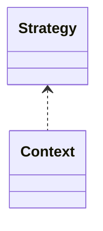

# OOP 原则与设计模式（工程化）

## 原理

- SOLID 原则：单一职责、开闭、里氏替换、接口隔离、依赖倒置。
- 设计模式：创建型（单例/工厂/建造者）、结构型（适配/代理/装饰）、行为型（观察者/策略/责任链）。
- 变化隔离：通过抽象与组合把可能变化的维度（策略、平台实现、装饰能力）隔离出来，既能扩展又避免修改稳定核心。
- 可测试性：面向接口与依赖注入使得实现可替换，便于 Mock/Fake；过度继承会导致耦合与难以测试。

### 深化与重构示例

- 单一职责：将多重逻辑的类拆分为独立服务；避免巨石类难测试与复用。
- 开闭原则：通过策略/装饰扩展行为，避免修改稳定核心。
- 里氏替换：子类不应削弱父类契约；违背会导致多态失败与隐藏 Bug。
- 依赖倒置：依赖抽象并通过注入管理具体实现，提升可替换性。

## 源码（线索）

- 标准库与常见框架中的模式应用（概览）：`Executor`（策略/工厂）、`OkHttp`（责任链）、`Retrofit`（代理）。

## 示例

```java
// 策略模式
interface Compression { byte[] zip(byte[] in); }
class ZipCompression implements Compression { public byte[] zip(byte[] in){ return in; } }
class Archiver { private final Compression c; Archiver(Compression c){ this.c = c; } }
```

```java
// 观察者模式
interface Observer { void onChanged(String v); }
class Subject { List<Observer> list = new ArrayList<>(); void emit(String v){ for(Observer o:list) o.onChanged(v); } }
```

## 对比与取舍

- 抽象 vs 具体：抽象提升扩展性，具体提升简洁性；按变化维度选择。
- 继承 vs 组合：组合更灵活且降低耦合；继承用于 is-a 关系且层次可控。

## 图表



## 性能与瓶颈

- 过度抽象带来额外层次与虚调用成本；核心路径谨慎使用。
- 观察者风暴与内存泄漏；统一取消与弱引用管理。

## 面试答题框架

- 定义：原则与模式的作用
- 原理：变化隔离与抽象边界
- 方法：常见模式的结构与适用场景
- 实践：结合项目例子落地
- 性能/风险：过度抽象与泄漏

## 调用链与工程落地

- 责任链：输入经一组 Handler 依序处理，可中途拦截；OkHttp 拦截器即典型实现。
- 代理：静态/动态代理包装真实对象，添加鉴权/缓存；Retrofit 动态代理生成接口实现。
- 观察者：事件源维护观察者列表，状态变更时依次通知；Android LiveData/Flow/Callback 皆属此类。
- 工厂/建造者：集中构造过程，确保必填参数与可读性；线程池/OkHttpClient 构建器是常用范例。

## Android 侧实践提示

- 避免滥用继承扩展 View/Component，优先组合与委托；重用生命周期感知组件降低泄漏。
- 设计模式结合 DI（Hilt/Dagger/Koin）与模块化，保持边界清晰、可测试。
