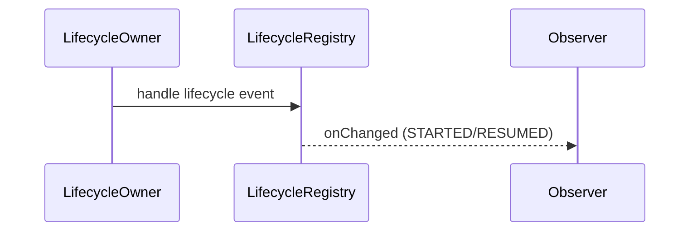

# ViewModel 与 Lifecycle 深入（架构）

## 原理

- Lifecycle：状态机（INITIALIZED/CREATED/STARTED/RESUMED/DESTROYED）驱动观察者回调；避免无效/越界事件。
- ViewModel：与 UI 生命周期解耦，在配置更改（旋转）后保持实例；通过 `SavedStateHandle` 实现进程重启数据恢复。
- 作用域：ViewModelScope 用于协程任务，随 ViewModel 清理。
- 存储与键：`ViewModelStore` 按 `ViewModel` 名称保存实例，配置变更时复用；Fragment/Activity 作用域不同导致实例隔离。
- 状态恢复：`SavedStateRegistry` 保存序列化 Bundle，`SavedStateHandle` 将持久化键值注入 ViewModel，进程被杀后可恢复。
- 事件分发：Lifecycle 只在 STARTED/RESUMED 分发数据（LiveData/Flow with lifecycle），避免后台界面接收无效事件。

## 源码（线索）

- `LifecycleRegistry`、`LifecycleOwner`
- `ViewModelStore`、`ViewModelProvider`、`SavedStateHandle`
- `SavedStateViewModelFactory` 组合 SavedState 与 ViewModel

## 示例

### Kotlin：SavedState 与进程重启恢复

```kotlin
class HomeVM(state: SavedStateHandle) : ViewModel() {
  val name = state.getLiveData("name", "")
}

val vm = ViewModelProvider(this)[HomeVM::class.java]
vm.name.observe(this) { /* update UI */ }
```

### Kotlin：协程作用域与取消

```kotlin
class FeedVM : ViewModel() {
  val items = MutableLiveData<List<Item>>()
  fun load() = viewModelScope.launch { items.postValue(repo.list()) }
}
```

## 对比与取舍

- LiveData vs Flow：前者生命周期感知，后者更灵活支持背压；UI 侧建议结合使用。
- Activity vs Fragment 范围的 ViewModel：作用域不同，数据共享策略不同。

## 时序图：生命周期与观察



## 类关系图

```mermaid
classDiagram
class ViewModel
class ViewModelStore
class LifecycleRegistry
ViewModelStore o-- ViewModel
LifecycleRegistry <.. ViewModel (observed)
```

## 方法级细节与优化

- 观察者注册与移除需与生命周期一致，避免泄漏。
- SavedStateKey 设计要唯一且稳定；复杂对象可序列化或使用 Proto。

## 性能与瓶颈

- 过度观察与重复计算导致 UI 抖动；使用 `distinctUntilChanged` 或等价策略。
- ViewModelScope 中长任务阻塞线程池；合理分配调度器。

## 面试答题框架

- 解释 Lifecycle 状态机与 ViewModel 的解耦；SavedState 的作用。
- 对比 LiveData 与 Flow，说明适配策略。
- 提供工程化实践：作用域设计、恢复与防泄漏。

## 调用链与源码线索

- 生命周期分发：`Activity/Fragment` 经 `ReportFragment`/`FragmentManager` 回调事件 → `LifecycleRegistry.handleLifecycleEvent` → 通知观察者。
- ViewModel 创建：`ViewModelProvider` 使用 `Factory` 创建实例；`ViewModelStore` 保存实例，配置变更时复用。
- SavedState：`SavedStateHandleController.attachHandleIfNeeded` 将 `SavedStateHandle` 绑定到 `SavedStateRegistry`；进程被杀后通过 `onRecreation` 恢复。
- 协程作用域：`viewModelScope` 基于 `SupervisorJob + Dispatchers.Main.immediate`，`onCleared` 取消所有协程。

## Android 15(API 35) 适配提示

- 前台服务/后台限制对 ViewModel 逻辑无直接变化，但涉及权限请求/后台启动需通过可见 UI 触发，避免在 ViewModel 中直接启动 Activity。
- Predictive Back 已默认启用：Fragment/Navigation 场景建议使用 `OnBackPressedDispatcher`/`OnBackInvokedCallback`，保证与 ViewModel 状态同步。
