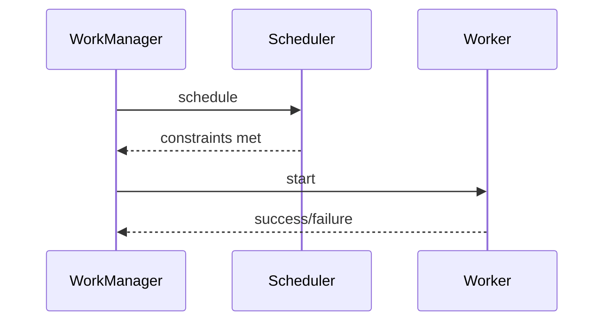
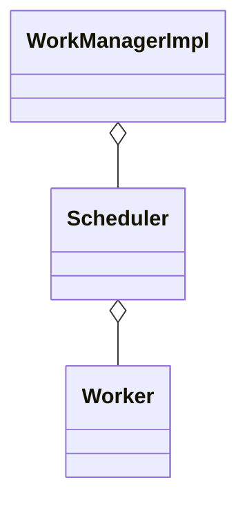

# WorkManager 调度与重试（深入）

## 原理

- 约束驱动：网络/充电/存储空间等约束满足时执行；支持链式工作与唯一性策略（Replace/Keep）。
- 重试与退避：失败后按退避策略（线性/指数）与最大次数重试。
- 持久：跨进程与重启可恢复，适合可靠后台任务。
- 调度层次：API 23+ 基于 JobScheduler，低版本回退 AlarmManager/Gcm；WorkManager 提供统一 API 并持久化到数据库。
- 唯一性与链：唯一工作防止重复，链式工作保证依赖顺序；状态存储在内部 DB 并可查询。
- 约束评估：ConstraintController 监听系统状态满足后才执行 Worker，执行中约束失效会重试或标记失败。

### 调度频率与状态查询

- 约束检查的频率影响电量与唤醒；状态查询通过 `WorkManager#getWorkInfos*` 提供执行链路可视性。

## 源码（线索）

- `WorkManagerImpl`、`GreedyScheduler`、`Processor`
- `ConstraintTrackingWorker` 与约束检查
- 数据库：任务状态持久化与调度记录

## 示例

### Kotlin：网络约束与退避

```kotlin
val req = OneTimeWorkRequestBuilder<UploadWork>()
  .setConstraints(Constraints.Builder().setRequiredNetworkType(NetworkType.CONNECTED).build())
  .setBackoffCriteria(BackoffPolicy.EXPONENTIAL, 10, java.util.concurrent.TimeUnit.SECONDS)
  .build()
WorkManager.getInstance(context).enqueueUniqueWork("upload", ExistingWorkPolicy.KEEP, req)
```

### Kotlin：链式工作与唯一性

```kotlin
WorkManager.getInstance(context).beginUniqueWork("chain", ExistingWorkPolicy.REPLACE, reqA).then(reqB).enqueue()
```

## 对比与取舍

- WorkManager vs JobScheduler/AlarmManager：统一跨版本与约束；底层封装更稳健。
- 唯一性策略：KEEP 避免重复，REPLACE 适合最新覆盖场景。

## 时序图：调度与执行



## 类关系图



## 方法级细节与优化

- 合理设置退避策略与最大重试；避免无限重试导致资源耗尽。
- 唯一性与链式设计避免重复执行与竞态。

## 性能与瓶颈

- 约束检查频率与后台资源消耗；日志与监控保障。
- 大量任务并发导致 CPU/I/O 压力；限流与批处理。

## 面试答题框架

- 解释约束、重试与持久模型；对比系统调度器。
- 给出唯一性与链式实践；退避策略设计。
- 指出资源治理与监控方案。
## 可运行示例与验证

```kotlin
class UploadWork(ctx: Context, params: WorkerParameters) : CoroutineWorker(ctx, params) {
  override suspend fun doWork(): Result {
    // 模拟网络上传
    return if (Math.random() < 0.7) Result.retry() else Result.success()
  }
}

fun enqueueUpload(context: Context) {
  val req = OneTimeWorkRequestBuilder<UploadWork>()
    .setConstraints(Constraints.Builder().setRequiredNetworkType(NetworkType.CONNECTED).build())
    .setBackoffCriteria(BackoffPolicy.EXPONENTIAL, 10, java.util.concurrent.TimeUnit.SECONDS)
    .build()
  WorkManager.getInstance(context).enqueueUniqueWork("upload", ExistingWorkPolicy.KEEP, req)
}
```

- 验证步骤：
  - 触发 `enqueueUpload`，观察 WorkManager 日志与退避重试行为
  - 切换网络状态验证约束生效
  - 使用 `getWorkInfosForUniqueWork` 检查最终状态

### 预期输出

- 日志显示约束满足后开始执行；失败时按指数退避间隔重试，最终返回 `SUCCEEDED` 或 `FAILED/RETRY`。
- `getWorkInfosForUniqueWork("upload")` 返回最新一次链路的状态序列。

### 常见失败原因

- 未声明 `WorkManager` 所需依赖或上下文错误导致入队失败。
- 唯一性策略误用（`REPLACE/KEEP`）导致任务覆盖或无法触发。
- 约束未满足（无网络）但未等待，误判任务未执行。

## 调用链与源码补充

- 调度路径：`WorkManagerImpl.enqueue` → `Scheduler`（`GreedyScheduler`/`SystemJobScheduler`）→ 系统调度器（JobScheduler/AlarmManager/Gcm）。
- 执行：`Processor` 取可运行 Work → 创建 `WorkerWrapper` → 调用 `ListenableWorker.startWork/doWork`。
- 约束：`ConstraintController` 监听网络/充电/存储等状态，满足后通知 `Processor`。
- 重试：`WorkSpec` 中的 `runAttemptCount` 与 `BackoffPolicy` 决定下次调度时间。

## Android 15(API 35) 提示

- 目标 SDK 35 后前台服务限制更严格：后台可靠任务继续使用 WorkManager/JobScheduler；避免用自启动 Service。
- 约束频率：系统对后台轮询更保守，建议合理设置网络/电量约束并监控执行延迟。
