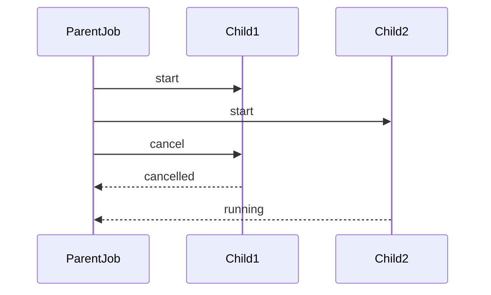
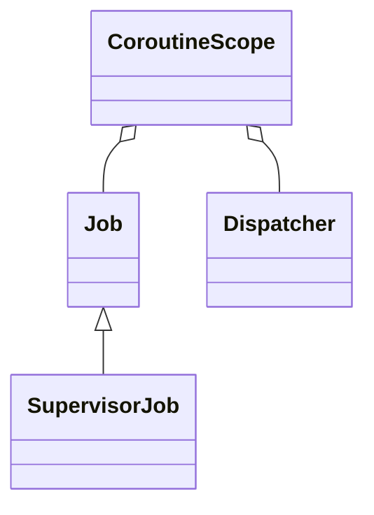

# 协程调度与取消（深入）

## 原理

- 协程通过 `Dispatcher` 调度至特定线程或线程池；`Job` 表示生命周期与取消状态；结构化并发通过父子关系管理作用域与异常传播。
- 取消是协作式：协程检查取消标记并在挂起点抛出 `CancellationException`；不可取消区需谨慎使用。
- Flow 背压：通过缓冲与操作符控制生产与消费速率，避免阻塞或过载。
- 调度策略：`Dispatchers.Default` 适合 CPU 任务，`IO` 适合阻塞 I/O，`Main` 绑定 UI 线程；`withContext` 切换上下文并继承父 Job。
- 异常传播：非监督作用域父失败会取消所有子协程；`SupervisorJob` 隔离子失败，结合 `CoroutineExceptionHandler` 处理未捕获异常。
- 资源释放：`invokeOnCompletion`/`try/finally` 清理资源；挂起函数必须可取消，耗时操作应主动检查 `isActive`。

## 源码（线索）

- `kotlinx.coroutines`: `Job`、`SupervisorJob`、`Deferred`、`CoroutineScope`、`Dispatchers`、`CoroutineStart`、`Channel`、`Flow`、`CoroutineExceptionHandler`。
- 调度：`Dispatchers.Default/IO/Main/Unconfined`；`withContext` 切换执行环境。
- 取消传播：父取消通知子；`SupervisorJob` 仅对子任务失败进行隔离。

## 示例

### Kotlin：并发请求聚合与超时取消

```kotlin
suspend fun loadUserAndFeed(api: Api): Pair<User, Feed> = coroutineScope {
  val u = async { api.user() }
  val f = async { api.feed() }
  withTimeout(2_000) { Pair(u.await(), f.await()) }
}
```

### Kotlin：Supervisor 降级与异常处理

```kotlin
val scope = CoroutineScope(SupervisorJob() + Dispatchers.IO)
val h = CoroutineExceptionHandler { _, e -> Log.e("C", e.toString()) }
scope.launch(h) { launch { taskA() }; launch { taskB() } }
```

### Kotlin：Flow 背压与缓冲

```kotlin
fun events(): Flow<Int> = flow {
  repeat(1000) { emit(it) }
}.buffer(64).conflate().flowOn(Dispatchers.Default)
```

## 对比与取舍

- `Job` vs `SupervisorJob`：前者父失败影响子，后者隔离子失败；服务稳健性优先选后者。
- `launch` vs `async`：前者用于无返回任务，后者用于并发返回值；避免滥用导致未捕获异常。
- 背压策略：`buffer` 提升吞吐但占用内存，`conflate` 丢弃中间值适合状态流。

## 时序图：取消与传播



## 类关系图



## 方法级细节与优化

- `withTimeout` 控制超时；超时抛异常需捕获并做降级。
- `CoroutineExceptionHandler` 在 `launch` 中处理未捕获异常；`async` 需在 `await` 时捕获。
- `flowOn` 移动上游到指定调度器；过度切换增加上下文成本，需合理分配。

## 面试答题框架

- 解释调度、取消与结构化并发；区分 `launch/async` 与 `Job/SupervisorJob`。
- 描述背压策略与常用操作符；给出工程化示例与异常处理策略。
- 指出优化方向：超时、隔离、线程切换减少、缓冲合理化。

## 调度与源码调用链

- `CoroutineScope.launch/async` → `BuildersKt.launch/async` 创建 `JobSupport`，注册到父 Job。
- 调度：`Dispatchers.Default/IO/Main` 基于 `SchedulerCoroutineDispatcher`/`HandlerContext`；`withContext` 切换时发布到目标 dispatcher。
- 恢复：挂起点通过 `Continuation` 恢复，`DispatchedContinuation.resumeWith` 决定立即执行或投递到队列。
- 取消：`JobSupport.cancel` 标记状态 → `ChildHandleNode` 传播到子 Job；挂起点检查 `isActive` 抛 `CancellationException`。
- Flow：`collect` 构建 `SafeCollector` 校验上下文；背压操作符（`buffer/conflate/flatMapLatest`）在 `Flow` 链路上调度。

## Android 15(API 35) 注意

- 主线程调度：`Dispatchers.Main.immediate` 依赖 `Handler`/`Looper.getMainLooper()`，在 API 35 行为一致；避免在 UI 帧内执行重计算。
- 后台限制：在后台进程执行网络/长 IO 需结合 WorkManager/JobScheduler；协程本身不绕过系统限制。
