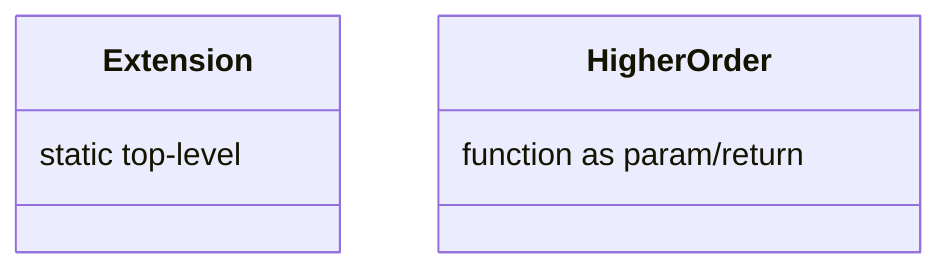

# Kotlin 扩展函数与高阶函数（深入）

## 原理

- 扩展函数：以静态方式为现有类型增加行为；通过接收者语法简化调用。
- 高阶函数：以函数作为参数或返回值；配合 Lambda/内联提升可读性与性能。
- 绑定与分派：扩展不会修改类本身，静态分派按接收者静态类型解析；同名成员优先于扩展，避免命名冲突。
- 捕获与分配：高阶函数的 Lambda 若捕获外部变量会生成闭包对象并产生分配；`inline` 可消除这部分开销，`crossinline/noinline` 控制非局部返回与分配。

## 源码（线索）

- 编译产物：扩展函数生成顶层静态方法；`inline` 函数消除调用开销。

## 示例

```kotlin
fun String.words(): List<String> = this.split(" ")

inline fun <T> measure(block: () -> T): T {
  val t = System.nanoTime(); val r = block(); println(System.nanoTime() - t); return r
}
```

## 对比与取舍

- 扩展 vs 成员：扩展更解耦，成员更集中；遵循模块边界与命名规范。
- 内联 vs 常规：内联性能更优但可能增大二进制；热点路径使用。

## 图表



## 性能与瓶颈

- 过多顶层函数影响组织与可读性；建议包内聚与命名规范。
- 滥用高阶导致过度分配；`inline` 与尾递归优化。

## 面试答题框架

- 定义：扩展与高阶的作用
- 原理：编译产物与内联
- 方法：示例与接收者语法
- 实践：命名与边界规范
- 性能/风险：分配与二进制膨胀

## 调用链与编译产物

- 扩展函数被编译为顶层静态方法，接收者作为首个参数；对 Java 暴露时可用 `@JvmName`/`@JvmStatic` 控制符号。
- 高阶函数默认生成函数对象并调用其 `invoke`；`inline` 展开调用并内联 Lambda，减少分配和虚调用。
- `crossinline/noinline` 控制 Lambda 的内联与非局部返回；`reified` 依赖内联在字节码中写入具体类型检查。

## 工程提示（Android）

- 热路径避免捕获外部变量的 Lambda 分配；必要时使用 `inline` 或单例对象。
- 扩展函数保持作用域收敛，避免顶层 API 污染；命名清晰可读，避免与标准库/DSL 冲突。
