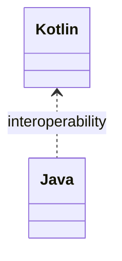

# Kotlin vs Java 互操作与差异（深入）

## 原理

- 互操作：Kotlin 编译为字节码与 Java 共用 JVM；`@JvmName/@JvmOverloads/@JvmStatic` 等注解改善调用体验。
- 差异点：空安全、数据类、密封类、扩展函数、协程等语言特性提升表达力与安全性。
- 编译产物：默认参数通过合成方法/`DefaultImpls` 实现；伴生对象生成静态访问器；空安全通过注解元数据供 Java 侧参考但不强制。
- 平台类型：来自 Java 的无注解类型视为平台类型，Kotlin 不强制空安全，需在边界处封装或补注。

## 源码（线索）

- Kotlin 编译器生成的字节码特征（概览）：`DefaultImpls`、合成方法、`@Metadata` 注解。

## 示例

```kotlin
class Foo(@JvmOverloads constructor(val x: Int = 0)) {
  @JvmStatic fun util(){}
}
```

```java
// Java 调用 Kotlin 生成的重载与静态方法
Foo.util();
new Foo();
new Foo(1);
```

## 对比与取舍

- Kotlin 简洁与空安全 vs Java 生态与成熟度；团队与项目约束决定取舍。
- 协程与 Flow 可读性与效率提升，但需规范作用域与取消策略。

## 图表



## 性能与瓶颈

- 过多扩展与顶层函数可能影响二进制结构与可读性；谨慎组织包与命名。
- 协程在错误调度下造成线程切换成本；合理使用 `Dispatchers`。

## 面试答题框架

- 定义：互操作目标与特性差异
- 原理：注解与编译产物
- 方法：互操作注解与调用示例
- 实践：团队规范与可维护性
- 性能/风险：扩展/顶层函数与协程调度

## 编译产物与调用链

- 默认参数：生成 `DefaultImpls` 与合成构造器；`@JvmOverloads` 控制对 Java 的重载数量。
- 静态暴露：`@JvmStatic` 将伴生/对象方法暴露为静态；`@file:JvmName` 统一顶层函数类名。
- 可空互操作：Kotlin 类型标注通过 `@NotNull/@Nullable` 影响 Java 侧签名；平台类型缺少注解需包装或断言。
- 协程互操作：挂起函数生成 `Continuation` 参数；Java 调用需借助 `runBlocking`/`CompletableFuture` 适配。

## 工程提示

- 跨语言 API 设计保持最小惊讶：稳定命名、清晰可空性、避免过度顶层函数。
- 若暴露给 Java，控制 `@JvmOverloads` 数量，避免方法爆炸与方法 ID 超限。
