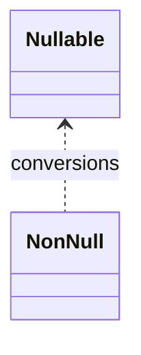

# Kotlin 空安全（深入）

## 原理

- 类型系统：可空 `T?` 与非空 `T`，编译期强制空检查；智能转换与安全调用避免 NPE。
- 操作符：`?.` 安全调用、`?:` Elvis、`!!` 非空断言（谨慎）、`let/run/also/apply` 等作用域函数。
- 平台类型处理：Java 无注解类型被视为平台类型，编译器不插入空检查；需要通过注解或包装函数在边界处收敛。
- 编译期插桩：对可空调用插入显式 null 检查，违约时抛 NPE；`!!` 强制断言会直接生成抛异常代码。
- 流程优化：智能转换基于控制流分析推断非空，避免重复空判断。

## 源码（线索）

- 编译器空安全检查；`@Nullable/@NotNull` 注解互操作。

## 示例

```kotlin
val s: String? = null
val len = s?.length ?: 0
```

```kotlin
fun require(v: String?): String = v ?: error("null")
```

## 对比与取舍

- 非空断言 `!!` 简洁但风险高；优先安全调用与早失败策略。
- 平台类型互操作需谨慎：来自 Java 的类型无注解可能视为平台类型。

## 图表



## 性能与瓶颈

- 过多空判断影响可读性；通过数据校验与早失败简化控制流。
- 互操作时的注解缺失导致运行期 NPE；建议补注或封装。

## 面试答题框架

- 定义：可空与非空类型
- 原理：编译期检查与操作符
- 方法：作用域函数与安全调用
- 实践：平台类型互操作策略
- 性能/风险：`!!` 与注解缺失

## 调用链与编译检查

- 可空性在编译期通过类型系统检查；可空调用编译为显式 null 检查与早返回。
- 平台类型：来自 Java 未注解的类型编译器视为平台类型，不插入检查；建议通过注解或包装类收敛。
- 内联空检查：`requireNotNull/checkNotNull` 编译为快速检查，失败抛异常；避免在热路径频繁使用。

## 工程提示

- API 边界处统一进行空校验与早失败，内部逻辑可简化分支。
- 对外暴露的 Kotlin API 明确可空性，并给 Java 使用者提供注解与文档；避免使用 `!!` 兜底。
