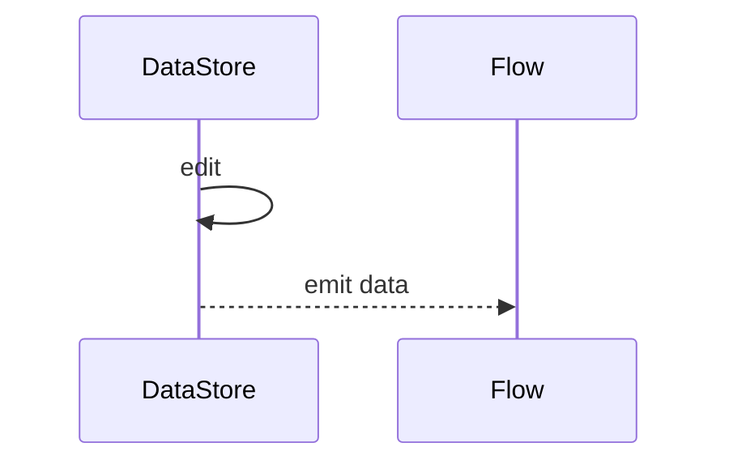
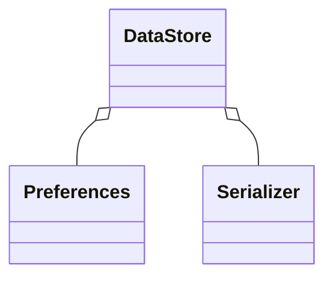

# DataStore vs SharedPreferences（深入）

## 原理

- SharedPreferences：XML 存储，读写同步/半异步，易产生主线程阻塞与一致性问题。
- DataStore：基于 `Flow` 的异步与事务性读写，分 `Preferences`（键值）与 `Proto`（强类型）两种模式。
- 一致性：SP 通过内存缓存+文件写回，`commit` 同步返回、`apply` 异步落盘可能丢失顺序；DataStore 串行事务保证写序与原子性。
- 线程与背压：DataStore 的单写队列避免并发冲突，`Flow` 持续发射最新数据；SP 在多线程并发写容易产生竞态与 ANR。
- 演进：Proto DataStore 用 schema 保障类型与向后兼容；SP 仅键值，易产生魔法字符串与类型不匹配。

## 源码（线索）

- `DataStore`、`Preferences`、`Serializer`、`DataStoreFactory`
- SP：`SharedPreferencesImpl` 读写与提交策略

## 示例

### Kotlin：Preferences DataStore 读写

```kotlin
val Context.settings by preferencesDataStore("settings")
val KEY = stringPreferencesKey("name")

suspend fun save(context: Context, v: String) {
  context.settings.edit { it[KEY] = v }
}

fun read(context: Context): Flow<String?> = context.settings.data.map { it[KEY] }
```

### Kotlin：Proto DataStore 强类型

```proto
message UserPrefs { string name = 1; }
```

```kotlin
val Context.user by dataStore("user.pb", serializer = UserPrefsSerializer)
```

## 对比与取舍

- SP 简单但易阻塞与丢失；DataStore 异步安全但迁移成本更高。
- Preferences vs Proto：键值灵活 vs 强类型可维护；按复杂度与演进选择。

## 时序图：DataStore 读写



## 类关系图



## 方法级细节与优化

- 合理作用域与调度器，避免 UI 线程阻塞。
- 迁移：从 SP 读取初值并写入 DataStore；一次性完成后移除旧路径。

## 性能与瓶颈

- 大量频繁写入建议批处理；Flow 收集方避免热路径计算。

## 面试答题框架

- 解释两者模型与适用场景；给出迁移与强类型方案。
- 指明线程与一致性问题的工程治理。

## 源码与调用链提示

- Preferences：`SharedPreferencesImpl` 同步读取 XML；`apply` 异步持久化但仍在主线程写入磁盘前进行序列化。
- DataStore：`DataStoreFactory` 创建单写队列；`DataStoreImpl#updateData` 在单线程 `CoroutineScope` 内串行执行写入；`Serializer` 负责 Proto 读写。
- Flow：`data` 流基于 `Flow` 热流自动合并最新值；背压通过缓冲/合并处理。
- 迁移：`SharedPreferencesMigration` 在首次访问时将旧值写入 DataStore，之后仅读写新存储。

## Android 15(API 35) 提示

- 后台磁盘 I/O 仍受限制，建议保持 DataStore 默认的异步序列化，避免在 UI 线程同步写 SP。
- 隐私权限：偏好存储不受新的敏感权限影响，但若偏好中保存敏感标识，仍需遵循最小化与加密原则。
