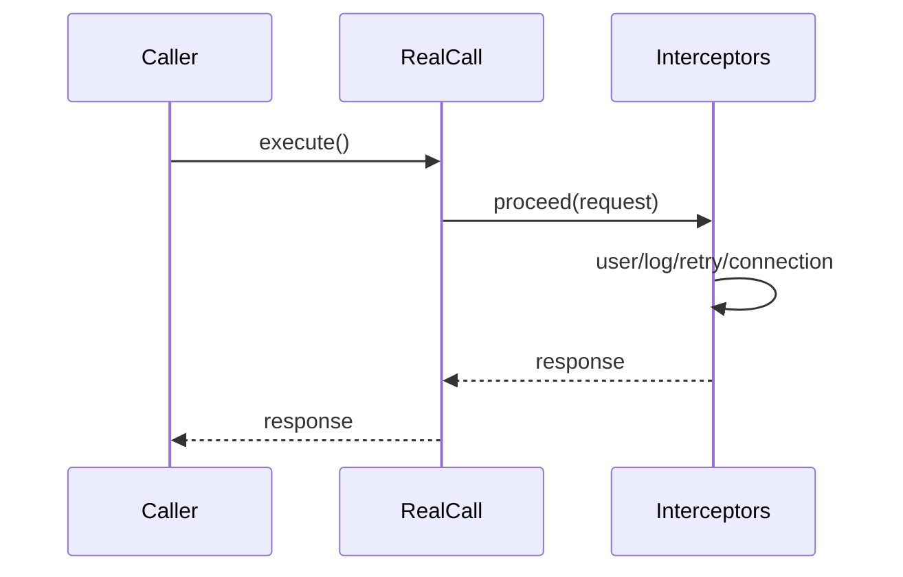
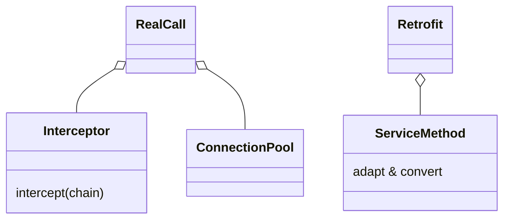

# OkHttp / Retrofit 原理（概览）

## OkHttp 关键机制

- 拦截器链：用户拦截器 → 重试/重定向 → 连接 → 头/正文 → 服务器调用
- 连接复用：ConnectionPool 管理 HTTP/2 与复用，减少握手与建连开销
- 超时与重试：读取/写入/连接超时分离，FollowUp 请求处理 3xx/401 等场景
- TLS 与证书：配置协议与证书校验，支持 ALPN 与 HTTP/2

## Retrofit 关键机制

- 动态代理：接口方法解析为 `ServiceMethod`，使用 `CallAdapter/Converter` 适配返回与序列化
- 协程/Flow 支持：通过自定义适配器实现挂起函数与响应流
- 错误模型：网络层异常、HTTP 状态码、业务错误分层封装

## 实战与测试建议

- 统一 `OkHttpClient` 配置：连接池、超时、日志、证书与缓存策略
- Retrofit 模块化：`Converter` 与 `CallAdapter` 明确边界，方便 Mock 与替换
- 可测试性：接口分层（Repository）、依赖注入（Hilt），用假服务器或拦截器做用例

## 面试答题框架

- 说明拦截器链路与关键拦截器职责
- 解释连接复用与 HTTP/2 的性能优势
- Retrofit 的动态代理、转换与适配流程
- 给出错误处理与测试的工程化方案

---

## 原理

- OkHttp 通过责任链拦截器组织请求流程：用户拦截器 → 重试/重定向 → 连接 → 请求头/请求体 → 网络 I/O → 响应解析。
- 连接层支持 HTTP/2 多路复用与连接池复用，减少握手与建连开销。
- Retrofit 使用动态代理将接口方法转换为 `ServiceMethod`，结合 `CallAdapter` 与 `Converter` 实现返回类型适配与序列化反序列化。
- 连接复用细节：`ConnectionPool` 维护空闲连接，依据目标主机、协议和 TLS 会话复用；HTTP/2 多路流避免队头阻塞。
- 失败与重试：`RetryAndFollowUpInterceptor` 处理路由选择、重定向、认证与幂等重试；连接失败时可能切换备用路由。
- 序列化链路：`Converter` 负责请求/响应体转换，`CallAdapter` 负责返回类型（suspend/Flow/Rx）；二者决定线程切换与错误模型。

### 数据结构与调用链细化

- `Exchange` 管理一次请求-响应交换的状态；`RealConnection` 维护 socket 与协议（HTTP/1.1/2）。
- 动态代理：`InvocationHandler` 解析方法注解生成 `ServiceMethod`，随后创建 `Call` 并通过适配器/转换器处理返回与序列化。

### 设计考量

- 将通用横切（日志、鉴权、重试）下沉为拦截器，避免散落在业务代码。
- 以适配器隔离框架与业务返回类型（例如挂起函数、Flow、Result）。

## 源码解析（线索）

- OkHttp 拦截链：`RealCall#getResponseWithInterceptorChain`。
- 连接复用：`ConnectionPool`、`RealConnection`、`Exchange`。
- HTTP/2：`Http2Connection`、`Stream` 管理多路复用。
- Retrofit 动态代理：`Retrofit#create` 返回的 `Proxy` 调用至 `InvocationHandler`，构建 `ServiceMethod` 后发起 `Call`。
- 适配与转换：`CallAdapter.Factory` 与 `Converter.Factory` 的解析与选择。

## 示例

### Kotlin：OkHttpClient 配置与自定义拦截器

```kotlin
val logging = HttpLoggingInterceptor().apply { level = HttpLoggingInterceptor.Level.BASIC }
val client = OkHttpClient.Builder()
  .addInterceptor(logging)
  .connectTimeout(10, java.util.concurrent.TimeUnit.SECONDS)
  .readTimeout(10, java.util.concurrent.TimeUnit.SECONDS)
  .build()
```

### Kotlin：Retrofit 接口与协程适配

```kotlin
interface ApiService {
  @GET("/users/{id}")
  suspend fun getUser(@Path("id") id: String): Response<User>
}

val retrofit = Retrofit.Builder()
  .baseUrl("https://example.com")
  .client(client)
  .addConverterFactory(MoshiConverterFactory.create())
  .build()

val api = retrofit.create(ApiService::class.java)
```

### 错误模型与对比

- 统一返回 `Result<T>`：将网络异常、HTTP 错误、业务错误分层封装，便于 UI 与域层处理。
- 直接抛异常：简洁但需要在调用处统一捕获，错误路径分散。

## 时序图：拦截器责任链



## 组件关系图



## 性能与瓶颈

- 过多拦截器与复杂序列化增加延迟，应精简拦截器并使用高效转换器（如 Moshi）。
- HTTP/2 在丢包场景可能受头阻塞影响，策略上可降级或优化重试与超时设置。

## 最佳实践

- 统一配置 `OkHttpClient`：连接池、超时、证书校验、日志级别、缓存策略。
- 分层返回类型：Repository 层统一 `Result<T>`，UI 层简化错误处理路径。
- Mock/注入：通过拦截器或替身服务便于测试与回归。

## 细化调用链（OkHttp）

- `OkHttpClient.newCall` → `RealCall#getResponseWithInterceptorChain` 构造拦截器链。
- 链顺序：自定义 interceptors → `RetryAndFollowUpInterceptor` → `BridgeInterceptor`（头/压缩）→ `CacheInterceptor` → `ConnectInterceptor` → `CallServerInterceptor`。
- 连接复用：`ConnectInterceptor` 从 `ConnectionPool` 取可复用连接；HTTP/2 复用多路流；`RouteSelector` 选择代理/直连。
- I/O：`CallServerInterceptor` 写请求流/读响应流，支持分块/压缩；`Exchange` 负责一次请求-响应的状态。

## 细化调用链（Retrofit）

- `Retrofit#create` 返回动态代理 → `InvocationHandler` 解析注解生成 `ServiceMethod`。
- `ServiceMethod#invoke` → 创建 `OkHttp Call` → `CallAdapter`（协程/Flow/Rx）包装 → `Converter` 处理序列化/反序列化。
- 失败/重试：配合 OkHttp 的重试与业务层 `Result` 包装；必要时添加重试拦截器或幂等校验。

## Android 15(API 35) 网络注意

- 网络权限未变，但后台联网/前台服务限制更严格：长连/推送建议使用 FCM 或前台服务类型匹配；避免在受限后台频繁拉取。
- 证书与 TLS：继续要求 TLS1.2+；ALPN/HTTP/2 默认开启，老设备降级逻辑保留；确保持久连接配置与 ConnectionPool 参数在 15 上回归验证。
