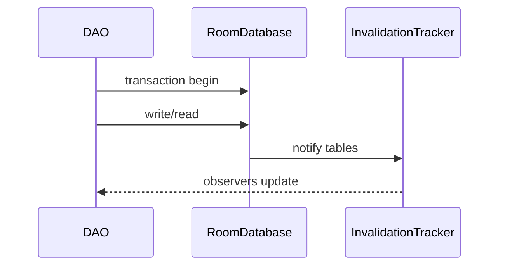
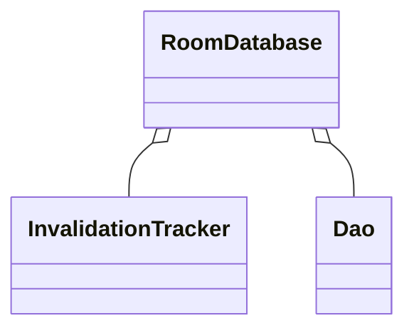

# Room 并发与事务（深入）

## 原理

- 事务：`@Transaction` 保证多个操作的原子性；SQLite 的锁与隔离级别决定并发行为。
- 线程模型：`suspend` DAO 在协程中执行；默认单线程事务，读写需合理调度。
- 失效器：`InvalidationTracker` 监听表变更，驱动观察者更新。
- WAL 与并发：默认 WAL 模式下写入追加到日志，允许读写并发，提交后 checkpoint 合并；大量写入会触发 checkpoint，需控制批量大小。
- 隔离与锁：SQLite 以数据库级锁实现隔离，长事务会阻塞其他写操作；尽量短事务并在 IO 调度器执行。
- 生成代码执行：Room 生成的 `*_Impl` 会在 `CoroutinesRoom.execute` 中切换线程并开启事务，失败时回滚，成功后触发失效通知。

### 通知链与订阅抑制

- 失效通知合并与节流，避免更新风暴；DiffUtil 合并 UI 层变更。

## 源码（线索）

- `RoomDatabase`、`InvalidationTracker`、`RoomSQLiteQuery`
- DAO 生成代码（KAPT/KSP）：参数绑定与游标解析

## 示例

### Kotlin：事务封装与并发写

```kotlin
@Dao interface UserDao {
  @Insert suspend fun insert(u: User)
  @Query("SELECT * FROM user WHERE id=:id") suspend fun byId(id: Long): User?
}

class Repo(private val db: AppDb) {
  @Transaction suspend fun upsert(u: User) {
    db.userDao().insert(u)
    db.userDao().byId(u.id)
  }
}
```

### Kotlin：Flow 订阅与并发读

```kotlin
@Dao interface FeedDao {
  @Query("SELECT * FROM feed") fun all(): Flow<List<Feed>>
}

## 可运行示例与验证

```kotlin
@Entity data class User(@PrimaryKey val id: Long, val name: String)
@Dao interface UserDao {
  @Insert(onConflict = OnConflictStrategy.REPLACE) suspend fun insert(u: User)
  @Query("SELECT * FROM User WHERE id=:id") suspend fun byId(id: Long): User?
}
@Database(entities = [User::class], version = 1)
abstract class AppDb : RoomDatabase() { abstract fun userDao(): UserDao }

suspend fun demo(context: Context) {
  val db = Room.databaseBuilder(context, AppDb::class.java, "demo.db").build()
  db.userDao().insert(User(1, "A"))
  val u = db.userDao().byId(1)
}
```

- 验证步骤：
  - 运行 `demo`，检查插入与查询结果
  - 添加索引与批量写用例，对比事务耗时（使用 `SystemClock.elapsedRealtime()`）

### 预期输出

- 首次插入后查询返回对应 `User(id=1, name="A")`；批量写入开启事务后整体耗时显著低于逐条独立事务。
- 添加索引后，按索引列查询的耗时明显下降。

### 常见失败原因

- 在主线程运行数据库操作导致异常或卡顿。
- 未正确关闭数据库或游标引发资源泄漏。
- DAO 注解与 SQL 语句不一致导致运行期异常。
```

## 对比与取舍

- Room vs 原生 SQLite：Room 更安全与可测试；原生更灵活但易错。
- LiveData vs Flow：Flow 背压更优；UI 侧结合 Lifecycle 使用。

## 时序图：事务与失效通知



## 类关系图



## 方法级细节与优化

- 批量写入与索引优化：减少事务次数与扫描成本。
- 大查询分页（`LIMIT/OFFSET`）与投影减少列，降低 I/O。
- 避免在主线程进行数据库操作；协程调度至 IO。

## 性能与瓶颈

- 热路径查询需索引与缓存；写入锁争用导致延迟。
- 订阅更新风暴：合并事件与差分更新（DiffUtil）。

## 面试答题框架

- 事务、并发与失效器原理；DAO 生成代码的安全性。
- 工程化实践：批量、索引、分页与协程调度。
- 订阅策略与更新优化。

## 调用链与源码线索

- DAO 生成代码：编译期 KAPT/KSP 生成 `*_Impl`，`CoroutinesRoom.execute` 在线程池/协程调度器执行 SQL。
- 事务：`RoomDatabase.beginTransaction` → `SupportSQLiteDatabase.beginTransactionNonExclusive`，WAL 下支持并发读。
- 失效通知：`InvalidationTracker` 注册表监听，变更后触发 `onInvalidated` 推送到 Flow/LiveData 观察者。
- Cursor/绑定：`RoomSQLiteQuery` 负责参数绑定/重用，`CursorUtil.close` 确保游标回收。

## Android 15(API 35) 提示

- 后台 I/O 限制依旧：数据库操作保持在 IO/Default 调度器，不要阻塞主线程或 Binder 线程。
- 迁移/清理：如在前台服务或 WorkManager 中执行长事务，需匹配合规的前台服务类型与约束；避免大事务持锁过久影响其他读写。
