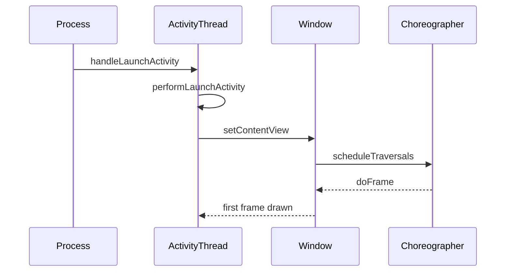

# 启动速度优化（概览）

## 启动类型与度量

- 冷启动/热启动/暖启动的定义与影响因素
- 关键指标：首帧时间、可交互时间、Activity 启动耗时、进程创建与 I/O

## 常用优化策略

- 初始化延后与拆分：按需加载、后台异步化、避免主线程重活
- App Startup 库：声明式初始化、依赖图与并行化
- Baseline Profiles：为关键路径生成 Profile，提升 dex 解释/JIT 启动性能
- 减少 ContentProvider 与反射：按需启用，精简 manifest 初始化
- 资源与 I/O：预加载轻量资源、图片压缩、避免同步磁盘读写

## 诊断与工具

- `perfetto/systrace`：观察调度与阻塞点
- `androidx.tracing`/`Trace`：埋点关键阶段以量化收益
- 启动阶段日志与采样：采集分阶段耗时，形成优化闭环

## 面试答题框架

- 先定义启动类型与指标
- 列举工程化策略：延后初始化、并行化、Profile 与反射压缩
- 辅以工具与数据度量，说明验证方法与回归保障

---

## 原理

- 冷启动包含进程创建、资源加载、类初始化、首帧绘制；热启动主要是恢复 Activity，路径更短。
- 阻塞因素包括主线程重活、磁盘 I/O、反射与 ContentProvider 初始化、网络同步等待。
- App Startup 与 Baseline Profiles 分别在初始化编排与执行效率上提供工程化能力。
- 进程与线程：Zygote fork 后主线程进入 Looper 循环；首帧前的主线程阻塞直接拉长 TTFB/TTI。
- 渲染驱动：`Choreographer` 基于 VSync 触发 `doFrame`，`ViewRootImpl#performTraversals` 完成 measure/layout/draw，任何超 16ms 的阻塞都会掉帧。
- 代码与编译：Baseline/Profile 让关键路径提前 AOT，减少首次解释/JIT；反射与动态加载会拖慢类初始化与校验。

### 调用链与指标细化

- `ActivityThread#handleLaunchActivity/performLaunchActivity/handleResumeActivity` 的分段耗时；`Choreographer#doFrame` 首帧绘制时机。
- 指标：TTID（可交互时间）、TTFB（首帧）、各阶段事件耗时与阻塞点分布。

### 设计考量

- 将不可或缺的初始化置前，其余延后或异步，避免影响首帧与可交互时间。
- 通过依赖图并行化可独立的初始化任务，减少串行等待。

## 源码解析（线索）

- Activity 启动链路：`ActivityThread#handleLaunchActivity` → `performLaunchActivity` → `handleResumeActivity` → 首帧绘制。
- `Choreographer` 与 VSync 驱动渲染节奏，过度计算会占用帧时隙导致卡顿。
- App Startup：`androidx.startup` 通过 `Initializer` 依赖关系构建执行序列。

## 示例

### Kotlin：App Startup 编排

```kotlin
class LoggerInitializer : Initializer<Unit> {
  override fun create(context: Context) { Logger.init() }
  override fun dependencies() = emptyList<Class<out Initializer<*>>>()
}

class NetworkInitializer : Initializer<Unit> {
  override fun create(context: Context) { Network.initAsync(context) }
  override fun dependencies() = listOf(LoggerInitializer::class.java)
}
```

### Kotlin：延后与懒加载

```kotlin
object LazyHolder {
  val heavy by lazy(LazyThreadSafetyMode.SYNCHRONIZED) { Heavy.init() }
}

class MainActivity : Activity() {
  override fun onCreate(savedInstanceState: Bundle?) {
    super.onCreate(savedInstanceState)
    window.decorView.post { LazyHolder.heavy }
  }
}
```

## 时序图：冷启动分解



## 性能与瓶颈

- 初始化分层与分级：核心必需、可延后、后台执行，避免一刀切放入 `Application#onCreate`。
- 资源与布局：减少层级与过度绘制，图片按密度与尺寸优化，避免同步解码。
- 反射与 Provider：能用直接调用或生成代码替代；精简 manifest Provider 并按需启用。

## 最佳实践

- 启动阶段梳理：明确冷/热启动路径，分段采样指标与阻塞点。
- 使用 App Startup 与 Baseline Profiles 协同：初始化编排与编译优化并进。
- 关键初始化延后：日志/监控按需与后台，避免阻塞首帧与交互。

## 调用链与源码补充

- 进程创建：`ZygoteInit` fork → `ActivityThread.main` 进入主线程消息循环。
- Activity 启动：`ActivityTaskManagerService#startActivity` → `ActivityStarter` 构建 `ActivityRecord` → `ClientTransaction` 发送到应用。
- 应用侧：`ActivityThread#handleLaunchActivity` → `Instrumentation#callActivityOnCreate` → `setContentView` → `Choreographer#doFrame` 首帧。
- 绘制：`ViewRootImpl#performTraversals` 触发 measure/layout/draw，`RenderThread`/GPU 完成合成。

## Android 15(API 35) 启动相关提示

- 目标 SDK 35 后后台启动/前台服务限制持续生效：冷启动时减少后台组件唤起，避免触发限制或额外延迟。
- App Startup/初始化：保持声明式初始化，避免在 `Application#onCreate` 做重 I/O；API 35 上行为一致但需重新基准测试。
- Baseline/Cloud Profile：继续生成 Baseline Profiles，并使用 Play 下发的 Cloud Profile；API 35 的 ART Mainline 可改变编译策略，需观察启动耗时回归。
