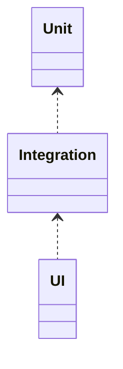

# 测试策略：单元/集成/UI（深入）

## 原理

- 分层：单元（纯逻辑）、集成（模块协作）、UI（用户交互与可视层）。
- 可测性：依赖隔离（接口与注入）、确定性输出、可观察状态。
- 隔离手段：Mock/Fake/Stubs 断开外部系统，Fixture 保证输入稳定；时间/线程/随机数需可控。
- 同步与稳定性：异步/UI 测试需通过 IdlingResource/await 等方式与主线程同步，关闭动画与不确定因素减少 flakiness。

## 工具（线索）

- JUnit/Mockito/Truth、Robolectric（单元/集成）、Espresso/Compose Test（UI）
- IdlingResource 与测试同步；`androidx.test` 框架

## 示例

### Kotlin：Repository 隔离与单元测试

```kotlin
class Repo(private val api: Api) {
  suspend fun load(): List<Item> = api.items()
}

class RepoTest {
  private val api = mock(Api::class.java)
  @Test fun ok() = runBlocking {
    `when`(api.items()).thenReturn(listOf(Item(1)))
    val r = Repo(api).load()
    assertThat(r).hasSize(1)
  }
}
```

### UI：Espresso 与 Compose Test

```kotlin
@RunWith(AndroidJUnit4::class)
class LoginTest {
  @Test fun login() {
    onView(withId(R.id.user)).perform(typeText("u"))
    onView(withId(R.id.btn)).perform(click())
    onView(withText("OK")).check(matches(isDisplayed()))
  }
}
```

## 对比与取舍

- Robolectric vs 仪器测试：前者快速、近似环境；后者真实设备但慢。
- Mockito vs Fake：Mock 便捷；Fake 更贴近真实逻辑便于集成测试。

## 图表：测试金字塔



## 方法级细节与优化

- 隔离外部依赖（网络/数据库/时间）；使用 DI 与替身对象。
- 测试数据与工厂方法；可读性与可维护性。
- 并行与分层执行，CI 中按风险划分。

## 性能与瓶颈

- UI 测试慢且不稳定；减少端到端用例数量，聚焦关键路径。
- 不确定性（异步/动画）导致波动；IdlingResource 与禁用动画。

## 面试答题框架

- 阐述分层与工具选择；给出可测性设计。
- 说明隔离、数据工厂与同步策略。
- 提供 CI 与质量门禁实践。

## 调用链与工具细节

- 单元/本地测试：`RobolectricTestRunner` 将 Android API stub 到 JVM；`Shadow*` 模拟系统服务。
- 仪器/UI 测试：`AndroidJUnitRunner` 启动目标进程，`Espresso` 通过 `UiController` 与 `IdlingResource` 同步主线程；Compose Test 使用 `ComposeTestRule` 在同一进程驱动。
- Mock/替身：Mockito/MockK 动态代理；Fake/伪实现适合集成测试；`ServiceTestRule`/`ActivityScenario` 提供组件级控制。
- 覆盖率：`jacoco`/`gradle testCoverage` 生成报告；CI 合并多模块覆盖率。

## Android 15(API 35) 测试提示

- 权限/后台行为更严格：UI/仪器测试需在 manifest 或 runtime 授权，避免因权限缺失导致 flakiness。
- Predictive Back：UI 测试需覆盖手势返回路径，验证过渡与状态一致。
