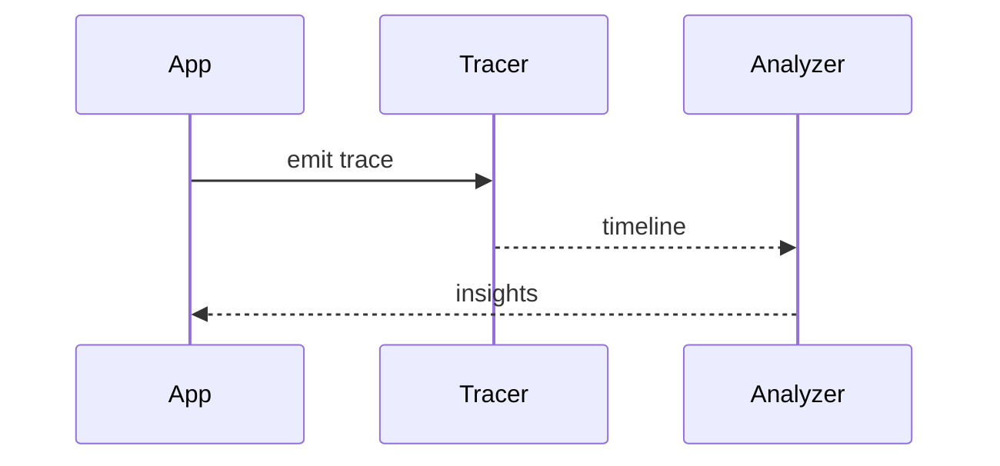
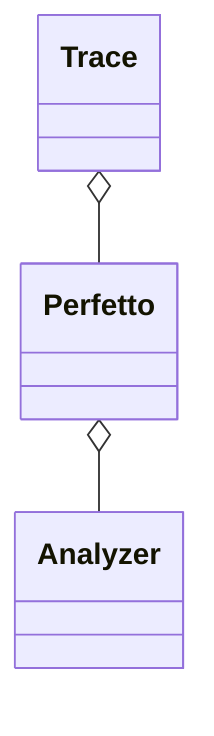

# 性能诊断工具：Profilers/Perfetto/Systrace（深入）

## 原理

- Profilers：方法与内存采样，定位热点与泄漏；`androidx.tracing` 用于代码级埋点。
- Perfetto/Systrace：系统级时间线，观察线程调度、I/O、渲染与 JIT/GC 影响。
- 数据来源：基于 JVMTI/ART 采样、内核 ftrace/atrace 事件、`atrace` 分类（sched/gfx/input/view/jit/gc），合成统一时间轴。
- 采样/插桩权衡：采样模式开销低但精度有限，插桩（Trace/Method tracing）更精细但有性能成本；按问题场景选择。
- 可视化与闭环：采集→标记关键段（Trace Section）→ 时间线分析 → 落地优化 → 复测回归，形成可重复流程。

## 工具与 API（线索）

- Android Studio Profilers、`Trace.beginSection/endSection`、`perfetto`
- `dumpsys gfxinfo` 与帧统计

## 示例

### Kotlin：关键路径埋点

```kotlin
android.os.Trace.beginSection("init-network")
// init
android.os.Trace.endSection()
```

### 命令：采集帧统计（文本示例）

```
adb shell dumpsys gfxinfo com.example | head -n 200
```

## 对比与取舍

- 方法采样 vs 系统追踪：前者细粒度代码级，后者全局视角；联合使用更有效。
- 在线监控 vs 离线分析：在线及时性 vs 离线深度与可视化。

## 时序图：采样与分析闭环



## 类关系图



## 方法级细节与优化

- 埋点分层与命名规范，便于检索与聚合。
- 采集窗口与采样率权衡，避免过度开销。

## 性能与瓶颈

- 采集开销与噪音；在关键阶段或问题重现时开启。
- 数据解读经验不足导致误判；建立指标字典与案例库。

## 面试答题框架

- 说明工具差异与使用场景；埋点与采样策略。
- 展示从数据到优化的闭环实践。

## 调用链与实操细节

- `Trace.beginSection/endSection` → `atrace`/`perfetto` 捕获 `sched/systrace` 等事件，生成 `perfetto-trace`。
- Studio Profiler：基于 JVMTI/ART hooks 与 perf 采样，方法采样与分配跟踪；GC/JIT 事件在时间线上可视化。
- `perfetto` CLI：`perfetto --txt -c config.pbtx -o trace.perfetto-trace` 采集；`traceconv` 转换为 `json`/`systrace`。
- `dumpsys gfxinfo framestats`：抓取帧耗时分布，可导入 Excel/脚本分析。

## Android 15(API 35) 观测提示

- ART/JIT/GC 事件依旧可在 Perfetto 中查看；Mainline 更新可能改变事件名称/字段，采集脚本需与官方模板保持同步。
- 后台限制：在受限场景采集 trace 需前台可见或允许的调试权限；CI 上建议使用 shell 权限设备。
