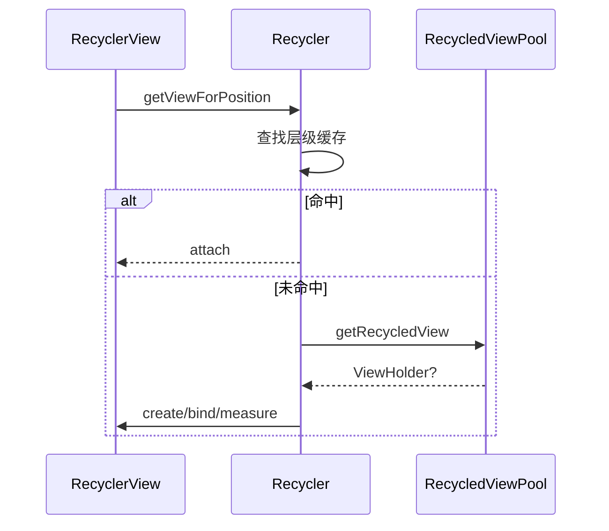
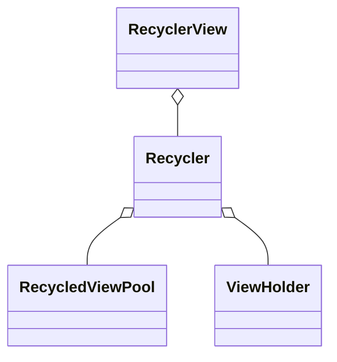

# RecyclerView 缓存机制与性能优化（深入）

## 原理

- 复用目标：降低 `onCreateViewHolder` 与 `onBindViewHolder` 的频率，减少测量与布局成本，提升滚动流畅度。
- 缓存层级：
  - Attached 缓存：屏幕内已附着的 ViewHolder。
  - Changed/Scrap：待复用的分离项，临时存放待二次绑定。
  - ViewCacheExtension：自定义缓存扩展，可接管取/放逻辑。
  - RecycledViewPool：全局池，跨列表复用同类型 ViewHolder。
- DiffUtil/动画：变更计算与 ItemAnimator 会引入额外测量与重绘，应在大列表中合理使用或关闭无益动画。
- 预取与线程：`GapWorker` 在滚动预测路径上预取、绑定与测量，减少下一帧开销；过多预取会与主线程争抢资源，需要平衡。
- 稳定性：`setHasStableIds(true)` 让复用更稳定，减少 diff 与闪烁；池容量与类型 key 需要与 item 视图类型对齐。

## 源码（线索）

- `RecyclerView`、`RecyclerView.Recycler`、`RecycledViewPool`、`AdapterHelper`、`ChildHelper`、`DefaultItemAnimator`。
- 取/放流程：`Recycler#getViewForPosition` → 命中层级缓存 → 绑定/测量 → 附着。
- 预取：`GapWorker` 基于滚动预测进行预取，减少下一帧绑定成本。

## 示例

### Kotlin：启用稳定 ID 与池复用

```kotlin
class MyAdapter : RecyclerView.Adapter<VH>() {
  init { setHasStableIds(true) }
  override fun getItemId(position: Int): Long = data[position].id
}

val pool = RecycledViewPool().apply { setMaxRecycledViews(1, 20) }
recyclerView.setRecycledViewPool(pool)
```

### Kotlin：禁用无益动画并开启预取

```kotlin
recyclerView.itemAnimator = null
recyclerView.setItemViewCacheSize(10)
RecyclerView.setItemAnimator(null)
```

### Kotlin：多列表共享池与布局优化

```kotlin
val shared = RecycledViewPool()
listA.setRecycledViewPool(shared)
listB.setRecycledViewPool(shared)
```

## 对比与取舍

- 稳定 ID vs 非稳定：稳定 ID 能减少 Diff 与重绑定，但需维护唯一性和正确性。
- 动画开启 vs 关闭：场景化使用；大量更新时关闭动画更稳。
- 共享池 vs 独立池：多列表共享提升命中，但需类型一致与容量匹配。

## 时序图：取/放与复用



## 类关系图



## 方法级细节与优化点

- `Recycler#getViewForPosition(int)`：复用入口，命中缓存直接返回。
- `Recycler#recycleView(View)`：回收与入池策略；容量影响命中率。
- `GapWorker`：预取提前绑定与测量，需合理布局与数据源响应。
- 视图层级与约束：过深层级与复杂约束布局导致测量开销增大，应简化。

## 面试答题框架

- 缓存层级与复用流程，说明稳定 ID 与池优化。
- 指出动画与 DiffUtil 的场景化取舍。
- 结合方法级细节与时序，给出工程化设置与典型参数。

## Android 15(API 35) 提示

- 渲染管线保持一致：关注 VSync/RenderThread 调度，避免在 `onBindViewHolder` 执行重计算或阻塞 I/O 以免卡帧。
- 权限/行为变更与列表性能无直接差异，但图片/媒体权限变化可能影响列表预加载，需在加载失败时优雅降级。
