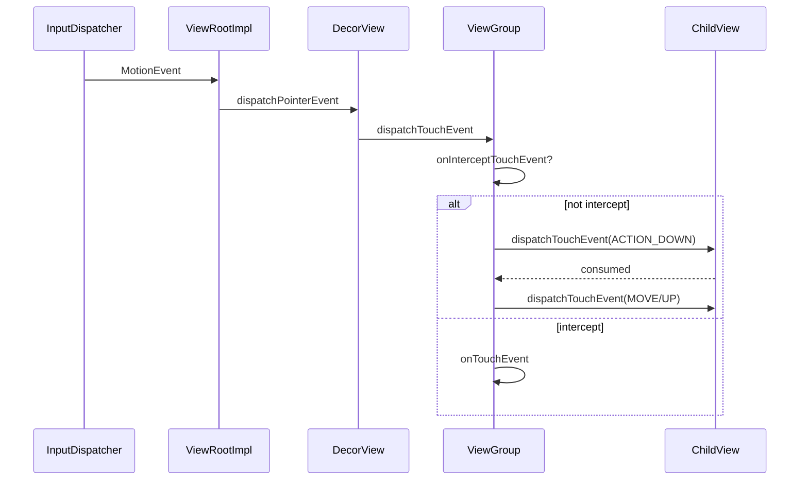
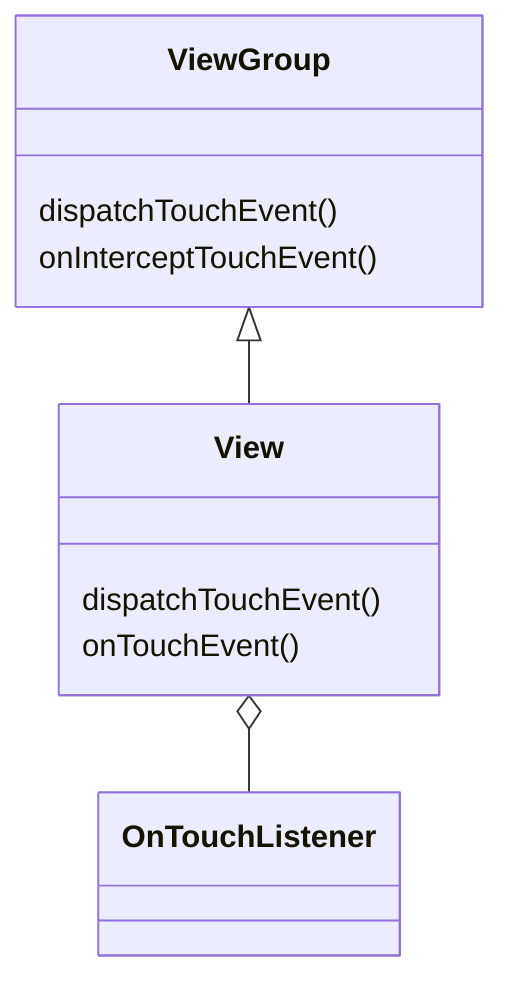

# 事件分发机制（Touch Event Dispatch）

## 核心结论

- 触摸事件流转核心方法：`dispatchTouchEvent` → `onInterceptTouchEvent`（ViewGroup）→ `onTouchEvent`（View）
- 事件起点从 `ViewRootImpl` 注入到 `DecorView`，随后沿 View 树自上而下分发
- `ACTION_DOWN` 建立目标链（TouchTarget），后续 `MOVE/UP` 优先派发到既定目标
- `ViewGroup` 可通过 `onInterceptTouchEvent` 拦截，或子 View 调用 `requestDisallowInterceptTouchEvent(true)` 禁止父拦截
- 返回值语义统一：`true` 表示消费并终止向下或向上传递，`false` 表示未消费继续传递或回溯

## 事件流转路径

- Activity → Window → DecorView → ViewRootImpl → 根 View 的 `dispatchTouchEvent`
- 根 View（通常是 `ViewGroup`）判断是否拦截：
  - 拦截：自己处理 `onTouchEvent`
  - 不拦截：遍历子 View 寻找可接收目标，命中后交由该子 View 的 `dispatchTouchEvent`
- 子 View 若消费 `DOWN`，后续同一手势序列优先派发给该子 View；若子 View返回 `false`，父容器可尝试其它子 View 或自行处理

## 关键规则与优先级

- `OnTouchListener` 的 `onTouch` 与 `onTouchEvent`：
  - 若 `onTouch` 返回 `true`，事件不再进入 `onTouchEvent`
  - 若返回 `false`，继续走默认的 `onTouchEvent`
- 点击与滑动的冲突：
  - 常用策略基于阈值（如 `ViewConfiguration.getScaledTouchSlop`）判断是否拦截
- 取消事件：
  - 父容器拦截或目标失效时，已有目标会收到 `ACTION_CANCEL`
- 多指触控：
  - 每根手指有独立 pointer id，目标匹配以初始 `DOWN` 为准，后续 `POINTER_DOWN/UP` 在既定目标内派发

## 常见冲突场景与解决模板

- 外层可横向滚动，内层纵向列表：
  - 在外层 `onInterceptTouchEvent` 根据滑动角度与位移阈值决定是否拦截
  - 内层遇到明显纵向滑动调用 `requestDisallowInterceptTouchEvent(true)`
- ViewPager 与内层可横滑控件：
  - 判断初始 `DOWN` 后的移动方向，横向显著时由外层消化，纵向显著时放行给内层

## 示例伪代码（拦截策略）

```
private float downX, downY;
private boolean intercept;

public boolean onInterceptTouchEvent(MotionEvent ev) {
    switch (ev.getActionMasked()) {
        case MotionEvent.ACTION_DOWN:
            intercept = false;
            downX = ev.getX();
            downY = ev.getY();
            break;
        case MotionEvent.ACTION_MOVE:
            float dx = ev.getX() - downX;
            float dy = ev.getY() - downY;
            if (Math.abs(dx) > touchSlop && Math.abs(dx) > Math.abs(dy)) {
                intercept = true; // 横向滑动，父容器拦截
            }
            break;
    }
    return intercept;
}
```

## 源码线索（便于深入）

- `ViewGroup#dispatchTouchEvent`
- `ViewGroup#onInterceptTouchEvent`
- `View#dispatchTouchEvent` / `View#onTouchEvent`
- `ViewRootImpl#processPointerEvent`

## 面试答题框架

- 先给出三大方法与事件流转路径
- 说明 `DOWN` 建立目标链与后续派发规则
- 描述拦截与 `requestDisallowInterceptTouchEvent` 的作用
- 给出一套冲突解决模板（方向/阈值/取消事件）与典型伪代码
- 补充多指、取消、监听器优先级等细节

## 统一 5 点面试框架（模板）

- 定义：事件序列与分发/拦截/处理
- 原理：目标链与优先级
- 方法：`dispatchTouchEvent/onIntercept/onTouchEvent`
- 实践：嵌套滚动冲突解决策略
- 性能/风险：误判与抖动

---

## 原理

- 输入系统将触摸事件通过 `InputDispatcher` 送达应用进程，由 `ViewRootImpl` 注入到 `DecorView`。
- `ViewGroup#dispatchTouchEvent` 负责寻找并锁定目标子 View（建立 `TouchTarget`）。
- `ACTION_DOWN` 阶段决定目标；后续同一手势序列（包含 `MOVE/UP/CANCEL`）优先派发到目标，除非父容器中途拦截。
- `requestDisallowInterceptTouchEvent(true)` 通知祖先容器在当前序列内避免拦截，实现子视图优先。
- 嵌套滚动与冲突解决基于方向与阈值：横向更大交给外层，纵向更大交给内层。
- 拦截判定：父容器可在 `onInterceptTouchEvent` 基于位移/速度/手势类型做决策；一旦拦截，需要向原目标发送 `ACTION_CANCEL`。
- 监听优先级：`OnTouchListener` 的返回值影响是否进入 `onTouchEvent`，可用于优先消费但要避免吞掉点击意图。
- 状态保持：目标链依赖 `ACTION_DOWN` 的命中顺序，事件必须严格按序到达，否则会丢失点击或导致手势紊乱。

### 多指与 pointer id

- 每根手指分配独立的 pointer id；`ACTION_POINTER_DOWN/UP` 在既定目标内派发，命中链基于初始 `DOWN` 的目标。

### 关键数据结构与状态

- `TouchTarget`：记录当前序列的接收者链表，包含目标 View 与 pointer 信息。
- `mFirstTouchTarget`：`ViewGroup` 中的首个目标引用，决定后续派发顺序。
- 取消标志：父容器改判或目标失效时，向既定目标派发 `ACTION_CANCEL`。

## 源码解析

### 入口与注入

- `ViewRootImpl#processPointerEvent`：接收指针事件并调用 `mView.dispatchPointerEvent`。
- `DecorView#dispatchTouchEvent`：顶层 View 进入分发流程。

### ViewGroup 分发主干

- `ViewGroup#dispatchTouchEvent`
  - `ACTION_DOWN`：遍历可点击/可接收的子 View，命中则创建 `TouchTarget` 并派发。
  - `onInterceptTouchEvent`：决定是否拦截当前事件；拦截则交由自身 `onTouchEvent`。
  - `mFirstTouchTarget` 非空：后续事件直接派发给既定目标。

### View 处理

- `View#dispatchTouchEvent`：优先执行 `OnTouchListener#onTouch`；返回 `true` 则消费并终止；否则进入 `onTouchEvent`。
- `View#onTouchEvent`：根据可点击、按压态、长按等逻辑决定返回值与状态变更。

## 示例

### Kotlin：横向父容器与纵向子列表冲突

```kotlin
class HScrollContainer(context: Context, attrs: AttributeSet?) : ViewGroup(context, attrs) {
    private var downX = 0f
    private var downY = 0f
    private var intercept = false
    private val touchSlop = ViewConfiguration.get(context).scaledTouchSlop

    override fun onInterceptTouchEvent(ev: MotionEvent): Boolean {
        when (ev.actionMasked) {
            MotionEvent.ACTION_DOWN -> {
                intercept = false
                downX = ev.x
                downY = ev.y
            }
            MotionEvent.ACTION_MOVE -> {
                val dx = ev.x - downX
                val dy = ev.y - downY
                if (kotlin.math.abs(dx) > touchSlop && kotlin.math.abs(dx) > kotlin.math.abs(dy)) {
                    intercept = true
                }
            }
        }
        return intercept
    }

    override fun onTouchEvent(event: MotionEvent): Boolean {
        // 处理横向滚动逻辑
        return true
    }
}
```

### Java：子 View 请求不拦截以保障纵向滚动

```java
public class VListView extends RecyclerView {
  public VListView(@NonNull Context c) { super(c); }
  @Override public boolean dispatchTouchEvent(MotionEvent e) {
    if (e.getActionMasked() == MotionEvent.ACTION_MOVE) {
      ViewParent p = getParent();
      if (p != null) p.requestDisallowInterceptTouchEvent(true);
    }
    return super.dispatchTouchEvent(e);
  }
}
```

## 对比与取舍

- 父拦截方案：简单直接，便于统一处理，但对子视图精细交互支持较弱。
- 子请求不拦截：保持子视图体验，但若误判易导致外层滚动迟滞或卡顿。
- 混合方案：以方向阈值决策，结合 `NestedScrolling` 接口在复杂场景中取得平衡。

## 时序图（Mermaid）



## 组件关系图（Mermaid Class）



## 性能与瓶颈

- 过度嵌套的层级导致命中查找与测量成本增高，触摸分发也会受影响。
- 频繁的 `requestDisallowInterceptTouchEvent` 与错误阈值可能引发抖动与卡顿。
- 使用 `GestureDetector`、`VelocityTracker` 可稳定识别手势并减少误判。
- 使用 `GestureDetector`、`VelocityTracker` 可稳定识别手势并减少误判。

## 源码片段（示意）

```java
// ViewGroup#dispatchTouchEvent 目标搜索的关键流程（示意）
public boolean dispatchTouchEvent(MotionEvent ev) {
  if (ev.getActionMasked() == MotionEvent.ACTION_DOWN) {
    cancelAndClearTouchTargets();
  }
  final boolean intercepted = onInterceptTouchEvent(ev);
  if (!intercepted && ev.getActionMasked() == MotionEvent.ACTION_DOWN) {
    // 从子视图逆序遍历，命中最上层可接收者
    for (int i = mChildrenCount - 1; i >= 0; i--) {
      View child = mChildren[i];
      if (canViewReceivePointerEvents(child)) {
        if (dispatchTransformedTouchEvent(ev, child)) {
          addTouchTarget(child);
          return true;
        }
      }
    }
  }
  return super.dispatchTouchEvent(ev);
}
```

```java
// 子视图请求不拦截，保障自身滚动
public boolean dispatchTouchEvent(MotionEvent e) {
  if (e.getActionMasked() == MotionEvent.ACTION_MOVE) {
    getParent().requestDisallowInterceptTouchEvent(true);
  }
  return super.dispatchTouchEvent(e);
}
```

## 自测题

- `ACTION_DOWN` 的特殊作用是什么？答：建立目标链与命中接收者，后续事件优先派发到该目标。
- 如何处理横竖向嵌套滚动冲突？答：基于阈值与角度的拦截策略，必要时子视图请求不拦截。
- 何时会产生 `ACTION_CANCEL`？答：父容器改判或目标失效时取消当前序列。
