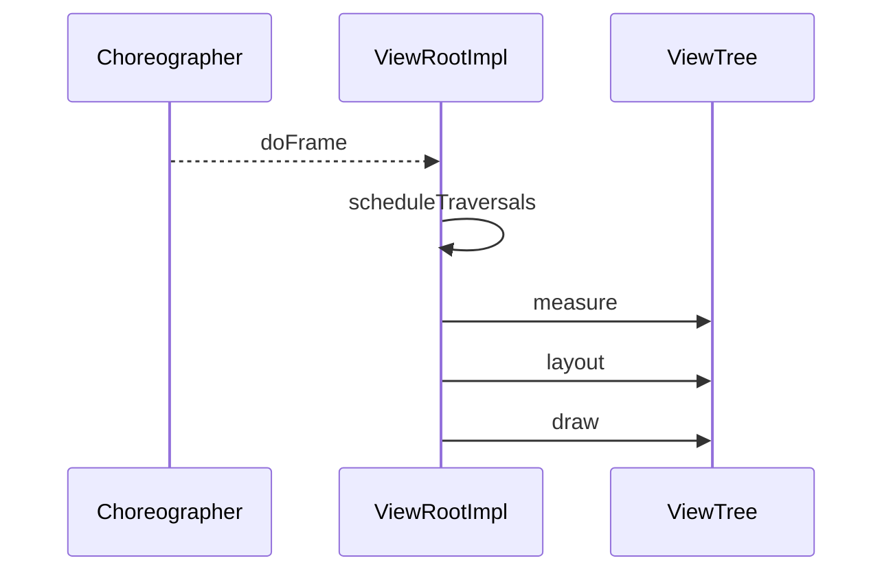
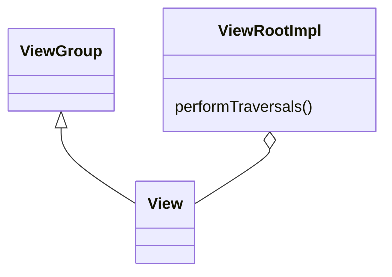

# View 绘制管线与渲染优化（深入）

## 原理

- 渲染驱动：`Choreographer` 在 VSync 信号到来时触发一次帧流程，`ViewRootImpl` 调用 `performTraversals()` 完成三步：`measure`、`layout`、`draw`。
- 依赖：父容器负责对子 View 的测量/布局调用；子 View 报告自身期望尺寸并绘制内容。
- DisplayList：硬件加速下将绘制指令记录至 DisplayList，交由 GPU 执行，减少 CPU 重复绘制成本。
- 帧预算：60fps 对应 ~16.6ms，measure/layout/draw 任一阶段超时都会掉帧；需要控制层级与运算量。
- 请求机制：`requestLayout` 进入测量/布局路径，`invalidate` 进入重绘路径；频繁调用会放大遍历与绘制开销。
- 脏区合成：仅重绘变更区域（Dirty Region），避免全屏刷新；复杂动画或过度绘制会增加 fillrate 与带宽压力。

### 渲染数据流与调用链

- `Choreographer#doFrame` → `ViewRootImpl#performTraversals` → 生成/更新 `RenderNode` 的 DisplayList → `RenderThread` 提交到 GPU（Skia）
- 脏区（Dirty Region）合成：仅重绘变更区域，降低像素填充与提交量。

## 源码（线索）

- `ViewRootImpl#scheduleTraversals / doTraversal / performTraversals`
- `Choreographer#doFrame` 驱动帧同步
- `View#onMeasure / onLayout / onDraw` 与 `ViewGroup#onLayout`
- 硬件加速：`HardwareRenderer`、`RenderNode`

## 示例

### Kotlin：自定义 View 的测量与绘制

```kotlin
class BarView(context: Context, attrs: AttributeSet?) : View(context, attrs) {
  private val p = Paint(Paint.ANTI_ALIAS_FLAG).apply { color = Color.BLUE }
  private var desired = 100
  override fun onMeasure(wSpec: Int, hSpec: Int) {
    val w = resolveSize(desired, wSpec)
    val h = resolveSize(desired / 2, hSpec)
    setMeasuredDimension(w, h)
  }
  override fun onDraw(c: Canvas) {
    c.drawRect(0f, 0f, width.toFloat(), height.toFloat(), p)
  }
}
```

### Kotlin：避免重复无效重绘

```kotlin
fun View.safeInvalidate() {
  if (isShown && width > 0 && height > 0) invalidate()
}
```

## 对比与取舍

- 约束布局 vs 线性布局：前者灵活但测量成本更高；大列表中优先简化层级与约束。
- 硬件加速 on/off：默认开启可获益；特殊自定义绘制可能需关闭以绕过兼容问题。

## 时序图：帧驱动与三步流程



## 类关系图



## 方法级细节与优化

- `requestLayout` 触发重新测量布局；减少不必要调用，批量更新。
- `invalidate` 触发重绘；合并更新区域、避免整屏重绘。
- 避免在 `onDraw` 内做复杂计算与 I/O；预计算与缓存。

## 渲染细节与组件（概览）

- HardwareRenderer/RenderThread：在硬件加速下，绘制指令通过 RenderThread 异步提交到 GPU。
- RenderNode/DisplayList：记录可重用的绘制命令列表，减少 CPU 重复工作。

```java
// 概念示意：记录绘制命令
RenderNode node = RenderNode.create("bar", null);
RecordingCanvas rc = node.beginRecording(width, height);
rc.drawRect(0, 0, width, height, paint);
node.endRecording();
// 后续帧直接复用 node 的 DisplayList 提交到 GPU
```

## 自测题

- 为什么减少层级能提升帧率？答：测量/布局递归与绘制命令数量减少，帧时长缩短。
- `requestLayout` 和 `invalidate` 的区别？答：前者布局路径，后者绘制路径；触发成本不同。
- DisplayList 的优势是什么？答：复用绘制命令，降低 CPU 重复工作并提升 GPU 提交效率。

## 性能与瓶颈

- 深层级导致多次测量与布局递归，增加帧时长；控制层级与使用合适布局。
- 过度绘制（Overdraw）导致 GPU 负担加重；通过工具检查与优化背景/重叠。
- 大图/复杂 Path 渲染开销显著；必要时采用位图缓存与分片绘制。

## 面试答题框架

- 说明 `Choreographer → ViewRootImpl → measure/layout/draw` 的驱动链。
- 指出 `requestLayout/invalidate` 的作用与成本。
- 给出层级/过度绘制/硬件加速的优化策略与取舍。

## 统一 5 点面试框架（模板）

- 定义：帧驱动与三步流程
- 原理：渲染组件与 DisplayList
- 方法：`performTraversals/onMeasure/onLayout/onDraw`
- 实践：自定义 View 与无效重绘治理
- 性能/风险：层级与过度绘制
